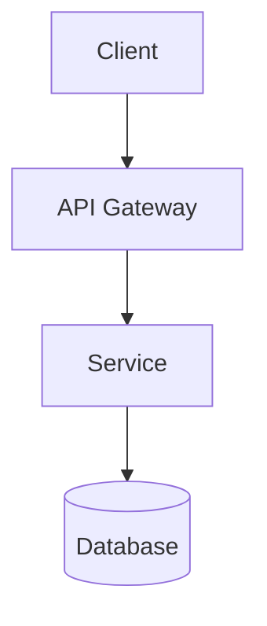

# Architecture Documentation - The "What"

**Purpose**: Define the system design, technical decisions, and data models.

## What Goes Here

- **HLD (High-Level Design)** - System overview, component diagrams, data flow (C4 Levels 1-2)
- **LLD (Low-Level Design)** - Detailed component design, internal structure (C4 Level 3)
- **ADR (Architecture Decision Records)** - Technical decisions with rationale
- **RFC (Request for Comments)** - API designs, schema proposals
- **Data Models** - Database schemas, entity relationships
- **Integration Maps** - How systems communicate
- **Security Architecture** - Security model, authentication, authorization

## C4 Model Adoption

SpecWeave uses the **C4 model** for architecture documentation:

| C4 Level | Document Type | Purpose | Example |
|----------|---------------|---------|---------|
| **Level 1: Context** | HLD | System in its environment | System → External APIs |
| **Level 2: Container** | HLD | Applications, services, databases | Web App → API → Database |
| **Level 3: Component** | LLD | Internal service structure | Controller → Service → Repository |
| **Level 4: Code** | Source | Implementation details | Class diagrams, inline docs |

**See**: [DIAGRAM-CONVENTIONS.md](../../DIAGRAM-CONVENTIONS.md) for complete C4 mapping and diagram naming conventions.

## Subdirectories

### `/adr/` - Architecture Decision Records
**Format**: `0001-decision-title.md`, `0002-decision-title.md`, etc.

**Purpose**: Document architectural decisions with context, options considered, and rationale.

**Template**: See `templates/docs/adr-template.md`

**Example**: `0001-adopt-nextjs.md`, `0002-use-prisma.md`

### `/rfc/` - Request for Comments
**Format**: `0001-feature-title.md`, `0002-feature-title.md`, etc.

**Purpose**: Propose API designs, schema changes, major features for review.

**Template**: See `templates/docs/rfc-template.md`

**Example**: `0001-auth-api-design.md`, `0002-payment-webhook-schema.md`

## Diagram Conventions ✨

**Default**: Use **Mermaid diagrams-as-code** for all architecture diagrams.

### Co-locate diagrams with documents (PREFERRED)

Keep each diagram next to the markdown page that explains it:

```
/architecture
  hld-system-overview.md
  hld-system-overview.context.mmd         # Mermaid source
  hld-system-overview.context.svg         # Rendered (optional, for social previews)
  hld-system-overview.sequence-auth.mmd   # Another diagram
  /adr
    0007-event-streaming.md
    0007-event-streaming.context.mmd
    0007-event-streaming.context.svg
```

### File Naming Pattern

```
<page>.<type>.mmd   → source (Mermaid source file)
<page>.<type>.svg   → rendered (optional, for public sites)
```

**Types**: `context`, `sequence`, `flow`, `entity`, `deployment`

**Examples**:
- `hld-system-overview.context.mmd`
- `hld-system-overview.sequence-auth.mmd`
- `0007-event-streaming.context.mmd` (for ADR 0007)

### Embedding in Markdown

**Directly in markdown** (MkDocs renders automatically):
```markdown
## Architecture Overview


```

**Or reference SVG** (if pre-rendered):
```markdown

```

**See**: [DIAGRAM-CONVENTIONS.md](../../DIAGRAM-CONVENTIONS.md) for complete guide.

## Document Structures

### HLD (High-Level Design) - C4 Levels 1-2

**Template**: See `templates/docs/hld-template.md`

**Purpose**: System-level design showing external boundaries (Level 1) and internal containers (Level 2)

**Sections**:
- **Context** - Why does this system exist? (link to PRD)
- **Requirements** - Functional and non-functional
- **Architecture Overview** - C4 Level 1 (Context) and Level 2 (Container) diagrams
- **Data Model** - Entities, relationships
- **Integrations** - External systems, APIs
- **Security & Privacy** - Auth, encryption, compliance
- **Scaling & Capacity** - Performance, load handling
- **Trade-offs** - Design compromises
- **Open Questions** - Unresolved issues

**Diagrams**:
- `hld-{system}.c4-context.mmd` - C4 Level 1: System context
- `hld-{system}.c4-container.mmd` - C4 Level 2: Applications, services, databases
- `hld-{system}.sequence-{flow}.mmd` - Sequence diagrams for key flows
- `hld-{system}.entity.mmd` - Data model

**Naming Convention**: `hld-{system-name}.md`

**Example**: `hld-booking-system.md`, `hld-payment-processing.md`

**When to create**: For every major system or subsystem that has external boundaries and multiple internal services/components.

---

### LLD (Low-Level Design) - C4 Level 3

**Template**: See `templates/docs/lld-template.md`

**Purpose**: Component-level design showing internal structure of a service (Level 3)

**Sections**:
- **Context** - Why does this component exist? (link to HLD)
- **Component Overview** - C4 Level 3 diagram showing internal structure
- **API / Interface Specification** - Public and internal interfaces
- **Detailed Flow Diagrams** - Sequence diagrams for key operations
- **Data Models** - Component-specific entities, DTOs, database schema
- **Implementation Details** - Tech stack, algorithms, configuration
- **Security Considerations** - Input validation, token handling, secrets
- **Performance Considerations** - Caching, optimization, monitoring
- **Error Handling** - Error types, retry strategies
- **Testing Strategy** - Unit, integration, component tests
- **Dependencies** - External and internal dependencies
- **Deployment Considerations** - Environment variables, health checks

**Diagrams**:
- `lld-{service}.c4-component.mmd` - C4 Level 3: Internal component structure
- `lld-{service}.sequence-{operation}.mmd` - Sequence diagrams for key operations
- `lld-{service}.class.mmd` - Class diagram (optional)
- `lld-{service}.state.mmd` - State diagram (if applicable)

**Naming Convention**: `lld-{service-name}.md`

**Example**: `lld-auth-service.md`, `lld-payment-processor.md`, `lld-order-manager.md`

**When to create**:
- For complex services with multiple internal components
- When implementation details need to be communicated to team
- Before coding a new service (design-first approach)
- When refactoring an existing service

**Not needed when**:
- Simple CRUD services with minimal logic
- Thin wrappers around external APIs
- Single-responsibility components with <3 internal classes

### ADR (Architecture Decision Record)

**Template**: See `templates/docs/adr-template.md`

**Sections**:
- **Status** - draft | review | approved | deprecated
- **Context** - What's the situation?
- **Decision** - What did we decide?
- **Consequences** - What's the impact?
- **Alternatives** - What else did we consider?

**Format**: `0001-decision-title.md` (sequential numbering)

### RFC (Request for Comments)

**Template**: See `templates/docs/rfc-template.md`

**Sections**:
- **Summary** - One-sentence description
- **Motivation** - Why is this needed?
- **Proposal** - API schema, flow diagram
- **Backwards Compatibility** - Breaking changes?
- **Rollout Plan** - How to deploy?
- **Observability & SLO Impact** - Monitoring, SLOs
- **Security / Compliance Considerations** - Risks, mitigations
- **Alternatives** - Other approaches
- **Decision & Next Steps** - Outcome, action items

**Format**: `0001-feature-title.md` (sequential numbering)

## Creating New Architecture Documents

### To create an HLD:
```bash
cp templates/docs/hld-template.md docs/internal/architecture/hld-{system}.md
```

**Then create diagrams**:
```bash
touch docs/internal/architecture/hld-{system}.c4-context.mmd
touch docs/internal/architecture/hld-{system}.c4-container.mmd
touch docs/internal/architecture/hld-{system}.sequence-{flow}.mmd
touch docs/internal/architecture/hld-{system}.entity.mmd
```

### To create an LLD:
```bash
cp templates/docs/lld-template.md docs/internal/architecture/lld-{service}.md
```

**Then create diagrams**:
```bash
touch docs/internal/architecture/lld-{service}.c4-component.mmd
touch docs/internal/architecture/lld-{service}.sequence-{operation}.mmd
```

### To create an ADR:
```bash
# Find next number
ls docs/internal/architecture/adr/ | grep -E '^[0-9]+' | tail -1
# Create new ADR with next number
cp templates/docs/adr-template.md docs/internal/architecture/adr/0001-decision-title.md
```

### To create an RFC:
```bash
# Find next number
ls docs/internal/architecture/rfc/ | grep -E '^[0-9]+' | tail -1
# Create new RFC with next number
cp templates/docs/rfc-template.md docs/internal/architecture/rfc/0001-feature-title.md
```

## Index of Architecture Documents

### HLDs (C4 Levels 1-2)
- (None yet - create your first HLD!)

### LLDs (C4 Level 3)
- (None yet - create your first LLD!)

### ADRs
- (None yet - create your first ADR!)

### RFCs
- (None yet - create your first RFC!)

## Cross-Links

**Document Hierarchy**:
```
PRD (Why/What) → HLD (How - System) → LLD (How - Component) → Code (Implementation)
                      ↓                     ↓
                    ADR/RFC              ADR/RFC
```

**Cross-linking Rules**:
- **PRD → HLD**: Every HLD should reference the PRD it implements
- **HLD → LLD**: Link to all LLDs for services within the system
- **LLD → HLD**: Every LLD should reference its parent HLD
- **HLD → ADR**: Link to all relevant ADRs
- **LLD → ADR**: Link to component-specific ADRs
- **RFC → HLD/LLD**: RFCs should reference the HLD/LLD they modify
- **ADR → HLD/LLD/RFC**: ADRs should be referenced from relevant docs

## Related Documentation

- [Strategy Documentation](../strategy/README.md) - Links to PRDs
- [Delivery Documentation](../delivery/README.md) - Links to roadmap, release plans
- [DIAGRAM-CONVENTIONS.md](../../DIAGRAM-CONVENTIONS.md) - C4 diagram conventions and naming
- [HLD Template](../../../templates/docs/hld-template.md) - High-Level Design template
- [LLD Template](../../../templates/docs/lld-template.md) - Low-Level Design template
- [ADR Template](../../../templates/docs/adr-template.md) - Architecture Decision Record template
- [RFC Template](../../../templates/docs/rfc-template.md) - Request for Comments template
