# Architecture Diagrams

**Purpose**: Visual representations of SpecWeave architecture using Mermaid diagrams

**Generated**: SVG files for reliable rendering in Docusaurus

---

## Quick Usage

### In Docusaurus Docs

**Simple (Light Mode Only)**:
```markdown

```

**With Dark Mode**:
```mdx
import ThemedImage from '@theme/ThemedImage';

<ThemedImage
  alt="Workflow Diagram"
  sources={{
    light: './specweave-workflow.svg',
    dark: './specweave-workflow-dark.svg',
  }}
/>
```

---

## Available Diagrams

### Main Workflow

**File**: `specweave-workflow.mmd`

**Description**: Complete SpecWeave workflow from project initialization to deployment

**Includes**:
- 8 workflow phases (init, brownfield, planning, validation, implementation, acceptance, docs, deploy)
- 10 decision points (user questions)
- 6 agent types (PM, Architect, QA, Security, DevOps, Implementation)
- 7 skills (router, analyzer, validator, loader, updater, optimizer)

**SVGs**:
- `specweave-workflow.svg` (light theme, 224KB)
- `specweave-workflow-dark.svg` (dark theme, 224KB)

**Usage**: Introduction page, workflow documentation

---

## Creating New Diagrams

### 1. Create .mmd File

```bash
# Create diagram in this directory
vim .specweave/docs/internal/architecture/diagrams/my-diagram.mmd
```

**Example**:


### 2. Generate SVG

```bash
# From project root
npm run generate:diagrams
```

### 3. Use in Docs

```markdown

```

### 4. Commit

```bash
git add .specweave/docs/internal/architecture/diagrams/my-diagram.*
git commit -m "docs: add my diagram"
```

---

## Diagram Types

### C4 Architecture Diagrams

**Naming Convention**:
- `system-context.mmd` - C4 Level 1 (system boundaries, external actors)
- `system-container.mmd` - C4 Level 2 (applications, services, databases)
- `component-{service}.mmd` - C4 Level 3 (internal structure)

**See**: [C4 Diagram Conventions](../../../../CLAUDE.md#c4-diagram-conventions)

### Workflow Diagrams

**Naming Convention**: `{feature}-workflow.mmd`

**Examples**:
- `specweave-workflow.mmd` - Main workflow
- `increment-lifecycle.mmd` - WIP limits, closures (planned)
- `external-integrations.mmd` - GitHub/JIRA/ADO sync (planned)

### Sequence Diagrams

**Naming Convention**: `flow-{name}.mmd`

**Location**: `{module}/flows/`

**Examples**:
- `authentication/flows/flow-login.mmd`
- `payments/flows/flow-checkout.mmd`

### ER Diagrams

**Naming Convention**: `data-model-{module}.mmd`

**Location**: `{module}/`

**Examples**:
- `authentication/data-model.mmd`
- `payments/data-model.mmd`

### Deployment Diagrams

**Naming Convention**: `deployment-{environment}.mmd`

**Location**: Root or `operations/diagrams/`

**Examples**:
- `deployment-production.mmd`
- `deployment-staging.mmd`

---

## File Organization

```
.specweave/docs/internal/architecture/diagrams/
├── README.md                           # This file
├── specweave-workflow.mmd              # Source
├── specweave-workflow.svg              # Generated (light)
├── specweave-workflow-dark.svg         # Generated (dark)
└── {module}/                           # Module-specific
    ├── component-{service}.mmd
    ├── component-{service}.svg
    ├── flows/
    │   ├── flow-{name}.mmd
    │   └── flow-{name}.svg
    └── data-model.mmd
```

---

## Configuration

**Mermaid Config**: `.mermaidrc.json` (project root)

**Theme**: Default with custom colors matching SpecWeave brand

**Generation Script**: `scripts/generate-diagram-svgs.sh`

---

## Troubleshooting

### SVG Not Showing in Docs

**Cause**: Relative path incorrect

**Fix**: Use `./` for same directory, `../` for parent

### Dark Mode Not Working

**Cause**: Not using `ThemedImage` component

**Fix**: Use MDX instead of Markdown:
```mdx
import ThemedImage from '@theme/ThemedImage';
<ThemedImage sources={{light: './diagram.svg', dark: './diagram-dark.svg'}} />
```

### Diagram Layout Wrong

**Cause**: Complex diagram, too many nodes

**Fix**: Split into multiple diagrams or adjust Mermaid config

---

## Related Documentation

- [Diagram SVG Generation Guide](../../delivery/guides/diagram-svg-generation.md) - Complete guide
- [C4 Diagram Conventions](../../../../CLAUDE.md#c4-diagram-conventions) - Architecture standards
- [Diagram Testing Strategy](../../../increments/001-core-framework/reports/DIAGRAM-TESTING-STRATEGY.md) - Validation

---

**Maintained By**: SpecWeave Documentation Team
**Last Updated**: 2025-10-27
