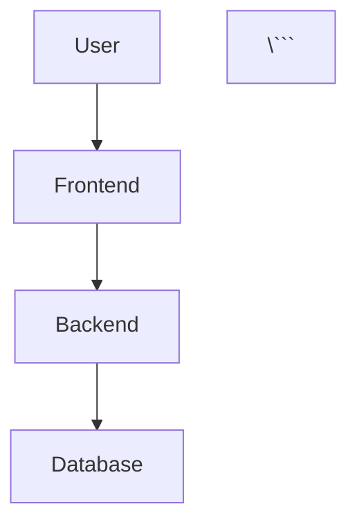
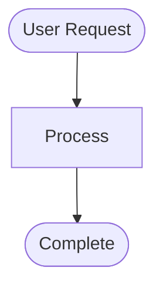
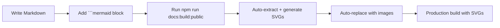

# Diagram SVG Generation Guide

**Purpose**: Automatically generate static SVG files from Mermaid diagrams for reliable rendering in Docusaurus

**Created**: 2025-10-27
**Updated**: 2025-10-28 (Added automated extraction workflow)

---

## 🚀 Quick Start - Fully Automated!

**The entire workflow is now automated!** Simply write Mermaid diagrams in your markdown files and they'll automatically be converted to SVGs during build:

```bash
# Development (auto-generates diagrams + starts dev server)
npm run docs:public

# Production build (auto-generates diagrams + builds site)
npm run docs:build:public
```

**That's it!** No manual steps needed. The system automatically:
1. ✅ Extracts all `\`\`\`mermaid` code blocks from markdown
2. ✅ Generates SVG files (light + dark themes)
3. ✅ Replaces Mermaid blocks with SVG images at build time
4. ✅ Supports dark mode with ThemedImage component

---

## Why SVG Generation?

### Problems with Client-Side Mermaid Rendering

1. **Inconsistent rendering**: Different browsers/versions render Mermaid differently
2. **Performance**: Large diagrams slow down page load (client-side parsing)
3. **Build failures**: Mermaid syntax errors can break SSG builds
4. **Accessibility**: SVGs are more accessible than dynamically rendered diagrams
5. **Reliability**: SVGs always work, even if Mermaid.js fails

### Benefits of SVG Export

1. ✅ **Consistent appearance**: Same rendering everywhere
2. ✅ **Faster page loads**: No JavaScript parsing required
3. ✅ **SSG-friendly**: Works with static site generators (Docusaurus, Next.js, etc.)
4. ✅ **Offline support**: Diagrams work without internet
5. ✅ **Version control**: See visual diffs in git
6. ✅ **Dark mode**: Generate both light and dark theme versions

---

## How It Works (Automated Workflow)

### Architecture Overview

```
┌─────────────────────────────────────────────────────────────┐
│ 1. Write Markdown with Mermaid                              │
│    .specweave/docs/public/overview/introduction.md          │
│    ```mermaid                                               │
│    graph TD                                                 │
│        A --> B                                              │
│    ```                                                      │
└─────────────────────────────────────────────────────────────┘
                           ↓
┌─────────────────────────────────────────────────────────────┐
│ 2. Run Build Command                                        │
│    npm run docs:build:public                                │
│    → Triggers: npm run generate:all-diagrams                │
└─────────────────────────────────────────────────────────────┘
                           ↓
┌─────────────────────────────────────────────────────────────┐
│ 3. Extract Diagrams (scripts/extract-and-generate-diagrams.sh)│
│    • Scans all .md files in .specweave/docs/public/        │
│    • Finds ```mermaid code blocks                           │
│    • Creates temp .mmd files                                │
└─────────────────────────────────────────────────────────────┘
                           ↓
┌─────────────────────────────────────────────────────────────┐
│ 4. Generate SVGs (uses @mermaid-js/mermaid-cli)            │
│    • Light theme: introduction.svg                          │
│    • Dark theme: introduction-dark.svg                      │
│    • Output: docs-site/static/diagrams/                    │
└─────────────────────────────────────────────────────────────┘
                           ↓
┌─────────────────────────────────────────────────────────────┐
│ 5. Build Docusaurus (Remark Plugin Processes Markdown)     │
│    Plugin: docs-site/plugins/remark-mermaid-to-svg.js      │
│    • Finds ```mermaid blocks                                │
│    • Replaces with <ThemedImage> component                 │
│    • References /diagrams/introduction.svg                  │
└─────────────────────────────────────────────────────────────┘
                           ↓
┌─────────────────────────────────────────────────────────────┐
│ 6. Final Output (docs-site/build/)                          │
│    • HTML with  tags pointing to SVGs                  │
│    • Fast loading, reliable rendering                       │
│    • Dark mode support                                      │
└─────────────────────────────────────────────────────────────┘
```

### Components

| Component | Purpose | Location |
|-----------|---------|----------|
| **Extraction Script** | Extracts `\`\`\`mermaid` from markdown | `scripts/extract-and-generate-diagrams.sh` |
| **Standalone Script** | Generates SVGs from `.mmd` files | `scripts/generate-diagram-svgs.sh` |
| **Remark Plugin** | Replaces mermaid blocks with SVGs at build time | `docs-site/plugins/remark-mermaid-to-svg.js` |
| **Mermaid Config** | Theme settings for consistent styling | `.mermaidrc.json` |

---

## Quick Start

### Option 1: Inline Diagrams (Recommended)

Write Mermaid diagrams directly in your markdown:

**File**: `.specweave/docs/public/overview/introduction.md`

```markdown
## Architecture



**That's it!** The diagram will automatically be converted to SVG during build.

### Option 2: Standalone .mmd Files

Create standalone diagram files:

**File**: `.specweave/docs/internal/architecture/diagrams/my-diagram.mmd`


Run:
```bash
# Generate SVGs for all .mmd files
npm run generate:diagrams
```

**Output**:
- For each `.mmd` file, creates:
  - `{filename}.svg` (light theme)
  - `{filename}-dark.svg` (dark theme)
- Placed next to source `.mmd` files

### Example

```bash
# Before
.specweave/docs/internal/architecture/diagrams/
└── specweave-workflow.mmd

# After running npm run generate:diagrams
.specweave/docs/internal/architecture/diagrams/
├── specweave-workflow.mmd          # Source (keep in git)
├── specweave-workflow.svg          # Generated (commit to git)
└── specweave-workflow-dark.svg     # Generated (commit to git)
```

---

## Workflow

### 1. Create Mermaid Diagram

**File**: `.specweave/docs/internal/architecture/diagrams/my-diagram.mmd`



**Important**: Use `.mmd` extension (NOT `.md`)

### 2. Generate SVG

```bash
npm run generate:diagrams
```

### 3. Verify Output

```bash
# Check files were created
ls -lh .specweave/docs/internal/architecture/diagrams/my-diagram*.svg

# Expected output:
# my-diagram.svg        (light theme)
# my-diagram-dark.svg   (dark theme)
```

### 4. Use in Documentation

**Markdown** (Docusaurus):
```markdown
## System Architecture


```

**MDX** (with dark mode support):
```mdx
import ThemedImage from '@theme/ThemedImage';

<ThemedImage
  alt="System Workflow"
  sources={{
    light: '/diagrams/specweave-workflow.svg',
    dark: '/diagrams/specweave-workflow-dark.svg',
  }}
/>
```

### 5. Commit to Git

```bash
# Commit both source and generated files
git add .specweave/docs/internal/architecture/diagrams/my-diagram.mmd
git add .specweave/docs/internal/architecture/diagrams/my-diagram*.svg
git commit -m "docs: add system workflow diagram"
```

---

## Configuration

### Mermaid Configuration File

**File**: `.mermaidrc.json`

```json
{
  "theme": "default",
  "themeVariables": {
    "primaryColor": "#e1f5ff",
    "primaryTextColor": "#000",
    "primaryBorderColor": "#0288d1",
    "lineColor": "#666",
    "secondaryColor": "#fff3e0",
    "tertiaryColor": "#f3e5f5",
    "background": "#fff",
    "fontFamily": "\"Segoe UI\", Roboto, \"Helvetica Neue\", Arial, sans-serif",
    "fontSize": "14px"
  },
  "flowchart": {
    "htmlLabels": true,
    "curve": "basis",
    "useMaxWidth": true
  }
}
```

**Customization**:
- Change colors to match brand
- Adjust font sizes
- Modify spacing/padding
- See [Mermaid Theme Configuration](https://mermaid.js.org/config/theming.html)

---

## Manual Generation (Single Diagram)

### Light Theme

```bash
npx mmdc -i path/to/diagram.mmd \
         -o path/to/diagram.svg \
         -c .mermaidrc.json \
         -b transparent
```

### Dark Theme

```bash
# Create dark theme config
cat .mermaidrc.json | \
  sed 's/"darkMode": false/"darkMode": true/' | \
  sed 's/"background": "#fff"/"background": "#1e1e1e"/' | \
  sed 's/"mainBkg": "#fff"/"mainBkg": "#1e1e1e"/' | \
  sed 's/"primaryTextColor": "#000"/"primaryTextColor": "#fff"/' \
  > /tmp/mermaid-dark.json

# Generate dark SVG
npx mmdc -i path/to/diagram.mmd \
         -o path/to/diagram-dark.svg \
         -c /tmp/mermaid-dark.json \
         -b transparent
```

---

## Using SVGs in Docusaurus

### Option 1: Simple Image (Recommended)

**Markdown**:
```markdown

```

**Benefits**:
- Simple syntax
- Works everywhere
- No build configuration

**Drawbacks**:
- No dark mode support

---

### Option 2: Themed Image (Dark Mode Support)

**MDX**:
```mdx
import ThemedImage from '@theme/ThemedImage';

<ThemedImage
  alt="Workflow Diagram"
  sources={{
    light: useBaseUrl('/diagrams/specweave-workflow.svg'),
    dark: useBaseUrl('/diagrams/specweave-workflow-dark.svg'),
  }}
/>
```

**Benefits**:
- Automatic dark mode switching
- Better UX

**Drawbacks**:
- Requires MDX (not Markdown)
- Slightly more complex

---

### Option 3: HTML Image Tag

**Markdown**:
```markdown

```

**Benefits**:
- Control size/styling
- Works in Markdown

**Drawbacks**:
- Verbose

---

## Automation

### Pre-Commit Hook (Optional)

**File**: `.git/hooks/pre-commit`

```bash
#!/usr/bin/env bash

# Auto-generate SVGs before commit
if git diff --cached --name-only | grep -q '\.mmd$'; then
    echo "Detected .mmd changes, regenerating SVGs..."
    npm run generate:diagrams

    # Stage generated SVGs
    git add .specweave/docs/**/*.svg
fi
```

**Make executable**:
```bash
chmod +x .git/hooks/pre-commit
```

---

### CI/CD Integration (GitHub Actions)

**File**: `.github/workflows/diagrams.yml`

```yaml
name: Generate Diagrams

on:
  push:
    paths:
      - '**/*.mmd'

jobs:
  generate-svgs:
    runs-on: ubuntu-latest
    steps:
      - uses: actions/checkout@v3

      - uses: actions/setup-node@v3
        with:
          node-version: '18'

      - run: npm install

      - run: npm run generate:diagrams

      - name: Commit SVGs
        run: |
          git config user.name "GitHub Actions"
          git config user.email "actions@github.com"
          git add .specweave/docs/**/*.svg
          git diff --cached --quiet || git commit -m "docs: regenerate diagram SVGs"
          git push
```

---

## Troubleshooting

### Issue: SVG Not Generated

**Symptoms**: Script runs but no `.svg` file created

**Causes**:
1. Mermaid syntax error in `.mmd` file
2. Invalid path
3. Permissions issue

**Debug**:
```bash
# Run mmdc directly with verbose output
npx mmdc -i path/to/diagram.mmd \
         -o path/to/diagram.svg \
         --verbose
```

**Fix**: Check error message, fix syntax error in `.mmd` file

---

### Issue: SVG Renders Incorrectly

**Symptoms**: Diagram shows but layout is wrong

**Causes**:
1. Complex diagram (too many nodes)
2. Mermaid version mismatch
3. Theme configuration issue

**Debug**:
```bash
# Test in Mermaid Live Editor
open https://mermaid.live/
# Paste diagram code, verify rendering
```

**Fixes**:
- Simplify diagram (split into multiple diagrams)
- Update mermaid-cli: `npm update @mermaid-js/mermaid-cli`
- Adjust `.mermaidrc.json` theme variables

---

### Issue: Dark Mode SVG Same as Light

**Symptoms**: Both SVGs look identical

**Causes**:
1. Dark theme config not applied
2. Hardcoded colors in `.mmd` file

**Debug**:
```bash
# Check dark config is different
cat /tmp/mermaid-dark.json | grep darkMode
# Should show: "darkMode": true
```

**Fixes**:
- Verify script generates dark config correctly
- Remove hardcoded colors from `.mmd` file (use theme variables)

---

### Issue: SVG File Size Too Large

**Symptoms**: `.svg` file is >500KB

**Causes**:
1. Very complex diagram
2. High resolution
3. Embedded fonts

**Fixes**:
```bash
# Optimize SVG with svgo
npm install -g svgo
svgo path/to/diagram.svg

# Or use --scale flag
npx mmdc -i diagram.mmd -o diagram.svg --scale 0.8
```

---

## Best Practices

### 1. Always Commit Both .mmd and .svg

```bash
# ✅ CORRECT
git add diagram.mmd diagram.svg diagram-dark.svg

# ❌ WRONG
git add diagram.mmd
# (SVG not committed - breaks docs site)
```

**Why**: Documentation site uses `.svg`, but source is `.mmd`

---

### 2. Regenerate After Editing .mmd

```bash
# Edit diagram
vim .specweave/docs/internal/architecture/diagrams/my-diagram.mmd

# MUST regenerate
npm run generate:diagrams

# Verify changes
git diff .specweave/docs/internal/architecture/diagrams/my-diagram.svg
```

---

### 3. Use Relative Paths in Markdown

```markdown
# ✅ CORRECT (relative path)


# ❌ WRONG (absolute path - breaks on different hosts)

```

---

### 4. Provide Alt Text

```markdown
# ✅ CORRECT (accessible)


# ❌ WRONG (no alt text)

```

---

### 5. Keep Diagrams Focused

```
# ✅ CORRECT (one concept per diagram)
- specweave-workflow.mmd         (main workflow)
- increment-lifecycle.mmd         (WIP limits, closures)
- external-integrations.mmd       (GitHub/JIRA/ADO)

# ❌ WRONG (everything in one diagram)
- specweave-everything.mmd        (60+ nodes, overwhelming)
```

---

## File Naming Conventions

| Type | Naming Pattern | Example |
|------|----------------|---------|
| **Workflow** | `{feature}-workflow.mmd` | `specweave-workflow.mmd` |
| **C4 Context** | `system-context.mmd` | `system-context.mmd` |
| **C4 Container** | `system-container.mmd` | `system-container.mmd` |
| **C4 Component** | `component-{service}.mmd` | `component-auth-service.mmd` |
| **Sequence** | `flow-{name}.mmd` | `flow-login.mmd` |
| **ER Diagram** | `data-model-{module}.mmd` | `data-model-auth.mmd` |
| **Deployment** | `deployment-{env}.mmd` | `deployment-production.mmd` |

---

## Directory Structure

```
.specweave/docs/internal/architecture/diagrams/
├── specweave-workflow.mmd              # Main workflow
├── specweave-workflow.svg              # Generated (light)
├── specweave-workflow-dark.svg         # Generated (dark)
├── increment-lifecycle.mmd             # Lifecycle diagram
├── increment-lifecycle.svg
├── increment-lifecycle-dark.svg
├── system-context.mmd                  # C4 Level 1
├── system-context.svg
├── system-container.mmd                # C4 Level 2
├── system-container.svg
└── {module}/                           # Module-specific diagrams
    ├── component-auth-service.mmd      # C4 Level 3
    ├── component-auth-service.svg
    ├── flow-login.mmd                  # Sequence diagram
    ├── flow-login.svg
    ├── data-model.mmd                  # ER diagram
    └── data-model.svg
```

---

## Scripts Reference

### npm run generate:all-diagrams (Recommended)

**Location**: `scripts/extract-and-generate-diagrams.sh`

**What it does**:
1. Scans all `.md` files in `.specweave/docs/public/`
2. Extracts all `\`\`\`mermaid` code blocks
3. Generates SVG files (light + dark) for each diagram
4. Outputs to `docs-site/static/diagrams/`
5. Also runs `generate:diagrams` for standalone `.mmd` files

**Usage**:
```bash
npm run generate:all-diagrams
```

**Output example**:
```
🎨 Extracting and Generating Diagrams from Markdown
━━━━━━━━━━━━━━━━━━━━━━━━━━━━━━━━━━━━━━━━━━━━━━━━━━━━━━━━━━━━━

📁 Scanning markdown files in: .specweave/docs/public
📦 Output directory: docs-site/static/diagrams

Found 9 markdown file(s)

📄 overview/introduction.md → diagram #1
  ✓ Generated: /diagrams/introduction.svg (light)
  ✓ Generated: /diagrams/introduction-dark.svg (dark)

✅ Success! Generated 1 inline diagram(s) + standalone .mmd files

Generated diagram files:
  • /diagrams/introduction.svg (16K)
  • /diagrams/introduction-dark.svg (16K)
```

**When to use**: Automatically runs during `npm run docs:public` and `npm run docs:build:public`. Manual use only needed if you want to regenerate diagrams without building.

---

### npm run generate:diagrams

**Location**: `scripts/generate-diagram-svgs.sh`

**What it does**:
1. Finds all `.mmd` files in project (excludes `node_modules`, `.git`)
2. Generates light theme SVG for each
3. Generates dark theme SVG for each
4. Reports success/failure

**Usage**:
```bash
npm run generate:diagrams
```

**When to use**: For standalone `.mmd` files only. Use `generate:all-diagrams` for complete coverage.

**Output**:
```
🎨 Generating SVG diagrams from Mermaid files...

Found 1 Mermaid diagram(s)

[1/1] Processing: .specweave/docs/internal/architecture/diagrams/specweave-workflow.mmd
  ✓ Generated: specweave-workflow.svg (light theme)
  ✓ Generated: specweave-workflow-dark.svg (dark theme)

━━━━━━━━━━━━━━━━━━━━━━━━━━━━━━━━━━━━━━━━━━━━━━━━━━━━━━━━━━━━━
✅ Success! Generated SVGs for 1/1 diagram(s)
━━━━━━━━━━━━━━━━━━━━━━━━━━━━━━━━━━━━━━━━━━━━━━━━━━━━━━━━━━━━━

Generated files:
  • .specweave/docs/internal/architecture/diagrams/specweave-workflow.svg (224K)
  • .specweave/docs/internal/architecture/diagrams/specweave-workflow-dark.svg (224K)

💡 Tip: Commit both .mmd and .svg files to git
   Use  in Markdown
```

---

## Related Documentation

- [Diagram Testing Strategy](../../001-core-framework/reports/DIAGRAM-TESTING-STRATEGY.md)
- [C4 Diagram Conventions](../../../../CLAUDE.md#c4-diagram-conventions)
- [Mermaid Documentation](https://mermaid.js.org/)
- [Docusaurus Markdown Features](https://docusaurus.io/docs/markdown-features)

---

## Summary

**Status**: ✅ Fully automated, production-ready SVG generation workflow

### Quick Reference

| Task | Command | When |
|------|---------|------|
| **Start dev server** | `npm run docs:public` | Automatically generates diagrams |
| **Build production** | `npm run docs:build:public` | Automatically generates diagrams |
| **Regenerate all diagrams** | `npm run generate:all-diagrams` | Manual regeneration needed |
| **Regenerate .mmd only** | `npm run generate:diagrams` | Standalone files only |

### Workflow Summary



### Key Features

- ✅ **100% Automated** - No manual steps required
- ✅ **Inline Diagrams** - Write `\`\`\`mermaid` directly in markdown
- ✅ **Standalone Files** - Support for `.mmd` files too
- ✅ **Dark Mode** - Automatic light/dark theme generation
- ✅ **Build-Time Processing** - Diagrams converted to SVGs at build
- ✅ **Reliable Rendering** - SVGs work everywhere, no client-side issues
- ✅ **Fast Loading** - No JavaScript parsing needed
- ✅ **Version Controlled** - SVGs committed to git

### Benefits

| Aspect | Before (Client-Side) | After (SVG Generation) |
|--------|---------------------|----------------------|
| **Rendering** | Inconsistent across browsers | Consistent everywhere |
| **Performance** | Slow (client-side parsing) | Fast (static images) |
| **Reliability** | Can break with Mermaid.js updates | Always works |
| **Dark Mode** | Manual implementation | Automatic |
| **SEO** | Not indexed | Fully indexed |
| **Accessibility** | Limited | Full alt text support |

### Maintenance

**No maintenance needed!** Diagrams are automatically regenerated on every build.

**If you want to regenerate manually**:
```bash
npm run generate:all-diagrams
```

**Git workflow**:
```bash
# 1. Write diagram in markdown
vim .specweave/docs/public/overview/features.md

# 2. Build (auto-generates SVGs)
npm run docs:build:public

# 3. Commit (SVGs are in docs-site/static/diagrams/)
git add .
git commit -m "docs: add features diagram"
```

---

**Created**: 2025-10-27
**Last Updated**: 2025-10-28 (Added automated extraction workflow)
**Maintained By**: SpecWeave Documentation Team

**Related Documentation**:
- [Diagram Conventions Guide](./diagram-conventions.md)
- [C4 Model Overview](../../../internal/architecture/diagrams/README.md)
