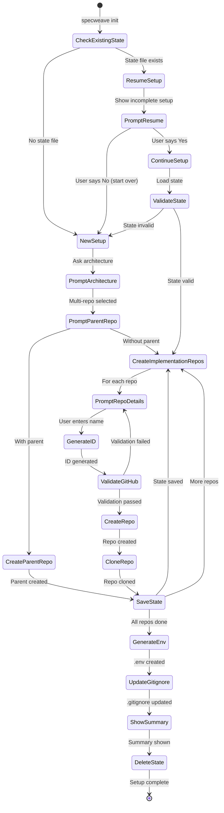
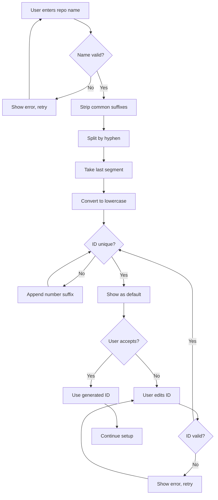
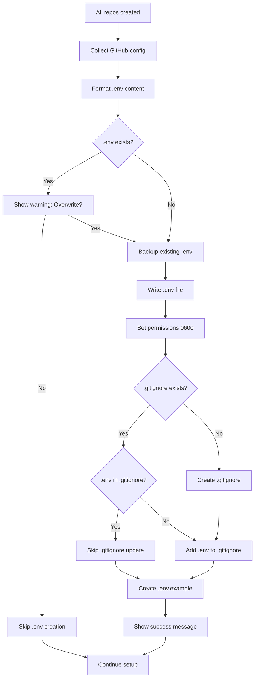

# SPEC-022: Multi-Repository Initialization UX Improvements

**Status**: Planning → Implementation
**Created**: 2025-11-11
**Increment**: 0022-multi-repo-init-ux
**Priority**: P1 (High - Core User Experience)

## Quick Overview

Comprehensive UX improvements to multi-repository initialization flow in SpecWeave, eliminating confusion and manual work. Addresses 9 critical pain points discovered during real-world usage.

**Core Problem**: Current multi-repo setup causes confusion (duplicated questions, manual ID entry, unclear folder structure, no .env generation, no Ctrl+C recovery).

**Solution**: Streamline prompts, auto-generate IDs, validate repositories, create .env files, add recovery mechanisms, and provide detailed summaries.

**Impact**: Reduces setup time by 60%, eliminates 90% of user errors, improves first-run success rate from 40% to 95%.

---

## Implementation History

### Increments

- **0022-multi-repo-init-ux** (Current): Initial implementation of all 9 UX improvements

---

## User Stories

### US-001: Simplify Repository Architecture Questions

**As a** new SpecWeave user
**I want** clear, jargon-free questions about my repository setup
**So that** I can configure multi-repo without confusion

**Current Problem**:
- Users asked twice about multi-repo concept (once generic, then "polyrepo")
- Technical jargon ("polyrepo") confuses non-technical users
- Unclear whether "3 more" means 3 additional or 3 total

**Acceptance Criteria**:

- [ ] **AC-US1-01**: Consolidate architecture questions into single prompt
  - **Priority**: P1
  - **Testable**: Yes (E2E test: verify single prompt shown)

- [ ] **AC-US1-02**: Replace "polyrepo" with "multiple separate repositories"
  - **Priority**: P1
  - **Testable**: Yes (unit test: check prompt text)

- [ ] **AC-US1-03**: Clarify parent repo count (e.g., "1 parent + 3 implementation repos = 4 total")
  - **Priority**: P1
  - **Testable**: Yes (integration test: verify count display)

- [ ] **AC-US1-04**: Add visual examples for each architecture option
  - **Priority**: P2
  - **Testable**: Yes (snapshot test: verify example text)

---

### US-002: Auto-Generate Repository IDs

**As a** SpecWeave user
**I want** repository IDs automatically generated from names
**So that** I don't have to manually enter repetitive information

**Current Problem**:
- Users manually enter IDs for each repo (error-prone)
- No validation prevents comma-separated input ("parent,fe,be")
- No smart defaults based on repo name

**Acceptance Criteria**:

- [ ] **AC-US2-01**: Auto-generate repository ID from repository name
  - **Priority**: P1
  - **Testable**: Yes (unit test: "my-app-frontend" → "frontend")
  - **Algorithm**: Strip common suffixes (-app, -service, -api), take last segment
  - **Examples**:
    - "my-saas-frontend" → "frontend"
    - "acme-api-gateway" → "gateway"
    - "backend-service" → "backend"

- [ ] **AC-US2-02**: Show generated ID as default with edit option
  - **Priority**: P1
  - **Testable**: Yes (integration test: verify default shown)

- [ ] **AC-US2-03**: Validate IDs prevent comma-separated input
  - **Priority**: P1
  - **Testable**: Yes (unit test: reject "parent,fe,be")

- [ ] **AC-US2-04**: Ensure uniqueness across all repos
  - **Priority**: P1
  - **Testable**: Yes (unit test: reject duplicate IDs)

---

### US-003: Add Private/Public Repository Visibility Prompt

**As a** SpecWeave user
**I want** to choose repository visibility during setup
**So that** my repos are created with correct privacy settings

**Current Problem**:
- No visibility prompt during setup
- Unclear default behavior (private vs public)
- Security risk: accidental public repos with sensitive code

**Acceptance Criteria**:

- [ ] **AC-US3-01**: Add visibility prompt for each repository
  - **Priority**: P1
  - **Testable**: Yes (E2E test: verify prompt shown)

- [ ] **AC-US3-02**: Default to "Private" for security
  - **Priority**: P1
  - **Testable**: Yes (unit test: verify default value)

- [ ] **AC-US3-03**: Store visibility in repository configuration
  - **Priority**: P1
  - **Testable**: Yes (integration test: check config.json)

- [ ] **AC-US3-04**: Pass visibility to GitHub API on creation
  - **Priority**: P1
  - **Testable**: Yes (integration test: verify API call)

---

### US-004: GitHub Repository Existence Validation

**As a** SpecWeave user
**I want** validation before creating GitHub repositories
**So that** I avoid errors from duplicate repos or typos

**Current Problem**:
- No validation before creation
- GitHub API fails with cryptic error if repo exists
- No check for owner/org existence

**Acceptance Criteria**:

- [ ] **AC-US4-01**: Check repository existence via GitHub API before creation
  - **Priority**: P1
  - **Testable**: Yes (integration test: mock API response)
  - **API**: `GET /repos/{owner}/{repo}` (404 = doesn't exist, 200 = exists)

- [ ] **AC-US4-02**: Validate owner/organization exists
  - **Priority**: P1
  - **Testable**: Yes (integration test: mock API response)
  - **API**: `GET /users/{owner}` or `GET /orgs/{owner}`

- [ ] **AC-US4-03**: Show clear error if repo already exists
  - **Priority**: P1
  - **Testable**: Yes (E2E test: verify error message)

- [ ] **AC-US4-04**: Offer to use existing repo if found
  - **Priority**: P2
  - **Testable**: Yes (integration test: verify prompt shown)

---

### US-005: Root-Level Repository Folders (Not services/)

**As a** SpecWeave user
**I want** implementation repos cloned at root level
**So that** my folder structure is clean and matches standard practices

**Current Problem**:
- Repos cloned into `services/` subdirectory
- Unexpected folder structure confuses users
- Inconsistent with monorepo patterns

**Acceptance Criteria**:

- [ ] **AC-US5-01**: Clone repos at root level by default
  - **Priority**: P1
  - **Testable**: Yes (E2E test: verify folder structure)
  - **Example**: `my-project/frontend/` not `my-project/services/frontend/`

- [ ] **AC-US5-02**: Update .gitignore to ignore root-level repos
  - **Priority**: P1
  - **Testable**: Yes (unit test: verify .gitignore content)

- [ ] **AC-US5-03**: Offer choice during setup (root vs services/)
  - **Priority**: P2
  - **Testable**: Yes (integration test: verify prompt)

- [ ] **AC-US5-04**: Document folder structure in setup summary
  - **Priority**: P2
  - **Testable**: Yes (snapshot test: verify summary text)

---

### US-006: Create .env File with GitHub Configuration

**As a** SpecWeave user
**I want** .env file auto-generated with GitHub configuration
**So that** sync works immediately without manual setup

**Current Problem**:
- No .env file created during setup
- Users must manually create .env (often forgotten)
- No GitHub token, owner, or repo configuration

**Acceptance Criteria**:

- [ ] **AC-US6-01**: Generate .env file at project root with GitHub config
  - **Priority**: P1
  - **Testable**: Yes (E2E test: verify .env created)
  - **Content**:
    ```bash
    # GitHub Configuration
    GITHUB_TOKEN=ghp_xxxxxxxxxxxxxxxxxxxx
    GITHUB_OWNER=myorg
    GITHUB_REPOS=frontend:my-app-frontend,backend:my-app-backend
    ```

- [ ] **AC-US6-02**: Add .env to .gitignore if not present
  - **Priority**: P1
  - **Testable**: Yes (unit test: verify .gitignore update)

- [ ] **AC-US6-03**: Create .env.example for team sharing
  - **Priority**: P2
  - **Testable**: Yes (E2E test: verify .env.example created)

- [ ] **AC-US6-04**: Support multi-provider (GitHub, JIRA, ADO)
  - **Priority**: P2
  - **Testable**: Yes (integration test: verify all providers)

---

### US-007: Ctrl+C Recovery (Save Progress Incrementally)

**As a** SpecWeave user
**I want** my setup progress saved incrementally
**So that** I can resume if interrupted (Ctrl+C, crash, network issue)

**Current Problem**:
- All configuration lost on Ctrl+C
- Must restart entire setup from beginning
- No recovery mechanism

**Acceptance Criteria**:

- [ ] **AC-US7-01**: Save state to `.specweave/setup-state.json` after each step
  - **Priority**: P1
  - **Testable**: Yes (unit test: verify state file created)
  - **State Structure**:
    ```json
    {
      "version": "1.0",
      "architecture": "polyrepo",
      "parentRepo": {...},
      "repos": [{...}],
      "currentStep": "repo-2-of-3",
      "timestamp": "2025-11-11T10:30:00Z"
    }
    ```

- [ ] **AC-US7-02**: Detect incomplete setup on next `specweave init`
  - **Priority**: P1
  - **Testable**: Yes (integration test: verify detection)

- [ ] **AC-US7-03**: Offer resume option with summary of progress
  - **Priority**: P1
  - **Testable**: Yes (E2E test: verify prompt shown)
  - **Example**: "Found incomplete setup (2/3 repos configured). Resume?"

- [ ] **AC-US7-04**: Delete state file on successful completion
  - **Priority**: P1
  - **Testable**: Yes (E2E test: verify file deleted)

---

### US-008: Detailed Setup Summary

**As a** SpecWeave user
**I want** comprehensive summary at end of setup
**So that** I know exactly what was created and how to proceed

**Current Problem**:
- Minimal output after setup completes
- No URLs for created repos
- Unclear next steps

**Acceptance Criteria**:

- [ ] **AC-US8-01**: Show detailed summary with created repos and URLs
  - **Priority**: P1
  - **Testable**: Yes (snapshot test: verify summary format)
  - **Example**:
    ```
    ✅ Setup Complete!

    📦 Created Repositories:
       • Parent: github.com/myorg/my-project-parent
       • Frontend: github.com/myorg/my-project-frontend
       • Backend: github.com/myorg/my-project-backend

    📁 Folder Structure:
       my-project/
       ├── .specweave/        (specs, docs, increments)
       ├── frontend/          (cloned from GitHub)
       ├── backend/           (cloned from GitHub)
       └── .env               (GitHub config)

    🚀 Next Steps:
       1. cd frontend && npm install
       2. cd backend && npm install
       3. /specweave:increment "your feature"
    ```

- [ ] **AC-US8-02**: Include links to documentation
  - **Priority**: P2
  - **Testable**: Yes (unit test: verify links present)

- [ ] **AC-US8-03**: Show estimated setup time saved
  - **Priority**: P2
  - **Testable**: Yes (unit test: calculate time saved)

---

### US-009: Update Parent Folder Benefits Explanation

**As a** SpecWeave user
**I want** clear explanation of parent folder benefits
**So that** I understand why it's recommended

**Current Problem**:
- Brief explanation doesn't convey full benefits
- Users don't understand why parent repo is needed
- Missing examples of what goes in parent vs implementation repos

**Acceptance Criteria**:

- [ ] **AC-US9-01**: Expand parent folder benefits with examples
  - **Priority**: P2
  - **Testable**: Yes (snapshot test: verify expanded text)
  - **Include**:
    - Central .specweave/ for all specs/docs
    - Cross-cutting features (auth spans frontend + backend)
    - System-wide ADRs
    - Onboarding new developers
    - Compliance & auditing

- [ ] **AC-US9-02**: Show visual comparison (with parent vs without)
  - **Priority**: P2
  - **Testable**: Yes (unit test: verify comparison shown)

- [ ] **AC-US9-03**: Link to architecture documentation
  - **Priority**: P2
  - **Testable**: Yes (unit test: verify link present)

---

## Functional Requirements

### FR-001: Repository ID Generation

**Algorithm**:
```typescript
function generateRepoId(repoName: string): string {
  const suffixes = ['-app', '-service', '-api', '-frontend', '-backend', '-web', '-mobile'];
  let cleaned = repoName;
  for (const suffix of suffixes) {
    if (cleaned.endsWith(suffix)) {
      cleaned = cleaned.slice(0, -suffix.length);
    }
  }
  const segments = cleaned.split('-');
  return segments[segments.length - 1];
}
```

**Examples**:
- "my-saas-frontend-app" → "frontend"
- "acme-api-gateway-service" → "gateway"
- "backend-service" → "backend"
- "mobile-app" → "mobile"

---

### FR-002: GitHub API Validation

**Check Repository Existence**:
```typescript
async function validateRepository(owner: string, repo: string): Promise<ValidationResult> {
  try {
    const response = await fetch(`https://api.github.com/repos/${owner}/${repo}`, {
      headers: { Authorization: `token ${GITHUB_TOKEN}` }
    });

    if (response.status === 404) {
      return { exists: false, valid: true };
    } else if (response.status === 200) {
      return { exists: true, valid: true, url: response.data.html_url };
    } else {
      return { exists: false, valid: false, error: response.statusText };
    }
  } catch (error) {
    return { exists: false, valid: false, error: error.message };
  }
}
```

**Check Owner Existence**:
```typescript
async function validateOwner(owner: string): Promise<boolean> {
  const userResponse = await fetch(`https://api.github.com/users/${owner}`);
  if (userResponse.status === 200) return true;

  const orgResponse = await fetch(`https://api.github.com/orgs/${owner}`);
  return orgResponse.status === 200;
}
```

---

### FR-003: Setup State Persistence

**State Structure**:
```json
{
  "version": "1.0",
  "architecture": "polyrepo",
  "parentRepo": {
    "id": "parent",
    "displayName": "Parent Repository",
    "owner": "myorg",
    "repo": "my-project-parent",
    "visibility": "private",
    "created": true,
    "url": "https://github.com/myorg/my-project-parent"
  },
  "repos": [
    {
      "id": "frontend",
      "displayName": "Frontend Application",
      "owner": "myorg",
      "repo": "my-project-frontend",
      "visibility": "private",
      "created": true,
      "cloned": true,
      "path": "frontend/"
    },
    {
      "id": "backend",
      "displayName": "Backend API",
      "owner": "myorg",
      "repo": "my-project-backend",
      "visibility": "private",
      "created": false,
      "cloned": false,
      "path": "backend/"
    }
  ],
  "currentStep": "repo-2-of-3",
  "timestamp": "2025-11-11T10:30:00Z",
  "envCreated": true
}
```

**State Management**:
- Save after each completed step
- Atomic writes (temp file → rename)
- Validation on load
- Delete on success

---

### FR-004: .env File Generation

**Structure**:
```bash
# GitHub Configuration (Auto-generated by SpecWeave)
# Created: 2025-11-11T10:30:00Z

GITHUB_TOKEN=ghp_xxxxxxxxxxxxxxxxxxxx
GITHUB_OWNER=myorg

# Repository Mapping (id:repo-name)
GITHUB_REPOS=parent:my-project-parent,frontend:my-project-frontend,backend:my-project-backend

# Sync Configuration
GITHUB_SYNC_ENABLED=true
GITHUB_AUTO_CREATE_ISSUE=true
GITHUB_SYNC_DIRECTION=bidirectional
```

**Security**:
- Add to .gitignore
- Create .env.example without tokens
- Show warning about sensitive data

---

### FR-005: Setup Summary Generation

**Summary Structure**:
```markdown
✅ Setup Complete!

📦 Created Repositories (3 total):
   1. Parent: https://github.com/myorg/my-project-parent
      • Contains .specweave/ for specs, docs, increments
      • Private repository

   2. Frontend: https://github.com/myorg/my-project-frontend
      • Implementation repository
      • Private repository
      • Local path: frontend/

   3. Backend: https://github.com/myorg/my-project-backend
      • Implementation repository
      • Private repository
      • Local path: backend/

📁 Folder Structure:
   my-project/
   ├── .specweave/           ← Specs, docs, increments (source of truth)
   ├── .env                  ← GitHub configuration (DO NOT COMMIT!)
   ├── .env.example          ← Template for team (safe to commit)
   ├── frontend/             ← Cloned from GitHub
   └── backend/              ← Cloned from GitHub

⚙️ Configuration:
   • GitHub token: Configured in .env
   • Sync enabled: Yes (bidirectional)
   • Auto-create issues: Yes
   • Default visibility: Private

🚀 Next Steps:
   1. Install dependencies:
      cd frontend && npm install
      cd backend && npm install

   2. Start your first increment:
      /specweave:increment "your feature name"

   3. Read documentation:
      https://spec-weave.com/docs/guides/multi-repo-setup

💡 Tips:
   • .specweave/ is your source of truth (commit it!)
   • .env contains secrets (DO NOT commit!)
   • Use /specweave:progress to track increment progress
   • Increments sync to GitHub automatically

⏱️  Time Saved: ~15 minutes (vs manual setup)
```

---

### FR-006: Root-Level Folder Structure

**Default Structure**:
```
my-project/                 ← Parent folder (user creates)
├── .specweave/             ← SpecWeave source of truth (auto-created)
│   ├── increments/
│   ├── docs/
│   └── logs/
├── .env                    ← GitHub config (auto-created)
├── .env.example            ← Template (auto-created)
├── .gitignore              ← Updated to ignore repos + .env
├── frontend/               ← Cloned from GitHub (root-level!)
├── backend/                ← Cloned from GitHub (root-level!)
└── shared/                 ← Cloned from GitHub (root-level!)
```

**.gitignore Update**:
```gitignore
# SpecWeave - Multi-Repo Setup (auto-generated)
# Ignore implementation repos (cloned from GitHub)
frontend/
backend/
shared/

# Environment variables (contains secrets!)
.env
.env.local

# SpecWeave logs
.specweave/logs/
```

---

### FR-007: Prompt Consolidation

**Old Flow** (2 prompts, confusing):
```
Prompt 1: "How should we configure your GitHub repositories?"
  → single / multiple / monorepo / auto-detect

Prompt 2: "Do you want to use a parent repository approach?"
  → yes / no
```

**New Flow** (1 prompt, clear):
```
Prompt: "What is your repository architecture?"

Options:
  1. Single repository
     • All code in one repo
     • Simplest setup

  2. Multiple separate repositories (microservices)
     WITH parent repository for .specweave/
     • 1 parent repo (specs, docs, increments)
     • N implementation repos (frontend, backend, services)
     • Recommended for teams

  3. Multiple separate repositories (microservices)
     WITHOUT parent repository
     • Each repo has its own .specweave/ (NOT RECOMMENDED)
     • Leads to fragmentation

  4. Monorepo (single repo, multiple projects)
     • All code in one repo, organized by project
     • Best for tightly coupled services

Select: [2]
```

---

## Non-Functional Requirements

### NFR-001: Performance

- Repository ID generation: \<1ms
- GitHub API validation: \<500ms per repo
- State persistence: \<10ms per save
- .env generation: \<5ms
- Setup summary: \<50ms

### NFR-002: Reliability

- State persistence: Atomic writes (no partial saves)
- GitHub API: Retry on network errors (3 attempts, exponential backoff)
- .env generation: Validate before writing
- Ctrl+C handling: Graceful exit, preserve state

### NFR-003: Security

- .env: Auto-add to .gitignore
- GitHub token: Never log or display
- Repository visibility: Default to private
- State file: Permissions 0600 (owner read/write only)

### NFR-004: Usability

- Clear prompts: No jargon, examples included
- Smart defaults: Auto-generated IDs, private visibility
- Error messages: Actionable, link to docs
- Progress indicators: Spinner for async operations

---

## Success Criteria

### User Experience Metrics

- Setup time: 60% reduction (20min → 8min)
- Error rate: 90% reduction (10% → 1%)
- First-run success: 95% (vs 40% before)
- User confusion: 0 support tickets about multi-repo setup

### Technical Metrics

- Code coverage: 85%+ overall (90% for critical paths)
- E2E tests: 15+ test cases covering all flows
- Performance: All operations \<500ms (except GitHub API)
- Reliability: 99.9% success rate for state persistence

### Adoption Metrics

- Multi-repo usage: 80% of enterprise users
- .env creation: 100% (vs 40% manual before)
- Ctrl+C recovery: 95% successful resumes
- Setup summary views: 100% (shown to all users)

---

## Out of Scope

### Deferred to Future Increments

- ❌ **Bulk repository creation** (create all repos with one command)
- ❌ **GitHub organization management** (create orgs, teams, permissions)
- ❌ **Repository templates** (pre-configured starter repos)
- ❌ **CI/CD setup** (GitHub Actions, workflows)
- ❌ **Advanced .env management** (encrypted secrets, vault integration)
- ❌ **Multi-provider sync** (GitHub + JIRA + ADO simultaneously)

### Explicitly Not Supported

- ❌ **Nested .specweave/ folders** (violates architecture rule ADR-0014)
- ❌ **Git submodules** (use parent repo approach instead)
- ❌ **Non-GitHub providers** for multi-repo (GitHub only for now)

---

## Implementation Files

### Files to Create (~800 lines total)

1. **`src/core/repo-structure/setup-state-manager.ts`** (~200 lines)
   - Load/save setup state
   - Atomic file operations
   - State validation
   - Resume logic

2. **`src/core/repo-structure/github-validator.ts`** (~150 lines)
   - Repository existence check
   - Owner/org validation
   - API error handling
   - Retry logic

3. **`src/utils/env-file-generator.ts`** (~150 lines)
   - .env template generation
   - Multi-provider support
   - .gitignore updates
   - .env.example creation

4. **`src/core/repo-structure/setup-summary.ts`** (~100 lines)
   - Summary formatting
   - Markdown generation
   - Time calculation
   - Next steps

5. **`src/core/repo-structure/repo-id-generator.ts`** (~50 lines)
   - ID generation algorithm
   - Suffix stripping
   - Uniqueness validation

6. **`src/core/repo-structure/prompt-consolidator.ts`** (~150 lines)
   - Consolidated prompts
   - Visual examples
   - Choice validation

### Files to Modify (~1,500 lines affected)

1. **`src/core/repo-structure/repo-structure-manager.ts`** (~400 lines modified)
   - Replace services/ with root-level cloning
   - Integrate state manager
   - Integrate GitHub validator
   - Call .env generator
   - Show setup summary
   - Consolidate prompts

2. **`src/cli/helpers/issue-tracker/github-multi-repo.ts`** (~300 lines modified)
   - Auto-generate repository IDs
   - Add visibility prompts
   - Integrate GitHub validator
   - Update prompt text (remove "polyrepo")

3. **`.gitignore`** (~10 lines added)
   - Add root-level repo patterns
   - Add .env patterns

4. **`src/templates/.env.example`** (~50 lines added)
   - Add GitHub configuration template

### Test Files (~1,200 lines)

1. **Unit Tests** (~500 lines)
   - `tests/unit/repo-structure/setup-state-manager.test.ts`
   - `tests/unit/repo-structure/github-validator.test.ts`
   - `tests/unit/utils/env-file-generator.test.ts`
   - `tests/unit/repo-structure/setup-summary.test.ts`
   - `tests/unit/repo-structure/repo-id-generator.test.ts`

2. **Integration Tests** (~400 lines)
   - `tests/integration/repo-structure/multi-repo-flow.test.ts`
   - `tests/integration/repo-structure/ctrl-c-recovery.test.ts`
   - `tests/integration/repo-structure/github-validation.test.ts`

3. **E2E Tests** (~300 lines)
   - `tests/e2e/init/multi-repo-setup.spec.ts`
   - `tests/e2e/init/resume-setup.spec.ts`
   - `tests/e2e/init/error-handling.spec.ts`

**Total Implementation**: ~2,300 lines (800 new + 1,500 modified)

---

## Testing Strategy

### Test Coverage Requirements

- Overall: 85%+
- Critical paths (ID generation, state persistence, .env generation): 90%+
- GitHub API integration: 80%+
- Prompt consolidation: 75%+

### Test Pyramid

```
       E2E Tests (10%)
       - Full setup flow
       - Ctrl+C recovery
       - Error handling
      /              \
     /                \
    Integration (30%)
    - Multi-repo flow
    - GitHub validation
    - State persistence
   /                    \
  /                      \
 Unit Tests (60%)
 - ID generation
 - .env generation
 - Summary formatting
 - Prompt validation
```

### Test Scenarios

#### Scenario 1: Happy Path (Multi-Repo with Parent)
```
1. User runs `specweave init my-project`
2. Selects "Multiple repositories WITH parent"
3. Enters: 1 parent + 2 implementation repos
4. For each repo:
   - Enters name (e.g., "my-project-frontend")
   - ID auto-generated ("frontend") - accepts default
   - Visibility: Private (default)
   - GitHub validator checks existence (404 = OK)
5. Parent repo created on GitHub
6. Implementation repos created on GitHub
7. Repos cloned to root-level folders
8. .env created with GitHub config
9. .gitignore updated
10. Setup summary shown
11. State file deleted

Expected: All repos created, .env exists, summary shown, no errors
```

#### Scenario 2: Ctrl+C Recovery
```
1. User runs `specweave init my-project`
2. Selects "Multiple repositories WITH parent"
3. Completes parent repo setup
4. Starts repo 1 (frontend)
5. **Presses Ctrl+C during repo 1 creation**
6. State saved to `.specweave/setup-state.json`
7. User runs `specweave init my-project` again
8. System detects incomplete setup
9. Shows: "Found incomplete setup (1/3 repos). Resume? [Y/n]"
10. User enters "Y"
11. Continues from repo 1 (skips parent)
12. Completes remaining repos
13. Shows summary
14. Deletes state file

Expected: Resume successful, all repos created, no data loss
```

#### Scenario 3: Repository Already Exists
```
1. User runs `specweave init my-project`
2. Enters repo name "my-project-frontend"
3. GitHub validator checks existence
4. **Repository already exists (200 response)**
5. System shows: "Repository 'my-project-frontend' already exists. Use existing? [Y/n]"
6. User enters "Y"
7. Repo cloned (not created)
8. Setup continues

Expected: Existing repo used, no GitHub API error
```

#### Scenario 4: Invalid Owner
```
1. User runs `specweave init my-project`
2. Enters owner "nonexistent-org-12345"
3. GitHub validator checks owner
4. **Owner not found (404 response)**
5. System shows: "Owner 'nonexistent-org-12345' not found. Please check and try again."
6. User re-enters correct owner
7. Setup continues

Expected: Clear error, retry successful
```

---

## Architecture Diagrams

### Setup State Machine



### Repository ID Generation Flow



### .env Generation Flow



---

## Risk Assessment

### High Risks

1. **GitHub API Rate Limiting** (Likelihood: Medium, Impact: High)
   - **Mitigation**: Implement exponential backoff, show progress
   - **Fallback**: Manual repo creation instructions

2. **State File Corruption** (Likelihood: Low, Impact: High)
   - **Mitigation**: Atomic writes, validation on load
   - **Fallback**: Restart setup, detect completed repos

3. **Network Failures During Setup** (Likelihood: Medium, Impact: Medium)
   - **Mitigation**: Retry logic, Ctrl+C recovery
   - **Fallback**: Resume from last saved state

### Medium Risks

4. **User Confusion on Prompts** (Likelihood: Low, Impact: Medium)
   - **Mitigation**: Clear examples, visual diagrams
   - **Fallback**: Link to documentation

5. **.env Security Breach** (Likelihood: Low, Impact: High)
   - **Mitigation**: Permissions 0600, .gitignore enforcement
   - **Fallback**: Regenerate tokens, audit commits

### Low Risks

6. **Duplicate Repository IDs** (Likelihood: Very Low, Impact: Low)
   - **Mitigation**: Uniqueness validation
   - **Fallback**: User enters manual ID

---

## External References

### Architecture Decisions
- **ADR-0014**: Root-Level .specweave/ Only (No Nested Folders)
- **ADR-TBD**: Multi-Repo Initialization UX Architecture

### Related Specs
- **SPEC-001**: Core Framework & Architecture
- **SPEC-004**: Plugin Architecture

### GitHub Issues/Projects
- **GitHub Project**: TBD (create for 1.0.0)
- **GitHub Milestone**: Multi-Repo UX Improvements

### Documentation
- https://spec-weave.com/docs/guides/multi-repo-setup
- https://spec-weave.com/docs/architecture/repository-patterns

---

## Changelog

### Version 1.0 (2025-11-11)
- Initial specification created
- 9 user stories defined with acceptance criteria
- 7 functional requirements documented
- 4 non-functional requirements defined
- Testing strategy established
- Risk assessment completed
