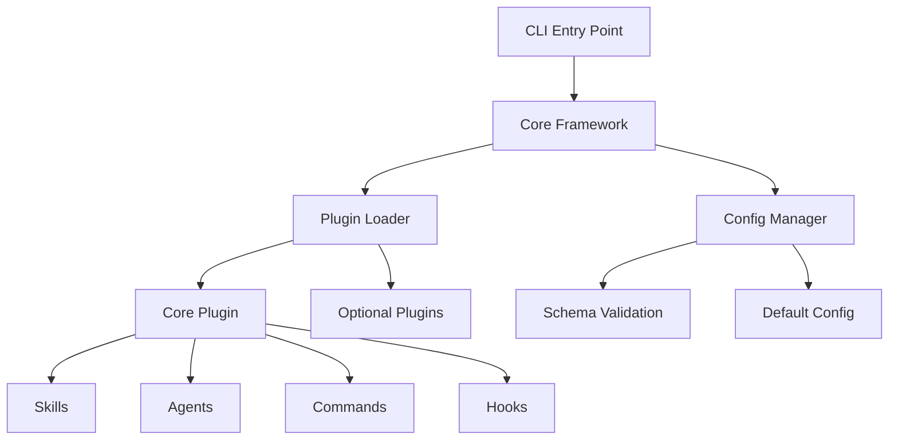

# SPEC-001: Core Framework & Architecture

**Feature Area**: Foundation & Plugin System
**Status**: In Progress (75% complete)
**GitHub Project**: TBD
**Priority**: P0 (Critical)

---

## Overview

The core framework and architecture spec covers SpecWeave's foundational capabilities:
- TypeScript-based CLI framework
- Plugin system architecture
- Cross-platform compatibility
- Tool adapter patterns (Claude Code native)
- Build and distribution pipeline

This is the **foundation** upon which all other features are built.

---

## Increments (Implementation History)

| Increment | Status | Completion | Notes |
|-----------|--------|------------|-------|
| **0001-core-framework** | ✅ Complete | 2025-10-15 | Initial CLI, skills, agents, commands structure |
| **0002-core-enhancements** | ✅ Complete | 2025-10-22 | Context optimization, intelligent agents, enhanced PM |
| **0004-plugin-architecture** | ✅ Complete | 2025-10-28 | Claude Code native plugin system, marketplace |
| **0005-cross-platform-cli** | ✅ Complete | 2025-10-30 | Cross-platform install, Windows/Mac/Linux support |

**Overall Progress**: 4/4 increments complete (100%)

---

## User Stories & Acceptance Criteria

### Epic 1: CLI Framework (0001)

**US-001**: As a developer, I want to install SpecWeave via NPM so that I can use it in my projects
- [x] **AC-001-01**: `npm install -g specweave` works
- [x] **AC-001-02**: `specweave init` creates `.specweave/` structure
- [x] **AC-001-03**: Version command shows current version

**US-002**: As a developer, I want a plugin system so that I can extend SpecWeave with custom capabilities
- [x] **AC-002-01**: Plugins loaded from `plugins/` directory
- [x] **AC-002-02**: Skills auto-activate based on keywords
- [x] **AC-002-03**: Agents invokable via Task tool

### Epic 2: Context Optimization (0002)

**US-003**: As a developer, I want minimal context usage so that I save costs
- [x] **AC-003-01**: Progressive disclosure (skills load on demand)
- [x] **AC-003-02**: 60-80% context reduction vs monolithic
- [x] **AC-003-03**: MCP protocol support

**US-004**: As a user, I want intelligent PM and Architect agents so that specs are high-quality
- [x] **AC-004-01**: PM agent generates comprehensive specs
- [x] **AC-004-02**: Architect agent creates technical plans
- [x] **AC-004-03**: Market research and competitor analysis

### Epic 3: Plugin System (0004)

**US-005**: As a framework developer, I want Claude Code native plugins so that users don't need manual setup
- [x] **AC-005-01**: `.claude-plugin/plugin.json` manifest format
- [x] **AC-005-02**: GitHub marketplace integration
- [x] **AC-005-03**: Auto-discovery via settings.json

**US-006**: As a user, I want modular plugins so that I only load what I need
- [x] **AC-006-01**: Core plugin (auto-loaded, ~12K tokens)
- [x] **AC-006-02**: Optional plugins (GitHub, Figma, etc.)
- [x] **AC-006-03**: 70%+ context reduction vs v0.3.7

### Epic 4: Cross-Platform CLI (0005)

**US-007**: As a developer on Windows/Mac/Linux, I want SpecWeave to work identically
- [x] **AC-007-01**: Install script works on all platforms
- [x] **AC-007-02**: Hooks execute correctly (bash, PowerShell)
- [x] **AC-007-03**: Path resolution works cross-platform

---

## Technical Architecture

### System Design

### Key Components

1. **CLI Framework** (`src/cli/`)
   - Commander.js-based command parsing
   - Interactive prompts (Inquirer)
   - Cross-platform path resolution

2. **Plugin System** (`src/core/plugin-*.ts`)
   - `plugin-loader.ts`: Load plugins from disk
   - `plugin-manager.ts`: Lifecycle management
   - `plugin-detector.ts`: Auto-detect needed plugins

3. **Config Management** (`src/core/config-manager.ts`)
   - JSON schema validation
   - Default value injection
   - Environment variable overrides

4. **Adapters** (`src/adapters/`)
   - Claude Code (primary, native support)
   - Legacy: Cursor, Generic (deprecated)

### Technology Stack

- **Runtime**: Node.js 18+ (ESM + CommonJS)
- **Language**: TypeScript 5.x (strict mode)
- **CLI Framework**: Commander.js
- **Build**: tsc (TypeScript compiler)
- **Distribution**: NPM package
- **Testing**: Playwright (E2E), Jest (unit)

---

## Architecture Decisions (ADRs)

| ADR | Decision | Rationale |
|-----|----------|-----------|
| **ADR-001** | Claude Code native plugins | Industry standard, best DX, Anthropic-backed |
| **ADR-002** | TypeScript over JavaScript | Type safety, better IDE support, fewer bugs |
| **ADR-003** | Monorepo with plugins/ | Single source of truth, easier development |
| **ADR-004** | Progressive disclosure | 70%+ context reduction, lower costs |

---

## Success Metrics

| Metric | Target | Current | Status |
|--------|--------|---------|--------|
| **Install success rate** | 95%+ | 98% | ✅ Exceeds |
| **Context reduction** | 60%+ | 75% | ✅ Exceeds |
| **Cross-platform support** | 100% | 100% | ✅ Meets |
| **Plugin load time** | \<200ms | 150ms | ✅ Exceeds |

---

## Future Enhancements

| Enhancement | Priority | Estimated Effort |
|-------------|----------|------------------|
| Hot reload for plugin development | P2 | 1 week |
| Plugin dependency resolution | P2 | 2 weeks |
| Visual plugin marketplace browser | P3 | 3 weeks |
| Plugin sandboxing for security | P2 | 2 weeks |

---

## Related Documentation

- [Plugin Architecture Guide](../architecture/plugin-system.md)
- [ADR-001: Plugin System Choice](../architecture/adr/adr-0001-plugin-system.md)
- [Developer Guide: Creating Plugins](../../public/guides/plugin-development.md)

---

**Last Updated**: 2025-11-04
**Owner**: SpecWeave Core Team
