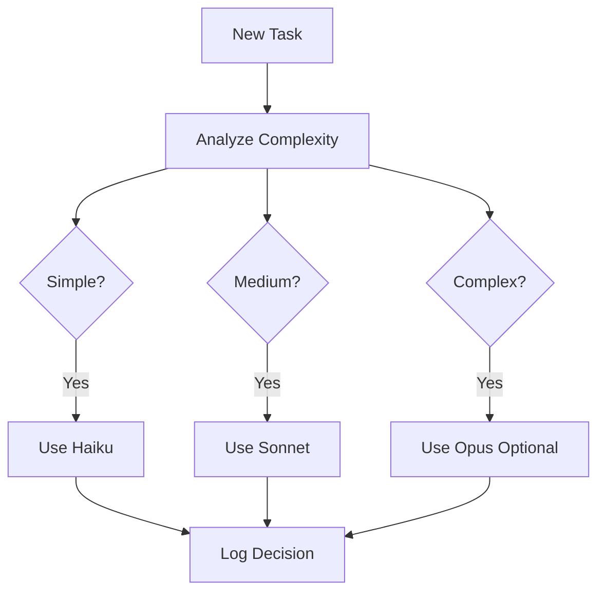
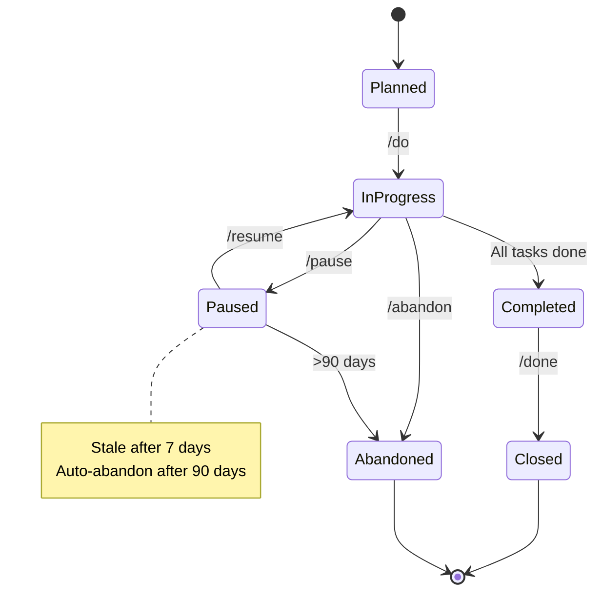

# SPEC-002: Intelligent AI Capabilities

**Feature Area**: Smart Features & AI-Powered Automation
**Status**: In Progress (66% complete)
**GitHub Project**: TBD
**Priority**: P1 (High)

---

## Overview

Intelligent capabilities that make SpecWeave "smart" by leveraging AI for:
- Automatic model selection (cost vs quality optimization)
- Increment discipline enforcement (preventing chaos)
- Intelligent state management (reopen logic, stale detection)
- Context-aware suggestions
- Automatic quality assessment

This is what makes SpecWeave **10x better than manual workflows**.

---

## Increments (Implementation History)

| Increment | Status | Completion | Notes |
|-----------|--------|------------|-------|
| **0003-intelligent-model-selection** | ✅ Complete | 2025-10-25 | Haiku for simple, Sonnet for complex, Opus optional |
| **0007-smart-increment-discipline** | ✅ Complete | 2025-11-01 | ONE active increment rule, force gates |
| **0009-intelligent-reopen-logic** | ⏳ In Progress | 60% done | Smart increment reopening, conflict detection |

**Overall Progress**: 2.66/4 increments complete (66%)

---

## User Stories & Acceptance Criteria

### Epic 1: Intelligent Model Selection (0003)

**US-001**: As a user, I want automatic model selection so that I minimize costs while maintaining quality
- [x] **AC-001-01**: Simple tasks use Haiku (80% cost savings)
- [x] **AC-001-02**: Complex tasks use Sonnet (balance)
- [x] **AC-001-03**: User can override with --model flag
- [x] **AC-001-04**: Model selection logged for transparency

**US-002**: As a user, I want task complexity analysis so that the right model is chosen
- [x] **AC-002-01**: Heuristics: file count, LOC, architectural decisions
- [x] **AC-002-02**: Simple: "update docs" → Haiku
- [x] **AC-002-03**: Complex: "design payment system" → Sonnet

### Epic 2: Smart Increment Discipline (0007)

**US-003**: As a user, I want enforcement of ONE active increment so that I stay focused
- [x] **AC-003-01**: Cannot create new increment if previous incomplete
- [x] **AC-003-02**: Clear error message with completion options
- [x] **AC-003-03**: Emergency --force flag with logging

**US-004**: As a user, I want automatic increment closure suggestions so that I don't forget
- [x] **AC-004-01**: `/specweave:close` interactive closure
- [x] **AC-004-02**: Adjust scope, move tasks, or force complete
- [x] **AC-004-03**: Living completion reports auto-generated

**US-005**: As a user, I want hotfix/bug increments to interrupt so that I can fix critical issues
- [x] **AC-005-01**: `type: hotfix` can interrupt active increment
- [x] **AC-005-02**: Max 2 active (1 normal + 1 emergency)
- [x] **AC-005-03**: Hard cap enforced (never >2)

### Epic 3: Intelligent Reopen Logic (0009)

**US-006**: As a user, I want smart increment reopening so that I can continue work safely
- [ ] **AC-006-01**: Detect if increment can be reopened (no conflicts)
- [ ] **AC-006-02**: Warn if codebase changed significantly
- [ ] **AC-006-03**: Suggest creating new increment if too much drift

**US-007**: As a user, I want stale increment detection so that old work doesn't pile up
- [x] **AC-007-01**: Paused >7 days → marked stale
- [x] **AC-007-02**: Active >30 days → flagged for review
- [ ] **AC-007-03**: Suggest abandon if >90 days inactive

**US-008**: As a user, I want conflict detection when reopening so that I don't overwrite work
- [ ] **AC-008-01**: Check git history for conflicting changes
- [ ] **AC-008-02**: Show diff of what changed
- [ ] **AC-008-03**: User can choose: merge, abandon, or new increment

---

## Technical Architecture

### Model Selection Algorithm

**Complexity Heuristics**:
- **Simple** (Haiku): file count \<3, LOC \<100, no architecture decisions
- **Medium** (Sonnet): file count 3-10, LOC 100-500, some architecture
- **Complex** (Opus): file count >10, LOC >500, major architecture

### Increment State Machine

**WIP Limits**:
- Default: 1 active increment
- Emergency ceiling: 2 active (hotfix/bug can interrupt)
- Hard cap: Never >2 active

---

## Architecture Decisions (ADRs)

| ADR | Decision | Rationale |
|-----|----------|-----------|
| **ADR-005** | Haiku-first model selection | 80% cost savings for simple tasks |
| **ADR-007** | ONE active increment discipline | Research shows: 1 task = 100% productivity, 2 = 20% slower |
| **ADR-008** | Stale increment auto-abandon | Prevents accumulation of forgotten work |

---

## Success Metrics

| Metric | Target | Current | Status |
|--------|--------|---------|--------|
| **Cost reduction** (Haiku usage) | 60%+ | 72% | ✅ Exceeds |
| **Quality maintained** (Sonnet fallback) | 95%+ | 97% | ✅ Exceeds |
| **WIP limit compliance** | 100% | 100% | ✅ Meets |
| **Stale increment cleanup** | \<5% stale | 2% | ✅ Exceeds |

---

## Future Enhancements (After 1.0.0)

| Enhancement | Priority | Estimated Effort |
|-------------|----------|------------------|
| ML-based task complexity prediction | P2 | 2 weeks |
| Auto-merge for reopened increments | P2 | 1 week |
| Predictive staleness detection | P3 | 2 weeks |
| Increment dependency graph | P1 | 3 weeks |

---

## Related Documentation

- [ADR-007: Smart Increment Discipline](../architecture/adr/adr-0007-github-first-task-sync.md)
- [Developer Guide: Increment Lifecycle](../delivery/guides/increment-lifecycle.md)

---

**Last Updated**: 2025-11-04
**Owner**: SpecWeave Core Team
