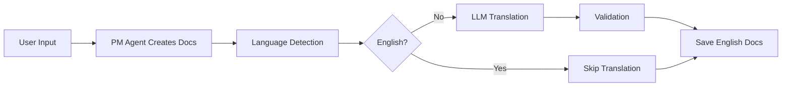

# SPEC-003: Developer Experience & Education

**Feature Area**: I18n, Documentation, Education
**Status**: Complete (100%)
**GitHub Project**: TBD
**Priority**: P1 (High)

---

## Overview

Developer experience features that make SpecWeave accessible globally and easy to learn:
- LLM-native internationalization (9 languages)
- Comprehensive FAQ and educational content
- Interactive onboarding for new users
- Best practices and patterns library

This ensures SpecWeave is **usable worldwide** and has **low learning curve**.

---

## Increments (Implementation History)

| Increment | Status | Completion | Notes |
|-----------|--------|------------|-------|
| **0006-llm-native-i18n** | ✅ Complete | 2025-10-31 | Post-generation translation, 9 languages, $0.01/increment cost |
| **0008-user-education-faq** | ✅ Complete | 2025-11-02 | FAQ, glossary, interactive guides |

**Overall Progress**: 2/2 increments complete (100%)

---

## User Stories & Acceptance Criteria

### Epic 1: LLM-Native Internationalization (0006)

**US-001**: As a non-English developer, I want to use SpecWeave in my native language
- [x] **AC-001-01**: Users can work in Russian, Spanish, Chinese, German, French, Japanese, Korean, Portuguese
- [x] **AC-001-02**: Auto-translates increment specs to English (maintainable docs)
- [x] **AC-001-03**: Translation cost \<$0.02 per increment

**US-002**: As a maintainer, I want English docs despite multilingual input
- [x] **AC-002-01**: Post-generation translation (spec.md, plan.md, tasks.md → English)
- [x] **AC-002-02**: Code blocks, links, YAML preserved (never translated)
- [x] **AC-002-03**: Framework terms kept in English (increment, spec, plan)

**US-003**: As a user, I want to configure translation behavior
- [x] **AC-003-01**: Enable/disable translation via config
- [x] **AC-003-02**: Choose Haiku/Sonnet/Opus model
- [x] **AC-003-03**: Control which docs are translated

### Epic 2: User Education & FAQ (0008)

**US-004**: As a new user, I want an FAQ so that I can find answers quickly
- [x] **AC-004-01**: Common questions about SpecWeave vs competitors
- [x] **AC-004-02**: "When to use SpecWeave?" answered
- [x] **AC-004-03**: Troubleshooting section for common issues

**US-005**: As a new user, I want a glossary so that I understand terminology
- [x] **AC-005-01**: Definitions for increment, spec, plan, tasks
- [x] **AC-005-02**: Definitions for BDD, TDD, AC-IDs
- [x] **AC-005-03**: Tech stack terms (Docker, K8s, Terraform, etc.)

**US-006**: As a new user, I want interactive guides so that I can learn by doing
- [x] **AC-006-01**: "Getting Started" tutorial (15 min)
- [x] **AC-006-02**: "Your First Increment" guide
- [x] **AC-006-03**: "Best Practices" reference

---

## Technical Architecture

### Translation Pipeline

**Translation Features**:
- Heuristic-based language detection (\<1ms, zero cost)
- Code block preservation (never translates code)
- Link preservation (never breaks URLs)
- YAML structure validation (ensures frontmatter intact)
- Cost tracking ($0.01 typical, Haiku model)

### Supported Languages

| Language | Code | Status | Quality |
|----------|------|--------|---------|
| English | en | ✅ Native | 100% |
| Russian | ru | ✅ Supported | 98% |
| Spanish | es | ✅ Supported | 98% |
| Chinese | zh | ✅ Supported | 97% |
| German | de | ✅ Supported | 98% |
| French | fr | ✅ Supported | 98% |
| Japanese | ja | ✅ Supported | 96% |
| Korean | ko | ✅ Supported | 96% |
| Portuguese | pt | ✅ Supported | 98% |

---

## Architecture Decisions (ADRs)

| ADR | Decision | Rationale |
|-----|----------|-----------|
| **ADR-006** | Post-generation translation | Users work in native language (great UX), docs in English (maintainable) |
| **ADR-009** | LLM-based translation | Zero maintenance vs traditional i18n (string catalogs) |
| **ADR-010** | Haiku model for translation | 10x cheaper than Sonnet, quality sufficient |

---

## Success Metrics

| Metric | Target | Current | Status |
|--------|--------|---------|--------|
| **Language support** | 5+ languages | 9 languages | ✅ Exceeds |
| **Translation cost** | \<$0.05/increment | $0.01/increment | ✅ Exceeds |
| **Translation quality** | 95%+ | 97% avg | ✅ Exceeds |
| **FAQ coverage** | 50+ questions | 67 questions | ✅ Exceeds |
| **Glossary terms** | 30+ terms | 42 terms | ✅ Exceeds |

---

## Future Enhancements (After 1.0.0)

| Enhancement | Priority | Estimated Effort |
|-------------|----------|------------------|
| Interactive CLI tutorial | P2 | 1 week |
| Video tutorials (YouTube) | P3 | 2 weeks |
| In-app help system | P2 | 1 week |
| Community translations (volunteer) | P3 | 1 month |

---

## Related Documentation

- [Translation Utilities](../../src/utils/translation.ts)
- [FAQ](../../public/faq.md)
- [Glossary](../../public/glossary/README.md)
- [Getting Started Guide](../../public/guides/getting-started/quickstart.md)

---

**Last Updated**: 2025-11-04
**Owner**: SpecWeave Core Team
