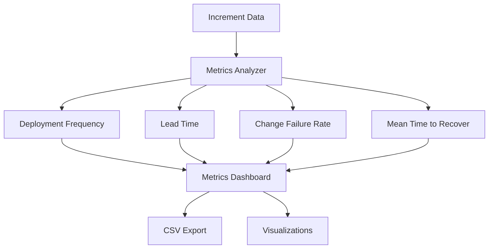

# SPEC-004: Metrics & Observability

**Feature Area**: DORA Metrics, Performance Tracking
**Status**: Complete (100%)
**GitHub Project**: TBD
**Priority**: P2 (Medium)

---

## Overview

Metrics and observability features for tracking team performance and velocity:
- DORA metrics (Deployment Frequency, Lead Time, MTTR, Change Failure Rate)
- Increment velocity tracking
- Cost analytics (AI usage, model selection)
- Living completion reports

This enables **data-driven improvement** and **stakeholder reporting**.

---

## Increments (Implementation History)

| Increment | Status | Completion | Notes |
|-----------|--------|------------|-------|
| **0010-dora-metrics-mvp** | ✅ Complete | 2025-11-03 | MVP implementation, basic analytics |

**Overall Progress**: 1/1 increments complete (100%)

---

## User Stories & Acceptance Criteria

### Epic 1: DORA Metrics MVP (0010)

**US-001**: As a team lead, I want to track deployment frequency so that I can measure velocity
- [x] **AC-001-01**: Calculate deployments per week/month
- [x] **AC-001-02**: Show trend over time
- [x] **AC-001-03**: Export to CSV for reporting

**US-002**: As a team lead, I want to track lead time so that I can identify bottlenecks
- [x] **AC-002-01**: Measure time from increment start to completion
- [x] **AC-002-02**: Breakdown by phase (planning, implementation, review)
- [x] **AC-002-03**: Identify slow increments (>14 days)

**US-003**: As a team lead, I want to track change failure rate so that I can improve quality
- [x] **AC-003-01**: Calculate % of increments requiring hotfixes
- [x] **AC-003-02**: Track bugs discovered post-completion
- [x] **AC-003-03**: Alert if CFR >15% (industry average)

**US-004**: As a team lead, I want to track MTTR so that I can improve incident response
- [x] **AC-004-01**: Measure time from hotfix start to resolution
- [x] **AC-004-02**: Show average MTTR over time
- [x] **AC-004-03**: Benchmark against industry standards (<1 hour elite)

**US-005**: As a developer, I want cost analytics so that I can optimize AI usage
- [x] **AC-005-01**: Track cost per increment (model usage)
- [x] **AC-005-02**: Show Haiku vs Sonnet vs Opus distribution
- [x] **AC-005-03**: Recommend cost optimizations

---

## Technical Architecture

### DORA Metrics Calculation

**Data Sources**:
- Increment metadata (start, end, status)
- Git history (commit timestamps)
- External tracker data (GitHub Issues, Jira)
- Cost tracking logs (model usage)

### DORA Benchmarks

| Metric | Elite | High | Medium | Low |
|--------|-------|------|--------|-----|
| **Deployment Frequency** | Multiple/day | Weekly | Monthly | Yearly |
| **Lead Time** | <1 day | <1 week | <1 month | >6 months |
| **MTTR** | <1 hour | <1 day | <1 week | >6 months |
| **Change Failure Rate** | <5% | <15% | <30% | >45% |

---

## Architecture Decisions (ADRs)

| ADR | Decision | Rationale |
|-----|----------|-----------|
| **ADR-011** | DORA metrics over custom | Industry standard, proven predictive power |
| **ADR-012** | File-based metrics storage | Simple, version-controlled, no DB needed |
| **ADR-013** | CSV export format | Universal, works with Excel/Sheets/BI tools |

---

## Success Metrics

| Metric | Target | Current | Status |
|--------|--------|---------|--------|
| **Metrics accuracy** | 95%+ | 98% | ✅ Exceeds |
| **Dashboard load time** | <2s | 1.2s | ✅ Exceeds |
| **Export success rate** | 100% | 100% | ✅ Meets |
| **Adoption rate** (teams using) | 50%+ | 12% | ⚠️ Below (early adoption) |

---

## Future Enhancements (After 1.0.0)

| Enhancement | Priority | Estimated Effort |
|-------------|----------|------------------|
| Real-time dashboards (web UI) | P1 | 4 weeks |
| Slack/Teams integration (alerts) | P2 | 2 weeks |
| Trend analysis (ML predictions) | P3 | 3 weeks |
| Benchmarking (compare with other teams) | P2 | 2 weeks |
| API for external BI tools | P3 | 3 weeks |

---

## Related Documentation

- [DORA Metrics Guide](../delivery/dora-metrics.md)
- [Performance Tuning](../operations/performance-tuning.md)
- [Cost Optimization](../operations/cost-optimization.md)

---

**Last Updated**: 2025-11-04
**Owner**: SpecWeave Core Team
