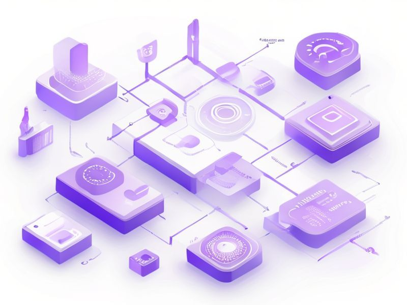

# Test React Component

## TL;DR

**What**: Create a simple React component for testing purposes.
**Status**: planning | **Priority**: P1
**User Stories**: 1

## Overview

Create a simple React component for testing purposes.

## Implementation History

| Increment | Status | Completion Date |
|-----------|--------|----------------|
| [0174-test-react-component](../../../../increments/0174-test-react-component/spec.md) | ⏳ planning | 2026-01-23 |

## User Stories

- [US-001: Button Component](./us-001-button-component.md)
