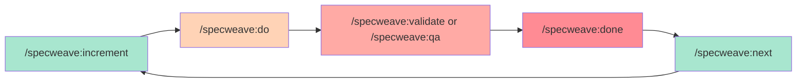

# Commands Overview

SpecWeave provides slash commands for every stage of your development workflow. This page covers the **main workflow commands** you'll use daily.

:::warning No Shortcuts
All commands MUST use the `/specweave:*` namespace prefix. Shortcuts like `/specweave:increment`, `/specweave:do`, `/pause` conflict with Claude Code's native commands.
:::

## The Core Workflow



## 1. Planning Commands

### `/specweave:increment` - Create New Increment

**Most frequently used command** - Start every new feature here.

```bash
/specweave:increment "User authentication with JWT"
/specweave:increment "Payment processing with Stripe"
/specweave:increment "Real-time notifications"
```

**What it does**:
- 🔍 Detects tech stack automatically
- 📋 PM-led planning (market research, spec.md, plan)
- ✅ Auto-generates tasks.md from plan
- 🧪 Creates test strategy
- 👥 Strategic agent review (Architect, Security, QA, DevOps)

**See**: [ADR](/docs/glossary/terms/adr) (Architecture Decision Records) for design decisions made during planning.

Full documentation →

---

### `/specweave:next` - Smart Increment Transition

Intelligently suggests what to work on next.

```bash
/specweave:next
```

**What it does**:
- ✅ Auto-closes current increment if ready (PM gates check)
- 💡 Suggests next work (backlog or new feature)
- 📊 Shows progress and priorities

---

## 2. Implementation Commands

### `/specweave:do` - Execute Tasks

**Smart auto-resume** - Continue from where you left off.

```bash
/specweave:do           # Auto-finds active increment
/specweave:do 0007      # Specific increment
```

**What it does**:
- 🎯 Resumes from last incomplete task
- 🔊 Plays sound after each task (via hooks)
- 📝 Updates docs inline (CLAUDE.md, README.md, CHANGELOG)
- 🔗 Syncs to GitHub (if plugin enabled)
- 🧪 Runs tests continuously

**Key Features**:
- **Cost optimization**: Uses Haiku for simple tasks (3x faster, 20x cheaper)
- **Automatic hooks**: Runs after EVERY task completion
- **Living docs sync**: Updates `.specweave/docs/` after all tasks complete

[Full documentation →](./do)

---

### `/update-scope` - Update Increment Scope

**Living completion reports** - Track scope changes in real-time.

```bash
/update-scope "Added dark mode toggle (stakeholder request, +16 hours)"
```

**What it does**:
- 📝 Logs scope changes with rationale
- ⏱️ Tracks time impact (+/- hours)
- 👥 Documents who approved
- 🔗 Links to ADRs, GitHub issues, etc.

**Why it matters**: Complete audit trail for compliance, retrospectives, and knowledge transfer.

[Full documentation →](./update-scope)

---

## 3. Quality Assurance Commands

### `/specweave:validate` - Rule-Based Validation

**120+ checks** - Fast, free validation.

```bash
/specweave:validate 0007
/specweave:validate 0007 --quality        # Include AI assessment
/specweave:validate 0007 --export         # Export suggestions to tasks.md
```

**What it validates**:
- ✅ Consistency (spec → plan → tasks)
- ✅ Completeness (all required sections)
- ✅ Quality (testable criteria, actionable tasks)
- ✅ Traceability (AC-IDs, ADR references)

[Full documentation →](./validate)

---

### `/specweave:qa` - Quality Assessment with Risk Scoring

**Comprehensive quality gate** - AI-powered assessment with BMAD risk scoring.

```bash
/specweave:qa 0007                    # Quick mode (default)
/specweave:qa 0007 --pre             # Before starting work
/specweave:qa 0007 --gate            # Before closing increment
/specweave:qa 0007 --export          # Export blockers to tasks.md
```

**7 Quality Dimensions**:
1. Clarity (18% weight)
2. Testability (22% weight)
3. Completeness (18% weight)
4. Feasibility (13% weight)
5. Maintainability (9% weight)
6. Edge Cases (9% weight)
7. **Risk Assessment** (11% weight)

**Quality Gate Decisions**:
- 🟢 **PASS** - Ready to proceed
- 🟡 **CONCERNS** - Should fix before release
- 🔴 **FAIL** - Must fix before proceeding

**Risk Scoring** (BMAD pattern):
- CRITICAL (≥9.0) - Immediate action required
- HIGH (6.0-8.9) - Address before release
- MEDIUM (3.0-5.9) - Monitor
- LOW (\<3.0) - Acceptable

[Full documentation →](./qa)

---

### `/validate-coverage` - Test Coverage Check

```bash
/validate-coverage 0007
```

**What it checks**:
- 📊 Per-task coverage (unit, integration, [E2E](/docs/glossary/terms/e2e))
- ✅ AC-ID coverage (all acceptance criteria tested)
- 🎯 Overall coverage vs target (80-90%)
- 📝 Missing tests and recommendations

---

## 4. Completion Commands

### `/specweave:done` - Close Increment

**PM validation before closing** - Ensures quality gates pass.

```bash
/specweave:done 0007
```

**What it does**:
- ✅ Validates all tasks complete
- ✅ Runs `/specweave:qa --gate` (quality gate check)
- ✅ PM agent validates completion
- ✅ Creates completion report
- 🔗 Closes GitHub issues (if plugin enabled)

[Full documentation →](./done)

---

### `/sync-docs` - Synchronize Living Documentation

**Bidirectional sync** - Keep strategic docs and implementation in sync.

```bash
/sync-docs review          # Before implementation (review strategic docs)
/sync-docs update          # After implementation (update with learnings)
```

**What it syncs**:
- 📚 [ADRs](/docs/glossary/terms/adr) (Proposed → Accepted)
- 🏗️ Architecture diagrams (planned → actual)
- 📖 [API](/docs/glossary/terms/api) documentation (contracts → endpoints)
- 📋 Feature lists (planned → completed)

[Full documentation →](./sync-docs)

---

## 5. Monitoring Commands

### `/specweave:progress` - Check Increment Progress

```bash
/specweave:progress
/specweave:progress 0007
```

**What it shows**:
- 📊 Task completion (15/42 tasks, 36%)
- ⏱️ Time tracking (1.2 weeks elapsed, 2.1 weeks remaining)
- 🎯 Current phase and next phase
- ✅ Recent completions
- 📝 Upcoming tasks

---

### `/specweave:status` - View All Increments

**High-level overview** - See what SpecWeave is managing.

```bash
/specweave:status
```

**What it shows**:
- ▶️  Active increments (what's in progress)
- ⏸️  Paused increments (what's blocked)
- ✅ Completed increments
- 📈 WIP limits and progress

[Full documentation →](./status)

---

### `/costs` - AI Cost Dashboard

**Real-time cost tracking** - See savings from intelligent model selection.

```bash
/costs              # Current increment
/costs 0007         # Specific increment
```

**What it shows**:
- 💰 Total cost (actual spend)
- 📊 Savings (Haiku vs Sonnet)
- 📈 Cost per task
- 🎯 Cost efficiency (% cheaper than all-Sonnet)

---

## 6. Supporting Commands

### `/translate` - Multilingual Support

**Zero-cost LLM-native translation** - Work in your language, maintain docs in English.

```bash
/translate spec.md ru en          # Russian → English
```

**Supported languages**: English, Russian, Spanish, Chinese, German, French, Japanese, Korean, Portuguese

**Smart features**:
- ✅ Preserves code blocks, inline code, links
- ✅ Keeps framework terms ([RFC](/docs/glossary/terms/rfc), ADR, increment)
- ✅ Keeps technical terms ([Node.js](/docs/glossary/terms/nodejs), [REST](/docs/glossary/terms/rest), [GraphQL](/docs/glossary/terms/graphql))
- ✅ Validates structure (heading count, code block count)

[Full documentation →](./translate)

---

## Status Management (System Commands)

:::warning Mostly Automatic
These commands are **primarily used by SpecWeave internally**. The system automatically detects blockages, pauses work, and resumes when ready. You rarely need to call these manually.
:::

### `/pause`, `/resume`, `/abandon`

**SpecWeave automatically**:
- ⏸️  **Pauses** when blocked (missing API keys, waiting for approvals)
- ▶️  **Resumes** when blockage resolved (dependencies available)
- 🚫 **Abandons** when you explicitly request it (business pivot)

**Manual use cases**:
- `/pause 0007 --reason "Pausing for hotfix"` - Business decision
- `/resume 0007` - Restart abandoned work
- `/abandon 0007 --reason "Requirements changed"` - Cancel permanently

[Status Management Guide →](./status-management)

---

## TDD Commands (Test-Driven Development)

For projects using TDD workflow:

```bash
/tdd-red           # Write failing test
/tdd-green         # Implement feature
/tdd-refactor      # Improve code
/tdd-cycle         # Full red-green-refactor cycle
```

---

## All Available Commands

### Core Workflow
- `/specweave:increment` (alias: `/specweave:increment`) - Plan new increment ⭐ **Most used**
- `/specweave:do` - Execute tasks ⭐ **Most used**
- `/specweave:validate` - Rule-based validation ⭐ **Most used**
- `/specweave:qa` - Quality assessment with risk scoring ⭐ **Most used**
- `/specweave:done` - Close increment ⭐ **Most used**
- `/specweave:next` - Smart increment transition

### Monitoring
- `/specweave:status` - View all increments
- `/specweave:progress` - Check increment progress
- `/costs` - AI cost dashboard

### Quality Assurance
- `/validate-coverage` - Test coverage check
- `/check-tests` - Validate test structure

### Documentation
- `/sync-docs` - Synchronize living docs
- `/update-scope` - Track scope changes
- `/translate` - Multilingual support

### Status Management (System)
- `/pause` - Pause increment (mostly automatic)
- `/resume` - Resume increment (mostly automatic)
- `/abandon` - Cancel increment

### TDD Workflow
- `/tdd-red` - Write failing test
- `/tdd-green` - Implement feature
- `/tdd-refactor` - Improve code
- `/tdd-cycle` - Full cycle

### Utilities
- `/list-increments` - List all increments
- `/sync-tasks` - Sync tasks to external tools

---

## Command Patterns

### Command Forms and Aliases

**SpecWeave provides three ways to invoke commands**:

```bash
# 1. Full name (primary, clear)
/specweave:increment "feature"
/specweave:validate 0007

# 2. Alias (convenience shorthand)
/specweave:increment "feature"              # Alias for /increment

# 3. Namespace (explicit, brownfield-safe)
/specweave:increment "feature"
/specweave:validate 0007
```

**When to use each form**:
- ✅ **Full name** (`/specweave:increment`): Daily use, clear and explicit
- ✅ **Alias** (`/specweave:increment`): Quick shortcuts for speed
- ✅ **Namespace** (`/specweave:increment`): Brownfield projects, scripts, avoid conflicts

**Available aliases**:
- `/specweave:increment` → `/specweave:increment`
- All other commands use full names

---

## Workflow Examples

### Example 1: Standard Feature Development

```bash
# 1. Plan (use full name or alias)
/specweave:increment "User authentication"    # Full name (recommended)
/specweave:increment "User authentication"          # Alias (shorthand)
# → Creates: spec.md, plan.md, tasks.md

# 2. Review (optional)
/sync-docs review
# → Review strategic docs before starting

# 3. Validate (optional)
/specweave:qa 0007 --pre
# → Pre-implementation quality check

# 4. Implement
/specweave:do 0007
# → Auto-resumes, hooks fire after each task

# 5. Quality gate
/specweave:qa 0007 --gate
# → Comprehensive check before closing

# 6. Close
/specweave:done 0007
# → PM validates, closes GitHub issues

# 7. Sync docs
/sync-docs update
# → Update living docs with learnings

# 8. Next
/specweave:next
# → Suggests next increment
```

---

### Example 2: Hotfix Workflow

```bash
# 1. Check status
/specweave:status
# → See active increments

# 2. Quick increment
/specweave:increment "Critical SQL injection fix"
# → Fast planning

# 3. Implement immediately
/specweave:do 0008
# → Execute fix

# 4. Validate
/specweave:qa 0008 --gate
# → Ensure quality

# 5. Close and deploy
/specweave:done 0008
```

---

### Example 3: Multilingual Development

```bash
# 1. Plan in Russian
/specweave:increment "Добавить аутентификацию пользователя"
# → PM generates spec in Russian

# 2. Auto-translate to English
# (post-increment-planning hook fires automatically)
# → Spec, plan, tasks now in English

# 3. Continue normally
/specweave:do 0007
```

---

## Integration with External Tools

### GitHub Issues (via specweave-github plugin)

```bash
# Create GitHub issue from increment
/github-create-issue 0007

# Sync progress to GitHub
/github-sync 0007

# Close GitHub issue when done
/github-close-issue 0007
```

**Automatic sync**: When GitHub plugin enabled, `/specweave:do` and `/specweave:done` automatically sync to GitHub.

---

## Best Practices

### 1. Use Full Names or Aliases Daily

```bash
# ✅ Quick and clear
/specweave:increment "feature"    # Full name (recommended)
/specweave:increment "feature"          # Alias (shorthand)
/specweave:do
/specweave:qa 0007

# ✅ Explicit namespace (brownfield-safe)
/specweave:increment "feature"
/specweave:do
/specweave:qa 0007
```

---

### 2. Validate Early and Often

```bash
# During planning
/specweave:qa 0007 --pre

# During development (quick checks)
/specweave:qa 0007

# Before closing (comprehensive)
/specweave:qa 0007 --gate
```

---

### 3. Track Scope Changes

```bash
# ✅ Good - documented scope change
/update-scope "Added dark mode (stakeholder request, +16h)"

# ❌ Bad - undocumented scope creep
# (just adding features without tracking)
```

---

### 4. Trust the System

```bash
# ✅ Let SpecWeave handle status
/specweave:do  # System pauses automatically when blocked

# ❌ Don't manually manage status
# (unless business decision)
```

---

## Configuration

All commands respect `.specweave/config.json`:

```json
{
  "limits": {
    "maxActiveIncrements": 1,
    "hardCap": 2
  },
  "validation": {
    "quality_judge": {
      "enabled": true,
      "always_run": false
    }
  },
  "language": "en",
  "translation": {
    "enabled": true,
    "autoTranslateInternalDocs": true
  }
}
```

---

## Glossary Links

Understanding SpecWeave terminology:

- **[ADR](/docs/glossary/terms/adr)** - Architecture Decision Records
- **[RFC](/docs/glossary/terms/rfc)** - Request for Comments (specification format)
- **[API](/docs/glossary/terms/api)** - Application Programming Interface
- **[E2E](/docs/glossary/terms/e2e)** - End-to-End Testing
- **[Node.js](/docs/glossary/terms/nodejs)** - JavaScript runtime
- **[REST](/docs/glossary/terms/rest)** - RESTful API pattern
- **[GraphQL](/docs/glossary/terms/graphql)** - Query language for APIs
- **[Microservices](/docs/glossary/terms/microservices)** - Distributed architecture pattern
- **[IaC](/docs/glossary/terms/iac)** - Infrastructure as Code

[View full glossary →](/docs/glossary)

---

## Next Steps

- **Getting Started**: [Quick Start Guide](/docs/guides/getting-started)
- **Workflow Guide**: [Complete Development Workflow](/docs/guides/workflow)
- **Quality Gates**: [Quality Assurance Guide](/docs/guides/quality-gates)
- **GitHub Integration**: [GitHub Sync Guide](/docs/guides/github-sync)

---

**Philosophy**:
> SpecWeave commands are designed for **intelligent automation**. The system detects intent, suggests actions, and handles workflow management - you focus on building.
