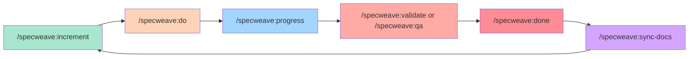

# Commands Overview

SpecWeave provides slash commands for every stage of your development workflow. This page covers the **main workflow commands** you'll use daily.

:::warning No Shortcuts
All commands MUST use the `/specweave:*` namespace prefix. Shortcuts like `/inc`, `/do`, `/pause`, `/resume` (without the namespace) conflict with Claude Code's native commands and other repositories.
:::

## The Core Workflow



## 1. Planning Commands

### `/specweave:increment` - Create New Increment

**Most frequently used command** - Start every new feature here.

```bash
/specweave:increment "User authentication with JWT"
/specweave:increment "Payment processing with Stripe"
/specweave:increment "Real-time notifications"
```

**What it does**:
- 🔍 Detects tech stack automatically
- 📋 PM-led planning (market research, spec.md, plan)
- ✅ Auto-generates tasks.md from plan
- 🧪 Creates test strategy
- 👥 Strategic agent review (Architect, Security, QA, Tech Lead)

**See**: [ADR](/docs/glossary/terms/adr) (Architecture Decision Records) for design decisions made during planning.

<!-- TODO: Add dedicated increment command documentation -->

---

## 2. Implementation Commands

### `/specweave:do` - Execute Tasks

**Smart auto-resume** - Continue from where you left off.

```bash
/specweave:do           # Auto-finds active increment
/specweave:do 0007      # Specific increment
```

**What it does**:
- 🎯 Resumes from last incomplete task
- 🔊 Plays sound after each task (via hooks)
- 📝 Updates docs inline (CLAUDE.md, README.md, CHANGELOG)
- 🔗 Syncs to GitHub (if plugin enabled)
- 🧪 Runs tests continuously

**Key Features**:
- **Cost optimization**: Uses Haiku for simple tasks (3x faster, 20x cheaper)
- **Automatic hooks**: Runs after EVERY task completion
- **Living docs sync**: Updates `.specweave/docs/` after all tasks complete

<!-- TODO: Add dedicated do command documentation -->

---

## 3. Quality Assurance Commands

### `/specweave:validate` - Rule-Based Validation

**120+ checks** - Fast, free validation.

```bash
/specweave:validate 0007
/specweave:validate 0007 --quality        # Include AI assessment
/specweave:validate 0007 --export         # Export suggestions to tasks.md
```

**What it validates**:
- ✅ Consistency (spec → plan → tasks)
- ✅ Completeness (all required sections)
- ✅ Quality (testable criteria, actionable tasks)
- ✅ Traceability (AC-IDs, ADR references)

<!-- TODO: Add dedicated validate command documentation -->

---

### `/specweave:qa` - Quality Assessment with Risk Scoring

**Comprehensive quality gate** - AI-powered assessment with BMAD risk scoring.

```bash
/specweave:qa 0007                    # Quick mode (default)
/specweave:qa 0007 --pre             # Before starting work
/specweave:qa 0007 --gate            # Before closing increment
/specweave:qa 0007 --export          # Export blockers to tasks.md
```

**7 Quality Dimensions**:
1. Clarity (18% weight)
2. Testability (22% weight)
3. Completeness (18% weight)
4. Feasibility (13% weight)
5. Maintainability (9% weight)
6. Edge Cases (9% weight)
7. **Risk Assessment** (11% weight)

**Quality Gate Decisions**:
- 🟢 **PASS** - Ready to proceed
- 🟡 **CONCERNS** - Should fix before release
- 🔴 **FAIL** - Must fix before proceeding

**Risk Scoring** (BMAD pattern):
- CRITICAL (≥9.0) - Immediate action required
- HIGH (6.0-8.9) - Address before release
- MEDIUM (3.0-5.9) - Monitor
- LOW (\<3.0) - Acceptable

<!-- TODO: Add dedicated qa command documentation -->

---

### `/specweave:check-tests` - Test Coverage Check

```bash
/specweave:check-tests 0007
```

**What it checks**:
- 📊 Per-task coverage (unit, integration, [E2E](/docs/glossary/terms/e2e))
- ✅ AC-ID coverage (all acceptance criteria tested)
- 🎯 Overall coverage vs target (80-90%)
- 📝 Missing tests and recommendations

---

## 4. Completion Commands

### `/specweave:done` - Close Increment

**PM validation before closing** - Ensures quality gates pass.

```bash
/specweave:done 0007
```

**What it does**:
- ✅ Validates all tasks complete
- ✅ Runs `/specweave:qa --gate` (quality gate check)
- ✅ PM agent validates completion
- ✅ Creates completion report
- 🔗 Closes GitHub issues (if plugin enabled)

<!-- TODO: Add dedicated done command documentation -->

---

### `/specweave:sync-docs` - Synchronize Living Documentation

**Bidirectional sync** - Keep strategic docs and implementation in sync.

```bash
/specweave:sync-docs review          # Before implementation (review strategic docs)
/specweave:sync-docs update          # After implementation (update with learnings)
```

**What it syncs**:
- 📚 [ADRs](/docs/glossary/terms/adr) (Proposed → Accepted)
- 🏗️ Architecture diagrams (planned → actual)
- 📖 [API](/docs/glossary/terms/api) documentation (contracts → endpoints)
- 📋 Feature lists (planned → completed)

<!-- TODO: Add dedicated sync-docs command documentation -->

---

## 5. Monitoring Commands

### `/specweave:progress` - Check Increment Progress

```bash
/specweave:progress
/specweave:progress 0007
```

**What it shows**:
- 📊 Task completion (15/42 tasks, 36%)
- ⏱️ Time tracking (1.2 weeks elapsed, 2.1 weeks remaining)
- 🎯 Current phase and next phase
- ✅ Recent completions
- 📝 Upcoming tasks

---

## All Available Commands

### Essential Workflow (Use These!)
- `/specweave:increment` - Plan new increment ⭐ **START HERE**
- `/specweave:do` - Execute tasks ⭐ **MAIN WORK**
- `/specweave:progress` - Check status ⭐ **VISIBILITY**
- `/specweave:validate` - Quick validation ⭐ **PRE-CHECK**
- `/specweave:qa` - Quality assessment ⭐ **QUALITY GATE**
- `/specweave:check-tests` - Test coverage check ⭐ **TEST VALIDATION**
- `/specweave:done` - Close increment ⭐ **FINISH**
- `/specweave:sync-docs` - Synchronize living docs ⭐ **KEEP DOCS CURRENT**

---

## Workflow Example: Standard Feature Development

```bash
# 1. Plan new feature
/specweave:increment "User authentication"
# → Creates: spec.md, plan.md, tasks.md

# 2. Review docs (optional)
/specweave:sync-docs review
# → Review strategic docs before starting

# 3. Pre-check quality (optional)
/specweave:qa 0007 --pre
# → Pre-implementation quality check

# 4. Implement tasks
/specweave:do 0007
# → Auto-resumes from last task, hooks fire after each completion

# 5. Check progress
/specweave:progress 0007
# → See completion status

# 6. Validate quality
/specweave:qa 0007 --gate
# → Comprehensive quality gate check

# 7. Check test coverage
/specweave:check-tests 0007
# → Validate all AC-IDs are tested

# 8. Close increment
/specweave:done 0007
# → PM validates and closes

# 9. Update living docs
/specweave:sync-docs update
# → Sync learnings to strategic docs
```

---

## Integration with External Tools

### GitHub Issues (via specweave-github plugin)

```bash
# Create GitHub issue from increment
/github-create-issue 0007

# Sync progress to GitHub
/github-sync 0007

# Close GitHub issue when done
/github-close-issue 0007
```

**Automatic sync**: When GitHub plugin enabled, `/specweave:do` and `/specweave:done` automatically sync to GitHub.

---

## Best Practices

### 1. Follow the Core Flow

Always use the standard workflow for best results:
1. `/specweave:increment` - Plan (START HERE)
2. `/specweave:do` - Implement (MAIN WORK)
3. `/specweave:progress` - Check status (VISIBILITY)
4. `/specweave:qa` - Validate quality (QUALITY GATE)
5. `/specweave:done` - Close (FINISH)
6. `/specweave:sync-docs` - Update docs (KEEP CURRENT)

### 2. Validate Early and Often

```bash
# Before starting work
/specweave:qa 0007 --pre

# Before closing
/specweave:qa 0007 --gate
```

### 3. Check Test Coverage

```bash
# Always validate tests before closing
/specweave:check-tests 0007
```

### 4. Keep Living Docs Current

```bash
# After completing increment
/specweave:sync-docs update
```

---

## Configuration

All commands respect `.specweave/config.json`:

```json
{
  "limits": {
    "maxActiveIncrements": 1,
    "hardCap": 2
  },
  "validation": {
    "quality_judge": {
      "enabled": true,
      "always_run": false
    }
  },
  "language": "en",
  "translation": {
    "enabled": true,
    "autoTranslateInternalDocs": true
  }
}
```

---

## Glossary Links

Understanding SpecWeave terminology:

- **[ADR](/docs/glossary/terms/adr)** - Architecture Decision Records
- **[RFC](/docs/glossary/terms/rfc)** - Request for Comments (specification format)
- **[API](/docs/glossary/terms/api)** - Application Programming Interface
- **[E2E](/docs/glossary/terms/e2e)** - End-to-End Testing
- **[Node.js](/docs/glossary/terms/nodejs)** - JavaScript runtime
- **[REST](/docs/glossary/terms/rest)** - RESTful API pattern
- **[GraphQL](/docs/glossary/terms/graphql)** - Query language for APIs
- **[Microservices](/docs/glossary/terms/microservices)** - Distributed architecture pattern
- **[IaC](/docs/glossary/terms/iac)** - Infrastructure as Code

[View full glossary →](/docs/glossary)

---

## Next Steps

- **Getting Started**: [Quick Start Guide](/docs/guides/getting-started)
- **Workflow Guide**: [Complete Development Workflow](/docs/guides/workflow)
- **Quality Gates**: [Quality Assurance Guide](/docs/guides/quality-gates)
- **GitHub Integration**: [GitHub Sync Guide](/docs/guides/github-sync)

---

**Philosophy**:
> SpecWeave commands are designed for **intelligent automation**. The system detects intent, suggests actions, and handles workflow management - you focus on building.
