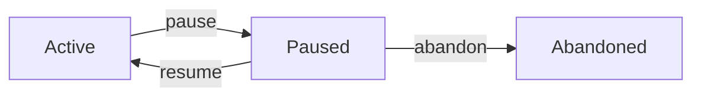

# pause

Pause an active increment when temporarily blocked.

## Synopsis

```bash
specweave pause <increment-id> [options]
```

## Description

The `pause` command temporarily suspends work on an active increment. This frees up your WIP (work-in-progress) limit slot while preserving all progress and context.

**Use pause when**:
- 🚧 Blocked by external dependency (API access, vendor response)
- 👥 Waiting for stakeholder feedback
- 🔄 Temporarily deprioritized (urgent work takes precedence)
- 📝 Waiting for code review

:::tip Paused ≠ Active
Paused increments **don't count** toward your WIP limit. This lets you start other work while waiting.
:::

## Options

### `<increment-id>` (required)

The increment to pause (e.g., `0007-payment-integration`).

```bash
specweave pause 0007-payment-integration
```

### `--reason <text>` or `-r <text>`

Reason for pausing (highly recommended).

```bash
specweave pause 0007 --reason "Waiting for Stripe production API keys"
```

:::warning Always Provide a Reason
While optional, **always provide a reason**. It documents context for your future self and team.
:::

### `--force` or `-f`

Update reason if already paused.

```bash
# First pause
specweave pause 0007 --reason "Waiting for API keys"

# Later, update reason
specweave pause 0007 --reason "Waiting for API keys (IT ticket #1234)" --force
```

## Examples

### Example 1: External Dependency

```bash
# Blocked by IT department
specweave pause 0007-payment-integration \
  --reason "Waiting for Stripe production API keys (IT ticket #1234)"

# Output:
⏸️  Pausing increment 0007-payment-integration...

✅ Increment 0007-payment-integration paused
📝 Reason: Waiting for Stripe production API keys (IT ticket #1234)
⏸️  No longer counts toward active limit

💡 Resume with: specweave resume 0007-payment-integration
```

**What happened**:
- ✅ Increment status → `paused`
- ✅ Metadata updated (reason, timestamp)
- ✅ WIP limit freed (can start other work)

### Example 2: Stakeholder Feedback

```bash
specweave pause 0005-ui-redesign \
  --reason "Waiting for design team approval on mockups"
```

**Why pause instead of continuing?**
- Can't proceed without feedback
- Frees mental bandwidth
- Documents blockage for standup/retrospectives

### Example 3: Temporary Deprioritization

```bash
# Urgent hotfix takes priority
specweave pause 0008-feature-x \
  --reason "Pausing for hotfix 0009, will resume after deploy"

# Work on hotfix
specweave inc "0009-critical-bug-fix"
specweave do

# Resume later
specweave resume 0008
```

### Example 4: Update Reason (Force)

```bash
# Initial pause
specweave pause 0007 --reason "Waiting for API access"

# Got more details
specweave pause 0007 \
  --reason "Waiting for API access (ETA: 3 days, contact: john@company.com)" \
  --force

# Output:
⚠️  Increment 0007 is already paused
   Previous reason: Waiting for API access
   Paused at: 2025-11-04T10:00:00Z

✅ Reason updated
```

## Behavior

### Status Transitions



**Valid transitions**:
- `active` → `paused` ✅
- `paused` → `paused` (with `--force`) ✅

**Invalid transitions**:
- `completed` → `paused` ❌
- `abandoned` → `paused` ❌ (use `resume` first)

### Metadata Changes

```json
// Before pause
{
  "id": "0007-payment-integration",
  "status": "active",
  "type": "feature",
  "created": "2025-11-01T10:00:00Z",
  "lastActivity": "2025-11-04T09:00:00Z"
}

// After pause
{
  "id": "0007-payment-integration",
  "status": "paused",                          // ← Changed
  "type": "feature",
  "created": "2025-11-01T10:00:00Z",
  "lastActivity": "2025-11-04T10:00:00Z",
  "pausedReason": "Waiting for API keys",      // ← Added
  "pausedAt": "2025-11-04T10:00:00Z"           // ← Added
}
```

### WIP Limit Impact

```bash
# Before pause
$ specweave status
▶️  Active (1): 0007-payment-integration
📈 WIP Limit: ✅ 1/1

# Try to start new work
$ specweave inc "0008-feature"
❌ Cannot create! WIP limit reached

# Pause current work
$ specweave pause 0007 --reason "Blocked"

# After pause
$ specweave status
⏸️  Paused (1): 0007-payment-integration
📈 WIP Limit: ✅ 0/1

# Now can start new work
$ specweave inc "0008-feature"
✅ Created!
```

## Error Handling

### Already Paused

```bash
$ specweave pause 0007 --reason "Blocked"
⚠️  Increment 0007 is already paused
   Previous reason: Waiting for API keys
   Paused at: 2025-11-04T10:00:00Z

   Use --force to update the reason
```

**Solution**: Add `--force` to update reason.

### Cannot Pause Completed

```bash
$ specweave pause 0001
❌ Cannot pause increment 0001
   Current status: completed
   Only active increments can be paused
```

**Solution**: Increment is already done. Nothing to pause.

### Cannot Pause Abandoned

```bash
$ specweave pause 0003
❌ Cannot pause increment 0003
   Current status: abandoned
   Only active increments can be paused

   💡 Resume it first: specweave resume 0003
```

**Solution**: Resume first, then pause.

## Best Practices

### 1. Always Document Why

```bash
# ❌ Bad - no context
specweave pause 0007

# ✅ Good - clear context
specweave pause 0007 --reason "Waiting for Stripe prod API keys (IT#1234, ETA: 3 days)"
```

**Why**:
- Future you won't remember why
- Team needs context for standups
- Retrospectives benefit from clear blockers

### 2. Include Actionable Info

Good reasons include:
- **What** you're waiting for
- **Who** can unblock
- **When** expected resolution

```bash
# ✅ Excellent
specweave pause 0007 \
  --reason "Waiting for Stripe prod API keys (IT ticket #1234, contact: ops@company.com, ETA: Nov 6)"
```

### 3. Review Paused Work Weekly

```bash
# Check paused increments
$ specweave status

⏸️  Paused (3):
  ⏸ 0003-kubernetes [feature]
     Reason: Waiting for DevOps approval
     Paused: 45 days ago  # ⚠️ Too long!
```

**Action**:
- If blockage resolved → `resume`
- If no longer relevant → `abandon`
- If still valid → update reason with new ETA

### 4. Keep Paused Count Low

**Rule of thumb**: Max 2-3 paused increments

If you have 5+ paused increments, something is wrong:
- Too many parallel initiatives?
- Too many external dependencies?
- Not abandoning obsolete work?

## Common Scenarios

### Scenario 1: Blocked by Another Team

```bash
# Blocked by backend team
specweave pause 0007-frontend-feature \
  --reason "Waiting for backend API (ticket BACK-123, owner: @john)"

# Check in 2 days
$ specweave status
⏸️  Paused: 0007-frontend-feature (2 days ago)

# API ready, resume
$ specweave resume 0007
```

### Scenario 2: Waiting for Decision

```bash
# Stakeholder hasn't decided
specweave pause 0005-new-dashboard \
  --reason "Waiting for VP approval on design mockups (meeting: Nov 5)"

# Decision made
$ specweave resume 0005
```

### Scenario 3: Multiple Pauses (Bad Pattern)

```bash
# Anti-pattern: pausing everything
$ specweave status
⏸️  Paused (8):  # ⚠️ Way too many!
  ⏸ 0001 (90 days ago)
  ⏸ 0003 (45 days ago)
  ⏸ 0005 (30 days ago)
  ...
```

**Fix**: Audit and clean up
```bash
# Abandon old/irrelevant work
$ specweave abandon 0001 --reason "Requirements changed, no longer needed"
$ specweave abandon 0003 --reason "Postponed indefinitely"

# Resume what's actually important
$ specweave resume 0005
```

## Integration with Other Commands

### pause → status

```bash
$ specweave pause 0007 --reason "Blocked"
$ specweave status

⏸️  Paused (1):
  ⏸ 0007-payment-integration [feature]
     Reason: Blocked  # ← Reason shown
```

### pause → resume

```bash
$ specweave pause 0007 --reason "Waiting for API"
# ... later ...
$ specweave resume 0007

✅ Resumed
📝 Was paused for: Waiting for API
```

### pause → abandon

```bash
$ specweave pause 0007 --reason "Waiting for API"
# Decision: not doing this anymore
$ specweave abandon 0007 --reason "Requirements changed"
```

## See Also

- [`resume`](./resume.md) - Restart paused work
- [`abandon`](./abandon.md) - Cancel work permanently
- [`status`](./status.md) - Check current status
- [Status Management Guide](./status-management.md) - Complete workflow guide

## Summary

**Key Points**:
- ✅ Use `pause` for **temporary** blockages
- ✅ Always provide a clear reason
- ✅ Paused increments don't count toward WIP limit
- ✅ Review paused work weekly
- ✅ Keep paused count low (2-3 max)

**Command**:
```bash
specweave pause <increment-id> --reason "<clear explanation>"
```

**Philosophy**:
> Pausing isn't failure—it's explicit acknowledgment of reality. Document it, move on, return when unblocked.
