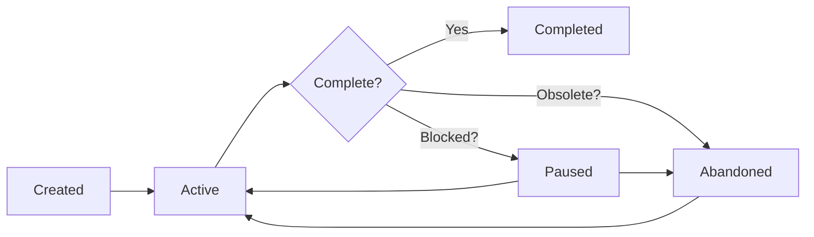

# Status Management

Learn how SpecWeave intelligently manages increment lifecycle with automatic status detection and tracking.

## Overview

SpecWeave is an **intelligent development system** that automatically manages your work-in-progress (WIP). It detects when you're blocked, pauses work automatically, asks for what it needs, and resumes when ready - all without manual intervention.

:::tip Default: ONE Active Increment
SpecWeave defaults to **1 active increment** maximum. This isn't a limitation—it's a feature that enforces focus and prevents context switching.
:::

## Why Status Management Matters

### The Problem: Context Switching Kills Quality

Research shows that every context switch costs **15-30 minutes** of lost productivity. Working on multiple things simultaneously leads to:

- ❌ Nothing actually shipping
- ❌ High bug counts
- ❌ Technical debt accumulation
- ❌ Developer burnout

### The Solution: Intelligent Automation

SpecWeave **automatically detects and manages** your work status:

```bash
# See exactly what's in progress
$ specweave status

📊 Increment Status

📈 Overall Progress: 3/10 increments complete (30%)

▶️  Active (1):
  ● 0007-payment-integration [feature] (60% complete)

⏸️  Paused (2):
  ⏸ 0005-kubernetes-migration [feature]
     Reason: Waiting for DevOps approval

📈 WIP Limit:
  ✅ Active increments: 1/1
```

**Result**: Everyone knows exactly what's happening. No confusion, no surprises.

## Increment Lifecycle



### Status Definitions

| Status | Meaning | Counts Toward WIP Limit? |
|--------|---------|-------------------------|
| **active** | Currently being worked on | ✅ Yes |
| **paused** | Temporarily blocked | ❌ No |
| **completed** | All tasks done, shipped | ❌ No |
| **abandoned** | Work cancelled | ❌ No |

## Status Commands

### User Command

| Command | Purpose | When to Use |
|---------|---------|-------------|
| [`status`](./status.md) | Show all increments and progress | Check what SpecWeave is working on, view overall progress |

### System Commands (Used by SpecWeave)

| Command | Purpose | When SpecWeave Uses It |
|---------|---------|------------------------|
| `pause` | Pause active work | Automatically detects blockage (missing API keys, waiting for approval) |
| `resume` | Restart paused work | Automatically resumes when blockage resolved |
| `abandon` | Cancel permanently | You explicitly request to abandon obsolete work |

:::tip Intelligent Automation
SpecWeave **automatically** calls `pause` when it detects you're blocked and `resume` when ready. You don't manually call these commands - the system does it for you.
:::

## Common Workflows

### Workflow 1: Automatic Blockage Detection

```bash
# Working on payment integration
$ specweave do

# SpecWeave detects you need Stripe API keys
🤖 SpecWeave: I need Stripe production API keys to continue

   Options:
   1. Provide API keys now
   2. Pause this work (I'll ask IT department for you)
   3. Skip this task for now

# You choose option 2
$ 2

✅ Increment 0007-payment-integration automatically paused
📝 Reason: Waiting for Stripe production API keys (IT ticket #1234 created)
⏸️  No longer counts toward active limit

# SpecWeave suggests next action
💡 You can now work on other increments while waiting
   Would you like to start "0008-notification-system"? (y/n)

# API keys arrive 2 days later - SpecWeave detects this
🤖 SpecWeave: Great! Stripe API keys are available
   Resuming increment 0007-payment-integration...

✅ Automatically resumed
▶️  Continuing from task T-005: Integrate Stripe payment flow
```

### Workflow 2: Multi-Increment Intelligence

```bash
# Check what SpecWeave is managing
$ specweave status

📊 Increment Status Overview

▶️  Active (1):
  ● 0007-payment-integration [feature] (60% complete, paused 2 days ago)
     💡 Waiting for: Stripe API keys (IT ticket #1234)

⏸️  Ready to Resume (1):
  ⏸ 0008-notification-system [feature] (paused, waiting for backend API)

✅ Completed (2):
  ✓ 0000-setup, 0003-refactor

# SpecWeave proactively checks external dependencies
🤖 SpecWeave: Backend API for 0008 is now available!
   Shall I resume 0008-notification-system? (y/n)

$ y

✅ Resuming 0008-notification-system
▶️  Continuing implementation...
```

### Workflow 3: Explicit User Commands (When Needed)

```bash
# Sometimes YOU need to tell SpecWeave to abandon work
# Example: Business pivot - features no longer relevant

$ specweave status
▶️  Active (2):
     0005-social-features
     0006-consumer-onboarding

# You explicitly abandon obsolete work
$ specweave abandon 0005 --reason "Pivot to enterprise, social features postponed"
$ specweave abandon 0006 --reason "Pivot to enterprise, consumer features postponed"

✅ Increments abandoned

# Start new direction
$ specweave inc "0010-enterprise-sso"
🤖 SpecWeave: Starting increment 0010-enterprise-sso
   Planning phase... Architect reviewing requirements...
   ✅ Ready to implement!
```

## Philosophy: One Thing at a Time

### Why Default to 1?

**Single-Tasking vs Multi-Tasking**:

| Approach | Features Active | Time | Features Shipped |
|----------|----------------|------|------------------|
| **Multi-tasking** | 5 features | 10 weeks | 0 complete |
| **Single-tasking** | 1 feature | 10 weeks | 5 complete |

**The Math**:
- 5 features in parallel = 5× context switching = 0 shipped
- 1 feature at a time = 0 context switching = 5 shipped

### When to Increase the Limit

You can configure multiple active increments in `.specweave/config.json`:

```json
{
  "limits": {
    "feature": 2  // Allow 2 active features
  }
}
```

**Use cases for multiple active increments**:
- ✅ Large team (10+ engineers)
- ✅ Truly independent work (frontend + backend, no conflicts)
- ✅ Mature team (low context-switching costs)

**Default stays at 1 for**:
- ✅ Solo developers
- ✅ Small teams (2-5 engineers)
- ✅ Learning phase (new to codebase)
- ✅ High complexity (lots of merge conflicts)

## WIP Limit Enforcement

### How Limits Work

```bash
# Current limit: 1 active increment

$ specweave status
📈 WIP Limit:
  ⚠️ Active increments: 2/1 (EXCEEDS LIMIT!)
     💡 Run 'specweave pause <id>' to pause one before starting new work
```

### Resume Command Enforces Limits

```bash
$ specweave resume 0005

⚠️  WARNING: WIP Limit Reached
   Current active: 1
   Limit: 1
   Resuming will exceed limit

   Complete or pause another increment first
   Or use --force to bypass this warning
```

### Force Flag (Emergency Use Only)

```bash
# Bypass limit for emergencies
$ specweave resume 0005 --force

✅ Increment 0005 resumed (forced)
⚠️  WARNING: WIP limit exceeded (2/1 active)
```

:::warning Use --force Sparingly
The `--force` flag bypasses WIP limits. Use only for emergencies (production down, critical hotfix). Document why you used it in standup/PR.
:::

## How SpecWeave Detects Blockages

SpecWeave intelligently detects when you're blocked and automatically pauses work:

### Automatic Detection Signals

- **Missing Dependencies**: API keys, credentials, configuration values
- **External Services**: Waiting for third-party approvals, vendor responses
- **Compilation Errors**: Persistent build failures indicating missing setup
- **Test Failures**: Consistent test failures suggesting environmental issues
- **User Indication**: You explicitly say "I'm blocked" or "waiting for..."

### What SpecWeave Does

1. **Detects blockage** → Analyzes error patterns and context
2. **Pauses automatically** → Updates increment status to "paused"
3. **Documents reason** → Records clear explanation of blockage
4. **Suggests actions** → Proposes next steps (file IT ticket, ask stakeholder, etc.)
5. **Monitors resolution** → Checks when blockage is resolved
6. **Resumes automatically** → Continues work when dependencies available

## Best Practices

### 1. Trust the System

SpecWeave is designed to manage status automatically. Trust its intelligence:

```bash
# ✅ Let SpecWeave detect blockages
$ specweave do  # SpecWeave will pause if blocked

# ❌ Don't manually pause unless business decision
# (SpecWeave handles technical blockages)
```

### 2. Use status Command Frequently

```bash
# Check what SpecWeave is managing
$ specweave status

# Shows:
# - Active work
# - Paused work (with reasons and duration)
# - What's blocking you
# - Suggested next actions
```

### 3. Only Manual Command: abandon

You only need to manually use `abandon` when:
- ✅ **Requirements changed** (business decision)
- ✅ **Feature no longer needed** (strategic pivot)
- ✅ **Long-term postponement** (deprioritized for quarters)

```bash
# Manual abandon (business decision)
$ specweave abandon 0007 --reason "Pivot to enterprise, consumer features on hold"
```

**Everything else** (technical blockages, dependencies) → SpecWeave handles automatically

## Configuration

### Configure WIP Limits

**File**: `.specweave/config.json`

```json
{
  "limits": {
    "feature": 1,                    // Max 1 active feature
    "hotfix": 1,                     // Max 1 active hotfix
    "experimentAutoAbandonDays": 14, // Auto-abandon experiments after 14 days
    "staleness": {
      "paused": 7,                   // Warn if paused > 7 days
      "active": 30                   // Warn if active > 30 days
    }
  }
}
```

### Team Size Recommendations

| Team Size | Recommended Limit | Rationale |
|-----------|-------------------|-----------|
| Solo (1) | 1 | Maximum focus |
| Small (2-3) | 1-2 | Slight parallelism |
| Medium (4-7) | 2-3 | Balanced |
| Large (8-15) | 3-5 | Higher parallelism |

## Troubleshooting

### "Cannot create new increment" Error

**Error**:
```bash
$ specweave inc "new feature"
❌ Cannot create new increment!
   You have 1 active increment: 0007-payment-integration
```

**Solution**:
```bash
# Option 1: Complete current work
$ specweave do

# Option 2: Pause current work
$ specweave pause 0007 --reason "..."

# Option 3: Abandon current work
$ specweave abandon 0007 --reason "..."
```

### "WIP Limit Reached" Warning

**Error**:
```bash
$ specweave resume 0005
⚠️  WARNING: WIP Limit Reached
```

**Solution**:
```bash
# Option 1: Pause another increment first
$ specweave pause 0007 --reason "..."
$ specweave resume 0005  # ✅ Now works

# Option 2: Use --force (emergency only)
$ specweave resume 0005 --force
```

### Stale Paused Increments

**Problem**: Increments paused for weeks

**Detection**:
```bash
$ specweave status
⏸️  Paused (2):
  ⏸ 0003-kubernetes-migration [feature]
     Reason: Waiting for DevOps approval
     Paused: 45 days ago  # ⚠️ Stale!
```

**Action**:
```bash
# Either abandon it
$ specweave abandon 0003 --reason "Postponed to Q2, no longer urgent"

# Or resume if blockage resolved
$ specweave resume 0003
```

## Next Steps

- [Pause Command Reference](./pause.md) - Detailed pause command guide
- [Resume Command Reference](./resume.md) - Detailed resume command guide
- [Abandon Command Reference](./abandon.md) - Detailed abandon command guide
- [Status Command Reference](./status.md) - Detailed status command guide

## Summary

**Key Takeaways**:
- ✅ SpecWeave is an **intelligent system** that manages status automatically
- ✅ **Automatic detection**: Pauses when blocked, resumes when ready
- ✅ **You focus on building**: Let SpecWeave handle workflow management
- ✅ **Manual command**: Only `abandon` for business decisions
- ✅ **status command**: Use frequently to see what SpecWeave is managing

**Philosophy**:
> **Intelligent automation = Maximum productivity. Manual workflow = Wasted time.**

SpecWeave detects blockages, pauses automatically, asks for what it needs, and resumes when ready - all without manual intervention. The result: you stay in flow, SpecWeave handles the rest.
