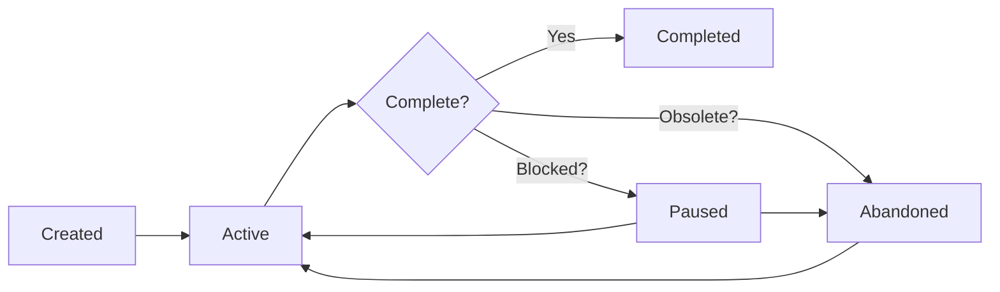

# Status Management

Learn how to manage increment lifecycle with pause, resume, abandon, and status commands.

## Overview

SpecWeave enforces **disciplined work-in-progress (WIP) management** through explicit status tracking. Every increment has a clear status, and you can only work on **one increment at a time** by default.

:::tip Default: ONE Active Increment
SpecWeave defaults to **1 active increment** maximum. This isn't a limitation—it's a feature that enforces focus and prevents context switching.
:::

## Why Status Management Matters

### The Problem: Context Switching Kills Quality

Research shows that every context switch costs **15-30 minutes** of lost productivity. Working on multiple things simultaneously leads to:

- ❌ Nothing actually shipping
- ❌ High bug counts
- ❌ Technical debt accumulation
- ❌ Developer burnout

### The Solution: Explicit Status Tracking

SpecWeave forces you to be **explicit** about what you're working on:

```bash
# See exactly what's in progress
$ specweave status

📊 Increment Status

📈 Overall Progress: 3/10 increments complete (30%)

▶️  Active (1):
  ● 0007-payment-integration [feature] (60% complete)

⏸️  Paused (2):
  ⏸ 0005-kubernetes-migration [feature]
     Reason: Waiting for DevOps approval

📈 WIP Limit:
  ✅ Active increments: 1/1
```

**Result**: Everyone knows exactly what's happening. No confusion, no surprises.

## Increment Lifecycle



### Status Definitions

| Status | Meaning | Counts Toward WIP Limit? |
|--------|---------|-------------------------|
| **active** | Currently being worked on | ✅ Yes |
| **paused** | Temporarily blocked | ❌ No |
| **completed** | All tasks done, shipped | ❌ No |
| **abandoned** | Work cancelled | ❌ No |

## The Four Commands

### Quick Reference

| Command | Purpose | When to Use |
|---------|---------|-------------|
| [`status`](./status.md) | Show all increments | Check overall progress |
| [`pause`](./pause.md) | Pause active work | External dependency blocks you |
| [`resume`](./resume.md) | Restart paused work | Dependency resolved |
| [`abandon`](./abandon.md) | Cancel permanently | Requirements changed |

## Common Workflows

### Workflow 1: Starting New Work When Something is Active

```bash
# 1. Check current status
$ specweave status
📈 Overall Progress: 2/8 complete
▶️  Active (1): 0007-payment-integration

# 2. Try to start new work
$ specweave inc "0008-notification-system"
❌ Cannot create new increment!
   You have 1 active increment: 0007-payment-integration

# 3. Options:
# Option A: Finish current work (recommended)
$ specweave do
# ... complete remaining tasks ...

# Option B: Pause current work
$ specweave pause 0007 --reason "Blocked by Stripe API access"
$ specweave inc "0008-notification-system"  # ✅ Now works

# Option C: Abandon current work
$ specweave abandon 0007 --reason "Requirements changed"
$ specweave inc "0008-notification-system"  # ✅ Now works
```

### Workflow 2: Handling External Blockages

```bash
# Scenario: Waiting for API keys from IT

# 1. Pause increment with clear reason
$ specweave pause 0007 --reason "Waiting for Stripe production API keys (IT ticket #1234)"

✅ Increment 0007-payment-integration paused
📝 Reason: Waiting for Stripe production API keys (IT ticket #1234)
⏸️  No longer counts toward active limit

# 2. Work on something else
$ specweave inc "0008-notification-system"  # ✅ Works (WIP limit freed)

# 3. When API keys arrive, resume
$ specweave resume 0007
✅ Increment 0007-payment-integration resumed
```

### Workflow 3: Pivot Scenario

```bash
# Scenario: Business decides to pivot from consumer to enterprise

# 1. Check what's in progress
$ specweave status
▶️  Active (1): 0005-social-features
▶️  Active (1): 0006-consumer-onboarding

# 2. Abandon obsolete work
$ specweave abandon 0005 --reason "Pivot to enterprise, social features postponed"
$ specweave abandon 0006 --reason "Pivot to enterprise, consumer features postponed"

# 3. Start new direction
$ specweave inc "0010-enterprise-sso"
$ specweave do
```

## Philosophy: One Thing at a Time

### Why Default to 1?

**Single-Tasking vs Multi-Tasking**:

| Approach | Features Active | Time | Features Shipped |
|----------|----------------|------|------------------|
| **Multi-tasking** | 5 features | 10 weeks | 0 complete |
| **Single-tasking** | 1 feature | 10 weeks | 5 complete |

**The Math**:
- 5 features in parallel = 5× context switching = 0 shipped
- 1 feature at a time = 0 context switching = 5 shipped

### When to Increase the Limit

You can configure multiple active increments in `.specweave/config.json`:

```json
{
  "limits": {
    "feature": 2  // Allow 2 active features
  }
}
```

**Use cases for multiple active increments**:
- ✅ Large team (10+ engineers)
- ✅ Truly independent work (frontend + backend, no conflicts)
- ✅ Mature team (low context-switching costs)

**Default stays at 1 for**:
- ✅ Solo developers
- ✅ Small teams (2-5 engineers)
- ✅ Learning phase (new to codebase)
- ✅ High complexity (lots of merge conflicts)

## WIP Limit Enforcement

### How Limits Work

```bash
# Current limit: 1 active increment

$ specweave status
📈 WIP Limit:
  ⚠️ Active increments: 2/1 (EXCEEDS LIMIT!)
     💡 Run 'specweave pause <id>' to pause one before starting new work
```

### Resume Command Enforces Limits

```bash
$ specweave resume 0005

⚠️  WARNING: WIP Limit Reached
   Current active: 1
   Limit: 1
   Resuming will exceed limit

   Complete or pause another increment first
   Or use --force to bypass this warning
```

### Force Flag (Emergency Use Only)

```bash
# Bypass limit for emergencies
$ specweave resume 0005 --force

✅ Increment 0005 resumed (forced)
⚠️  WARNING: WIP limit exceeded (2/1 active)
```

:::warning Use --force Sparingly
The `--force` flag bypasses WIP limits. Use only for emergencies (production down, critical hotfix). Document why you used it in standup/PR.
:::

## Best Practices

### 1. Always Provide Reasons

```bash
# ❌ Bad (no reason)
$ specweave pause 0007

# ✅ Good (clear reason)
$ specweave pause 0007 --reason "Waiting for Stripe production API keys (IT ticket #1234)"
```

**Why**: Reasons provide context for:
- Your future self (why did we stop?)
- Your team (what's blocked?)
- Retrospectives (what slowed us down?)

### 2. Keep Paused Count Low

If you have many paused increments, something is wrong:

```bash
$ specweave status
⏸️  Paused (5):  # ⚠️ Too many!
```

**Action**: Review paused increments weekly. Either:
- Resume them (blockage resolved)
- Abandon them (no longer relevant)
- Document long-term blockages clearly

### 3. Complete > Pause > Abandon

**Decision tree**:
1. **Can you finish it?** → Complete it (best option)
2. **Temporarily blocked?** → Pause it
3. **Permanently obsolete?** → Abandon it

### 4. Use Status Frequently

```bash
# Daily standup
$ specweave status

# Before starting work
$ specweave status

# Before ending day
$ specweave status
```

**Why**: Status command gives instant clarity on what's happening.

## Configuration

### Configure WIP Limits

**File**: `.specweave/config.json`

```json
{
  "limits": {
    "feature": 1,                    // Max 1 active feature
    "hotfix": 1,                     // Max 1 active hotfix
    "experimentAutoAbandonDays": 14, // Auto-abandon experiments after 14 days
    "staleness": {
      "paused": 7,                   // Warn if paused > 7 days
      "active": 30                   // Warn if active > 30 days
    }
  }
}
```

### Team Size Recommendations

| Team Size | Recommended Limit | Rationale |
|-----------|-------------------|-----------|
| Solo (1) | 1 | Maximum focus |
| Small (2-3) | 1-2 | Slight parallelism |
| Medium (4-7) | 2-3 | Balanced |
| Large (8-15) | 3-5 | Higher parallelism |

## Troubleshooting

### "Cannot create new increment" Error

**Error**:
```bash
$ specweave inc "new feature"
❌ Cannot create new increment!
   You have 1 active increment: 0007-payment-integration
```

**Solution**:
```bash
# Option 1: Complete current work
$ specweave do

# Option 2: Pause current work
$ specweave pause 0007 --reason "..."

# Option 3: Abandon current work
$ specweave abandon 0007 --reason "..."
```

### "WIP Limit Reached" Warning

**Error**:
```bash
$ specweave resume 0005
⚠️  WARNING: WIP Limit Reached
```

**Solution**:
```bash
# Option 1: Pause another increment first
$ specweave pause 0007 --reason "..."
$ specweave resume 0005  # ✅ Now works

# Option 2: Use --force (emergency only)
$ specweave resume 0005 --force
```

### Stale Paused Increments

**Problem**: Increments paused for weeks

**Detection**:
```bash
$ specweave status
⏸️  Paused (2):
  ⏸ 0003-kubernetes-migration [feature]
     Reason: Waiting for DevOps approval
     Paused: 45 days ago  # ⚠️ Stale!
```

**Action**:
```bash
# Either abandon it
$ specweave abandon 0003 --reason "Postponed to Q2, no longer urgent"

# Or resume if blockage resolved
$ specweave resume 0003
```

## Next Steps

- [Pause Command Reference](./pause.md) - Detailed pause command guide
- [Resume Command Reference](./resume.md) - Detailed resume command guide
- [Abandon Command Reference](./abandon.md) - Detailed abandon command guide
- [Status Command Reference](./status.md) - Detailed status command guide

## Summary

**Key Takeaways**:
- ✅ Default to 1 active increment (maximum focus)
- ✅ Pause work when temporarily blocked
- ✅ Abandon work when permanently obsolete
- ✅ Use status command frequently (daily)
- ✅ Always provide reasons for pause/abandon
- ✅ Complete > Pause > Abandon

**Philosophy**:
> **Focus = Quality. Context switching = Chaos.**

SpecWeave enforces discipline through explicit status management. The result: higher quality, faster shipping, better visibility.
