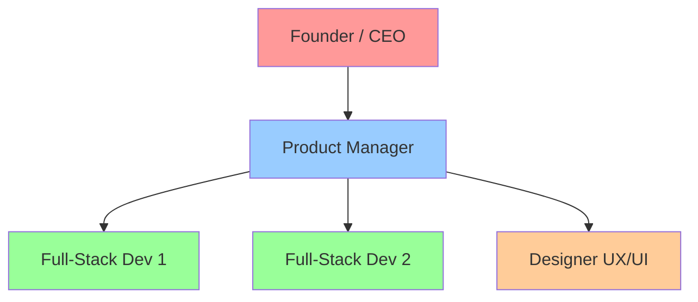
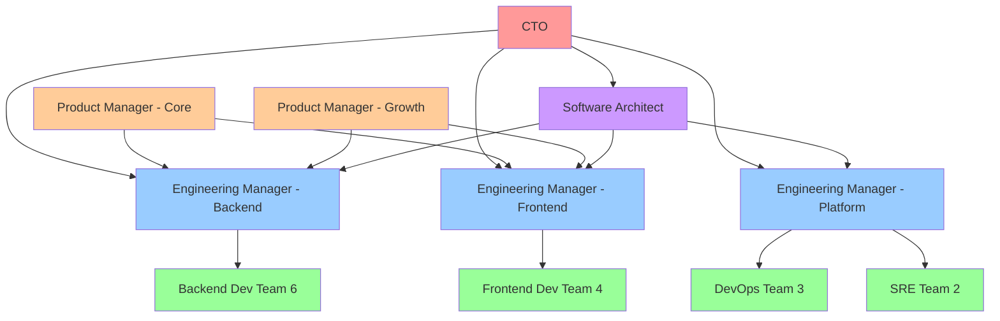
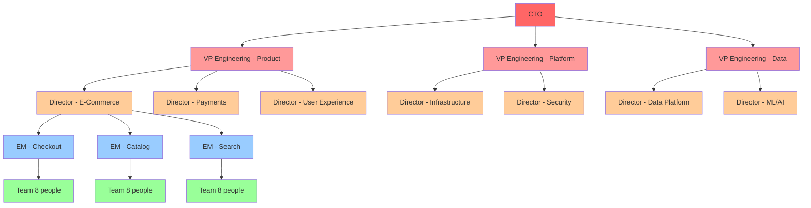
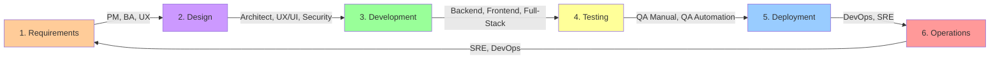
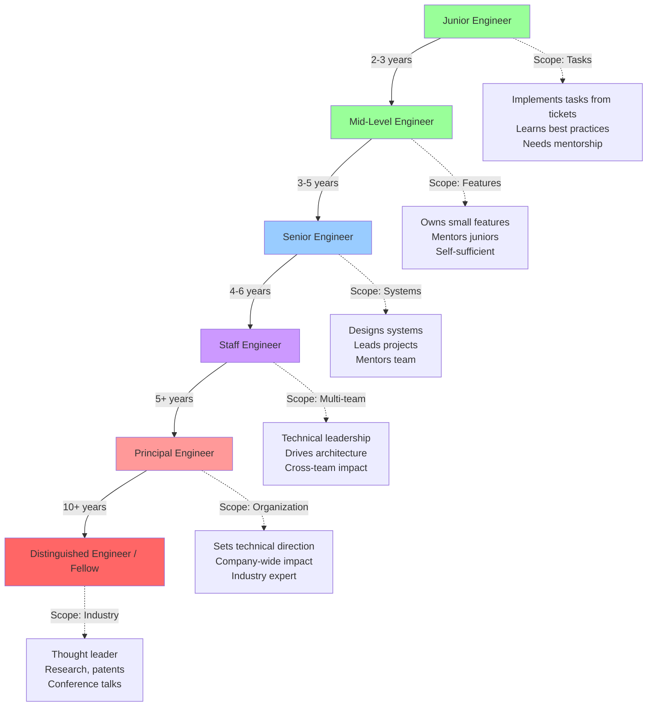
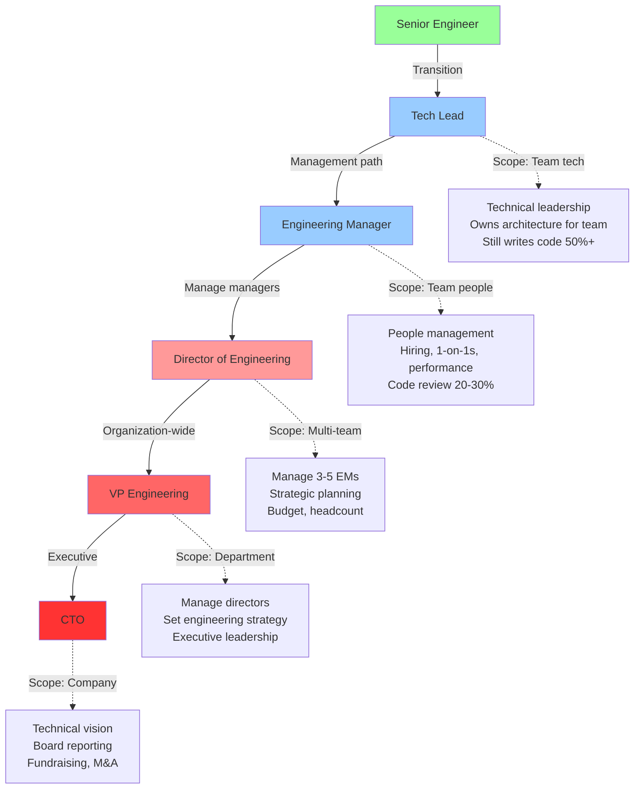
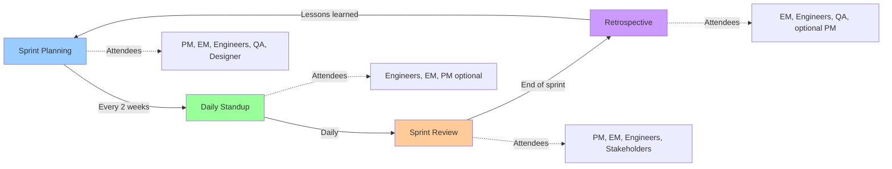

# Software Engineering Roles & Responsibilities

## Introduction

Building modern software is a team sport. While a solo developer can create simple applications, complex systems require diverse expertise: someone to understand user needs, someone to design scalable architecture, someone to write secure code, someone to ensure quality, and someone to keep production running smoothly.

**Why Roles Matter:**

- **Division of Expertise**: Modern software spans backend APIs, frontend UX, infrastructure, security, data pipelines, and machine learning. No single person can master everything.
- **Efficiency**: Specialists work faster and produce higher quality in their domain than generalists.
- **Clear Accountability**: When production breaks at 2 AM, who gets paged? When a feature is delayed, who owns the timeline?
- **Career Growth**: Clear roles create career ladders (Junior → Senior → Staff → Principal).

**The Collaboration Challenge:**

Different roles speak different languages:
- Product Managers think in user stories and business metrics
- Architects think in systems, data flows, and scalability
- Developers think in code, APIs, and algorithms
- QA Engineers think in test cases, edge cases, and quality gates
- DevOps Engineers think in pipelines, infrastructure, and reliability

**How SpecWeave Bridges the Gap:**

SpecWeave provides a common language across roles:
- **PMs** define requirements in `spec.md` (user stories, acceptance criteria)
- **Architects** create design in `plan.md` (architecture, ADRs, diagrams)
- **Developers** implement via `tasks.md` (embedded tests, TDD workflow)
- **QA** validates against acceptance criteria (AC-ID traceability)
- **DevOps** automates via hooks (CI/CD integration, living docs sync)

Every role works from the same source of truth, using the same increment structure.

---

## Core Engineering Roles

### Product Owner / Product Manager

**What They Do:**

Product Managers (PMs) define WHAT to build and WHY it matters. They are the bridge between business stakeholders, users, and the engineering team.

**Daily Responsibilities:**

1. **User Research**: Interview users, analyze feedback, identify pain points
2. **Prioritization**: Decide which features to build first (ROI, impact, effort)
3. **Requirements Definition**: Write user stories, acceptance criteria, success metrics
4. **Stakeholder Communication**: Report progress to executives, sales, marketing
5. **Backlog Grooming**: Keep feature backlog prioritized and up-to-date
6. **Go-to-Market**: Work with marketing on launches, beta programs, feature announcements

**Key Skills:**

- Business acumen (understand revenue, costs, market dynamics)
- User empathy (understand user needs, pain points)
- Communication (explain technical concepts to non-technical stakeholders)
- Data analysis (interpret metrics, A/B test results)
- Prioritization frameworks (RICE, MoSCoW, Kano model)

**Tools They Use:**

- Product management: Jira, Linear, Asana, ProductBoard
- Analytics: Mixpanel, Amplitude, Google Analytics
- Design: Figma (to review mockups)
- Communication: Slack, Confluence, Notion

**Interaction with Other Roles:**

- **Architect**: Discusses technical feasibility, complexity estimates
- **Engineering Manager**: Negotiates capacity, timelines, resource allocation
- **UX Designer**: Collaborates on user flows, wireframes, prototypes
- **QA**: Defines acceptance criteria, reviews test plans
- **Stakeholders**: Reports progress, gathers feedback

**How SpecWeave Helps PMs:**

```markdown
# Example: PM creates spec.md

## US-001: User Login with Email
**Priority**: P1 (Must-Have)
**Acceptance Criteria**:
- [ ] **AC-US1-01**: User can log in with valid email/password (testable)
- [ ] **AC-US1-02**: Invalid credentials show error message (testable)
- [ ] **AC-US1-03**: 5 failed attempts lock account for 15 minutes (testable)

**Success Metrics**:
- Login success rate > 95%
- Login time < 2 seconds (p95)
```

SpecWeave auto-generates this structure from PM input, with AC-IDs that trace to tests.

**Day in the Life:**

- **9:00 AM**: Review production metrics (login conversion, feature adoption)
- **10:00 AM**: User interview (understand checkout flow pain points)
- **11:00 AM**: Sprint planning with engineering (prioritize next two weeks)
- **1:00 PM**: Stakeholder demo (show new payment integration)
- **2:30 PM**: Write user stories for Q2 roadmap
- **4:00 PM**: Review designs with UX team
- **5:00 PM**: Respond to customer feedback from support tickets

---

### Engineering Manager

**What They Do:**

Engineering Managers (EMs) lead the engineering team: hiring, performance management, technical direction, and team health. They balance technical excellence with team productivity and morale.

**Daily Responsibilities:**

1. **Team Leadership**: 1-on-1s, career development, performance reviews
2. **Hiring**: Interview candidates, grow the team
3. **Technical Oversight**: Code review standards, architecture decisions
4. **Project Management**: Track sprint velocity, remove blockers
5. **Cross-Team Collaboration**: Coordinate with other EMs, Product, Design
6. **Incident Response**: On-call escalation, postmortem reviews

**Key Skills:**

- People management (coaching, feedback, conflict resolution)
- Technical depth (can review code, understand architecture)
- Project management (estimate timelines, track progress)
- Communication (translate technical details for executives)
- Strategic thinking (long-term technical roadmap)

**Tools They Use:**

- Project management: Jira, Linear, GitHub Projects
- Communication: Slack, email, Zoom
- Code review: GitHub, GitLab, Bitbucket
- Metrics: Team velocity charts, DORA metrics, incident dashboards

**Interaction with Other Roles:**

- **Product Manager**: Negotiate scope, timelines, resource allocation
- **Engineers**: 1-on-1s, code reviews, mentorship
- **Architect**: Discuss technical direction, ADRs
- **HR**: Hiring pipeline, compensation discussions
- **Other EMs**: Cross-team dependencies, API contracts

**How SpecWeave Helps EMs:**

- **Track Progress**: `/specweave:progress` shows real-time completion status
- **Quality Gates**: `/specweave:qa` runs automated quality checks
- **Velocity Metrics**: Living completion reports show scope changes, hours tracked
- **Onboarding**: New engineers read living docs to understand architecture

**Day in the Life:**

- **9:00 AM**: Check production alerts, review on-call incidents
- **9:30 AM**: 1-on-1 with senior engineer (career growth discussion)
- **10:30 AM**: Interview candidate for backend role
- **12:00 PM**: Lunch with team (informal bonding)
- **1:00 PM**: Architecture review meeting (new microservice design)
- **2:30 PM**: Review pull requests, provide feedback
- **3:30 PM**: Sprint retrospective (what went well, what to improve)
- **4:30 PM**: Update engineering roadmap based on PM priorities

---

### Software Architect

**What They Do:**

Software Architects design the high-level structure of systems: how components interact, where data flows, how the system scales. They make technical decisions with long-term impact.

**Daily Responsibilities:**

1. **Architecture Design**: Design systems, data models, API contracts
2. **Architecture Decision Records (ADRs)**: Document why we chose X over Y
3. **Diagrams**: Create C4 diagrams (context, container, component, code)
4. **Technical Spikes**: Prototype new technologies, evaluate tools
5. **Code Review**: Review critical PRs for architecture consistency
6. **Mentorship**: Guide developers on design patterns, best practices
7. **Technical Debt**: Identify and prioritize refactoring work

**Key Skills:**

- System design (microservices, databases, caching, queuing)
- Design patterns (SOLID, DDD, CQRS, event sourcing)
- Scalability (horizontal scaling, load balancing, sharding)
- Security (authentication, authorization, encryption)
- Documentation (ADRs, diagrams, technical specs)

**Tools They Use:**

- Diagramming: Mermaid, Lucidchart, Draw.io, C4 PlantUML
- Documentation: Markdown, Confluence, Notion
- Code review: GitHub, GitLab
- Prototyping: Local dev environments, Docker, cloud sandboxes

**Interaction with Other Roles:**

- **Product Manager**: Discuss technical feasibility, complexity estimates
- **Engineering Manager**: Plan technical roadmap, capacity planning
- **Backend Developers**: Review API designs, data models
- **DevOps/SRE**: Discuss deployment strategies, infrastructure needs
- **Security Engineer**: Review authentication, authorization, data protection

**How SpecWeave Helps Architects:**

```markdown
# Example: Architect creates plan.md with ADRs

## Architecture Decision Record: Database Choice

**Context**: We need to store user profiles, orders, and payment history.

**Decision**: Use PostgreSQL for transactional data, Redis for session cache.

**Rationale**:
- PostgreSQL: ACID compliance, strong consistency for payments
- Redis: Fast session lookups (< 10ms), TTL support for auto-expiration

**Consequences**:
- ✅ Reliable payment processing (no lost transactions)
- ✅ Fast login (session cache)
- ⚠️ Two databases to maintain (operational complexity)

**Alternatives Considered**:
- MongoDB: No ACID guarantees for payments (rejected)
- MySQL: Weaker JSON support than PostgreSQL (rejected)
```

SpecWeave stores ADRs in `.specweave/docs/internal/architecture/adr/`, versioned with living docs sync.

**Day in the Life:**

- **9:00 AM**: Review overnight production metrics (database query times)
- **10:00 AM**: Design session for new checkout microservice (whiteboard diagrams)
- **12:00 PM**: Write ADR for database sharding strategy
- **1:30 PM**: Code review: API design for payment integration
- **3:00 PM**: Technical spike: Evaluate GraphQL vs REST for mobile app
- **4:30 PM**: Mentorship: Pair with junior developer on service layer design

---

### Backend Developer

**What They Do:**

Backend Developers build the server-side logic: APIs, databases, business logic, integrations with third-party services. They focus on data processing, security, and performance.

**Daily Responsibilities:**

1. **API Development**: Build REST/GraphQL endpoints
2. **Database Design**: Schema design, migrations, indexing, query optimization
3. **Business Logic**: Implement domain logic (e.g., pricing calculations, order processing)
4. **Third-Party Integrations**: Connect to payment gateways, email services, cloud APIs
5. **Performance Optimization**: Optimize slow queries, add caching, reduce API latency
6. **Testing**: Write unit tests, integration tests
7. **Code Review**: Review peers' backend PRs

**Key Skills:**

- Programming languages: Node.js/TypeScript, Python, Java, Go, C#
- Databases: PostgreSQL, MySQL, MongoDB, Redis
- APIs: REST, GraphQL, gRPC
- Authentication: OAuth2, JWT, session management
- Testing: Unit tests (Jest, pytest), integration tests

**Tools They Use:**

- Code editors: VS Code, IntelliJ, PyCharm
- API testing: Postman, Insomnia, curl
- Databases: pgAdmin, DBeaver, MongoDB Compass
- Version control: Git, GitHub, GitLab

**Interaction with Other Roles:**

- **Frontend Developer**: Define API contracts (request/response schemas)
- **Architect**: Implement architecture designs, follow ADRs
- **DevOps**: Deploy code, troubleshoot production issues
- **QA**: Fix bugs found in testing
- **Product Manager**: Estimate effort for features

**How SpecWeave Helps Backend Developers:**

```markdown
# Example: tasks.md with embedded tests (BDD format)

## T-003: Implement User Login API

**AC**: AC-US1-01, AC-US1-02, AC-US1-03

**Test Plan** (BDD format):
- **Given** user with valid credentials → **When** POST /auth/login → **Then** return JWT token + 200 status
- **Given** user with invalid password → **When** POST /auth/login → **Then** return error + 401 status
- **Given** user with 5 failed attempts → **When** 6th attempt → **Then** return locked error + 429 status

**Test Cases**:
- Unit (`auth.test.ts`): validLogin, invalidPassword, accountLocking → 90% coverage
- Integration (`auth-flow.test.ts`): loginEndpoint, sessionCreation → 85% coverage

**Implementation**:
1. Create AuthService.ts (business logic)
2. Create POST /auth/login endpoint (Express)
3. Add bcrypt password hashing
4. Add JWT token generation
5. Add rate limiting (Redis)
6. Write tests (TDD: red → green → refactor)

**Coverage Target**: 87%
```

Developers implement tasks with embedded test plans, ensuring quality.

**Day in the Life:**

- **9:00 AM**: Standup (yesterday: finished login API, today: password reset)
- **9:30 AM**: TDD: Write failing test for password reset
- **10:00 AM**: Implement password reset logic (bcrypt, token generation)
- **11:30 AM**: Run tests (all passing), commit code
- **12:00 PM**: Lunch
- **1:00 PM**: Code review: Review teammate's payment integration PR
- **2:00 PM**: Fix production bug (slow database query, add index)
- **3:30 PM**: Integrate with SendGrid email service (password reset emails)
- **4:30 PM**: Update API documentation (OpenAPI spec)
- **5:00 PM**: Respond to frontend dev's question about API contract

---

### Frontend Developer

**What They Do:**

Frontend Developers build the user interface: web pages, mobile apps, interactive components. They focus on user experience, performance, and accessibility.

**Daily Responsibilities:**

1. **UI Development**: Implement designs from Figma/Sketch
2. **State Management**: Manage application state (Redux, MobX, Zustand)
3. **API Integration**: Call backend APIs, handle loading/error states
4. **Performance**: Optimize bundle size, lazy loading, caching
5. **Accessibility**: ARIA labels, keyboard navigation, screen reader support
6. **Testing**: Unit tests (components), E2E tests (Playwright, Cypress)
7. **Browser Compatibility**: Test across Chrome, Firefox, Safari, Edge

**Key Skills:**

- Languages: JavaScript/TypeScript, HTML, CSS
- Frameworks: React, Vue, Angular, Svelte, Next.js
- State management: Redux, MobX, Zustand, Recoil
- Styling: CSS Modules, Tailwind, Styled Components, SASS
- Testing: Jest, React Testing Library, Playwright, Cypress

**Tools They Use:**

- Code editors: VS Code, WebStorm
- Design handoff: Figma, Zeplin, Storybook
- Browser DevTools: Chrome DevTools, React DevTools
- Version control: Git, GitHub, GitLab

**Interaction with Other Roles:**

- **UX/UI Designer**: Implement designs, provide feedback on feasibility
- **Backend Developer**: Define API contracts, troubleshoot integration issues
- **Product Manager**: Demo features, gather feedback
- **QA**: Fix UI bugs, improve E2E test coverage

**How SpecWeave Helps Frontend Developers:**

```markdown
# Example: tasks.md with embedded tests

## T-005: Implement Login Form Component

**AC**: AC-US1-01, AC-US1-02

**Test Plan** (BDD format):
- **Given** user enters valid email/password → **When** click "Login" → **Then** call POST /auth/login, redirect to dashboard
- **Given** user enters invalid password → **When** click "Login" → **Then** show error message "Invalid credentials"

**Test Cases**:
- Unit (`LoginForm.test.tsx`): renders form, validates input, handles submit → 95% coverage
- E2E (`login.spec.ts`): successful login flow, error handling → 100% critical path

**Implementation**:
1. Create LoginForm.tsx component (React + TypeScript)
2. Add form validation (Formik + Yup)
3. Integrate with backend API (fetch)
4. Add loading spinner, error message UI
5. Write tests (React Testing Library + Playwright)

**Coverage Target**: 93%
```

**Day in the Life:**

- **9:00 AM**: Standup (yesterday: dashboard layout, today: login form)
- **9:30 AM**: Review Figma designs for login page
- **10:00 AM**: Implement LoginForm component (React + TypeScript)
- **11:00 AM**: Add form validation (email format, password length)
- **12:00 PM**: Lunch
- **1:00 PM**: Integrate with backend login API (handle loading, errors)
- **2:30 PM**: Write unit tests (React Testing Library)
- **3:30 PM**: Code review: Review teammate's dashboard PR
- **4:00 PM**: Fix accessibility issues (ARIA labels, keyboard navigation)
- **4:45 PM**: Update Storybook with new LoginForm component

---

### Full-Stack Developer

**What They Do:**

Full-Stack Developers work on both backend and frontend, handling the entire feature end-to-end. They are generalists who can build complete features independently.

**Daily Responsibilities:**

- Backend: APIs, databases, business logic (like Backend Developer)
- Frontend: UI components, state management, API integration (like Frontend Developer)
- End-to-End Ownership: Build features from database to UI

**Key Skills:**

- Combination of backend and frontend skills
- Understanding of full system architecture
- Ability to context-switch between server and client code

**When to Use Full-Stack vs Specialists:**

| Scenario | Best Choice |
|----------|-------------|
| Small startup (3-5 people) | Full-Stack (everyone does everything) |
| Rapid prototyping / MVP | Full-Stack (faster iteration) |
| Complex UI (design system, animations) | Frontend Specialist |
| Complex backend (distributed systems, high scale) | Backend Specialist |
| Large team (20+ engineers) | Specialists (deeper expertise) |

---

### DevOps Engineer

**What They Do:**

DevOps Engineers automate infrastructure, CI/CD pipelines, deployment processes. They bridge development and operations, enabling fast and reliable releases.

**Daily Responsibilities:**

1. **CI/CD Pipelines**: Build automated test and deployment pipelines (GitHub Actions, Jenkins)
2. **Infrastructure as Code**: Manage cloud resources (Terraform, CloudFormation)
3. **Containerization**: Docker, Kubernetes, Helm charts
4. **Monitoring**: Set up metrics (Prometheus, Grafana), alerting
5. **Security**: Secret management (Vault), vulnerability scanning
6. **Troubleshooting**: Debug deployment failures, infrastructure issues

**Key Skills:**

- Cloud platforms: AWS, Azure, GCP
- Containers: Docker, Kubernetes
- Infrastructure as Code: Terraform, Ansible, Pulumi
- CI/CD: GitHub Actions, GitLab CI, Jenkins, CircleCI
- Scripting: Bash, Python, Go

**Tools They Use:**

- Cloud consoles: AWS Console, Azure Portal, GCP Console
- Kubernetes: kubectl, Lens, k9s
- Monitoring: Prometheus, Grafana, Datadog, New Relic
- Secret management: HashiCorp Vault, AWS Secrets Manager

**Interaction with Other Roles:**

- **Backend/Frontend Developers**: Deploy their code, troubleshoot issues
- **SRE**: Collaborate on production reliability
- **Security Engineer**: Implement security scanning, compliance
- **Architect**: Implement infrastructure designs

**How SpecWeave Helps DevOps:**

```markdown
# Example: tasks.md with infrastructure tests

## T-008: Set Up Kubernetes Deployment

**AC**: AC-INF-01 (All services deployed to K8s)

**Test Plan**:
- **Given** Helm chart → **When** helm install → **Then** all pods running, health checks passing

**Test Cases**:
- Integration: Deploy to staging K8s, verify endpoints, check logs → 100% coverage

**Implementation**:
1. Create Dockerfile for each service
2. Create Kubernetes manifests (deployment, service, ingress)
3. Create Helm chart with values.yaml
4. Set up GitHub Actions pipeline (build → push to ECR → deploy to K8s)
5. Add health check endpoints (/health, /ready)
6. Test on staging cluster

**Validation**: Deployment succeeds, all pods healthy, endpoints accessible
```

**Day in the Life:**

- **9:00 AM**: Check overnight deployments (staging auto-deployed at 2 AM)
- **9:30 AM**: Debug failed CI pipeline (Docker build timeout, increase resources)
- **10:30 AM**: Implement Terraform for new RDS database
- **12:00 PM**: Lunch
- **1:00 PM**: Set up Prometheus alerts for high memory usage
- **2:30 PM**: Help backend dev troubleshoot local Docker setup
- **3:30 PM**: Review security scan results (update vulnerable npm packages)
- **4:30 PM**: Write runbook for database backup/restore process

---

### Site Reliability Engineer (SRE)

**What They Do:**

SREs keep production running smoothly: monitoring, incident response, performance optimization, capacity planning. They treat operations as a software engineering problem.

**Daily Responsibilities:**

1. **On-Call**: Respond to production incidents (paged 24/7)
2. **Monitoring**: Create dashboards (Grafana), set up alerts
3. **Incident Response**: Debug outages, implement fixes, write postmortems
4. **Performance**: Optimize latency, throughput, resource usage
5. **Capacity Planning**: Predict growth, scale infrastructure
6. **Reliability Engineering**: Improve system reliability (SLOs, error budgets)
7. **Runbooks**: Document operational procedures

**Key Skills:**

- Production debugging (logs, metrics, traces)
- Performance optimization (profiling, caching, database tuning)
- Incident management (triage, communication, postmortems)
- Observability: Prometheus, Grafana, Datadog, New Relic, OpenTelemetry
- Scripting: Python, Bash, Go

**Tools They Use:**

- Monitoring: Prometheus, Grafana, Datadog, New Relic
- Logging: ELK Stack (Elasticsearch, Logstash, Kibana), Splunk
- Tracing: Jaeger, Zipkin, OpenTelemetry
- Incident management: PagerDuty, Opsgenie

**Interaction with Other Roles:**

- **DevOps**: Collaborate on infrastructure reliability
- **Backend Developers**: Debug production issues, optimize code
- **Product Manager**: Report on SLOs (Service Level Objectives), uptime
- **Engineering Manager**: Report on incident trends, propose reliability improvements

**How SpecWeave Helps SREs:**

```markdown
# Example: Runbook in .specweave/docs/internal/operations/

## Runbook: Database High CPU Alert

**Alert**: database_cpu_usage > 80% for 5 minutes

**Severity**: P2 (impacts performance, not downtime)

**Triage**:
1. Check Grafana dashboard: Which queries are slow?
2. Run `EXPLAIN ANALYZE` on top 5 queries
3. Check for missing indexes
4. Check for long-running transactions (pg_stat_activity)

**Mitigation**:
1. Short-term: Add missing indexes, kill long transactions
2. Long-term: Optimize queries, add read replicas, consider sharding

**Escalation**: Page backend on-call if queries are application bugs
```

SpecWeave stores runbooks in `.specweave/docs/internal/operations/`, updated via living docs sync.

**Day in the Life:**

- **9:00 AM**: Review overnight alerts (3 high memory warnings, auto-resolved)
- **10:00 AM**: Postmortem meeting for yesterday's outage (database deadlock)
- **11:30 AM**: Implement fix from postmortem (add retry logic)
- **12:00 PM**: Lunch
- **1:00 PM**: Analyze performance trends (API latency increased 10% this week)
- **2:30 PM**: Optimize slow database queries (add indexes)
- **3:30 PM**: Write runbook for new payment service
- **4:30 PM**: Review SLO dashboard (99.95% uptime this month, on target)
- **6:00 PM**: Paged for production incident (investigate, mitigate, page backend dev)

---

### QA Engineer / Tester

**What They Do:**

QA Engineers ensure software quality: manual testing, test planning, bug reporting. They validate that features meet acceptance criteria before release.

**Daily Responsibilities:**

1. **Test Planning**: Write test cases from acceptance criteria
2. **Manual Testing**: Exploratory testing, edge cases, negative testing
3. **Bug Reporting**: File detailed bug reports with reproduction steps
4. **Regression Testing**: Ensure new features don't break existing ones
5. **User Acceptance Testing (UAT)**: Validate with product/stakeholders
6. **Quality Gates**: Approve/reject releases based on quality

**Key Skills:**

- Testing methodologies: Black-box, white-box, exploratory
- Test case design: Equivalence partitioning, boundary value analysis
- Bug lifecycle: Triage, prioritization, verification
- Domain knowledge: Understand user workflows, edge cases
- Communication: Clearly describe bugs to developers

**Tools They Use:**

- Test management: TestRail, Zephyr, Xray
- Bug tracking: Jira, Linear, GitHub Issues
- Collaboration: Slack, Confluence
- Browsers: Chrome, Firefox, Safari (cross-browser testing)

**Interaction with Other Roles:**

- **Product Manager**: Clarify acceptance criteria, validate features
- **Developers**: Report bugs, verify fixes
- **QA Automation Engineer**: Identify tests to automate
- **UX Designer**: Provide feedback on usability

**How SpecWeave Helps QA:**

```markdown
# Example: Acceptance criteria in spec.md with testable AC-IDs

## US-002: Password Reset

**Acceptance Criteria**:
- [ ] **AC-US2-01**: User can request reset via email (testable)
- [ ] **AC-US2-02**: Reset link expires after 1 hour (testable)
- [ ] **AC-US2-03**: User can set new password (min 8 chars, 1 number) (testable)

**QA validates**:
1. Manual test: Request reset, receive email, click link, set password ✅
2. Edge case: Try expired link (> 1 hour old) → should show error ✅
3. Negative test: Set weak password (< 8 chars) → should reject ✅
4. Cross-browser: Test on Chrome, Firefox, Safari ✅
```

QA traces tests back to AC-IDs in spec.md, ensuring complete coverage.

**Day in the Life:**

- **9:00 AM**: Standup (yesterday: tested login, today: password reset)
- **9:30 AM**: Review new feature (password reset) on staging
- **10:00 AM**: Write test cases from acceptance criteria
- **11:00 AM**: Manual testing (happy path, edge cases, negative tests)
- **12:00 PM**: Lunch
- **1:00 PM**: File 3 bugs found (expired link bug, weak password validation bug, UI typo)
- **2:30 PM**: Regression testing (ensure login still works)
- **3:30 PM**: Cross-browser testing (Chrome, Firefox, Safari)
- **4:30 PM**: UAT with Product Manager (demo feature, get sign-off)
- **5:00 PM**: Update test cases in TestRail (mark as passed/failed)

---

### QA Automation Engineer

**What They Do:**

QA Automation Engineers write automated tests: unit tests, integration tests, E2E tests. They build test frameworks and CI/CD integration.

**Daily Responsibilities:**

1. **Test Automation**: Write E2E tests (Playwright, Cypress, Selenium)
2. **Test Frameworks**: Build reusable test utilities, page object models
3. **CI/CD Integration**: Run tests on every PR, block merges if tests fail
4. **Flaky Test Management**: Fix unstable tests
5. **Test Reporting**: Dashboards showing test coverage, pass rates
6. **Collaboration**: Work with developers to improve testability

**Key Skills:**

- Programming: JavaScript/TypeScript, Python, Java
- Test frameworks: Playwright, Cypress, Selenium, Puppeteer
- Unit testing: Jest, pytest, JUnit
- CI/CD: GitHub Actions, GitLab CI, Jenkins
- Test design: Page object model, test data management

**Tools They Use:**

- E2E frameworks: Playwright, Cypress, Selenium
- Unit testing: Jest, pytest, JUnit
- CI/CD: GitHub Actions, GitLab CI
- Test reporting: Allure, ReportPortal

**Interaction with Other Roles:**

- **QA Engineer**: Automate test cases identified by manual testers
- **Developers**: Collaborate on testability (add test IDs, API endpoints)
- **DevOps**: Integrate tests into CI/CD pipelines

**How SpecWeave Helps QA Automation:**

```markdown
# Example: tasks.md with E2E tests

## T-006: E2E Tests for Login Flow

**AC**: AC-US1-01, AC-US1-02, AC-US1-03

**Test Plan**:
- **Given** user on login page → **When** enter valid credentials, click "Login" → **Then** redirect to dashboard
- **Given** user enters invalid password → **When** click "Login" → **Then** show error "Invalid credentials"

**Test Cases**:
- E2E (`login.spec.ts`):
  - test('successful login', ...) → enter creds, click button, assert URL = /dashboard
  - test('invalid password', ...) → enter wrong password, assert error message
  - test('account locking', ...) → 5 failed attempts, assert locked message

**Implementation**:
1. Create Playwright test suite
2. Add page object model (LoginPage.ts)
3. Add test data fixtures (valid/invalid users)
4. Run tests in CI (GitHub Actions)
5. Generate HTML report

**Coverage Target**: 100% critical path
```

**Day in the Life:**

- **9:00 AM**: Standup (yesterday: wrote login tests, today: payment tests)
- **9:30 AM**: Write E2E test for new payment flow
- **11:00 AM**: Fix flaky test (timeout issue, add explicit wait)
- **12:00 PM**: Lunch
- **1:00 PM**: Code review: Review developer's unit tests
- **2:00 PM**: Integrate tests into CI (run on every PR)
- **3:30 PM**: Investigate test failure (found regression bug, file ticket)
- **4:30 PM**: Update test reporting dashboard (95% pass rate this week)

---

### UX Designer

**What They Do:**

UX Designers research user needs and design user flows. They focus on usability, user satisfaction, and solving user problems.

**Daily Responsibilities:**

1. **User Research**: Interviews, surveys, usability testing
2. **User Personas**: Create profiles of typical users
3. **User Flows**: Map out how users navigate the app
4. **Wireframes**: Low-fidelity sketches of screens
5. **Prototypes**: Interactive mockups for usability testing
6. **Usability Testing**: Observe users, identify pain points
7. **Collaboration**: Work with PM, UI Designer, Engineers

**Key Skills:**

- User research methods (interviews, surveys, A/B testing)
- Information architecture (navigation, content hierarchy)
- Wireframing (low-fidelity sketches)
- Prototyping (interactive mockups)
- Usability testing (task analysis, think-aloud protocol)

**Tools They Use:**

- Design: Figma, Sketch, Adobe XD
- Prototyping: Figma, InVision, Axure
- Research: UserTesting, Hotjar, Maze
- Diagramming: Miro, FigJam, Lucidchart

**Interaction with Other Roles:**

- **Product Manager**: Validate that designs solve user problems
- **UI Designer**: Hand off user flows for visual design
- **Frontend Developer**: Discuss implementation feasibility
- **QA**: Collaborate on usability test scripts

**Day in the Life:**

- **9:00 AM**: Review user interview recordings (checkout flow)
- **10:00 AM**: Create user personas (first-time buyer, returning customer)
- **11:00 AM**: Sketch user flows for new checkout (whiteboard)
- **12:00 PM**: Lunch
- **1:00 PM**: Build low-fidelity wireframes (Figma)
- **2:30 PM**: Usability testing session (observe 3 users, take notes)
- **4:00 PM**: Synthesize findings (3 pain points identified)
- **4:45 PM**: Present findings to PM and UI Designer

---

### UI Designer

**What They Do:**

UI Designers create the visual design: colors, typography, icons, layouts. They focus on aesthetics, branding, and visual consistency.

**Daily Responsibilities:**

1. **Visual Design**: Design high-fidelity mockups from wireframes
2. **Design Systems**: Create reusable components (buttons, forms, cards)
3. **Branding**: Apply brand colors, fonts, logo usage
4. **Icons & Illustrations**: Create custom graphics
5. **Handoff**: Provide assets, specs to frontend developers
6. **Design Reviews**: Present designs to stakeholders

**Key Skills:**

- Visual design (color theory, typography, layout)
- Design systems (component libraries, style guides)
- Tools: Figma, Sketch, Adobe Illustrator, Photoshop
- Accessibility (color contrast, font sizes)
- Responsive design (mobile, tablet, desktop)

**Tools They Use:**

- Design: Figma, Sketch, Adobe XD, Illustrator
- Handoff: Figma, Zeplin, Storybook
- Prototyping: Figma, Framer

**Interaction with Other Roles:**

- **UX Designer**: Receive wireframes, user flows
- **Frontend Developer**: Hand off designs, provide assets (SVGs, PNGs)
- **Product Manager**: Get feedback on designs
- **Marketing**: Ensure brand consistency

**Day in the Life:**

- **9:00 AM**: Review UX wireframes for new checkout flow
- **10:00 AM**: Design high-fidelity mockups (apply brand colors, typography)
- **11:30 AM**: Create new icon set (shopping cart, payment methods)
- **12:00 PM**: Lunch
- **1:00 PM**: Update design system (add new button variant)
- **2:30 PM**: Design review with Product Manager (gather feedback)
- **3:30 PM**: Iterate on designs based on feedback
- **4:30 PM**: Handoff to frontend dev (export assets, provide specs)

---

## Team Structures

### Small Startup (3-5 People)

**Typical Roles:**

- 1-2 Full-Stack Developers (backend + frontend)
- 1 Product Manager / Founder (wears many hats)
- 1 Designer (UX + UI combined)
- 0-1 DevOps (often outsourced or using PaaS like Vercel, Railway)

**Organization:**



**Characteristics:**

- ✅ Fast iteration (everyone does everything)
- ✅ Low overhead (no meetings, no process)
- ⚠️ Limited expertise (generalists, not specialists)
- ⚠️ Scalability issues (hard to grow beyond MVP)

**Example Stack:**

- Backend: Node.js + Express + PostgreSQL
- Frontend: React + Next.js
- Deployment: Vercel (auto-deploys from GitHub)
- Monitoring: LogRocket, Sentry

---

### Mid-Size Company (20-50 Engineers)

**Typical Roles:**

- 10-20 Backend Developers
- 5-10 Frontend Developers
- 3-5 DevOps Engineers
- 2-3 QA Engineers
- 1-2 Data Engineers
- 1-2 SREs
- 2-3 Product Managers
- 3-5 Engineering Managers
- 1 Software Architect
- 1-2 UX/UI Designers

**Organization:**



**Characteristics:**

- ✅ Specialized teams (backend, frontend, platform)
- ✅ Dedicated QA, DevOps, SRE (higher quality)
- ✅ Clear ownership (team owns specific services/features)
- ⚠️ Coordination overhead (cross-team dependencies)
- ⚠️ Process needed (sprint planning, standups, retros)

**Example Structure:**

- **Backend Team**: Builds APIs, databases, business logic
- **Frontend Team**: Builds web app, mobile web
- **Platform Team**: DevOps + SRE (infrastructure, reliability)
- **QA Team**: Manual + automated testing

---

### Large Enterprise (200+ Engineers)

**Typical Roles:**

- 100+ Software Engineers (backend, frontend, mobile, data, ML)
- 20+ DevOps Engineers
- 10+ SREs
- 10+ QA Engineers (manual + automation)
- 5+ Data Engineers
- 5+ ML Engineers
- 10+ Product Managers
- 20+ Engineering Managers
- 5+ Software Architects
- 5+ Security Engineers
- 5+ UX/UI Designers
- 3+ Technical Writers

**Organization:**



**Characteristics:**

- ✅ Deep expertise (specialists in narrow domains)
- ✅ High quality (dedicated security, compliance, performance teams)
- ✅ Scalability (can work on many features in parallel)
- ⚠️ Complexity (many layers of management)
- ⚠️ Slow iteration (coordination across teams)
- ⚠️ Bureaucracy (approval processes, compliance, security reviews)

**Example Team Structure** (8-person "Two-Pizza Team"):

- 1 Engineering Manager (tech lead + people management)
- 1 Product Manager (owns roadmap)
- 3 Backend Engineers
- 2 Frontend Engineers
- 1 QA Engineer (manual + automation)
- 1 Designer (UX/UI)

---

## The Software Development Lifecycle (SDLC) with Roles

### Phase 1: Requirements Gathering

**Who's Involved:**

- **Product Manager** (leads): User research, competitive analysis, stakeholder interviews
- **Business Analyst**: Document requirements, user stories, acceptance criteria
- **UX Designer**: User interviews, personas, user flows
- **Stakeholders**: Provide business context, constraints

**Outputs:**

- Product Requirements Document (PRD)
- User stories with acceptance criteria
- User personas, user flows

**Example**:

```markdown
## User Story: US-001: User Login

**As a** registered user
**I want to** log in with my email and password
**So that** I can access my account

**Acceptance Criteria**:
- [ ] AC-US1-01: User can log in with valid credentials
- [ ] AC-US1-02: Invalid credentials show error message
- [ ] AC-US1-03: 5 failed attempts lock account for 15 minutes
```

---

### Phase 2: Design

**Who's Involved:**

- **Software Architect** (leads): System design, architecture decisions, ADRs
- **UX Designer**: Wireframes, user flows, prototypes
- **UI Designer**: High-fidelity mockups, design system
- **Backend Developers**: API design, data modeling
- **DevOps**: Infrastructure design, deployment strategy
- **Security Engineer**: Security requirements, threat modeling

**Outputs:**

- High-Level Design (HLD)
- Low-Level Design (LLD)
- Architecture Decision Records (ADRs)
- Wireframes, mockups
- API contracts (OpenAPI spec)
- Database schema

**Example**:

```markdown
## Architecture Decision Record: Authentication Strategy

**Context**: We need to authenticate users securely.

**Decision**: Use JWT tokens for stateless authentication.

**Rationale**:
- ✅ Stateless (no session storage in backend)
- ✅ Scalable (no sticky sessions needed)
- ✅ Mobile-friendly (can store token in mobile app)

**Consequences**:
- ⚠️ Token revocation is complex (can't revoke until expiry)
- ✅ Faster login (no database lookup for every request)

**Alternatives Considered**:
- Session cookies: Requires sticky sessions (rejected)
- OAuth2: Too complex for MVP (deferred to v2)
```

---

### Phase 3: Development

**Who's Involved:**

- **Backend Developers** (leads): Implement APIs, business logic, database
- **Frontend Developers** (leads): Implement UI, state management, API integration
- **Full-Stack Developers**: End-to-end features
- **QA Automation Engineers**: Write automated tests
- **Engineering Manager**: Code reviews, unblock developers

**Outputs:**

- Working code (backend + frontend)
- Unit tests (85%+ coverage)
- Integration tests
- E2E tests (critical paths)
- Pull requests (code review)

**Example** (SpecWeave workflow):

```markdown
## T-003: Implement Login API

**Implementation** (TDD):
1. Write failing test (red)
   - test('POST /auth/login with valid credentials returns JWT')
   - Run test → ❌ Fails (expected)

2. Implement minimal code (green)
   - Create AuthService.ts
   - Create POST /auth/login endpoint
   - Run test → ✅ Passes

3. Refactor
   - Extract password hashing to utility
   - Add error handling
   - Run test → ✅ Still passes
```

---

### Phase 4: Testing

**Who's Involved:**

- **QA Engineer** (leads): Manual testing, exploratory testing, UAT
- **QA Automation Engineer**: Automated test execution, flaky test fixes
- **Backend/Frontend Developers**: Fix bugs found in testing
- **Product Manager**: User acceptance testing (UAT), sign-off

**Outputs:**

- Bug reports (Jira, Linear, GitHub Issues)
- Test case execution reports
- UAT sign-off

**Example**:

```markdown
## Bug Report: Password Reset Link Expired Error

**Severity**: P2 (impacts user experience, not critical)
**Steps to Reproduce**:
1. Request password reset
2. Wait 61 minutes
3. Click reset link in email
**Expected**: Show "Link expired, request new one"
**Actual**: Shows generic error "Something went wrong"

**Environment**: Staging (Chrome 120, macOS)
**Assigned to**: Backend Developer
```

---

### Phase 5: Deployment

**Who's Involved:**

- **DevOps Engineer** (leads): Deploy to staging/production, monitor deployment
- **Backend/Frontend Developers**: Provide deployment instructions, debug issues
- **SRE**: Monitor production metrics, alerts
- **QA**: Smoke testing on production

**Outputs:**

- Deployment to staging
- Smoke tests passed
- Deployment to production
- Rollback plan (if deployment fails)

**Example**:

```bash
# GitHub Actions pipeline (automated by DevOps)

1. Build Docker image
2. Push to ECR (AWS Container Registry)
3. Deploy to staging K8s cluster (Helm)
4. Run smoke tests (Playwright)
5. If tests pass → Deploy to production K8s cluster
6. Monitor metrics (Grafana dashboard)
```

---

### Phase 6: Operations & Monitoring

**Who's Involved:**

- **SRE** (leads): Monitor production, respond to incidents
- **DevOps**: Infrastructure scaling, cost optimization
- **Backend Developers**: Debug production bugs, optimize performance
- **Product Manager**: Review production metrics, user feedback

**Outputs:**

- Production monitoring dashboards (Grafana)
- Incident reports, postmortems
- Performance optimizations
- Runbooks (operational procedures)

**Example**:

```markdown
## Incident Postmortem: Database Deadlock (2025-11-04)

**Incident**: Database deadlock caused 5-minute outage
**Severity**: P1 (production downtime)
**Duration**: 5 minutes (10:30 AM - 10:35 AM)

**Root Cause**: Two transactions locked rows in opposite order

**Fix**:
- Short-term: Killed transactions, service recovered
- Long-term: Changed transaction order to prevent deadlock

**Lessons Learned**:
- Add deadlock detection to monitoring
- Add retry logic for transient failures
- Update runbook with deadlock resolution steps
```

---

### SDLC Workflow with Roles (Diagram)



---

## How SpecWeave Supports Each Role

### Product Manager

**Challenge**: Requirements scattered across Jira, Confluence, Slack, email. Hard to trace what was promised vs delivered.

**SpecWeave Solution**:

- ✅ **spec.md**: Single source of truth for requirements (user stories, AC)
- ✅ **AC-ID traceability**: Every acceptance criteria has an ID (AC-US1-01) that traces to tests
- ✅ **Living completion reports**: Track scope changes in real-time (what changed, why, who approved)
- ✅ **Auto-generated specs**: PM agent generates spec.md from high-level description

**Workflow**:

```bash
# 1. PM creates increment
/specweave:inc "Add user authentication with OAuth"

# 2. PM agent generates spec.md with user stories and AC-IDs
# 3. PM reviews, edits, approves
# 4. Architect creates plan.md (architecture, ADRs)
# 5. PM tracks progress
/specweave:progress  # Shows: 73% complete (11/15 tasks done)

# 6. PM reviews completion report
cat .specweave/increments/0008-auth/reports/COMPLETION-REPORT.md
# See: What was delivered, scope changes, lessons learned
```

---

### Software Architect

**Challenge**: Architecture decisions lost in Slack threads, Google Docs. No way to track WHY we chose X over Y.

**SpecWeave Solution**:

- ✅ **ADRs in plan.md**: Document architecture decisions with rationale
- ✅ **Diagrams in Mermaid**: C4 diagrams versioned with code
- ✅ **Living docs sync**: ADRs updated from Proposed → Accepted after implementation
- ✅ **Architect agent**: Generates plan.md with architecture design

**Workflow**:

```bash
# 1. Architect reviews spec.md (requirements)
# 2. Architect creates plan.md with ADRs

## ADR: Database Choice

**Context**: We need to store user profiles, orders, payments.

**Decision**: PostgreSQL for transactional data, Redis for sessions.

**Rationale**:
- PostgreSQL: ACID compliance (critical for payments)
- Redis: Fast session lookups (< 10ms)

**Consequences**:
- ✅ Reliable payment processing
- ⚠️ Two databases to maintain

# 3. After implementation, ADR status changes
Status: Proposed → Accepted (auto-updated via /specweave:sync-docs)
```

---

### Backend Developer

**Challenge**: Test requirements unclear. Tests written after code (no TDD). Hard to know when feature is "done".

**SpecWeave Solution**:

- ✅ **Embedded tests in tasks.md**: Test plans in BDD format (Given/When/Then)
- ✅ **AC-ID traceability**: Tests map to acceptance criteria (AC-US1-01)
- ✅ **TDD workflow**: Red → Green → Refactor (test-first development)
- ✅ **Coverage targets**: 80-90% per task (realistic, not 100%)

**Workflow**:

```markdown
## T-003: Implement Login API

**AC**: AC-US1-01, AC-US1-02

**Test Plan** (BDD):
- **Given** valid credentials → **When** POST /auth/login → **Then** return JWT token

**Test Cases**:
- Unit (`auth.test.ts`): validLogin, invalidPassword → 90% coverage
- Integration (`auth-flow.test.ts`): loginEndpoint → 85% coverage

**Implementation** (TDD):
1. Write failing test (red)
2. Implement code (green)
3. Refactor (keep tests green)
```

---

### QA Engineer

**Challenge**: Test cases disconnected from requirements. Hard to know if all acceptance criteria are tested.

**SpecWeave Solution**:

- ✅ **AC-ID traceability**: Every AC has an ID (AC-US1-01) that maps to tests
- ✅ **Test coverage validation**: `/specweave:check-tests` shows which ACs are tested
- ✅ **Quality gates**: `/specweave:qa` runs automated quality assessment

**Workflow**:

```bash
# 1. QA reviews spec.md for acceptance criteria
# 2. QA validates test coverage

/specweave:check-tests 0008

# Output:
# ✅ AC-US1-01: Covered by T-003 (unit + integration)
# ✅ AC-US1-02: Covered by T-003 (unit + integration)
# ❌ AC-US1-03: NOT COVERED (missing test for account locking)

# 3. QA requests developer to add missing test
# 4. QA performs manual exploratory testing
# 5. QA signs off on UAT
```

---

### DevOps Engineer

**Challenge**: Deployment steps undocumented. Infrastructure changes not reviewed. Deployments break production.

**SpecWeave Solution**:

- ✅ **Infrastructure specs in tasks.md**: Deployment steps documented
- ✅ **Runbooks in living docs**: Operational procedures versioned with code
- ✅ **Hooks for automation**: Pre/post deployment hooks (smoke tests, rollback)

**Workflow**:

```markdown
## T-008: Deploy to Kubernetes

**Test Plan**:
- **Given** Helm chart → **When** helm install → **Then** all pods running

**Implementation**:
1. Create Dockerfile
2. Create K8s manifests (deployment, service, ingress)
3. Create Helm chart
4. Set up GitHub Actions pipeline (build → push → deploy)
5. Test on staging cluster
6. Deploy to production

**Validation**: All pods healthy, health checks passing
```

---

### Site Reliability Engineer (SRE)

**Challenge**: Production incidents repeat. Runbooks outdated. No postmortem process.

**SpecWeave Solution**:

- ✅ **Runbooks in .specweave/docs/internal/operations/**: Operational procedures
- ✅ **Postmortems in living docs**: Incident reports with root cause analysis
- ✅ **Living docs sync**: Runbooks updated after incidents

**Workflow**:

```markdown
# 1. SRE responds to incident
# 2. SRE writes postmortem

## Incident: Database High CPU (2025-11-04)

**Root Cause**: Missing index on user_orders table

**Fix**:
- Short-term: Added index (CPU dropped 80% → 20%)
- Long-term: Added automated index recommendations to monitoring

**Action Items**:
- Update runbook: "Database High CPU" (add index check)
- Add alert: Slow queries > 1 second

# 3. SRE updates runbook via /specweave:sync-docs
# 4. Runbook now includes index troubleshooting
```

---

## Career Paths

### Individual Contributor (IC) Track



**Level Progression**:

1. **Junior Engineer** (0-2 years experience)
   - **Scope**: Individual tasks (implement API endpoint, fix bug)
   - **Skills**: Learning language, framework, tools
   - **Mentorship**: Needs guidance on design, code review
   - **Impact**: Contributes to team velocity

2. **Mid-Level Engineer** (2-5 years experience)
   - **Scope**: Small features (login flow, user profile page)
   - **Skills**: Proficient in language, framework, best practices
   - **Mentorship**: Mentors juniors, self-sufficient
   - **Impact**: Owns features end-to-end

3. **Senior Engineer** (5-10 years experience)
   - **Scope**: Systems (authentication system, payment pipeline)
   - **Skills**: Design patterns, system design, architecture
   - **Mentorship**: Leads projects, mentors mid-level and juniors
   - **Impact**: Drives architecture decisions, cross-team collaboration

4. **Staff Engineer** (10-15 years experience)
   - **Scope**: Multi-team initiatives (migrate to microservices, adopt GraphQL)
   - **Skills**: Technical leadership, influence without authority
   - **Mentorship**: Mentors senior engineers, sets technical direction
   - **Impact**: Company-wide technical initiatives

5. **Principal Engineer** (15+ years experience)
   - **Scope**: Organizational (choose cloud provider, define SRE strategy)
   - **Skills**: Strategic thinking, industry expertise
   - **Mentorship**: Mentors staff engineers, external thought leadership
   - **Impact**: Sets long-term technical vision

6. **Distinguished Engineer / Fellow** (20+ years experience)
   - **Scope**: Industry (research, patents, open source leadership)
   - **Skills**: Domain expert, recognized industry leader
   - **Mentorship**: Conference talks, academic papers
   - **Impact**: Influences entire industry (e.g., Brendan Eich - JavaScript, Guido van Rossum - Python)

---

### Management Track



**Level Progression**:

1. **Senior Engineer** (IC starting point)
   - **Scope**: Individual systems
   - **Focus**: Technical excellence

2. **Tech Lead** (Hybrid IC + Management)
   - **Scope**: Team technical direction
   - **Focus**: 50% code, 50% leadership (architecture, mentorship)
   - **People management**: No direct reports (influence, not authority)

3. **Engineering Manager** (Management)
   - **Scope**: Team (5-8 engineers)
   - **Focus**: People management (hiring, 1-on-1s, performance reviews)
   - **Code**: 20-30% (code review, critical PRs)

4. **Director of Engineering** (Senior Management)
   - **Scope**: Multi-team (3-5 Engineering Managers, 20-40 engineers)
   - **Focus**: Strategic planning, cross-team initiatives, budget
   - **Code**: 10% or less (architecture reviews)

5. **VP Engineering** (Executive)
   - **Scope**: Department (100+ engineers)
   - **Focus**: Engineering strategy, organizational structure, hiring pipeline
   - **Code**: Rare (architecture strategy, tech stack decisions)

6. **CTO** (C-Level Executive)
   - **Scope**: Entire company
   - **Focus**: Technical vision, board reporting, M&A, fundraising
   - **Code**: None (strategic oversight)

---

### Switching Between Tracks

**IC → Management**:

- Common at Senior level (Senior Engineer → Engineering Manager)
- Requires: People skills, interest in mentorship, willingness to stop coding full-time
- Reversible: Can go back to IC track (Engineering Manager → Senior/Staff Engineer)

**Management → IC**:

- Less common but possible (Engineering Manager → Staff Engineer)
- Requires: Rebuild technical depth, re-establish IC impact

**Key Decision Factors**:

| Aspect | IC Track | Management Track |
|--------|----------|------------------|
| **Day-to-Day** | Write code, design systems | 1-on-1s, hiring, project planning |
| **Impact** | Technical excellence | Team productivity, culture |
| **Growth** | Deeper technical expertise | Broader organizational skills |
| **Compensation** | Parity at Staff+ level | Parity at EM+ level |
| **Job Market** | High demand (senior IC scarce) | Competitive (fewer EM roles) |

---

## Team Collaboration Patterns

### Agile Ceremonies



**Sprint Planning** (2-4 hours, every 2 weeks):
- **Who attends**: PM, Engineering Manager, Engineers, QA, Designer
- **Purpose**: Plan next sprint (what to build, who builds it)
- **Outputs**: Sprint backlog (Jira tickets assigned)

**Daily Standup** (15 minutes, every day):
- **Who attends**: Engineers, Engineering Manager, PM (optional)
- **Format**: Each person answers:
  - What I did yesterday
  - What I'm doing today
  - Any blockers
- **Purpose**: Sync team, identify blockers

**Sprint Review / Demo** (1 hour, end of sprint):
- **Who attends**: PM, EM, Engineers, Stakeholders
- **Purpose**: Demo completed features, gather feedback
- **Outputs**: Stakeholder sign-off, feedback for next sprint

**Retrospective** (1 hour, end of sprint):
- **Who attends**: EM, Engineers, QA, PM (optional)
- **Format**:
  - What went well?
  - What didn't go well?
  - Action items for next sprint
- **Purpose**: Continuous improvement

---

### Communication Channels

**Synchronous** (Real-time):
- Daily standups (15 min)
- Pair programming sessions
- Incident war rooms (production issues)
- Architecture design sessions (whiteboard)

**Asynchronous** (Non-blocking):
- Pull request reviews (GitHub)
- Slack messages (quick questions)
- Documentation updates (Confluence, SpecWeave)
- Email (stakeholder updates)

**Best Practices**:

- ✅ **Default to async**: Respect focus time (developers need 2-4 hour blocks)
- ✅ **Document decisions**: ADRs, meeting notes (don't rely on memory)
- ✅ **Minimize meetings**: Question every recurring meeting
- ✅ **Use right channel**: Quick question → Slack, Architecture decision → ADR, Bug → Jira

---

## Real-World Examples

### Example 1: Startup Journey (3 → 50 People)

**Phase 1: Founding Team (3 people, Year 1)**

- Founder / CEO (product vision, fundraising)
- Full-Stack Developer 1 (backend + frontend)
- Full-Stack Developer 2 (backend + frontend)

**What they built**: MVP e-commerce platform (product catalog, checkout, payments)

**Stack**: Node.js + React + PostgreSQL + Vercel (PaaS)

**Challenges**:
- ⚠️ No DevOps (manual deployments)
- ⚠️ No QA (developers test their own code)
- ⚠️ Limited scalability (single database, no caching)

---

**Phase 2: Seed Funding (10 people, Year 2)**

- 1 CEO / Product Manager
- 1 Engineering Manager
- 4 Backend Developers (APIs, integrations)
- 2 Frontend Developers (web app)
- 1 DevOps Engineer (CI/CD, infrastructure)
- 1 QA Engineer (manual + automation)
- 1 Designer (UX/UI)

**What they built**: Mobile app, inventory management, admin dashboard

**Stack**: Node.js + React + React Native (mobile) + PostgreSQL + Redis + AWS

**Improvements**:
- ✅ Dedicated DevOps (automated deployments)
- ✅ QA Engineer (fewer production bugs)
- ✅ Caching layer (Redis, faster API responses)

---

**Phase 3: Series A (50 people, Year 3-4)**

- 1 CTO
- 3 Engineering Managers (Backend, Frontend, Platform)
- 1 Software Architect
- 20 Backend Developers (split into 3 teams: Catalog, Checkout, Payments)
- 10 Frontend Developers (Web, Mobile)
- 5 DevOps Engineers
- 3 SREs (production monitoring)
- 5 QA Engineers (manual + automation)
- 2 Product Managers (Core, Growth)
- 3 Designers (UX, UI, Design System)

**What they built**: International expansion, multi-currency, advanced analytics, recommendation engine

**Stack**: Microservices (Node.js, Python) + React + React Native + PostgreSQL (sharded) + Redis + Kafka + AWS + Kubernetes

**Improvements**:
- ✅ Microservices (independent scaling)
- ✅ SRE team (99.9% uptime)
- ✅ Data engineering (analytics, recommendations)

---

### Example 2: E-Commerce Feature (Who Builds What)

**Feature**: "Add to Cart" with Real-Time Inventory

**Roles Involved**:

1. **Product Manager**:
   - Writes user stories: "As a shopper, I want to add items to cart and see if they're in stock"
   - Defines acceptance criteria: "AC-001: If item out of stock, show 'Notify Me' button"

2. **UX Designer**:
   - User flows: Browse product → Click "Add to Cart" → View cart
   - Wireframes: Cart modal, inventory badge

3. **UI Designer**:
   - High-fidelity mockups: Cart icon, inventory badge (green = in stock, red = out of stock)

4. **Software Architect**:
   - Design: Cart stored in Redis (session cache), inventory in PostgreSQL
   - ADR: Why Redis? Fast lookups (< 10ms), auto-expiration (session TTL)

5. **Backend Developer**:
   - Implements:
     - POST /cart/add (add item to cart)
     - GET /cart (fetch cart items)
     - GET /products/:id/inventory (check stock)
   - Tests: Unit tests (cart logic), integration tests (API endpoints)

6. **Frontend Developer**:
   - Implements:
     - "Add to Cart" button (calls POST /cart/add)
     - Cart modal (displays items, quantities)
     - Inventory badge (green/red based on stock)
   - Tests: Component tests, E2E test (add to cart flow)

7. **QA Engineer**:
   - Manual testing:
     - Happy path: Add item, verify cart
     - Edge case: Add out-of-stock item → shows "Notify Me"
     - Cross-browser: Chrome, Firefox, Safari

8. **DevOps**:
   - Deploys to staging, runs smoke tests
   - Deploys to production (canary rollout: 10% traffic → 100%)

9. **SRE**:
   - Monitors production metrics:
     - Cart add latency (p95 < 200ms)
     - Error rate (< 0.1%)

**Timeline**: 2-week sprint

---

### Example 3: FinTech Compliance (Security & Compliance Roles)

**Feature**: PCI-DSS Compliant Payment Processing

**Roles Involved**:

1. **Product Manager**: Defines business requirements (accept credit cards)

2. **Security Engineer**:
   - Threat modeling: Identify risks (card data theft, PCI violations)
   - Requirements: Never store full card numbers, use tokenization

3. **Compliance Officer**:
   - PCI-DSS audit requirements
   - SOC 2 compliance (security controls)

4. **Software Architect**:
   - Design: Use Stripe (PCI-compliant payment gateway)
   - ADR: Why Stripe? Handles PCI compliance, tokenization, fraud detection

5. **Backend Developer**:
   - Integrates with Stripe API
   - Stores payment tokens (not card numbers)
   - Tests: Unit tests (Stripe integration), mock API responses

6. **Security Engineer** (again):
   - Penetration testing: Try to extract card data (should fail)
   - Vulnerability scanning: Ensure no SQL injection, XSS

7. **Compliance Officer** (again):
   - Audit documentation: Prove we don't store card data
   - PCI attestation of compliance (AOC)

8. **DevOps**:
   - Secure secret management (Stripe API keys in Vault, not code)
   - Encrypted connections (TLS 1.3)

9. **SRE**:
   - Monitor payment success rate (> 99%)
   - Alert on payment failures

**Timeline**: 4-week sprint + 2-week security audit

---

## Conclusion

Modern software engineering is collaborative, with each role bringing specialized expertise:

- **Product Managers** define WHAT to build and WHY
- **Architects** design HOW to build it (system design)
- **Developers** implement the code (backend, frontend, full-stack)
- **QA Engineers** ensure quality (manual testing, automation)
- **DevOps/SRE** automate deployment and keep production running
- **Designers** create user-friendly experiences (UX/UI)

**SpecWeave bridges these roles** with a common language:

- **spec.md**: Requirements (PM, stakeholders)
- **plan.md**: Design (Architect, security)
- **tasks.md**: Implementation (Developers, QA)
- **Living docs**: Runbooks, ADRs, postmortems (SRE, DevOps)

**Key Takeaways**:

1. **No role works in isolation**: Success requires collaboration across PM, engineering, QA, DevOps
2. **Clear ownership**: Each role has clear responsibilities (backend dev owns APIs, QA owns quality gates)
3. **Career paths**: IC track (Junior → Principal) or Management track (EM → CTO)
4. **Team size matters**: Startups need generalists, large companies need specialists
5. **SpecWeave enables collaboration**: Single source of truth, traceability (AC-IDs), living docs

**Next Steps**:

- **Explore SpecWeave workflows**: [Planning](../workflows/planning.md), [Implementation](../workflows/implementation.md)
- **Learn backend fundamentals**: [Backend Development Guide](./backend-fundamentals.md)
- **Learn frontend fundamentals**: [Frontend Development Guide](./frontend-fundamentals.md)
- **Understand enterprise architecture**: [Enterprise App Development](./enterprise-app-development.md)

**Further Reading**:

- [The Manager's Path](https://www.oreilly.com/library/view/the-managers-path/9781491973882/) - Career progression (IC → EM → Director)
- [Staff Engineer](https://staffeng.com/) - IC track beyond Senior
- [The Phoenix Project](https://www.goodreads.com/book/show/17255186-the-phoenix-project) - DevOps, SRE collaboration
- [Inspired](https://www.goodreads.com/book/show/35249663-inspired) - Product management best practices
