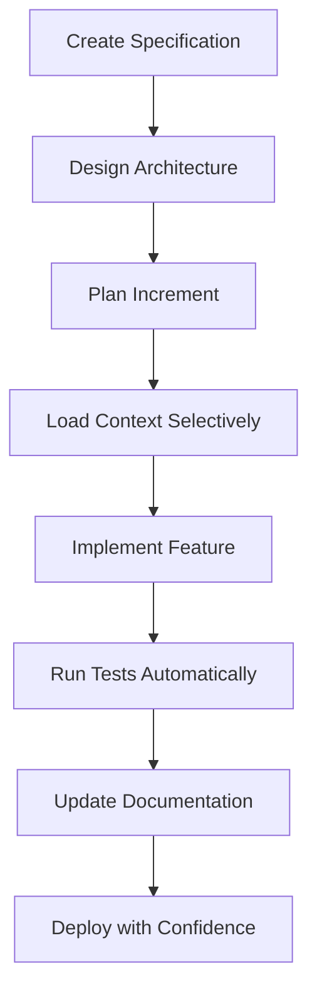

# What is SpecWeave?

**SpecWeave** is a specification-first AI development framework that transforms how you build production software. Instead of "vibe coding" where implementation leads and documentation follows (or never comes), SpecWeave inverts the paradigm: **specifications and documentation are the SOURCE OF TRUTH**, and code is the expression of these specifications.

## The Problem: Vibe Coding

Traditional AI-assisted development often looks like this:

1. Tell AI: "Build me a feature"
2. AI generates code
3. Test it manually
4. Fix bugs as they appear
5. (Maybe) document it later
6. Repeat for next feature

**Problems**:
- No documentation = regression risk
- No specs = unclear requirements
- Manual testing = inconsistent quality
- Context bloat = expensive AI costs
- No architecture = technical debt

## The SpecWeave Solution

SpecWeave enforces a **Spec-Driven Development** workflow:



### Key Principles

1. **Specification Before Implementation** - Define WHAT and WHY before HOW
2. **Living Documentation** - Specs evolve with code, never diverge
3. **Context Precision** - Load only what's needed (70%+ token reduction)
4. **Test-Validated Features** - Every feature proven through automated tests
5. **Regression Prevention** - Document existing code before modification
6. **Framework Agnostic** - Works with ANY tech stack ([TypeScript](/docs/glossary/terms/typescript), Python, Go, Rust, Java, etc.)

## How It Works

### 1. Documentation-First

Create comprehensive specifications in `.specweave/docs/internal/strategy/`:

```markdown
## User Story: US1-001 - User Login

**As a** user
**I want to** log in with email and password
**So that** I can access my account

**Acceptance Criteria** (Test Cases):
- [ ] **TC-0001**: Valid credentials → redirect to dashboard
- [ ] **TC-0002**: Invalid password → error message shown
```

### 2. Architecture Design

Design technical architecture in `.specweave/docs/internal/architecture/`:

- System design (C4 diagrams)
- Architecture Decision Records (ADRs)
- Component diagrams
- Data models

### 3. Incremental Implementation

Plan work in auto-numbered increments:

```
.specweave/increments/
├── 0001-user-authentication/
│   ├── spec.md              # What and Why
│   ├── plan.md              # How
│   ├── tasks.md             # Checklist
│                            # Tests embedded in tasks.md (v0.7.0+)
└── 0002-payment-processing/
    └── ...
```

### 4. Context-Aware Execution

Load only relevant specifications via context manifests (70%+ token reduction):

```yaml
# context-manifest.yaml
spec_sections:
  - .specweave/docs/internal/strategy/auth/login-spec.md
documentation:
  - .specweave/docs/internal/architecture/adr/0001-auth-method.md
```

### 5. Automated Testing

Four levels of testing with full traceability:

1. **Specification Acceptance Criteria** (TC-0001 format)
2. **Feature Test Strategy** (maps TC-0001 to implementations)
3. **Skill Test Cases** (YAML-based validation)
4. **Code Tests** ([E2E](/docs/glossary/terms/e2e), integration, unit)

## Who Should Use SpecWeave?

### Perfect For

✅ **Enterprise teams** building production systems
✅ **Startups** needing scalable architecture from day one
✅ **Solo developers** building complex applications
✅ **Regulated industries** (healthcare, finance, government)
✅ **Teams migrating [brownfield](/docs/glossary/terms/brownfield) codebases** to modern practices

### Use Cases

- **[Greenfield](/docs/glossary/terms/greenfield) projects**: Start with comprehensive specs (500-600+ pages for enterprise)
- **[Brownfield](/docs/glossary/terms/brownfield) projects**: Document existing code before modification
- **Iterative development**: Build documentation gradually (like Microsoft)
- **Compliance-heavy**: Maintain audit trails and traceability

## Core Features

- **Framework-agnostic**: Works with [TypeScript](/docs/glossary/terms/typescript), Python, Go, Rust, Java, C#, etc.
- **AI-powered agents**: PM, Architect, DevOps, QA, Security specialists
- **Context precision**: 70%+ token reduction vs loading full specs
- **Auto-role routing**: Skills detect expertise automatically
- **Living documentation**: Auto-update via Claude hooks
- **Mermaid diagrams**: C4 Model architecture diagrams
- **External integrations**: JIRA, Azure DevOps, GitHub sync
- **Regression prevention**: Document before modifying existing code

## Getting Started

Ready to build production software the right way?

- [Quickstart Guide](/docs/guides/getting-started/quickstart) - Get up and running in 5 minutes
- [Installation](/docs/guides/getting-started/installation) - Detailed installation instructions
- [Core Concepts](/docs/guides/core-concepts/specifications) - Understand the fundamentals

## Philosophy

Learn more about the principles behind SpecWeave:

- [Philosophy](/docs/overview/philosophy) - Core principles and design decisions
- [Documentation Approaches](/docs/guides/core-concepts/specifications) - Comprehensive vs Incremental

---

**Next**: [Key Features](/docs/overview/features) →
