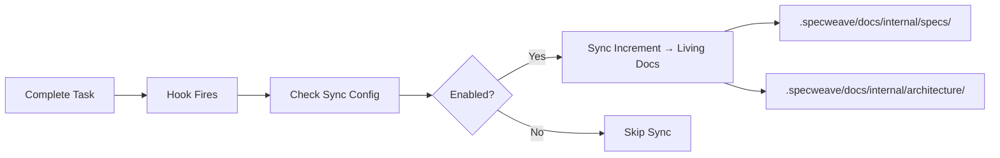

# Living Docs (Living Documentation)

**Category**: SpecWeave Core

## Definition

**Living Docs** (Living Documentation) is SpecWeave's automatic documentation synchronization system that ensures documentation never becomes stale. After every task completion, living docs automatically sync from increment specs to the permanent knowledge base in `.specweave/docs/internal/`.

**Key Principle**: Documentation = Code. They evolve together, automatically, with zero manual intervention.

## What Problem Does It Solve?

**The Traditional Documentation Problem**:
- ❌ Docs written once, never updated ("Documentation is always out of date")
- ❌ Code changes, docs don't ("It works differently now")
- ❌ Manual sync (too much effort, never happens)
- ❌ Tribal knowledge ("Just ask Sarah, she knows")

**Living Docs Solution**:
- ✅ Automatic sync after every task completion (hooks-based)
- ✅ Documentation tracks code changes (always current)
- ✅ Zero manual effort (post-task-completion hook handles it)
- ✅ Complete audit trail (know what was built and when)

## How It Works



**Workflow**:
1. **Task Completion**: Developer marks task complete via `TodoWrite`
2. **Hook Fires**: `post-task-completion.sh` triggers automatically
3. **Sync Check**: Reads `.specweave/config.json` for sync settings
4. **Auto-Sync**: If enabled, syncs:
   - `spec.md` → `.specweave/docs/internal/specs/spec-NNN-feature.md`
   - `plan.md` → `.specweave/docs/internal/architecture/hld-NNN-feature.md`
   - `tasks.md` → Task completion status updates
5. **External Sync**: Optionally syncs to GitHub/Jira/ADO

## Configuration

**Location**: `.specweave/config.json`

```json
{
  "hooks": {
    "post_task_completion": {
      "sync_living_docs": true,         // ✅ MUST be true!
      "sync_tasks_md": true,            // Updates tasks.md status
      "external_tracker_sync": true     // Syncs to GitHub/Jira/ADO
    }
  }
}
```

**Settings**:
- `sync_living_docs`: Auto-sync increment specs to living docs (default: true)
- `sync_tasks_md`: Update tasks.md with completion status (default: true)
- `external_tracker_sync`: Sync to external issue trackers (default: false)

## Living Docs Structure

```
.specweave/docs/internal/
├── strategy/                    # Business rationale (Why?)
│   ├── prd-001-user-auth.md     # Product requirements
│   └── okr-2025-q1.md           # Quarterly objectives
│
├── specs/                       # Living specs (What?)
│   ├── spec-001-user-auth.md    # ✅ Synced from 0001, 0002, 0003
│   └── spec-002-payments.md     # ✅ Synced from 0004, 0005
│
├── architecture/                # Technical design (How?)
│   ├── hld-system.md            # High-level design
│   ├── adr/                     # Architecture decisions
│   │   ├── 0001-database.md     # Why PostgreSQL?
│   │   └── 0002-auth-jwt.md     # Why JWT over sessions?
│   └── diagrams/                # Visual architecture
│       └── c4-system.mmd        # C4 model diagrams
│
├── delivery/                    # Build & release (How we build)
│   ├── branch-strategy.md       # Git workflow
│   └── dora-metrics.md          # Deployment frequency, lead time
│
├── operations/                  # Production ops (How we run)
│   ├── runbook-api.md           # Operational procedures
│   └── incident-001.md          # Postmortem reports
│
└── governance/                  # Policies (Guardrails)
    ├── security-policy.md       # Security requirements
    └── coding-standards.md      # Code style, conventions
```

## Real-World Example

**Scenario**: Building user authentication across 3 increments

```bash
# Increment 0001: Basic Login
/specweave:increment "User authentication MVP"
# Creates: .specweave/increments/0001-user-auth-mvp/spec.md

# Implement tasks
/specweave:do
# Task T-001 complete → Hook fires automatically
# Syncs: spec.md → .specweave/docs/internal/specs/spec-001-user-auth.md

# Increment 0002: Password Reset
/specweave:increment "Password reset flow"
# Creates: .specweave/increments/0002-password-reset/spec.md
# References: SPEC-001 (same living doc)

/specweave:do
# Task T-001 complete → Hook fires automatically
# Updates: SPEC-001 with password reset user stories

# Increment 0003: Social Login
/specweave:increment "Social login (Google, GitHub)"
# Creates: .specweave/increments/0003-social-login/spec.md
# References: SPEC-001 (same living doc)

/specweave:do
# Task T-001 complete → Hook fires automatically
# Updates: SPEC-001 with social login user stories

# Result:
# - 3 increments completed
# - 1 living docs spec (SPEC-001) with COMPLETE history
# - All user stories from all 3 increments
# - No manual sync required!
```

**Living Docs Spec After 3 Increments**:

```markdown
File: .specweave/docs/internal/specs/spec-001-user-authentication.md

# SPEC-001: User Authentication System
Complete authentication solution with social login, 2FA, session management

## Increments (Implementation History)
- 0001-user-auth-mvp: Basic login/logout (Complete ✅)
- 0002-password-reset: Password reset flow (Complete ✅)
- 0003-social-login: Google/GitHub OAuth (Complete ✅)

## User Stories
### US-001: Basic Login Flow (0001) ✅
[Implementation details synced from 0001]

### US-002: Password Reset (0002) ✅
[Implementation details synced from 0002]

### US-003: Social Login (0003) ✅
[Implementation details synced from 0003]

[... Complete history of all 3 increments]
```

## Benefits

### 1. **Always Current**
- ✅ Docs sync after every task (real-time updates)
- ✅ No stale documentation
- ✅ Code and docs evolve together

### 2. **Zero Manual Effort**
- ✅ Automatic sync (hooks-based)
- ✅ No "remember to update docs" guilt
- ✅ Developers focus on code, framework handles docs

### 3. **Complete Audit Trail**
- ✅ Know what was built and when
- ✅ Implementation history per increment
- ✅ Compliance & regulatory requirements (FDA, SOC 2, HIPAA)

### 4. **Easy Onboarding**
- ✅ New developers read living docs
- ✅ Complete project history
- ✅ No "tribal knowledge" bottlenecks

### 5. **Enterprise-Ready**
- ✅ Regulatory compliance (audit trails)
- ✅ Knowledge preservation (no "Sarah knows" syndrome)
- ✅ Multi-team coordination (shared specs)

## Manual Sync (When Automatic Sync Disabled)

```bash
# Sync all completed increments to living docs
/specweave:sync-docs update

# Or copy manually (emergency only)
cp .specweave/increments/0001-user-auth-mvp/spec.md \
   .specweave/docs/internal/specs/spec-001-user-auth.md
```

## Verify Sync

```bash
# Check all synced specs
ls -1 .specweave/docs/internal/specs/spec-*.md

# Should match number of completed increments
ls -1 .specweave/increments/ | grep -E '^[0-9]{4}' | wc -l
```

## Hook Implementation

**File**: `plugins/specweave/hooks/post-task-completion.sh`

```bash
#!/bin/bash
# Fires after every TodoWrite tool use (Claude Code native)

# 1. Check if sync enabled
if [ "$(cat .specweave/config.json | jq -r '.hooks.post_task_completion.sync_living_docs')" = "true" ]; then
  # 2. Run sync utility
  node dist/hooks/lib/sync-living-docs.js

  # 3. Update tasks.md with completion status
  if [ "$(cat .specweave/config.json | jq -r '.hooks.post_task_completion.sync_tasks_md')" = "true" ]; then
    node dist/hooks/lib/sync-tasks-md.js
  fi

  # 4. External tracker sync (GitHub/Jira/ADO)
  if [ "$(cat .specweave/config.json | jq -r '.hooks.post_task_completion.external_tracker_sync')" = "true" ]; then
    node dist/hooks/lib/external-sync.js
  fi
fi
```

## Best Practices

### 1. **Enable Automatic Sync**
- ✅ Set `sync_living_docs: true` in config
- ✅ Let hooks handle sync (zero manual effort)
- ❌ Don't disable sync (docs become stale)

### 2. **Review Synced Docs**
- ✅ Periodically check living docs for accuracy
- ✅ Ensure increment history is complete
- ❌ Don't assume sync is perfect (review quarterly)

### 3. **Use Descriptive Names**
- ✅ Clear increment names (0001-user-auth-mvp)
- ✅ Clear spec names (spec-001-user-authentication.md)
- ❌ Avoid generic names (0001, increment-1)

### 4. **Link to External Tools**
- ✅ Add GitHub Project links to living docs
- ✅ Add Jira Epic links to living docs
- ✅ Keep external tools in sync (via external_tracker_sync)

## Common Pitfalls

### ❌ Disabling Automatic Sync
**Problem**: Documentation becomes stale immediately

**Solution**: Keep `sync_living_docs: true` unless you have a specific reason

### ❌ Editing Living Docs Directly
**Problem**: Changes get overwritten by next sync

**Solution**: Edit increment specs, let sync propagate changes

### ❌ Deleting Increment Folders
**Problem**: Lose implementation history

**Solution**: Keep increment folders, or ensure living docs are synced first

## Related Terms

- [SpecWeave](./specweave.md) - The framework
- [Increment](./increment.md) - Unit of work
- [Spec](./spec.md) - Specification document
- [Hook](./hook.md) - Lifecycle automation
- [Post-Task-Completion Hook](./post-task-completion-hook.md) - Specific hook

## Learn More

- [Living Documentation Guide](/docs/guides/core-concepts/living-documentation)
- [Hooks Documentation](/docs/workflows/implementation#hooks-and-automation)
- [Configuration Reference](/docs/api/configuration)
