# TDD (Test-Driven Development)

**Category**: Testing & Quality

## Definition

**TDD** (Test-Driven Development) is a development methodology where you write tests **before** writing implementation code. TDD follows the **red-green-refactor** cycle to ensure code is tested from the start.

**Cycle**: Red (failing test) → Green (minimal code to pass) → Refactor (improve while keeping tests green)

## What Problem Does It Solve?

**The Traditional Development Problem**:
- ❌ Code written first, tests added later (if at all)
- ❌ Untestable code (not designed for testing)
- ❌ Low test coverage (tests treated as afterthought)
- ❌ Bugs discovered late (during QA or production)

**TDD Solution**:
- ✅ Tests written first (code is testable by design)
- ✅ 100% test coverage (every line tested)
- ✅ Better design (testing forces good architecture)
- ✅ Bugs discovered immediately (test fails = immediate feedback)

## Red-Green-Refactor Cycle

```mermaid
graph LR
    A[🔴 RED<br/>Write Failing Test] --> B[🟢 GREEN<br/>Write Minimal Code]
    B --> C[🔵 REFACTOR<br/>Improve Code]
    C --> A
```



### 1. **RED**: Write a Failing Test

Write a test for functionality that doesn't exist yet. Test must fail!

```typescript
// Step 1: RED - Write failing test
it('should return JWT token when given valid credentials', async () => {
  // Given
  const email = 'user@example.com';
  const password = 'Password123!';

  // When
  const result = await authService.login(email, password);

  // Then
  expect(result.accessToken).toBeDefined();
  expect(result.refreshToken).toBeDefined();
});

// Run test: ❌ FAILS (authService.login doesn't exist yet)
```

### 2. **GREEN**: Write Minimal Code to Pass

Implement just enough code to make the test pass. Don't over-engineer!

```typescript
// Step 2: GREEN - Write minimal implementation
export class AuthService {
  async login(email: string, password: string) {
    // Minimal code to pass test
    return {
      accessToken: 'fake-access-token',
      refreshToken: 'fake-refresh-token'
    };
  }
}

// Run test: ✅ PASSES (but implementation is fake)
```

### 3. **REFACTOR**: Improve Code Quality

Now improve the implementation while keeping tests green.

```typescript
// Step 3: REFACTOR - Real implementation
export class AuthService {
  async login(email: string, password: string) {
    // Validate input
    if (!email || !password) {
      throw new Error('Email and password required');
    }

    // Find user
    const user = await this.userRepo.findByEmail(email);
    if (!user) {
      throw new Error('Invalid credentials');
    }

    // Verify password
    const isValid = await bcrypt.compare(password, user.passwordHash);
    if (!isValid) {
      throw new Error('Invalid credentials');
    }

    // Generate tokens
    const accessToken = jwt.sign({ userId: user.id }, SECRET, { expiresIn: '15m' });
    const refreshToken = jwt.sign({ userId: user.id }, REFRESH_SECRET, { expiresIn: '7d' });

    return { accessToken, refreshToken };
  }
}

// Run test: ✅ STILL PASSES (real implementation works)
```

## TDD in SpecWeave

### In tasks.md

```yaml
---
increment: 0008-user-authentication
total_tasks: 5
test_mode: TDD           # ← Enables TDD workflow
coverage_target: 90%
---
```

**When `test_mode: TDD`**:
- Write tests FIRST (before implementation)
- Follow red-green-refactor cycle strictly
- Aim for 90%+ coverage

### Workflow

```bash
# Task T-001: Authentication Service (TDD mode)

# 1. RED - Write failing test
vim tests/unit/services/auth.test.ts
npm test  # ❌ Fails (expected)

# 2. GREEN - Minimal implementation
vim src/services/auth/AuthService.ts
npm test  # ✅ Passes

# 3. REFACTOR - Improve code
vim src/services/auth/AuthService.ts
npm test  # ✅ Still passes

# 4. Repeat for next feature
```

## Real-World Example

**Feature**: Password validation

### RED: Write Failing Test

```typescript
describe('PasswordValidator', () => {
  it('should accept password with 8+ chars, uppercase, lowercase, number, special', () => {
    const validator = new PasswordValidator();
    const result = validator.validate('ValidPass123!');
    expect(result.valid).toBe(true);
  });

  it('should reject password shorter than 8 chars', () => {
    const validator = new PasswordValidator();
    const result = validator.validate('Short1!');
    expect(result.valid).toBe(false);
    expect(result.errors).toContain('Password must be at least 8 characters');
  });

  it('should reject password without uppercase letter', () => {
    const validator = new PasswordValidator();
    const result = validator.validate('lowercase123!');
    expect(result.valid).toBe(false);
    expect(result.errors).toContain('Password must contain uppercase letter');
  });
});

// Run: ❌ FAILS (PasswordValidator doesn't exist)
```

### GREEN: Minimal Implementation

```typescript
export class PasswordValidator {
  validate(password: string) {
    const errors: string[] = [];

    if (password.length < 8) {
      errors.push('Password must be at least 8 characters');
    }

    if (!/[A-Z]/.test(password)) {
      errors.push('Password must contain uppercase letter');
    }

    if (!/[a-z]/.test(password)) {
      errors.push('Password must contain lowercase letter');
    }

    if (!/[0-9]/.test(password)) {
      errors.push('Password must contain number');
    }

    if (!/[!@#$%^&*]/.test(password)) {
      errors.push('Password must contain special character');
    }

    return {
      valid: errors.length === 0,
      errors
    };
  }
}

// Run: ✅ PASSES
```

### REFACTOR: Improve Design

```typescript
export class PasswordValidator {
  private readonly MIN_LENGTH = 8;
  private readonly RULES = [
    { regex: /[A-Z]/, error: 'Password must contain uppercase letter' },
    { regex: /[a-z]/, error: 'Password must contain lowercase letter' },
    { regex: /[0-9]/, error: 'Password must contain number' },
    { regex: /[!@#$%^&*]/, error: 'Password must contain special character' }
  ];

  validate(password: string) {
    const errors: string[] = [];

    // Check length
    if (password.length < this.MIN_LENGTH) {
      errors.push(`Password must be at least ${this.MIN_LENGTH} characters`);
    }

    // Check each rule
    for (const rule of this.RULES) {
      if (!rule.regex.test(password)) {
        errors.push(rule.error);
      }
    }

    return {
      valid: errors.length === 0,
      errors
    };
  }
}

// Run: ✅ STILL PASSES (improved design)
```

## Benefits of TDD

### 1. **Better Design**
Tests force you to think about API before implementation

```typescript
// TDD forces good design
class AuthService {
  async login(email, password) { ... }  // Simple, testable
}

// Without TDD
class AuthService {
  async doLoginStuffWithEmailAndPasswordAndMaybeThrowErrors(email, password, req, res, next) { ... }
  // Complex, hard to test
}
```

### 2. **Faster Debugging**
Tests fail immediately when code breaks

```typescript
// Change breaks test immediately
it('should return JWT token', () => {
  const result = authService.login(email, password);
  expect(result.accessToken).toBeDefined();  // ❌ Fails immediately
});
```

### 3. **Refactoring Confidence**
Can improve code without breaking behavior

```bash
# Before refactoring
npm test  # ✅ All tests pass

# Refactor code (improve structure)
vim src/services/auth/AuthService.ts

# After refactoring
npm test  # ✅ Still pass = refactoring safe!
```

### 4. **Documentation**
Tests document how code should be used

```typescript
// Tests serve as examples
it('should return JWT token when given valid credentials', () => {
  // Shows how to use authService.login()
  const result = await authService.login('user@example.com', 'Password123!');
  expect(result.accessToken).toBeDefined();
});
```

## TDD vs BDD

| Aspect | TDD | BDD |
|--------|-----|-----|
| **Level** | Unit tests | Integration/E2E tests |
| **Focus** | Code correctness | Business behavior |
| **Format** | Assertions | Given/When/Then |
| **Language** | Technical | Plain English |
| **Audience** | Developers | Developers + stakeholders |

**Can Use Both**:
- BDD for user-facing scenarios (integration/E2E)
- TDD for implementation details (unit tests)

## Best Practices

### 1. **Write Smallest Possible Test**
```typescript
✅ CORRECT:
it('should return true for valid email', () => {
  expect(isValidEmail('user@example.com')).toBe(true);
});

❌ WRONG:
it('should handle all email scenarios', () => {
  // Testing 20 different cases in one test
});
```

### 2. **One Assert Per Test** (Ideally)
```typescript
✅ CORRECT:
it('should return JWT token', () => {
  expect(result.accessToken).toBeDefined();
});

it('should return refresh token', () => {
  expect(result.refreshToken).toBeDefined();
});

🟡 ACCEPTABLE (related asserts):
it('should return both tokens', () => {
  expect(result.accessToken).toBeDefined();
  expect(result.refreshToken).toBeDefined();
});
```

### 3. **Don't Skip RED Step**
```bash
❌ WRONG:
# Write test
# Write implementation immediately
# Test passes on first run
# ⚠️  How do you know test is correct if it never failed?

✅ CORRECT:
# Write test
# Run test → ❌ FAILS (verifies test is correct)
# Write implementation
# Run test → ✅ PASSES
```

### 4. **Refactor Only When Green**
```bash
✅ CORRECT:
Tests passing → Refactor → Tests still passing

❌ WRONG:
Tests failing → Refactor → Still failing → Now what?
```

## Common TDD Patterns

### Test-First for New Features
```bash
# New feature: Email verification
# 1. Write test for send verification email
npm test  # ❌ Fails
# 2. Implement send verification email
npm test  # ✅ Passes
# 3. Write test for verify email token
npm test  # ❌ Fails
# 4. Implement verify email token
npm test  # ✅ Passes
```

### Bug Fix with TDD
```bash
# Bug reported: Password reset link doesn't expire
# 1. Write test that reproduces bug
it('should reject expired reset link', () => {
  const expiredToken = createExpiredToken();
  expect(validateToken(expiredToken)).toBe(false);
});
npm test  # ❌ Fails (reproduces bug)

# 2. Fix implementation
vim src/services/auth/token-validator.ts
npm test  # ✅ Passes (bug fixed)
```

## TDD Commands in SpecWeave

```bash
# Start TDD workflow
/specweave:tdd-cycle 0008

# Execute TDD red phase (write failing tests)
/specweave:tdd-red

# Execute TDD green phase (implement to pass)
/specweave:tdd-green

# Execute TDD refactor phase (improve code)
/specweave:tdd-refactor
```

## Related Terms

- [BDD](./bdd.md) - Behavior-Driven Development
- [Unit Testing](./unit-testing.md) - Testing individual components
- [Tasks.md](./tasks-md.md) - Task file with test plans
- [Test Coverage](./test-coverage.md) - Code coverage metrics

## Learn More

- [TDD Workflow](/docs/workflows/implementation#tdd-workflow)
- [Test-Driven Development Guide](https://martinfowler.com/bliki/TestDrivenDevelopment.html)
- [Kent Beck - TDD by Example](https://www.amazon.com/Test-Driven-Development-Kent-Beck/dp/0321146530)
