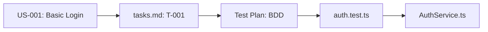

# User Story

**Category**: SpecWeave Core

## Definition

A **user story** is a user-facing requirement written from the end-user's perspective. It describes **who** wants a feature, **what** they want, and **why** they want it.

**Format**: "As a [user role], I want to [action], so that [benefit]"

**Example**: "As a user, I want to reset my password, so that I can regain access to my account"

## What Problem Does It Solve?

**The Traditional Requirements Problem**:
- ❌ Technical jargon (developers understand, users don't)
- ❌ Missing the "why" (just describes what to build)
- ❌ No user perspective (feature-driven, not user-driven)
- ❌ Hard to prioritize (which features matter most?)

**User Story Solution**:
- ✅ Written in plain language (anyone can understand)
- ✅ Includes the "why" (business value clear)
- ✅ User-centric (focuses on user needs)
- ✅ Easy to prioritize (P1/P2/P3 based on user impact)

## Structure in SpecWeave

**Format**:
```markdown
### US-001: [Story Title]
**Priority**: P1 (Critical) | P2 (High) | P3 (Medium) | P4 (Low)
**Status**: Complete ✅ | In Progress ⏳ | Planned 📋

**User Story**:
As a [user role],
I want to [action],
So that [benefit].

**Acceptance Criteria**:
- [ ] **AC-US1-01**: Specific, measurable criterion (P1, testable)
- [ ] **AC-US1-02**: Another criterion (P1, testable)
- [ ] **AC-US1-03**: Edge case handling (P2, testable)

**Implemented In**: 0001-increment-name
```

## Real-World Example

**Feature**: User Authentication System

```markdown
### US-001: Basic Login Flow
**Priority**: P1 (Critical)
**Status**: Complete ✅

**User Story**:
As a registered user,
I want to log in with my email and password,
So that I can access my account securely.

**Acceptance Criteria**:
- [ ] **AC-US1-01**: User can log in with valid email/password (P1, testable)
- [ ] **AC-US1-02**: Invalid credentials show error "Invalid credentials" (P1, testable)
- [ ] **AC-US1-03**: 5 failed attempts lock account for 15min (P2, testable)
- [ ] **AC-US1-04**: Successful login redirects to dashboard (P1, testable)

**Implemented In**: 0001-user-auth-mvp

---

### US-002: Password Reset
**Priority**: P1 (Critical)
**Status**: Complete ✅

**User Story**:
As a user who forgot their password,
I want to reset my password via email,
So that I can regain access to my account.

**Acceptance Criteria**:
- [ ] **AC-US2-01**: User can request password reset email (P1, testable)
- [ ] **AC-US2-02**: Reset link expires after 1 hour (P1, testable)
- [ ] **AC-US2-03**: Reset link can only be used once (P2, testable)
- [ ] **AC-US2-04**: Password must meet complexity requirements (P1, testable)

**Implemented In**: 0002-password-reset

---

### US-003: Social Login
**Priority**: P2 (High)
**Status**: Planned 📋

**User Story**:
As a new user,
I want to sign in with Google or GitHub,
So that I can quickly create an account without remembering another password.

**Acceptance Criteria**:
- [ ] **AC-US3-01**: User can sign in with Google (P1, testable)
- [ ] **AC-US3-02**: User can sign in with GitHub (P2, testable)
- [ ] **AC-US3-03**: First-time OAuth users create account automatically (P1, testable)
- [ ] **AC-US3-04**: Existing users can link OAuth accounts (P2, testable)

**Implemented In**: 0003-social-login (planned)
```

## INVEST Criteria

Good user stories follow **INVEST**:

- **I**ndependent: Can be implemented separately
- **N**egotiable: Details can be refined
- **V**aluable: Delivers value to users
- **E**stimable: Team can estimate effort
- **S**mall: Can be completed in one increment
- **T**estable: Has clear acceptance criteria

**Example**:
```markdown
✅ GOOD (INVEST compliant):
US-001: User can log in with email/password
- Independent: Doesn't depend on other stories
- Negotiable: Can discuss password requirements
- Valuable: Users need to access their account
- Estimable: ~8 hours
- Small: Fits in one sprint
- Testable: Clear success criteria (valid login works)

❌ BAD (violates INVEST):
US-001: Build entire authentication system
- Not small: Too large (weeks of work)
- Not independent: Multiple interdependent pieces
- Hard to estimate: Too many unknowns
```

## Priority Levels

**P1 (Critical)**: Must have, blocks release
- Example: User can log in (core functionality)

**P2 (High)**: Should have, high impact
- Example: Password reset (important but not blocking)

**P3 (Medium)**: Nice to have, low impact
- Example: Remember me checkbox (convenience)

**P4 (Low)**: Can defer to later
- Example: Custom avatar upload (low priority)

## Numbering Convention

**Format**: `US-{number}`

**Examples**:
- `US-001` - First user story
- `US-002` - Second user story
- `US-010` - Tenth user story

**Relationship to AC-IDs**:
```
US-001: Basic Login Flow
├── AC-US1-01: Valid login works
├── AC-US1-02: Invalid credentials show error
└── AC-US1-03: Rate limiting after 5 attempts

US-002: Password Reset
├── AC-US2-01: Request reset email
├── AC-US2-02: Reset link expires 1 hour
└── AC-US2-03: Reset link single-use only
```

## Traceability

**User Story → Tasks → Tests → Code**:



**Example**:
```markdown
# spec.md
US-001: User can log in
  AC-US1-01: Valid login works

# tasks.md
T-001: Implement Authentication Service
  AC: AC-US1-01
  Test Plan: Given valid credentials → When login → Then success

# auth.test.ts
it('should allow login with valid credentials (AC-US1-01)', ...)

# AuthService.ts
async login(email, password) { ... }
```

## Best Practices

### 1. **Write from User Perspective**
```markdown
✅ CORRECT:
As a user, I want to reset my password, so that I can regain access

❌ WRONG:
As a developer, I want to implement password reset API endpoint
(Developer perspective, not user perspective)
```

### 2. **Include the "Why" (Benefit)**
```markdown
✅ CORRECT:
I want to reset my password, so that I can regain access to my account
(Clear benefit: regain access)

❌ WRONG:
I want to reset my password
(No benefit/motivation stated)
```

### 3. **Keep Stories Small**
```markdown
✅ CORRECT:
US-001: User can log in with email/password
US-002: User can reset password
US-003: User can enable 2FA
(Small, focused stories)

❌ WRONG:
US-001: Build entire authentication system
(Too large, not estimable)
```

### 4. **Make Acceptance Criteria Testable**
```markdown
✅ CORRECT:
AC-US1-01: User can log in with valid email/password (testable)
AC-US1-02: Invalid credentials show error "Invalid credentials" (testable)

❌ WRONG:
AC-US1-01: Login works well (vague, not testable)
AC-US1-02: Users will be happy (not measurable)
```

## Common Patterns

### Epic → User Stories
```markdown
Epic: User Authentication
├── US-001: Basic Login Flow
├── US-002: Password Reset
├── US-003: Social Login (Google, GitHub)
├── US-004: Two-Factor Authentication (SMS, TOTP)
└── US-005: Session Management
```

### Story Splitting
```markdown
Large Story: User can manage their profile
↓ Split into smaller stories:
├── US-010: User can view their profile
├── US-011: User can edit profile (name, email)
├── US-012: User can upload avatar
└── US-013: User can change password
```

## Related Terms

- [AC-ID](./ac-id.md) - Acceptance Criteria ID
- [Spec](./spec.md) - Specification document
- [Increment](./increment.md) - Unit of work
- [Tasks.md](./tasks-md.md) - Task file with embedded tests

## Learn More

- [Planning Guide](/docs/workflows/planning)
- [Writing Good User Stories](/docs/guides/best-practices/user-stories)
- [Acceptance Criteria](/docs/guides/core-concepts/acceptance-criteria)
