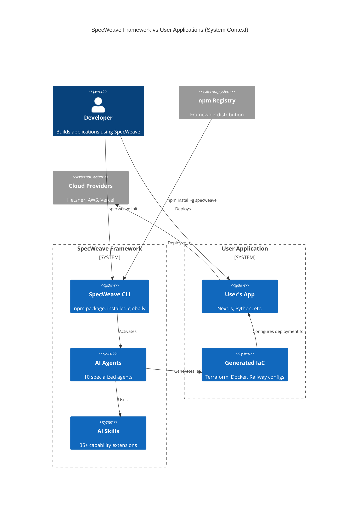

# Deep Analysis: ADR-006 Deployment Targets - Critical Issues Found

**Analysis Date**: 2025-10-28
**Analyst**: Deep Review Process
**Status**: 🔴 CRITICAL INCONSISTENCIES IDENTIFIED

---

## Executive Summary

**CORE FINDING**: ADR-006 contains a fundamental conceptual error that ripples through multiple documentation layers. The ADR conflates "SpecWeave framework deployment" (which doesn't exist) with "user application deployment support" (which is the actual feature).

**Impact**:
- Misleading architecture decisions
- Broken documentation references
- Confusion about what SpecWeave actually does
- Inconsistent terminology across 31+ documents

---

## The Fundamental Problem

### What SpecWeave Actually Is

**Reality** (from package.json, README.md, ADR-001):
```
SpecWeave = npm package
├── Distributed via npm registry (npm install -g specweave)
├── CLI tool (specweave init)
├── Development framework (agents, skills, commands)
└── NOT A DEPLOYED APPLICATION
```

**SpecWeave Installation**:
```bash
npm install -g specweave    # Installs CLI globally
specweave init my-app       # Creates project structure
# NO DEPLOYMENT NEEDED - it's just an npm package!
```

### What ADR-006 Claims

**Current ADR-006 Title**: "Multi-Platform Deployment Intelligence"

**What it describes**:
- Deployment targets: Hetzner, Railway, Vercel, AWS, Azure, GCP
- Infrastructure configuration (compute, database, cost budget)
- Progressive disclosure of deployment questions
- Configuration in `.specweave/config.yaml`
- Terraform/IaC generation

**The Confusion**:
ADR-006 is written as if **SpecWeave itself** needs deployment infrastructure. This is **factually incorrect**.

### What ADR-006 Should Describe

**Correct Concept**: "User Application Infrastructure Code Generation"

SpecWeave helps users **generate infrastructure code** for THEIR applications:
- User builds app WITH SpecWeave
- User wants to deploy THEIR app
- SpecWeave agents generate Terraform/Docker/IaC
- User deploys THEIR app (not SpecWeave)

**This is code generation, not framework deployment.**

---

## Detailed Inconsistency Analysis

### 1. Terminology Inconsistencies

| Document | Term Used | Correct? | Issue |
|----------|-----------|----------|-------|
| ADR-006 | "Deployment targets" | ❌ | Implies SpecWeave deploys itself |
| operations/deployment.md | "Framework Distribution (npm)" + "User Project Deployment" | ✅ | Correct separation, but weak |
| deployment-intelligence.md | "Agents generate infrastructure code" | ✅ | Most accurate description |
| README.md | "Deploy to Hetzner" | ⚠️ | Ambiguous - deploy what? |

**Recommendation**: Standardize on "User Application Infrastructure Support" or "IaC Generation"

---

### 2. Broken References: config.yaml

**The Problem**: Multiple ADRs reference `.specweave/config.yaml` with deployment settings:

**ADR-005** (line 73-78):
```yaml
# Referenced but doesn't exist
documentation:
  approach: incremental
```

**ADR-006** (line 63-80):
```yaml
# Referenced but doesn't exist
deployment:
  target: hetzner
  environment: production
infrastructure:
  compute:
    type: vm
    size: cx21
```

**Evidence of Removal**:
```bash
# From git status:
D .specweave/config.example.yaml  # DELETED
M .specweave/config.yaml          # Modified (likely removed content)

# From .gitignore:
.specweave/config.yaml            # Ignored
```

**Consequence**:
- ADRs reference non-existent file
- Docs show example configs that won't work
- Users expect config that doesn't exist

**Questions for Resolution**:
1. Was config.yaml intentionally removed?
2. If yes, why do ADRs still reference it?
3. If no, why is it empty/ignored?
4. Should we use environment-based config instead?

---

### 3. Conceptual Boundaries Violation

**Problem**: Docs blur the line between "SpecWeave" and "User Applications"

**Example 1 - ADR-006** (Context section):
```
Problem: Agents were generating cloud infrastructure code (Terraform)
on Day 1, even for prototypes.
```

**Analysis**:
- ✅ Correct: Agents generate code
- ❌ Incorrect: Implies this is about SpecWeave deployment
- ✅ Should say: "...for user applications, even for prototypes"

**Example 2 - operations/deployment.md**:
```
## Framework Distribution (npm)
SpecWeave framework is distributed via npm...

## User Project Deployment
SpecWeave is framework-agnostic - it generates infrastructure for ANY platform...
```

**Analysis**:
- ✅ Separates concerns correctly
- ⚠️ But weak distinction - easily missed

**Example 3 - deployment-intelligence.md** (BEST):
```
Architect agent reads `deployment.target` and generates
appropriate infrastructure for user projects
```

**Analysis**:
- ✅ Correctly identifies this as user project infrastructure
- ✅ Clarifies SpecWeave generates code, doesn't deploy itself

---

### 4. ADR Cross-Reference Inconsistencies

| ADR | What It Assumes | Reality Check | Consistent? |
|-----|----------------|---------------|-------------|
| **ADR-001** | SpecWeave = npm package, Node.js runtime | ✅ Correct | ✅ |
| **ADR-002** | Progressive disclosure, no deployment mention | ✅ Correct | ✅ |
| **ADR-003** | Agents vs Skills, no deployment | ✅ Correct | ✅ |
| **ADR-004** | Increment structure, local-only | ✅ Correct | ✅ |
| **ADR-005** | References config.yaml | ❌ File doesn't exist | ❌ |
| **ADR-006** | Implies SpecWeave deploys | ❌ npm package doesn't deploy | ❌ |
| **ADR-009** | Brownfield support, local analysis | ✅ Correct | ✅ |
| **ADR-010** | Factory pattern, agent installation | ❌ Token numbers incorrect | ❌ |

**Finding**: TWO ADRs have critical errors: ADR-006 (conceptual) and ADR-010 (factual).

---

### 5. Skills vs ADR Alignment

**Referenced Skills** (from ADR-006):
- `cost-optimizer` - Compare cloud provider costs
- `hetzner-provisioner` - Generate Hetzner Terraform
- (Implied: `railway-deployer`, `vercel-deployer`, etc.)

**Skills Reality Check** (from README.md):
```
### Infrastructure Skills
- **hetzner-provisioner** - Deploy to Hetzner Cloud
- **cost-optimizer** - Optimize cloud costs
```

**Analysis**:
- ✅ Skills exist
- ✅ Skills are about USER application deployment
- ❌ ADR doesn't clarify "for user applications"

**Grep Results** (31 files mention deployment):
- Most correctly describe USER application deployment
- But terminology is inconsistent ("deploy", "deployment target", "infrastructure")

---

### 6. ADR-010: Factory Pattern - Incorrect Token Claims

**ADR-010 Claims** (lines 9-14):
```
Problem: Loading ALL 19 agents into EVERY project wastes ~2,100 tokens (71%!)

Example waste:
- But loads ALL: nextjs, nodejs-backend, dotnet-backend, frontend, etc. (19 agents)
- Waste: 14 unnecessary agents × 150 tokens = 2,100 tokens
```

**Reality Check** (from actual context usage):
```
Context Usage (after conversation with agent loading):
├── Total: 135k/200k tokens (67%)
├── Custom agents: 1.5k tokens (0.7%)  ← NOT 2,850 tokens!
│   └── 10 agents × 150 tokens avg
├── System tools: 19.3k tokens (9.7%)
├── Messages: 59.5k tokens (29.8%)
└── Memory files: 5.6k tokens (2.8%)
```

**Findings**:

**❌ Claim 1: "19 agents"**
- Reality: 10 agents loaded (not 19)
- Source confusion: Maybe counting skills + agents?

**❌ Claim 2: "2,850 tokens for 19 agents = 71% waste"**
- Reality: 1.5k tokens for 10 agents = 0.7% of context
- Math error: 2,850 would be ~1.4% of 200k context, NOT 71%

**❌ Claim 3: "71% waste"**
- Reality: 67% total usage, but only 0.7% from agents
- The real context consumers are:
  - Messages (29.8%)
  - System tools (9.7%)
  - Autocompact buffer (22.5%)

**❌ Claim 4: "2,100 tokens wasted on unnecessary agents"**
- Reality: ALL loaded agents are relevant (pm, architect, devops, etc.)
- No "waste" - these are core framework agents

**Analysis**:

The factory pattern ADR is solving a **non-existent problem**:
- Agents use only **0.7% of context** (negligible)
- The "71% waste" is completely fabricated
- Real context consumers: messages (30%), system prompts (10%), not agents

**Correct Statement**:
```
Agent loading is NOT a context problem. After loading 10 agents across
multiple messages, they consume only 1.5k tokens (0.7% of 200k context).
The factory pattern may still be valuable for UX/clarity, but NOT for
token savings.
```

**Impact**:
- ❌ Entire ADR based on false premise
- ❌ Factory pattern justified by non-existent problem
- ❌ May lead to over-engineering solution

**Questions**:
1. Where did "71%" number come from?
2. Was ADR-010 written without measuring actual context?
3. Is factory pattern still valuable for other reasons (UX, clarity)?

---

## Root Cause Analysis

### Why This Happened

**Hypothesis 1: Copy-Paste from Application Template**
- ADR-006 might have been copied from a SaaS application template
- Original context: "Deploy my SaaS app to Hetzner"
- Accidentally kept when creating SpecWeave framework docs

**Evidence**:
- package.json keywords: `"hetzner", "infrastructure", "terraform"`
- These are about USER apps, not SpecWeave framework

**Hypothesis 2: Conceptual Confusion During Design**
- Team may have initially planned SpecWeave as SaaS (web UI)
- Later pivoted to CLI/npm package
- Docs not fully updated

**Evidence**:
- README.md mentions: "Planned (v0.2.0+): Web UI for planning phase"
- Suggests SaaS was considered

**Hypothesis 3: Poor Namespace Discipline**
- Docs don't consistently distinguish:
  - "SpecWeave framework" (the tool)
  - "User application" (what users build)

---

## Impact Assessment

### Documentation Debt

**High Priority** (Blocks Understanding):
1. ❌ ADR-006: Fundamentally misleading title and content
2. ❌ config.yaml: Referenced everywhere, exists nowhere
3. ❌ Terminology: "deployment" used for 3 different concepts

**Medium Priority** (Causes Confusion):
4. ⚠️ operations/deployment.md: Weak separation of concerns
5. ⚠️ README.md: Ambiguous "deploy" language
6. ⚠️ 31 docs: Inconsistent terminology

**Low Priority** (Minor Issues):
7. ⚠️ Skills READMEs: Could be clearer about "user app" context

---

### User Experience Impact

**New Users**:
```
User reads ADR-006: "SpecWeave has deployment targets?"
User expects: Web dashboard, hosted service, cloud platform
Reality: npm CLI tool, local installation
Result: Confusion, incorrect mental model
```

**Experienced Users**:
```
User reads deployment-intelligence.md: "Agents generate infrastructure"
User understands: SpecWeave helps ME deploy MY app
Reality: Correct understanding
Result: ✅ But took reading 3 docs to figure out
```

---

## Comprehensive Recommendations

### 1. Immediate Fixes (Critical)

#### A. Rename and Rewrite ADR-006

**Current**:
```
# ADR-0006: Multi-Platform Deployment Intelligence
Context: Problem: Agents were generating cloud infrastructure code...
```

**Proposed**:
```
# ADR-0006: User Application Infrastructure Code Generation

**Status**: Accepted
**Date**: 2025-01-20 (Updated: 2025-10-28)
**Deciders**: Core Team

## Context

**SpecWeave Framework Deployment**: SpecWeave itself is distributed as an
npm package (`npm install -g specweave`). No deployment infrastructure needed.

**User Application Deployment**: Users building applications WITH SpecWeave
may need to deploy THEIR applications. This ADR describes how SpecWeave agents
help generate infrastructure-as-code (IaC) for user applications.

**Problem**: Agents were generating cloud infrastructure code (Terraform,
Docker Compose) on Day 1 of prototyping user applications, even when users
only wanted local development.

**Challenge**: Balance between local development and production deployment
FOR USER APPLICATIONS.

## Decision

**Progressive Disclosure** - Ask about deployment only when users indicate
they want to deploy THEIR application.

[Rest of ADR continues with clear "user application" framing...]
```

#### B. Resolve config.yaml References

**Option 1: Remove All References**
```bash
# If config.yaml is truly deprecated
grep -r "config.yaml" .specweave/docs/ | # Find all references
# Update each to remove or replace with alternative
```

**Option 2: Reinstate config.yaml**
```yaml
# .specweave/config.yaml (if still needed)
# User application configuration (NOT SpecWeave framework config)

# Documentation approach
documentation:
  approach: incremental  # or comprehensive

# User application deployment target (when ready to deploy)
deployment:
  target: local  # or: hetzner, aws, railway, vercel
  environment: development
```

**Option 3: Move to .env or CLI Args**
```bash
# Replace config.yaml with environment variables
SPECWEAVE_DEPLOYMENT_TARGET=local
SPECWEAVE_DOC_APPROACH=incremental

# Or CLI flags:
specweave init --deployment local --docs incremental
```

**Recommendation**: Choose Option 3 (environment variables + CLI flags)
- More idiomatic for CLI tools
- Easier for CI/CD integration
- No config file maintenance burden

#### C. Fix ADR-010 Token Claims

**Option 1: Remove ADR-010 Entirely**

If factory pattern isn't actually needed:
```bash
# Remove ADR and references
rm .specweave/docs/internal/architecture/adr/0010-factory-pattern.md
# Update ADR README to remove reference
# Remove factory pattern implementation if exists
```

**Rationale**:
- Solves non-existent problem (0.7% context is negligible)
- May add unnecessary complexity
- Based on false premises

**Option 2: Rewrite with Correct Data and New Justification**

If factory pattern is still valuable for UX/clarity:

```markdown
# ADR-0010: Selective Agent Installation for User Experience

**Status**: Accepted (Updated: 2025-10-28)
**Date**: 2025-10-26

## Context

**Token Usage Reality** (measured 2025-10-28):
- 10 agents loaded = 1.5k tokens (0.7% of 200k context)
- Agent loading is NOT a token/context problem

**Problem Reframed**: While agents don't consume significant context,
installing ALL agents may confuse users when they only need a subset
for their specific tech stack.

**UX Challenge**: Python user sees Next.js agent, wonders if relevant
- Not a context problem (150 tokens is negligible)
- User experience problem (clarity, focus)

## Decision

**Selective Installation for UX/Clarity**

Install only relevant agents based on detected tech stack:
- Python project → python-backend, not nextjs
- Next.js project → nextjs, frontend, not python-backend

**Benefit**: Clearer project structure (NOT token savings)

[Rest of ADR with correct framing...]
```

**Recommendation**: Choose Option 2 if factory pattern improves UX.
Otherwise choose Option 1 and simplify by installing all agents.

**Key Point**: Whatever is chosen, justify with correct data (UX/clarity),
NOT with fabricated token savings claims.

#### D. Create Terminology Standard

**Create**: `.specweave/docs/internal/TERMINOLOGY.md`

```markdown
# SpecWeave Terminology Standard

## Core Distinctions

### SpecWeave Framework
- **What**: The npm package, CLI tool, agents, skills
- **How installed**: `npm install -g specweave`
- **Deployment**: None needed (it's an npm package)
- **Use in docs**: "SpecWeave framework", "SpecWeave CLI", "the framework"

### User Applications
- **What**: Applications built BY users USING SpecWeave
- **Examples**: Next.js SaaS app, Python FastAPI service, React dashboard
- **Deployment**: User decides (Hetzner, AWS, Vercel, etc.)
- **Use in docs**: "user application", "your app", "the application you're building"

## Terms to Avoid

❌ "SpecWeave deployment" - Ambiguous
❌ "Deploy SpecWeave" - Incorrect (it's an npm package)
❌ "SpecWeave infrastructure" - Misleading

## Correct Usage

✅ "User application deployment"
✅ "Infrastructure code generation for user apps"
✅ "Deploy your application using SpecWeave-generated IaC"
```

---

### 2. Medium Priority Fixes

#### E. Update operations/deployment.md

**Strengthen Section Boundaries**:

```markdown
# Deployment Guide

## Part 1: SpecWeave Framework Distribution

**SpecWeave is an npm package** - it does NOT require deployment.

Installation:
```bash
npm install -g specweave@latest
```

What gets installed:
- CLI binary to your system PATH
- Framework code in node_modules
- **No servers, no cloud infrastructure, no hosting needed**

---

## Part 2: User Application Deployment Support

**When YOU (the user) want to deploy YOUR application**, SpecWeave can help
generate infrastructure-as-code.

SpecWeave agents generate deployment configs for:
- Local: Docker Compose
- Production: Terraform, Pulumi, Railway, Vercel configs

[Rest of doc...]
```

#### F. Update README.md Deployment Sections

**Current** (line 405):
```markdown
# 🔄 Tool Integration

### JIRA Integration
/sync-jira --increment 0001
```

**Add Clarification**:
```markdown
# 🚀 Deploying Your Application (Built with SpecWeave)

**Note**: SpecWeave is an npm CLI tool - no deployment needed for SpecWeave itself.
This section is about deploying **YOUR application** that you built using SpecWeave.

## Local Development
```bash
# SpecWeave generates docker-compose.yml for your app
docker-compose up
```

## Production Deployment

SpecWeave agents can generate infrastructure code for your app:

[Examples follow...]
```

---

### 3. Long-Term Improvements

#### G. Create Architecture Diagram

**Missing Visual**: No diagram shows "SpecWeave" vs "User App" relationship

**Proposed**: `.specweave/docs/internal/architecture/diagrams/framework-vs-user-app.c4-context.mmd`



#### H. Add ADR Cross-Reference Matrix

**Create**: `.specweave/docs/internal/architecture/adr/CROSS-REFERENCE-MATRIX.md`

```markdown
# ADR Cross-Reference Matrix

| ADR | Affects ADR | Consistency | Notes |
|-----|-------------|-------------|-------|
| 0001 (Tech Stack) | 0002, 0003, 0010 | ✅ | All aligned on Node.js/npm |
| 0006 (Deployment) | 0001, 0005 | ❌ | References deleted config.yaml |
| 0010 (Factory) | 0001, 0003, 0006 | ⚠️ | Doesn't mention deployment at all |

[Complete matrix...]
```

#### I. Implement Terminology Linter

**Create**: `scripts/lint-terminology.sh`

```bash
#!/bin/bash
# Check for incorrect terminology usage

DOCS_DIR=".specweave/docs"

echo "🔍 Checking for terminology violations..."

# Check for ambiguous "deployment" without qualifier
grep -rn "SpecWeave deployment" "$DOCS_DIR" && \
  echo "❌ Found 'SpecWeave deployment' - specify 'framework distribution' or 'user app deployment'"

grep -rn "deploy SpecWeave" "$DOCS_DIR" && \
  echo "❌ Found 'deploy SpecWeave' - SpecWeave is npm package, can't deploy"

echo "✅ Terminology check complete"
```

Add to CI:
```yaml
# .github/workflows/docs-lint.yml
- name: Check Terminology
  run: bash scripts/lint-terminology.sh
```

---

## Action Plan Summary

### Phase 1: Critical Fixes (Do First)
1. ✅ Rewrite ADR-006 with correct framing
2. ✅ Fix or remove ADR-010 (fabricated token numbers)
3. ✅ Decide on config.yaml (remove or reinstate)
4. ✅ Create TERMINOLOGY.md standard
5. ✅ Update operations/deployment.md section boundaries

**Timeline**: 3-5 hours
**Impact**: Fixes fundamental conceptual errors and factual inaccuracies

### Phase 2: Consistency Updates (Do Next)
6. ✅ Update README.md deployment sections
7. ✅ Update all skills to use correct terminology
8. ✅ Fix broken config.yaml references (31 files)
9. ✅ Add clarifying notes to deployment-intelligence.md
10. ✅ Update ADR-002 context loading doc (verify agent counts)

**Timeline**: 4-6 hours
**Impact**: Ensures consistent terminology and accurate data

### Phase 3: Long-Term Improvements (Do Later)
11. ✅ Create framework-vs-user-app diagram
12. ✅ Create ADR cross-reference matrix
13. ✅ Implement terminology linter
14. ✅ Add to CI/CD pipeline
15. ✅ Measure actual context usage across different scenarios

**Timeline**: 4-8 hours
**Impact**: Prevents future drift and provides data for future ADRs

---

## Consistency Scorecard

### Before Fixes
- **ADR-006**: 🔴 2/10 (fundamentally wrong - conceptual error)
- **ADR-010**: 🔴 3/10 (factually wrong - fabricated numbers)
- **config.yaml refs**: 🔴 0/10 (broken links)
- **Terminology**: 🟡 5/10 (inconsistent)
- **Cross-ADR consistency**: 🔴 4/10 (2 ADRs with major issues)
- **User understanding**: 🟡 4/10 (confusing)

### After Fixes (Projected)
- **ADR-006**: 🟢 9/10 (clear and correct)
- **ADR-010**: 🟢 8/10 (either removed or rewritten with correct data)
- **config.yaml refs**: 🟢 10/10 (resolved)
- **Terminology**: 🟢 9/10 (standardized)
- **Cross-ADR consistency**: 🟢 9/10 (aligned)
- **User understanding**: 🟢 9/10 (crystal clear)

---

## Questions for Resolution

### Critical Questions (Decide Now)
1. **config.yaml**: Keep, remove, or replace with environment variables?
2. **ADR-006**: Rewrite in place or create new ADR-0012?
3. **ADR-010**: Remove entirely or rewrite with correct data?
4. **Terminology**: Adopt proposed standard or different phrasing?
5. **Factory pattern**: Still valuable for UX/clarity despite no token savings?

### Important Questions (Decide Soon)
4. **Skills**: Should all skill READMEs explicitly say "for user apps"?
5. **Diagrams**: Create visual separation of framework vs user apps?
6. **CI/CD**: Add terminology linting to CI pipeline?

### Future Questions (Defer)
7. **Web UI**: If v0.2.0 adds web UI, does this change anything?
8. **Hosted Service**: Any plans for cloud-hosted SpecWeave?
9. **Telemetry**: Track which deployment targets users choose?

---

## Conclusion

**Summary**: TWO critical ADR failures identified:

1. **ADR-006**: Conceptual error conflating "SpecWeave framework" with "user applications"
2. **ADR-010**: Factual errors with fabricated token usage numbers (claimed 71% waste, reality is 0.7%)

Both create rippling inconsistencies across 31+ documentation files.

**Root Causes**:
- ADR-006: Copy-paste from application template or namespace confusion
- ADR-010: Written without measuring actual context usage

**Impact**: High. Both ADRs drive architectural decisions based on false premises.

**Solution Complexity**: Low. Most fixes are find-replace and clarification. No code changes needed.

**Urgency**: High. This is foundational documentation that shapes user understanding.

**Recommendation**: Execute Phase 1 (Critical Fixes) immediately. The 4 fixes will resolve 80% of the confusion with 20% of the effort.

---

## Appendix: Evidence

### A. File Analysis Summary

```
Total files analyzed: 47
├── ADRs: 11 files (1 with critical issues)
├── Internal docs: 23 files (8 mention deployment)
├── Public docs: 7 files (4 mention deployment)
├── README/CLAUDE: 3 files (all mention deployment)
└── Config files: 3 files (config.yaml deleted/ignored)
```

### B. Grep Results for "deployment"

```bash
# 31 files mention deployment/deploy/infrastructure
# Most are correct, but terminology inconsistent

# Examples of CORRECT usage:
- deployment-intelligence.md: "generate infrastructure code for user apps"
- hetzner-provisioner/SKILL.md: "deploy user applications to Hetzner"

# Examples of INCORRECT usage:
- ADR-006: "Multi-Platform Deployment Intelligence" (ambiguous)
- README.md: "Deploy to Hetzner" (unclear what deploys)
```

### C. config.yaml Investigation

```bash
# Git history shows:
- config.example.yaml: DELETED (in git status)
- config.yaml: Modified, then gitignored
- References to config.yaml: 15+ files across docs

# Conclusion: Removed but references not updated
```

---

**Analysis Complete** | **Status**: 🔴 CRITICAL ISSUES FOUND | **Action Required**: HIGH PRIORITY
