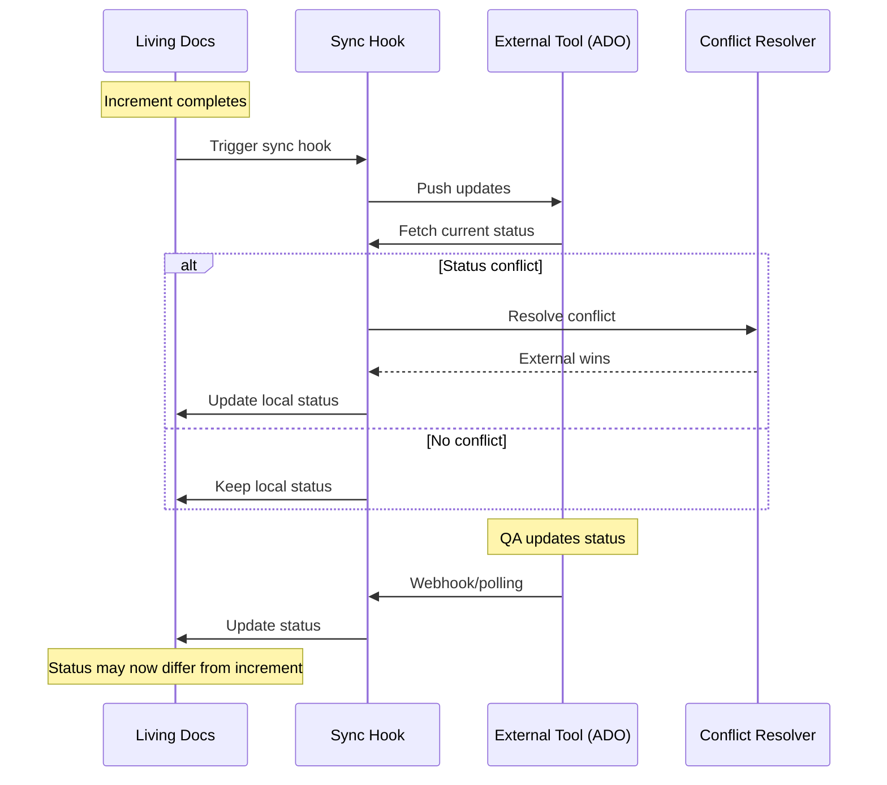

# Living Docs Synchronization Architecture Analysis

**Date**: 2025-11-11
**Status**: 🔍 DEEP ANALYSIS
**Critical Finding**: Need to distinguish increment completion from spec status synchronization

## Executive Summary

The synchronization between living docs (`.specweave/docs/internal/specs/`) and external tools (ADO, JIRA, GitHub) requires careful orchestration. Living docs are PERMANENT feature documentation that may have status lagging behind actual implementation due to external QA processes. This is fundamentally different from increment completion which requires strict validation.

## Core Architecture Principles

### 1. Two Distinct Lifecycles

```mermaid
graph TD
    A[Increment Lifecycle - TEMPORARY] --> B[Create increment]
    B --> C[Implementation]
    C --> D[Tests pass]
    D --> E[/specweave:done]
    E --> F[MUST be complete]
    F --> G[Can be deleted]

    H[Spec Lifecycle - PERMANENT] --> I[Create spec]
    I --> J[Multiple increments]
    J --> K[External QA]
    K --> L[Status may lag]
    L --> M[Never deleted]
    M --> N[Sync with external]
```

### 2. Source of Truth Hierarchy

```
PRIMARY SOURCE: .specweave/docs/internal/specs/
├── Permanent feature documentation
├── Complete user story history
├── Status synchronized with external tools
└── May lag behind implementation

TEMPORARY REFERENCE: .specweave/increments/####/
├── Current implementation snapshot
├── Subset of user stories
├── Must be 100% complete to close
└── Deleted after completion (optional)

EXTERNAL MIRRORS: ADO/JIRA/GitHub
├── Reflect living docs status
├── May have newer status (QA updates)
├── Status WINS in conflicts
└── Bidirectional sync
```

## Critical Distinction: Increment vs Spec Status

### Increment Completion (Strict)

**Requirement**: Must be 100% complete to close

```typescript
// /specweave:done logic
async function closeIncrement(incrementId: string): Promise<void> {
  const tasks = await loadTasks(incrementId);
  const incompleteTasks = tasks.filter(t => !t.completed);

  if (incompleteTasks.length > 0) {
    throw new Error(`Cannot close increment: ${incompleteTasks.length} tasks incomplete`);
  }

  const tests = await runTests(incrementId);
  if (!tests.allPassing) {
    throw new Error(`Cannot close increment: Tests failing`);
  }

  // Strict validation passed
  await markIncremementComplete(incrementId);
  await syncToLivingDocs(incrementId); // Update permanent docs
}
```

### Spec Status (Flexible)

**Requirement**: Can lag behind implementation due to external processes

```typescript
// Spec status synchronization
async function syncSpecStatus(specId: string): Promise<void> {
  const localSpec = await loadSpec(specId);
  const externalStatus = await fetchExternalStatus(specId);

  // CRITICAL: External status WINS in conflicts
  if (externalStatus && externalStatus !== localSpec.status) {
    console.log(`Conflict detected: Local=${localSpec.status}, External=${externalStatus}`);
    console.log(`Resolution: Using external status (${externalStatus})`);

    await updateLocalSpec(specId, { status: externalStatus });
  }

  // Status may legitimately be:
  // - Local: "implemented" (code complete)
  // - External: "in-qa" (being verified)
  // This is NORMAL and EXPECTED
}
```

## Synchronization Architecture

### 1. Hook-Triggered Sync

**When living docs are updated, sync MUST be triggered**:

```bash
# Hook: post-living-docs-update.sh
#!/bin/bash

# Triggered after:
# 1. Increment completion (/specweave:done)
# 2. Manual spec updates
# 3. Living docs sync (/specweave:sync-docs)

SPEC_PATH="$1"
SPEC_ID=$(basename "$SPEC_PATH" .md)

# Detect external tool from metadata
EXTERNAL_TOOL=$(detect_external_tool "$SPEC_PATH")

case "$EXTERNAL_TOOL" in
  "ado")
    sync_to_ado "$SPEC_ID"
    ;;
  "jira")
    sync_to_jira "$SPEC_ID"
    ;;
  "github")
    sync_to_github "$SPEC_ID"
    ;;
esac
```

### 2. Conflict Resolution Strategy

**RULE: External tool status ALWAYS wins**

```typescript
interface ConflictResolution {
  field: string;
  localValue: any;
  externalValue: any;
  resolution: 'external'; // ALWAYS external for status
  reason: string;
}

function resolveStatusConflict(local: string, external: string): ConflictResolution {
  return {
    field: 'status',
    localValue: local,
    externalValue: external,
    resolution: 'external', // CRITICAL: External wins
    reason: 'External tool reflects QA/stakeholder updates'
  };
}
```

### 3. Bidirectional Sync Flow



## Implementation Requirements

### 1. Living Docs Update Hook

```typescript
// src/hooks/lib/sync-living-docs-to-external.ts
export async function syncLivingDocsToExternal(specPath: string): Promise<void> {
  const spec = await loadSpec(specPath);
  const metadata = spec.externalLinks;

  if (!metadata) {
    console.log('No external links found, skipping sync');
    return;
  }

  // Detect which external tool
  if (metadata.ado) {
    await syncToAdo(spec, metadata.ado);
  } else if (metadata.jira) {
    await syncToJira(spec, metadata.jira);
  } else if (metadata.github) {
    await syncToGithub(spec, metadata.github);
  }

  // CRITICAL: After pushing, pull back status
  const externalStatus = await fetchExternalStatus(metadata);
  if (externalStatus !== spec.status) {
    console.log(`Status conflict: Local=${spec.status}, External=${externalStatus}`);
    console.log(`Applying external status: ${externalStatus}`);
    await updateSpecStatus(specPath, externalStatus);
  }
}
```

### 2. Status Mapping

Different tools use different status names:

```typescript
const STATUS_MAPPING = {
  ado: {
    'New': 'draft',
    'Active': 'in-progress',
    'Resolved': 'implemented',
    'Closed': 'complete',
    'In Review': 'in-qa'
  },
  jira: {
    'To Do': 'draft',
    'In Progress': 'in-progress',
    'Code Review': 'implemented',
    'QA': 'in-qa',
    'Done': 'complete'
  },
  github: {
    'open': 'in-progress',
    'closed': 'complete'
  }
};

function mapExternalStatus(tool: string, externalStatus: string): string {
  return STATUS_MAPPING[tool][externalStatus] || 'unknown';
}
```

### 3. Sync Triggers

**Automatic Triggers**:
1. ✅ After `/specweave:done` (increment complete)
2. ✅ After `/specweave:sync-docs update` (living docs sync)
3. ✅ After manual spec edits (file watcher)
4. ✅ Webhook from external tool (status change)
5. ✅ Periodic polling (every 5 minutes)

**Manual Triggers**:
1. `/specweave-ado:sync-spec {spec-id}`
2. `/specweave-jira:sync-spec {spec-id}`
3. `/specweave-github:sync-spec {spec-id}`

## Why This Architecture Matters

### 1. Separation of Concerns

**Increments** = Implementation tracking
- Must be 100% complete
- Tests must pass
- Strict validation via `/specweave:done`
- Temporary, can be deleted

**Specs** = Feature documentation
- Permanent knowledge base
- Status can lag (QA takes time)
- External tool is source of truth for status
- Never deleted

### 2. Real-World Workflow

```
Day 1: Developer completes increment
  - All tasks done ✅
  - Tests pass ✅
  - /specweave:done ✅
  - Increment closed ✅
  - Living docs updated ✅
  - Status: "implemented"

Day 2-5: QA Testing
  - External QA team tests
  - ADO status: "In QA"
  - Living docs sync: Status updates to "in-qa"
  - Increment already closed (correct!)

Day 6: QA Finds Issue
  - ADO status: "Active" (reopened)
  - Living docs sync: Status updates to "in-progress"
  - NEW increment created for fix
  - Original increment stays closed (correct!)

Day 8: Fix Deployed
  - New increment completed
  - ADO status: "Resolved"
  - Living docs sync: Status updates to "implemented"

Day 10: QA Approves
  - ADO status: "Closed"
  - Living docs sync: Status updates to "complete"
  - Both increments closed
  - Spec shows complete history
```

## Conflict Resolution Examples

### Example 1: Status Conflict

```yaml
# Local (living docs)
status: implemented
lastModified: 2024-11-10T10:00:00Z

# External (ADO)
status: In QA
lastModified: 2024-11-10T14:00:00Z

# Resolution
status: in-qa  # External wins
source: ado
syncedAt: 2024-11-10T14:30:00Z
```

### Example 2: Priority Conflict

```yaml
# Local
priority: P1

# External
priority: P0

# Resolution
priority: P0  # External wins (stakeholder decision)
```

### Example 3: User Story Status

```yaml
# Local
US-001: done
US-002: in-progress

# External
US-001: done
US-002: done

# Resolution
US-001: done      # Agreed
US-002: done      # External wins (QA verified)
```

## Testing Strategy

### 1. Unit Tests

```typescript
describe('Living Docs Sync', () => {
  test('should prefer external status in conflicts', async () => {
    const local = { status: 'implemented' };
    const external = { status: 'in-qa' };

    const resolved = await resolveConflict(local, external);

    expect(resolved.status).toBe('in-qa');
    expect(resolved.source).toBe('external');
  });

  test('should trigger sync after living docs update', async () => {
    const mockSync = jest.fn();
    hookManager.on('living-docs-updated', mockSync);

    await updateLivingDocs(specPath);

    expect(mockSync).toHaveBeenCalledWith(specPath);
  });
});
```

### 2. Integration Tests

```typescript
describe('ADO Bidirectional Sync', () => {
  test('should sync status from ADO to living docs', async () => {
    // Setup
    const spec = await createSpec('spec-001');
    const adoItem = await createAdoWorkItem(spec);

    // Change status in ADO
    await updateAdoStatus(adoItem.id, 'In QA');

    // Trigger sync
    await syncFromAdo(spec.id);

    // Verify
    const updated = await loadSpec(spec.id);
    expect(updated.status).toBe('in-qa');
  });
});
```

## Summary

### Key Principles

1. **Living docs are permanent** - Never deleted, complete history
2. **Increments are temporary** - Must be 100% complete to close
3. **External status wins** - Always prefer external tool in conflicts
4. **Status can lag** - QA/verification takes time, this is normal
5. **Bidirectional sync** - Push updates, pull status

### Critical Rules

1. ✅ **Increment completion is strict** - All tasks done, tests pass
2. ✅ **Spec status is flexible** - Can be "in-qa" while code is complete
3. ✅ **External tool is authority** - For status and priority
4. ✅ **Living docs are source** - For content and history
5. ✅ **Sync is automatic** - Hooks trigger after updates

### Implementation Checklist

- [ ] Add post-living-docs-update hook
- [ ] Implement conflict resolution (external wins)
- [ ] Add status mapping for each tool
- [ ] Create sync triggers (auto and manual)
- [ ] Add integration tests
- [ ] Document the distinction
- [ ] Train team on the workflow

---

**Conclusion**: The architecture correctly separates increment completion (strict) from spec status (flexible), ensuring proper tracking while accommodating real-world QA workflows. External tool status takes precedence to reflect stakeholder and QA decisions.