# SpecWeave Complete Lifecycle Flow Diagram v2.0

**Version**: 2.0 (Plugin Architecture Update)
**Date**: 2025-10-31
**Context**: Updated for YouTube video, includes all decision points and 4-phase plugin detection

---

## Main Flow Diagram

```mermaid
flowchart TD
    Start([Developer Starts New Work]) --> Type{Project Type?}

    %% Greenfield Path
    Type -->|Greenfield| Init[specweave init]
    Init --> Phase1[Phase 1: Init-Time Detection]
    Phase1 --> Scan1[Scan project structure]
    Scan1 --> Check1{Found stack indicators?}
    Check1 -->|Yes| Suggest1[Suggest plugins:<br/>React → frontend-stack<br/>K8s → kubernetes<br/>etc.]
    Check1 -->|No| CoreOnly[Load core framework only]
    Suggest1 --> UserChoice1{User accepts?}
    UserChoice1 -->|Yes| EnablePlugins1[Enable suggested plugins]
    UserChoice1 -->|No| CoreOnly
    EnablePlugins1 --> Ready
    CoreOnly --> Ready

    %% Brownfield Path
    Type -->|Brownfield| BrownInit[specweave init --brownfield]
    BrownInit --> BrownScan[Scan existing codebase]
    BrownScan --> BrownAnalysis[Analyze:<br/>- Docs<br/>- Tests<br/>- Issues<br/>- Git history]
    BrownAnalysis --> MigrationPlan[Generate migration plan]
    MigrationPlan --> Ready[Ready for increment]

    %% Increment Planning
    Ready --> IncStart[/specweave:inc 'feature description']
    IncStart --> Phase2[Phase 2: Pre-Spec Detection]
    Phase2 --> AnalyzeDesc[Analyze increment description]
    AnalyzeDesc --> Check2{Keywords match plugins?}
    Check2 -->|Yes| Suggest2[Suggest plugins:<br/>'deploy to K8s' → kubernetes<br/>'Stripe payment' → payment<br/>etc.]
    Check2 -->|No| NoPluginNeeded
    Suggest2 --> UserChoice2{Enable plugin?}
    UserChoice2 -->|Yes| EnablePlugins2[Enable plugins]
    UserChoice2 -->|No| NoPluginNeeded[Continue without plugin]
    EnablePlugins2 --> DecisionGate
    NoPluginNeeded --> DecisionGate

    %% Decision Gate (NEW)
    DecisionGate{User Decision Gate}
    DecisionGate --> Q1[Q1: How deep should we spec?]
    Q1 --> A1{User selects:}
    A1 -->|High-level| DepthHigh[- User stories only<br/>- Minimal detail<br/>- Fast iteration]
    A1 -->|Detailed| DepthDetailed[- Full acceptance criteria<br/>- Edge cases<br/>- Complete test scenarios]
    DepthHigh --> Q2
    DepthDetailed --> Q2

    Q2[Q2: Test-Driven Development?]
    Q2 --> A2{User selects:}
    A2 -->|Yes TDD| TDDYes[- Tests written first<br/>- Red-Green-Refactor<br/>- Higher confidence]
    A2 -->|No TDD| TDDNo[- Tests after code<br/>- Faster iteration<br/>- Pragmatic approach]
    TDDYes --> Q3
    TDDNo --> Q3

    Q3[Q3: Test quality level?]
    Q3 --> A3{User selects:}
    A3 -->|Basic| QualBasic[- Coverage targets<br/>- Manual review<br/>- Fast validation]
    A3 -->|AI Judge| QualAI[- AI quality assessment<br/>- Edge case detection<br/>- Architecture review]
    QualBasic --> Q4
    QualAI --> Q4

    Q4[Q4: Living docs sync?]
    Q4 --> A4{User selects:}
    A4 -->|Auto| DocsAuto[- Hooks fire after every task<br/>- Docs auto-update<br/>- Zero manual work]
    A4 -->|Manual| DocsManual[- User runs /sync-docs<br/>- More control<br/>- Manual effort]
    DocsAuto --> Research
    DocsManual --> Research

    %% Research Phase
    Research[PM Agent: Research & Analysis]
    Research --> ResearchSteps[- Market analysis<br/>- Competitive research<br/>- User story extraction]
    ResearchSteps --> SpecGen[Generate spec.md]
    SpecGen --> SpecContent[spec.md contains:<br/>- User stories<br/>- Acceptance criteria<br/>- Success metrics]

    %% Planning Phase
    SpecContent --> Plan[Architect Agent: Technical Planning]
    Plan --> PlanSteps[- Architecture design<br/>- Tech stack selection<br/>- Risk assessment]
    PlanSteps --> PlanGen[Generate plan.md]
    PlanGen --> PlanContent[plan.md contains:<br/>- Architecture<br/>- Implementation strategy<br/>- Dependencies]

    %% Task Breakdown
    PlanContent --> Tasks[Tech Lead Agent: Task Breakdown]
    Tasks --> TaskSteps[- Break into tasks<br/>- Estimate effort<br/>- Identify risks]
    TaskSteps --> TaskGen[Generate tasks.md]
    TaskGen --> TaskContent[tasks.md contains:<br/>- Task list<br/>- Dependencies<br/>- Acceptance criteria]

    %% Test Planning
    TaskContent --> Tests[QA Lead Agent: Test Planning]
    Tests --> TestSteps[- Define test scenarios<br/>- Coverage requirements<br/>- Quality gates]
    TestSteps --> TestGen[Generate tests.md]
    TestGen --> TestContent[tests.md contains:<br/>- Test cases<br/>- Coverage targets<br/>- Quality criteria]

    %% Validation Gate
    TestContent --> ValidateCheck{Run validation?}
    ValidateCheck -->|Yes| Validate[/specweave:validate]
    ValidateCheck -->|No| Ready2
    Validate --> ValidationRules[Rule-based checks:<br/>- Required fields present<br/>- Tasks have criteria<br/>- Tests cover requirements]
    ValidationRules --> AIJudge{AI Judge enabled?}
    AIJudge -->|Yes| AICheck[AI Quality Assessment:<br/>- Spec clarity<br/>- Edge case coverage<br/>- Architecture soundness]
    AIJudge -->|No| ValidationResult
    AICheck --> ValidationResult{Validation passed?}
    ValidationResult -->|Failed| FixIssues[Fix issues in specs]
    ValidationResult -->|Passed| Ready2[Ready for execution]
    FixIssues --> ValidateCheck

    %% Execution Phase
    Ready2 --> Execute[/specweave:do]
    Execute --> Phase3[Phase 3: Pre-Task Detection]
    Phase3 --> CheckTask[Check next task description]
    CheckTask --> TaskHints{Task mentions plugins?}
    TaskHints -->|Yes| SuggestTaskPlugin[Non-blocking suggestion:<br/>'Consider enabling X plugin']
    TaskHints -->|No| ExecTask
    SuggestTaskPlugin --> ExecTask[Execute current task]

    %% Task Execution Loop
    ExecTask --> TaskWork[Developer works on task]
    TaskWork --> TaskComplete{Task complete?}
    TaskComplete -->|No| TaskWork
    TaskComplete -->|Yes| PostHook[Post-task hook fires]

    %% Post-Task Hook
    PostHook --> HookActions[Hook performs:<br/>1. Log completion<br/>2. Play sound<br/>3. Update progress<br/>4. Sync docs if enabled]
    HookActions --> DocsSync{Auto-sync enabled?}
    DocsSync -->|Yes| UpdateDocs[/sync-docs update automatically]
    DocsSync -->|No| SkipSync
    UpdateDocs --> CheckMore
    SkipSync[Manual sync later] --> CheckMore

    CheckMore{More tasks?}
    CheckMore -->|Yes| Execute
    CheckMore -->|No| QualityGate

    %% Quality Gate
    QualityGate[Quality Gate Checks]
    QualityGate --> GateChecks[Verify:<br/>- All tasks complete<br/>- All tests passing<br/>- Docs synced]
    GateChecks --> GatePass{All checks pass?}
    GatePass -->|No| BlockClose[Cannot close increment]
    GatePass -->|Yes| AllowClose[Can close increment]
    BlockClose --> FixGate[Fix failing checks]
    FixGate --> QualityGate

    %% Increment Completion
    AllowClose --> Close[/specweave:done]
    Close --> Phase4[Phase 4: Post-Increment Detection]
    Phase4 --> GitDiff[Analyze git diff]
    GitDiff --> NewDeps{New dependencies added?}
    NewDeps -->|Yes| SuggestFuture[Suggest for next increment:<br/>'Found Stripe → payment plugin?<br/>'Found Docker → container plugin?']
    NewDeps -->|No| FinalSync
    SuggestFuture --> FinalSync[Final living docs sync]

    %% Final Sync
    FinalSync --> UpdateStrategic[Update strategic docs:<br/>- Architecture changes<br/>- ADR updates<br/>- Lessons learned]
    UpdateStrategic --> Complete([Increment Complete])

    %% Next Increment
    Complete --> Next{Start next increment?}
    Next -->|Yes| IncStart
    Next -->|No| End([Done])

    %% Styling
    classDef decision fill:#FFE4B5,stroke:#FF8C00,stroke-width:2px
    classDef process fill:#B0E0E6,stroke:#4682B4,stroke-width:2px
    classDef hook fill:#98FB98,stroke:#228B22,stroke-width:2px
    classDef plugin fill:#DDA0DD,stroke:#8B008B,stroke-width:2px
    classDef quality fill:#FFB6C1,stroke:#DC143C,stroke-width:2px

    class Type,Check1,UserChoice1,Check2,UserChoice2,DecisionGate,A1,A2,A3,A4,ValidateCheck,AIJudge,ValidationResult,TaskComplete,DocsSync,CheckMore,GatePass,NewDeps,Next decision
    class Init,Execute,Close,Validate process
    class Phase1,Phase2,Phase3,Phase4,PostHook hook
    class Suggest1,EnablePlugins1,Suggest2,EnablePlugins2,SuggestTaskPlugin,SuggestFuture plugin
    class QualityGate,GateChecks,ValidationRules,AICheck quality
```

---

## Decision Gate Detail (for Video Highlight)


---

## 4-Phase Plugin Detection (for Video Highlight)

```mermaid
flowchart TD
    Start([SpecWeave Initialization]) --> Phase1

    %% Phase 1: Init-Time
    Phase1[Phase 1: Init-Time Detection]
    Phase1 --> Init1[Trigger: specweave init]
    Init1 --> Scan1[Scan:<br/>- package.json<br/>- Directory structure<br/>- .git/config<br/>- Environment variables]
    Scan1 --> Detect1[Detect:<br/>✓ React in package.json<br/>✓ kubernetes/ folder<br/>✓ github.com remote<br/>✓ GITHUB_TOKEN env var]
    Detect1 --> Suggest1[Suggest plugins:<br/>- frontend-stack<br/>- kubernetes<br/>- github-sync]
    Suggest1 --> User1{User decision}
    User1 -->|Accept| Enable1[Enable plugins immediately]
    User1 -->|Reject| Skip1[Continue with core only]

    %% Phase 2: Pre-Spec
    Enable1 --> Phase2
    Skip1 --> Phase2
    Phase2[Phase 2: Pre-Spec Detection]
    Phase2 --> Init2[Trigger: /specweave:inc 'description']
    Init2 --> Scan2[Analyze increment description]
    Scan2 --> Detect2[Detect keywords:<br/>✓ 'deploy to Kubernetes'<br/>✓ 'Stripe payment'<br/>✓ 'React components']
    Detect2 --> Match2{Matches plugin triggers?}
    Match2 -->|Yes| Suggest2[Suggest before spec creation:<br/>'This needs kubernetes plugin.<br/>Enable? Y/n']
    Match2 -->|No| NoSuggest2[Proceed to spec]
    Suggest2 --> User2{User decision}
    User2 -->|Accept| Enable2[Enable plugin before spec]
    User2 -->|Reject| NoSuggest2

    %% Phase 3: Pre-Task
    Enable2 --> Phase3
    NoSuggest2 --> Phase3
    Phase3[Phase 3: Pre-Task Detection]
    Phase3 --> Init3[Trigger: Before each task execution]
    Init3 --> Scan3[Scan task description]
    Scan3 --> Detect3[Detect:<br/>✓ 'kubectl apply'<br/>✓ 'Stripe.checkout'<br/>✓ 'React.useState']
    Detect3 --> Match3{Matches plugin?}
    Match3 -->|Yes| Suggest3[Non-blocking suggestion:<br/>'💡 Consider kubernetes plugin']
    Match3 -->|No| NoSuggest3[Execute task]
    Suggest3 --> Continue3[Developer can enable or ignore]
    Continue3 --> NoSuggest3

    %% Phase 4: Post-Increment
    NoSuggest3 --> Phase4
    Phase4[Phase 4: Post-Increment Detection]
    Phase4 --> Init4[Trigger: /specweave:done]
    Init4 --> Scan4[Scan git diff]
    Scan4 --> Detect4[Detect new dependencies:<br/>✓ Added: stripe package<br/>✓ Added: @kubernetes/client<br/>✓ Added: playwright]
    Detect4 --> Match4{New plugin-relevant deps?}
    Match4 -->|Yes| Suggest4[Suggest for next increment:<br/>'Detected Stripe.<br/>Enable payment plugin<br/>for future work?']
    Match4 -->|No| NoSuggest4[Complete]
    Suggest4 --> User4{User decision}
    User4 -->|Accept| Enable4[Enable for next increment]
    User4 -->|Reject| NoSuggest4
    Enable4 --> Complete
    NoSuggest4 --> Complete([Complete])

    classDef phase fill:#DDA0DD,stroke:#8B008B,stroke-width:2px
    classDef detect fill:#B0E0E6,stroke:#4682B4,stroke-width:2px
    classDef decision fill:#FFE4B5,stroke:#FF8C00,stroke-width:2px

    class Phase1,Phase2,Phase3,Phase4 phase
    class Scan1,Detect1,Scan2,Detect2,Scan3,Detect3,Scan4,Detect4 detect
    class User1,Match2,User2,Match3,Match4,User4 decision
```



---

## Context Efficiency (Before/After Plugin Architecture)


---

## Living Docs Sync Flow (Hook Automation)

```mermaid
sequenceDiagram
    actor Dev as Developer
    participant CLI as SpecWeave CLI
    participant Hook as Post-Task Hook
    participant Docs as Living Docs
    participant Git as Git Repository

    Dev->>CLI: /specweave:do
    CLI->>Dev: Execute Task T-001
    Dev->>Dev: Write code, tests
    Dev->>CLI: Task complete

    activate Hook
    CLI->>Hook: Fire post-task-completion.sh
    Hook->>Hook: 1. Log completion
    Hook->>Hook: 2. Play completion sound
    Hook->>Hook: 3. Update progress
    Hook->>Hook: 4. Check auto-sync config

    alt Auto-sync enabled
        Hook->>Docs: Update docs automatically
        Docs->>Docs: Sync spec.md ← code reality
        Docs->>Docs: Update plan.md ← learnings
        Docs->>Docs: Update ADRs ← decisions
        Docs->>Hook: ✅ Docs updated
        Hook->>Dev: Docs synced automatically
    else Manual sync
        Hook->>Dev: Reminder: Run /sync-docs when ready
    end
    deactivate Hook

    Dev->>CLI: Continue to next task

    Note over Dev,Git: After all tasks complete
    Dev->>CLI: /specweave:done
    CLI->>Docs: Final sync: strategic docs
    Docs->>Git: Commit updated docs
    Git->>Dev: ✅ Increment complete
```



---

## Comparison Matrix (for Video)

```mermaid
flowchart TD
    Start([Choose Your Framework]) --> Compare{What do you need?}

    Compare -->|Research-heavy,<br/>solo architect,<br/>infinite time| BMAD[BMAD Method]
    Compare -->|Tiny team,<br/>simple project,<br/>hate frameworks| SpecKit[SpecKit]
    Compare -->|Team of 2-50,<br/>need speed + quality,<br/>automation| SpecWeave[SpecWeave]

    BMAD --> BMADPros["✅ Brilliant research methodology<br/>✅ Comprehensive documentation<br/>✅ Proven for complex domains"]
    BMAD --> BMADCons["❌ 100% manual<br/>❌ PhD thesis per feature<br/>❌ No automation<br/>❌ No multi-tool support"]

    SpecKit --> SpecKitPros["✅ Simple Markdown templates<br/>✅ Zero lock-in<br/>✅ Fast to start<br/>✅ Minimal learning curve"]
    SpecKit --> SpecKitCons["❌ Just scaffolding<br/>❌ No automation<br/>❌ No living docs<br/>❌ No enforcement"]

    SpecWeave --> SpecWeavePros["✅ Automated living docs<br/>✅ Plugin system 60-80% context<br/>✅ Multi-tool support<br/>✅ Quality gates enforced<br/>✅ Brownfield migration<br/>✅ GitHub/Jira sync"]
    SpecWeave --> SpecWeaveCons["⚠️ Learning curve: medium<br/>⚠️ Requires Node.js<br/>⚠️ Opinionated workflow"]

    BMADPros --> Decision
    BMADCons --> Decision
    SpecKitPros --> Decision
    SpecKitCons --> Decision
    SpecWeavePros --> Decision
    SpecWeaveCons --> Decision

    Decision{Your choice?}
    Decision --> End([Start building!])

    classDef bmad fill:#FFE4B5,stroke:#FF8C00,stroke-width:2px
    classDef speckit fill:#B0E0E6,stroke:#4682B4,stroke-width:2px
    classDef specweave fill:#98FB98,stroke:#228B22,stroke-width:2px

    class BMAD,BMADPros,BMADCons bmad
    class SpecKit,SpecKitPros,SpecKitCons speckit
    class SpecWeave,SpecWeavePros,SpecWeaveCons specweave
```



---

## Usage in Video

### Section Mapping

1. **Section 4 (8:00-11:00)**: Use "Main Flow Diagram"
   - Show complete lifecycle
   - Highlight decision gates
   - Emphasize plugin detection phases

2. **Section 4 Detail (9:30)**: Use "Decision Gate Detail"
   - Zoom into decision gate
   - Show user control
   - Emphasize flexibility

3. **Section 4 Plugin (10:15)**: Use "4-Phase Plugin Detection"
   - Show intelligence of detection
   - Highlight non-intrusive suggestions
   - Demonstrate context efficiency

4. **Section 4 Context (10:45)**: Use "Context Efficiency"
   - Before/after comparison
   - Show 76% reduction
   - Emphasize practical benefit

5. **Section 4 Automation (11:00)**: Use "Living Docs Sync Flow"
   - Show hook automation
   - Demonstrate zero manual work
   - Highlight competitive advantage

6. **Section 7 (24:00)**: Use "Comparison Matrix"
   - Decision tree format
   - Show when to use what
   - Position SpecWeave for teams

---

## Animation Suggestions

1. **Main Flow**: Animate path highlighting based on user choices
2. **Decision Gate**: Interactive overlay showing "click to choose"
3. **Plugin Detection**: Pulse effect on detection nodes
4. **Context Efficiency**: Animated bar chart showing token reduction
5. **Living Docs Sync**: Sequence diagram with message flow animation
6. **Comparison Matrix**: Fade in pros/cons as you narrate

---

## Diagram Export for Video

```bash
# Generate SVG for video editing
npx @mermaid-js/mermaid-cli -i FLOW-DIAGRAM-V2-COMPLETE.md -o diagrams/

# Or use online tool
# https://mermaid.live/
# Copy each diagram, export as SVG, import to Final Cut/Premiere
```

---

**DIAGRAMS READY FOR PRODUCTION** ✅
