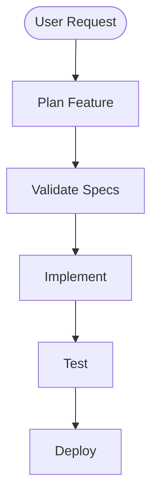
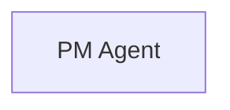

# Using Diagram SVGs in Docusaurus

**Purpose**: Guide for embedding SpecWeave diagram SVGs in Docusaurus documentation site

**Created**: 2025-10-27

**SVG Files Generated**: 2025-10-27

---

## ✅ What Was Generated

### Workflow Diagram SVGs

**Source**: `.specweave/docs/internal/architecture/diagrams/specweave-workflow.mmd`

**Generated Files**:
1. `specweave-workflow.svg` (224KB, light theme)
2. `specweave-workflow-dark.svg` (224KB, dark theme)

**Coverage**: All 36 SpecWeave scenarios including:
- Project initialization with tech stack detection
- Brownfield workflow (analyzer, CLAUDE.md merge, baseline tests)
- Multi-agent planning (PM, Architect, QA, Security, DevOps)
- Increment validation (quick → deep analysis)
- Context loading (70%+ token reduction)
- Implementation with E2E testing
- Acceptance criteria validation
- Documentation updates
- Deployment intelligence

---

## 🚀 Quick Usage in Docusaurus

### Option 1: Simple Image (Recommended for Introduction)

**File**: `docs/overview/introduction.md`

```markdown
# Introduction to SpecWeave

SpecWeave is a specification-first AI development framework...

## Complete Workflow

The diagram below shows the complete SpecWeave workflow:


### Workflow Phases

1. **Project Initialization**: Tech stack detection, selective agent installation...
```

**Benefits**:
- ✅ Simple Markdown syntax
- ✅ Works immediately
- ✅ Fast rendering (no JavaScript)

**Drawbacks**:
- ❌ No dark mode switching

---

### Option 2: Themed Image (Dark Mode Support)

**File**: `docs/overview/introduction.mdx` (note `.mdx` extension)

```mdx
---
title: Introduction
---

import ThemedImage from '@theme/ThemedImage';
import useBaseUrl from '@docusaurus/useBaseUrl';

# Introduction to SpecWeave

SpecWeave is a specification-first AI development framework...

## Complete Workflow

<ThemedImage
  alt="SpecWeave Complete Workflow - 8 phases from initialization to deployment"
  sources={{
    light: useBaseUrl('/.specweave/docs/internal/architecture/diagrams/specweave-workflow.svg'),
    dark: useBaseUrl('/.specweave/docs/internal/architecture/diagrams/specweave-workflow-dark.svg'),
  }}
  style={{width: '100%', maxWidth: '1200px'}}
/>

### Workflow Phases...
```

**Benefits**:
- ✅ Automatic dark mode switching
- ✅ Better UX
- ✅ Consistent with Docusaurus theme

**Drawbacks**:
- ⚠️ Requires MDX (not Markdown)
- ⚠️ Slightly more complex

---

### Option 3: Static Assets (Copy to /static)

**Recommended for production**: Copy SVGs to Docusaurus `/static` folder

```bash
# Create diagrams directory in static assets
mkdir -p static/diagrams

# Copy SVGs
cp .specweave/docs/internal/architecture/diagrams/specweave-workflow.svg \
   static/diagrams/
cp .specweave/docs/internal/architecture/diagrams/specweave-workflow-dark.svg \
   static/diagrams/
```

**Usage** (`docs/overview/introduction.mdx`):
```mdx
import ThemedImage from '@theme/ThemedImage';

<ThemedImage
  alt="SpecWeave Workflow"
  sources={{
    light: '/diagrams/specweave-workflow.svg',
    dark: '/diagrams/specweave-workflow-dark.svg',
  }}
/>
```

**Benefits**:
- ✅ Clean URLs (`/diagrams/...`)
- ✅ CDN-friendly
- ✅ Standard Docusaurus practice

**Maintenance**:
- ⚠️ Must copy SVGs after regeneration

---

## 📋 Docusaurus Configuration

### docusaurus.config.js

**No special configuration needed!** Docusaurus supports SVG images by default.

**Optional**: Add custom styles for diagrams

```js
module.exports = {
  // ... other config
  stylesheets: [
    {
      href: '/css/diagrams.css',
    },
  ],
};
```

**File**: `static/css/diagrams.css`

```css
/* Responsive diagram sizing */
img[alt*="Workflow"],
img[alt*="Diagram"] {
  max-width: 100%;
  height: auto;
  margin: 2rem 0;
  border-radius: 8px;
  box-shadow: 0 4px 6px rgba(0, 0, 0, 0.1);
}

/* Dark mode adjustments */
[data-theme='dark'] img[alt*="Workflow"],
[data-theme='dark'] img[alt*="Diagram"] {
  box-shadow: 0 4px 6px rgba(255, 255, 255, 0.1);
}

/* Zoom on hover (optional) */
.diagram-container:hover img {
  transform: scale(1.02);
  transition: transform 0.3s ease;
}
```

---

## 📱 Responsive Design

### Mobile-Friendly Diagrams

**Problem**: Large diagrams (60+ nodes) may be hard to read on mobile

**Solutions**:

#### 1. Add Zoom Functionality

```mdx
<div className="diagram-container" style={{overflow: 'auto'}}>
  <ThemedImage
    alt="Workflow"
    sources={{
      light: '/diagrams/specweave-workflow.svg',
      dark: '/diagrams/specweave-workflow-dark.svg',
    }}
    style={{minWidth: '800px'}}
  />
</div>
```

**Benefits**: Users can scroll/zoom on mobile

#### 2. Create Simplified Mobile Version

**File**: `specweave-workflow-mobile.mmd`



**Usage**:
```mdx
<div className="mobile-only">
  
</div>
<div className="desktop-only">
  <ThemedImage sources={{...}} />
</div>
```

---

## 🎨 Diagram Explanation Section

**Recommended**: Add explanation alongside diagram

**Example** (`docs/overview/introduction.md`):

```markdown
## Complete Workflow


### How to Read This Diagram

**Color Legend**:
- 🔵 **Blue boxes**: AI agents (PM, Architect, DevOps, etc.)
- 🟠 **Orange boxes**: Skills (router, validator, loader, etc.)
- 🟣 **Purple diamonds**: Decision points (where you provide input)
- 🟢 **Green boxes**: Success states (milestones completed)
- 🟡 **Yellow boxes**: Warnings (review needed)

**Workflow Phases**:

1. **🆕 Project Initialization**
   - Detects tech stack (TypeScript, Python, Go, etc.)
   - Installs ONLY relevant agents (60% token savings!)
   - Asks: "Comprehensive docs upfront or incremental?"

2. **🔧 Brownfield Path** (for existing code)
   - Merges old CLAUDE.md
   - Documents current behavior
   - Creates baseline E2E tests

3. **📋 Feature Planning**
   - PM Agent: Creates spec.md with TC-0001 acceptance criteria
   - Architect Agent: Creates plan.md with ADRs
   - QA Agent: Creates tests.md with coverage matrix
   - Security Agent: Reviews security considerations
   - DevOps Agent: Designs infrastructure (ONLY if needed)

... (continue for all 8 phases)
```

---

## 🔗 Interactive Features (Optional)

### Click-to-Navigate

**Mermaid supports click events** in SVGs:

**Source** (`.mmd` file):


**Regenerate SVG**:
```bash
npm run generate:diagrams
```

**Result**: Clicking "PM Agent" navigates to `/docs/agents/pm`

**Benefits**:
- ✅ Interactive documentation
- ✅ Easier navigation

**Drawbacks**:
- ⚠️ Must update .mmd file for each link
- ⚠️ Links hardcoded (not configurable)

---

## 📊 Performance Optimization

### SVG File Size Optimization

**Current Size**: 224KB (acceptable)

**If >500KB**, optimize with SVGO:

```bash
# Install SVGO
npm install -g svgo

# Optimize SVG
svgo .specweave/docs/internal/architecture/diagrams/specweave-workflow.svg \
     --multipass \
     --pretty

# Result: 30-50% size reduction
```

---

### Lazy Loading (Docusaurus 2.0+)

**File**: `docs/overview/introduction.mdx`

```mdx
import React from 'react';

const LazyDiagram = () => {
  const [loaded, setLoaded] = React.useState(false);

  return (
    <div>
      {!loaded && <button onClick={() => setLoaded(true)}>Load Diagram</button>}
      {loaded && (
        <ThemedImage
          sources={{
            light: '/diagrams/specweave-workflow.svg',
            dark: '/diagrams/specweave-workflow-dark.svg',
          }}
        />
      )}
    </div>
  );
};

export default LazyDiagram;
```

**Benefits**: Faster initial page load

---

## 🛠️ Automation

### Auto-Copy SVGs to /static (GitHub Actions)

**File**: `.github/workflows/copy-diagrams.yml`

```yaml
name: Copy Diagram SVGs to Static

on:
  push:
    paths:
      - '.specweave/docs/internal/architecture/diagrams/*.svg'

jobs:
  copy-svgs:
    runs-on: ubuntu-latest
    steps:
      - uses: actions/checkout@v3

      - name: Copy SVGs
        run: |
          mkdir -p static/diagrams
          cp .specweave/docs/internal/architecture/diagrams/*.svg static/diagrams/

      - name: Commit
        run: |
          git config user.name "GitHub Actions"
          git config user.email "actions@github.com"
          git add static/diagrams/
          git diff --cached --quiet || git commit -m "docs: update diagram SVGs"
          git push
```

---

## ✅ Deployment Checklist

Before deploying to https://spec-weave.com:

- [ ] SVGs generated (`npm run generate:diagrams`)
- [ ] Both light and dark versions exist
- [ ] SVGs copied to `/static/diagrams/` (if using Option 3)
- [ ] Markdown/MDX updated with correct paths
- [ ] Diagram explanation section added
- [ ] Tested on mobile (responsive)
- [ ] Tested dark mode switching
- [ ] SVGs committed to git
- [ ] Build succeeds (`npm run build`)
- [ ] Preview deployed diagram renders correctly

---

## 📚 Example Page Structure

**Recommended structure** for Introduction page:

```markdown
# Introduction to SpecWeave

Brief overview...

## What is SpecWeave?

Core principles...

## Complete Workflow


### How to Read This Diagram

Color legend, phase descriptions...

### Workflow Phases (Detailed)

1. Project Initialization
2. Brownfield Path
3. Feature Planning
...

## Key Features

- 70%+ token reduction
- 120 validation checks
- Progressive deployment
...

## Next Steps

- [Install SpecWeave](/docs/guides/installation)
- [Quickstart Tutorial](/docs/guides/quickstart)
- [Learn About Agents](/docs/agents/overview)
```

---

## 🔄 Maintenance Workflow

### When Diagram Changes

1. **Edit source**: `vim .specweave/docs/internal/architecture/diagrams/specweave-workflow.mmd`
2. **Regenerate**: `npm run generate:diagrams`
3. **Copy to static** (if using Option 3): `cp ... static/diagrams/`
4. **Verify**: Check both light and dark versions
5. **Commit**: `git add ... && git commit -m "docs: update workflow diagram"`
6. **Deploy**: Push to GitHub (CI/CD auto-deploys)

---

## 📖 Related Documentation

- [Diagram SVG Generation Guide](../../delivery/guides/diagram-svg-generation.md)
- [Architecture Diagrams README](../../architecture/diagrams/README.md)
- [Workflow Diagram Validation Report](./workflow-diagram-validation.md)
- [Docusaurus Markdown Features](https://docusaurus.io/docs/markdown-features)
- [Docusaurus Static Assets](https://docusaurus.io/docs/static-assets)

---

## 🎯 Summary

**Status**: ✅ Ready for Docusaurus deployment

**Recommended Approach**: Option 3 (Copy to /static with ThemedImage)

**Files to Deploy**:
1. `static/diagrams/specweave-workflow.svg` (224KB)
2. `static/diagrams/specweave-workflow-dark.svg` (224KB)
3. `docs/overview/introduction.mdx` (with ThemedImage)

**Next Steps**:
1. Copy SVGs to `/static/diagrams/`
2. Update introduction page with MDX
3. Add diagram explanation section
4. Test on mobile and dark mode
5. Deploy to production

---

**Generated**: 2025-10-27
**For**: https://spec-weave.com/docs/overview/introduction
**Maintained By**: SpecWeave Documentation Team
