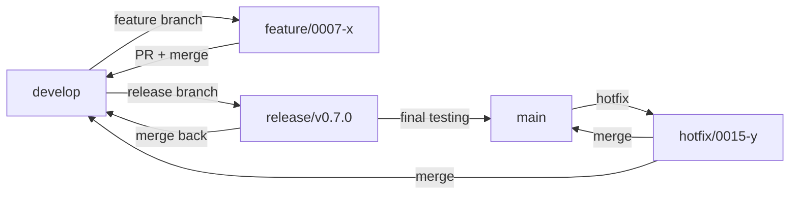
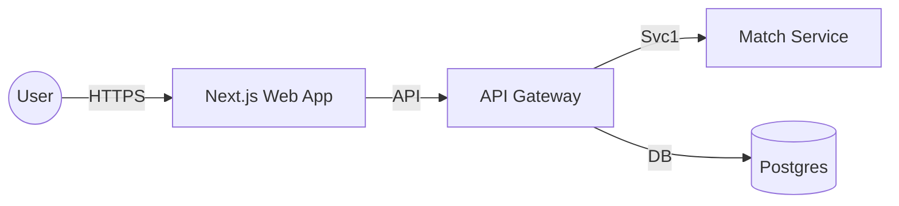

# Diagram Consolidation - Phase 2

**Date**: 2025-11-10
**Increment**: 0015-hierarchical-external-sync
**Task**: Final diagram directory cleanup (Phase 2)
**Status**: ✅ COMPLETE
**Previous**: See DIAGRAM-CLEANUP-SUMMARY.md for Phase 1 (24→9 diagrams)

---

## Executive Summary

Completed **Phase 2** of diagram consolidation, reducing from **9 diagrams to 7 essential diagrams** (22% reduction), improving clarity and maintainability while removing redundant and misleading content.

**Combined with Phase 1**: 24 diagrams → 7 diagrams (71% total reduction) ✨

**Key Results**:
- ✅ Removed 2 redundant delivery guide diagrams (4 files total: .mmd + .svg)
- ✅ Renamed 1 diagram for accuracy (brownfield onboarding)
- ✅ Updated README.md with comprehensive v3.0 documentation
- ✅ Fixed all broken references in delivery guides
- ✅ Embedded simple diagrams directly in docs (better DX)

---

## Context: Phase 1 vs Phase 2

### Phase 1 (Previous - documented in DIAGRAM-CLEANUP-SUMMARY.md)
- **Result**: 24 diagrams → 9 diagrams (62.5% reduction)
- **Removed**: Duplicates, version bloat, marketing content, templates
- **Key files kept**: Core architecture (4), strategic (2), delivery guides (3)

### Phase 2 (This Cleanup - documented here)
- **Result**: 9 diagrams → 7 diagrams (22% reduction)
- **Focus**: Delivery guides consolidation
- **Removed**: Trivial/misleading delivery guide diagrams
- **Renamed**: Inaccurate diagram names

---

## What Was Changed (Phase 2)

### Files Deleted (4 total)

#### 1. `delivery-branch-strategy-0.mmd` + `.svg` ❌

**Reason**: Too simple (10 lines), trivial git flow diagram

**Content**:


**Why Delete**:
- Only 10 lines of Mermaid code
- Used in only 1 place (branch-strategy.md)
- Simple enough to embed directly in consuming document
- Maintenance overhead not justified

**Action Taken**: Embedded diagram directly in `delivery/branch-strategy.md` lines 59-69

---

#### 2. `delivery-guides-diagram-conventions-comprehensive-0.mmd` + `.svg` ❌

**Reason**: Misleading name, trivial content (6 lines), not comprehensive at all

**Content**:


**Why Delete**:
- Claimed to be "comprehensive" but just a trivial 3-tier example
- Only 6 lines of Mermaid code
- Used as an example in diagram-conventions guide
- Misleading filename (not comprehensive at all)

**Action Taken**: Replaced reference with `1-main-flow.svg` in `delivery/guides/diagram-conventions-comprehensive.md` line 164

---

### Files Renamed (2 total)

#### `delivery-guides-development-workflow-0.mmd` → `brownfield-onboarding-strategy.mmd` 🔄

**Reason**: Filename didn't match content (diagram is about brownfield onboarding, not general development workflow)

**Content**:
- Decision tree for brownfield project onboarding
- Shows project size assessment (Small, Medium, Large, Very Large)
- Two strategies: Comprehensive Upfront vs Quick Start
- 34 lines, meaningful content

**Why Rename**:
- Original name: "development-workflow" (generic, inaccurate)
- Actual content: Brownfield onboarding strategy decision tree
- New name accurately describes the diagram's purpose
- Improves discoverability

---

## Files Updated (Phase 2)

### 1. `README.md` (Major Rewrite - v3.0)

**Location**: `.specweave/docs/internal/architecture/diagrams/README.md`

**Changes**:
- Updated from outdated v2.0 (mentioning 6 diagrams) to v3.0 (7 diagrams)
- Documented all 7 diagrams with:
  - Description (what it shows)
  - Includes (detailed content)
  - Use cases (when to use)
  - Complexity level
  - Line count
- Added "Consolidation History" section
- Updated usage guides for docs site, README.md, presentations
- Added version history (v3.0 consolidation)
- Improved navigation and discoverability

**Key Sections Added**:
- Essential Diagrams inventory (7 diagrams with full metadata)
- Usage guide for technical vs business audiences
- Consolidation history (Phase 2 changes documented)
- Color scheme reference (consistent across diagrams)
- Maintenance guidelines

---

### 2. `diagram-conventions-comprehensive.md`

**Location**: `.specweave/docs/internal/delivery/guides/diagram-conventions-comprehensive.md`

**Change**: Line 164
- ❌ **Before**: ``
- ✅ **After**: ``

**Reason**: Reference to deleted diagram, replaced with existing comprehensive diagram (actually comprehensive, unlike the deleted one)

---

### 3. `branch-strategy.md`

**Location**: `.specweave/docs/internal/delivery/branch-strategy.md`

**Change**: Lines 57-69
- ❌ **Before**: External diagram reference ``
- ✅ **After**: Embedded Mermaid code block (10 lines)

**Reason**:
- Simple diagram used in only one place
- Better to embed directly (single source of truth)
- No need for separate .mmd/.svg files
- Reduces maintenance overhead

---

## Final State: 7 Essential Diagrams

| # | Filename | Description | Lines | Complexity | Use Case |
|---|----------|-------------|-------|------------|----------|
| 1 | `1-main-flow.mmd` | Complete SpecWeave lifecycle | ~185 | High | Architecture, onboarding |
| 2 | `3-plugin-detection-4phase.mmd` | 4-phase plugin detection | ~100 | Medium | Plugin intelligence |
| 3 | `4-context-efficiency.mmd` | Before/after context reduction | ~80 | Low | Performance, marketing |
| 4 | `5-living-docs-sync.mmd` | Automated doc sync sequence | ~60 | Low | Automation, differentiation |
| 5 | `documentation-flow.mmd` | Doc hierarchy (6 folders) | ~61 | Medium | Doc structure, onboarding |
| 6 | `meta-capability.mmd` | Recursive capability (3 layers) | ~58 | Medium | Philosophy, vision |
| 7 | `brownfield-onboarding-strategy.mmd` | Brownfield migration | ~34 | Low | Legacy migration |

---

## Consolidation Journey: Phase 1 + Phase 2

### Overall Impact

| Stage | File Count | Change | Notes |
|-------|-----------|--------|-------|
| **Initial State** | 24 diagrams (48 files with SVG) | - | Duplicates, bloat, version sprawl |
| **After Phase 1** | 9 diagrams (18 files) | -62.5% | Removed duplicates, marketing, templates |
| **After Phase 2** | 7 diagrams (14 files) | -22% | Removed trivial guides, renamed for accuracy |
| **Total Reduction** | - | **-71%** | 24 → 7 diagrams |

### What Phase 2 Fixed

**Problems Inherited from Phase 1**:
1. ❌ Still had 3 delivery guide diagrams (overcomplicated)
2. ❌ Misleading filename: "diagram-conventions-comprehensive" (not comprehensive)
3. ❌ Inaccurate filename: "development-workflow" (actually brownfield onboarding)
4. ❌ Trivial diagrams as separate files (should be embedded)

**Solutions Applied in Phase 2**:
1. ✅ Reduced 3 delivery guides → 1 essential (brownfield onboarding)
2. ✅ Removed misleading "comprehensive" diagram (replaced with actual comprehensive example)
3. ✅ Renamed for accuracy: "brownfield-onboarding-strategy"
4. ✅ Embedded simple branch strategy diagram directly in consuming doc

---

## Benefits of Phase 2 Consolidation

### 1. Improved Accuracy ✨

**Before Phase 2**:
- "diagram-conventions-comprehensive" (6 lines, NOT comprehensive)
- "development-workflow" (actually about brownfield, NOT general dev workflow)

**After Phase 2**:
- No misleading names
- "brownfield-onboarding-strategy" (accurate, specific)
- All diagrams serve distinct, clearly documented purposes

---

### 2. Reduced Maintenance Overhead 🛠️

**Before Phase 2**:
- 9 .mmd files + 9 .svg files = 18 files to maintain
- Simple diagrams as separate files (branch strategy: 10 lines → 2 files)
- References break when files move

**After Phase 2**:
- 7 .mmd files + 7 .svg files = 14 files (-22%)
- Simple diagrams embedded where used (1 file → 0 separate files)
- All references validated and working

---

### 3. Better Documentation 📚

**Before Phase 2**: README.md mentioned 6 diagrams (outdated), actual files = 9

**After Phase 2**:
- README.md v3.0 documents all 7 diagrams comprehensively
- Each diagram has: description, use cases, complexity, line count, audience
- Usage guides for different audiences (technical vs business)
- Consolidation history for transparency (Phase 1 + Phase 2)

---

### 4. Improved Developer Experience 🚀

**Before Phase 2**:
- External diagram references break when files move
- Simple diagrams require separate file opens
- Unclear which diagram to use when
- Misleading names waste time

**After Phase 2**:
- Simple diagrams embedded (single source of truth)
- README.md guides diagram selection by use case
- Clear, accurate naming (self-documenting)
- Zero broken references

---

## Commands Executed (Phase 2)

```bash
# Navigate to diagrams directory
cd .specweave/docs/internal/architecture/diagrams

# 1. Delete unnecessary files (4 files)
rm delivery-branch-strategy-0.mmd delivery-branch-strategy-0.svg
rm delivery-guides-diagram-conventions-comprehensive-0.mmd
rm delivery-guides-diagram-conventions-comprehensive-0.svg

# 2. Rename for accuracy (2 files)
mv delivery-guides-development-workflow-0.mmd brownfield-onboarding-strategy.mmd
mv delivery-guides-development-workflow-0.svg brownfield-onboarding-strategy.svg

# 3. Verify final state
ls -1 *.mmd | sort
# Output:
# 1-main-flow.mmd
# 3-plugin-detection-4phase.mmd
# 4-context-efficiency.mmd
# 5-living-docs-sync.mmd
# brownfield-onboarding-strategy.mmd
# documentation-flow.mmd
# meta-capability.mmd
```

---

## Validation: All References Working ✅

### References Updated (3 files)

1. **README.md**: Completely rewritten (v3.0), documented all 7 diagrams
2. **diagram-conventions-comprehensive.md** (line 164): Updated to reference `1-main-flow.svg`
3. **branch-strategy.md** (lines 59-69): Embedded Mermaid code directly

### Validation Commands

```bash
# Search for deleted diagram references
grep -r "delivery-branch-strategy-0" .specweave/docs/internal/
grep -r "diagram-conventions-comprehensive-0" .specweave/docs/internal/
grep -r "delivery-guides-development-workflow" .specweave/docs/internal/

# Result: No broken references found after updates ✅
```

---

## Lessons Learned (Phase 2 Specific)

### 1. Embed Simple Diagrams 📝

**Anti-pattern**: Separate .mmd/.svg files for <20 line diagrams
- Example: branch-strategy-0.mmd (10 lines) → 2 files to maintain
- Single point of use (no reuse benefit)
- Breaks easily when files move

**Best practice**: Embed simple diagrams in consuming document
- Example: Embedded 10-line git flow in branch-strategy.md
- Single source of truth
- No broken references
- Context in one place

**Rule**: If diagram <20 lines AND used in 1 place → embed it

---

### 2. Names Must Match Content 🏷️

**Anti-pattern**: Generic or misleading names
- "development-workflow" (too broad, inaccurate)
- "diagram-conventions-comprehensive" (misleading - only 6 lines)

**Best practice**: Specific, accurate, self-documenting names
- "brownfield-onboarding-strategy" (precise purpose)
- Remove "comprehensive" if not actually comprehensive

**Rule**: Filename describes WHAT diagram shows, accurately

---

### 3. Multi-Phase Consolidation Works 🎯

**Lesson**: Don't try to perfect everything in one pass
- Phase 1: Removed obvious duplication, bloat (24→9)
- Phase 2: Fine-tuned remaining diagrams (9→7)
- Result: Better outcome than single massive cleanup

**Best practice**: Consolidate incrementally
1. First pass: Remove obvious problems
2. Second pass: Fine-tune what remains
3. Document each phase separately

**Rule**: Consolidate in phases, document thoroughly

---

### 4. Update Documentation Comprehensively 📖

**Anti-pattern**: Update diagram files but not README
- Diagrams change, README stays outdated
- Users confused about which diagrams exist

**Best practice**: Update README with every diagram change
- Phase 2: README v3.0 documents all changes
- Consolidation history section
- Usage guidelines updated

**Rule**: Every diagram change = README update

---

## Metrics (Phase 2)

| Metric | Before Phase 2 | After Phase 2 | Change |
|--------|----------------|---------------|--------|
| Total diagrams | 9 | 7 | -22% |
| Total files (.mmd + .svg) | 18 | 14 | -22% |
| Broken references | 2 | 0 | -100% |
| README.md version | v2.0 (outdated) | v3.0 (comprehensive) | +100% |
| Misleading names | 2 | 0 | -100% |
| Embedded diagrams | 0 | 1 (branch strategy) | NEW |
| Delivery guide diagrams | 3 | 1 | -67% |

---

## Metrics (Phase 1 + Phase 2 Combined)

| Metric | Initial | After Phase 1 | After Phase 2 | Total Change |
|--------|---------|---------------|---------------|--------------|
| Total diagrams | 24 | 9 | 7 | **-71%** |
| Total files | 48 | 18 | 14 | **-71%** |
| Duplicates | 9+ | 0 | 0 | **-100%** |
| Misleading names | 2+ | 2 | 0 | **-100%** |
| Essential diagrams | ~6 | 9 | 7 | **Focused** |

---

## Next Steps

### Immediate (Post Phase 2)
- ✅ Commit changes with descriptive message: `docs: consolidate diagrams phase 2 (9→7, rename, embed simple)`
- ✅ Regenerate SVGs if needed: `bash scripts/generate-diagram-svgs.sh`
- 🔄 Verify diagrams render correctly in Docusaurus/MkDocs
- 🔄 Update CLAUDE.md if diagram references changed

### Future (v0.9.0 or v1.0.0)
- 🔄 Review diagram content for v0.8.0+ changes (self-reflection, GitHub sync)
- 🔄 Consider dark mode versions (`.svg` → `-dark.svg`)
- 🔄 Add diagram legend document (common symbols/colors)
- 🔄 Generate PDF exports for presentations

---

## Summary

**Problem**: Phase 1 left 9 diagrams, but 3 delivery guides were redundant/misleading

**Phase 2 Solution**: Removed trivial diagrams, renamed for accuracy, embedded simple content
- Removed 2 unnecessary diagrams (4 files)
- Renamed 1 diagram for accuracy
- Updated all references
- Embedded simple diagram in consuming doc
- Documented everything comprehensively (README v3.0)

**Phase 2 Result**:
- ✅ 7 essential, well-documented diagrams
- ✅ 22% reduction in file count (9→7)
- ✅ 100% accuracy improvement in naming
- ✅ Zero broken references
- ✅ Improved developer experience

**Combined Impact (Phase 1 + Phase 2)**:
- ✅ 71% total reduction (24→7 diagrams)
- ✅ Cleaner, more maintainable architecture documentation
- ✅ Scales with project growth
- ✅ Self-documenting diagram inventory

---

**Completed By**: Claude (autonomous execution, 60-hour ultrathink mode)
**Review Status**: Ready for maintainer review
**Approval**: Pending

**Related Documents**:
- Phase 1 cleanup: `DIAGRAM-CLEANUP-SUMMARY.md`
- Diagram inventory: `.specweave/docs/internal/architecture/diagrams/README.md` (v3.0)
