# External Tool Sync Architecture Analysis

**Date**: 2025-11-12
**Increment**: 0029-cicd-failure-detection-auto-fix
**Context**: User feedback on GitHub Issue #37

## Executive Summary

This document analyzes the current state of SpecWeave's external tool integration (GitHub, JIRA, ADO) and identifies critical gaps that need to be addressed for production-ready bidirectional synchronization.

## Current Implementation Analysis

### What Works ✅

#### 1. Spec Content Sync (`github-spec-content-sync.ts`)
- ✅ Syncs spec title, description, user stories to GitHub Issues
- ✅ Creates or updates GitHub issues from spec files
- ✅ Uses compact identifier format (e.g., `[BE-JIRA-AUTH-123]`)
- ✅ Detects content changes and updates accordingly
- ⚠️  **One-way only**: SpecWeave → GitHub (no status sync back)

#### 2. Task Sync (`task-sync.ts`)
- ✅ Creates milestone for increment
- ✅ Creates epic issue for increment
- ✅ Creates individual GitHub issues for each task
- ✅ Updates tasks.md with GitHub issue numbers
- ✅ Smart rate limiting and batch processing

#### 3. Issue Updater (`github-issue-updater.ts`)
- ✅ Updates issues with living docs section
- ✅ Posts comments for architecture docs (ADRs, HLDs)
- ✅ Posts scope change comments
- ✅ Posts status change comments (pause/resume/abandon)

### Critical Gaps ❌

#### Gap 1: Incomplete Content in External Issues

**Problem**: GitHub Issue #37 shows only a file path reference, not the actual spec content.

**Current Behavior**:
```markdown
## Overview

This issue tracks the implementation of...

See the full specification in the repository:
.specweave/docs/internal/specs/default/spec-0029-cicd-failure-detection-auto-fix.md
```

**Desired Behavior**:
```markdown
## Overview

This issue tracks the implementation of Automated CI/CD Failure Detection & Claude Auto-Fix System.

## User Stories

### US-001: Detect CI/CD Failures
**As a** developer with CI/CD pipelines
**I want** SpecWeave to detect test failures automatically
**So that** I don't need to manually check CI status

**Acceptance Criteria**:
- [ ] AC-US1-01: Auto-detect GitHub Actions failures (P1)
- [ ] AC-US1-02: Parse test output and identify root cause (P1)
- [ ] AC-US1-03: Notify developer with actionable summary (P2)

### US-002: Claude Auto-Fix
...

## Tasks (Linked)

This epic includes tasks from increment 0029:
- T-001: Implement failure detector (#123)
- T-002: Create Claude fix agent (#124)
- T-003: Add GitHub Actions integration (#125)

See full task list: [tasks.md](link)

## Source Specification

Full specification: [spec-0029-cicd-failure-detection-auto-fix.md](link)
```

**Root Cause**: `buildExternalDescription()` generates basic summary but doesn't include full user story details.

**Impact**: External stakeholders can't understand the feature without navigating to the repository.

#### Gap 2: No Task-Level Mapping Between Specs and Increments

**Problem**: No linkage between permanent specs (internal/specs) and execution tasks (increments/####/tasks.md).

**Current Structure**:
```
.specweave/docs/internal/specs/spec-0029-cicd-auto-fix.md  ← Permanent spec
.specweave/increments/0029-cicd-auto-fix/spec.md           ← Implementation spec
.specweave/increments/0029-cicd-auto-fix/tasks.md          ← Execution tasks
```

**Missing Link**: No explicit mapping showing:
- Which tasks implement which user stories
- Which acceptance criteria map to which tasks
- Which increments contribute to which permanent spec

**Desired Mapping**:
```yaml
# In spec-0029-cicd-auto-fix.md frontmatter
linked_increments:
  - id: 0029-cicd-auto-fix
    tasks:
      - US-001 → T-001, T-002, T-003
      - US-002 → T-004, T-005
    github_issues:
      - T-001: #123
      - T-002: #124
      - T-003: #125
```

**Impact**:
- Lost traceability (can't answer "which increment implemented US-001?")
- Difficult to understand progress on permanent specs
- No way to roll up task completion to spec level

#### Gap 3: No Status Synchronization (CRITICAL!)

**Problem**: Status changes in SpecWeave don't sync to external tools, and vice versa.

**Current Behavior**:
1. User completes increment 0029 in SpecWeave → Status: "complete"
2. GitHub Issue #37 → Status: Still "Open" ❌
3. User must manually update GitHub Issue

**Missing Functionality**:
- ❌ No status mapping configuration
- ❌ No bidirectional sync (SpecWeave ↔ External Tool)
- ❌ No user prompts ("Update status in GitHub?")
- ❌ No workflow support (different tools have different states)

**Required Status Mappings**:

##### GitHub Issues
```
SpecWeave Status    →  GitHub State
------------------     -------------
planning            →  open
active              →  open
paused              →  open (with label: paused)
completed           →  closed
abandoned           →  closed (with label: wontfix)
```

##### JIRA
```
SpecWeave Status    →  JIRA Status
------------------     ------------
planning            →  To Do
active              →  In Progress
paused              →  On Hold
completed           →  Done
abandoned           →  Won't Do
```

##### Azure DevOps
```
SpecWeave Status    →  ADO State
------------------     ----------
planning            →  New
active              →  Active
paused              →  On Hold (custom state)
completed           →  Closed
abandoned           →  Removed
```

**Bidirectional Sync Rules**:

**SpecWeave → External**:
- When increment status changes, update external issue/epic
- Prompt user: "Update status in GitHub Issue #37 to 'closed'? (Y/n)"
- Log status change in external tool (comment with reason)

**External → SpecWeave**:
- When external issue closes, mark increment as "completed" in SpecWeave
- When external issue reopens, mark increment as "active"
- Conflict resolution: Last-write-wins with user prompt

**User Prompt Flow**:
```bash
# User completes increment
/specweave:done 0029

# System detects GitHub link
✅ Increment 0029 completed!

🔗 External Tool Sync:
   GitHub Issue #37: https://github.com/anton-abyzov/specweave/issues/37
   Current status: Open

📝 Update external status?
   1. Yes, close the issue (add completion comment)
   2. No, keep it open (I'll close manually)
   3. Custom status (specify)

Your choice [1/2/3]: _
```

## Proposed Architecture

### Component 1: Enhanced Content Sync

**File**: `plugins/specweave-{github|jira|ado}/lib/{tool}-enhanced-content-sync.ts`

**Features**:
1. Include full user story content in external descriptions
2. Add task-level links (with GitHub issue numbers)
3. Generate compact but comprehensive descriptions
4. Maintain readability (not overwhelming)

**Example Output**:
```typescript
function buildEnhancedDescription(spec: SpecContent): string {
  // 1. Executive summary (2-3 sentences)
  // 2. User stories (collapsed by default in GitHub)
  // 3. Linked tasks with issue numbers
  // 4. Architecture diagrams (if any)
  // 5. Links to full docs
}
```

### Component 2: Spec-to-Increment Mapping

**File**: `src/core/spec-increment-mapper.ts`

**Features**:
1. Track which increments implement which specs
2. Map user stories to tasks
3. Map acceptance criteria to task validation
4. Generate traceability reports

**Data Structure**:
```typescript
interface SpecIncrementMapping {
  specId: string;              // spec-0029-cicd-auto-fix
  increments: {
    id: string;                // 0029-cicd-auto-fix
    userStoryMapping: {
      [userStoryId: string]: string[];  // US-001 → [T-001, T-002]
    };
    externalLinks: {
      github?: {
        epic: number;          // #37
        tasks: {               // T-001 → #123
          [taskId: string]: number;
        };
      };
      jira?: { ... };
      ado?: { ... };
    };
  }[];
}
```

### Component 3: Status Synchronization System

**Files**:
1. `src/core/sync/status-mapper.ts` - Status mapping logic
2. `src/core/sync/status-sync-bidirectional.ts` - Bidirectional sync engine
3. `plugins/specweave-{tool}/lib/{tool}-status-sync.ts` - Tool-specific implementations

**Configuration** (`.specweave/config.json`):
```json
{
  "sync": {
    "statusSync": {
      "enabled": true,
      "autoSync": true,          // Auto-sync on status change
      "promptUser": true,         // Prompt before syncing
      "conflictResolution": "prompt",  // prompt | last-write-wins | specweave-wins | external-wins
      "mappings": {
        "github": {
          "planning": "open",
          "active": "open",
          "paused": "open",        // + label: paused
          "completed": "closed",
          "abandoned": "closed"    // + label: wontfix
        },
        "jira": {
          "planning": "To Do",
          "active": "In Progress",
          "paused": "On Hold",
          "completed": "Done",
          "abandoned": "Won't Do"
        },
        "ado": {
          "planning": "New",
          "active": "Active",
          "paused": "On Hold",
          "completed": "Closed",
          "abandoned": "Removed"
        }
      }
    }
  }
}
```

**Status Sync Flow**:

```mermaid
graph TD
    A[User: /specweave:done 0029] --> B{Has External Link?}
    B -->|Yes| C[Load Status Mapping]
    B -->|No| Z[Complete Without Sync]

    C --> D{Auto-Sync Enabled?}
    D -->|No| Z
    D -->|Yes| E{Prompt User?}

    E -->|Yes| F[Show Prompt]
    E -->|No| G[Auto-Sync]

    F --> H{User Choice}
    H -->|Yes| G
    H -->|No| Z
    H -->|Custom| I[Custom Status]

    G --> J[Map Status]
    I --> J

    J --> K{Tool Type}
    K -->|GitHub| L[Update GitHub Issue]
    K -->|JIRA| M[Update JIRA Issue]
    K -->|ADO| N[Update ADO Work Item]

    L --> O[Post Comment]
    M --> O
    N --> O

    O --> P[Update Metadata]
    P --> Q[Log Sync Event]
    Q --> R[✅ Sync Complete]
```



### Component 4: Conflict Resolution

**Scenarios**:

1. **Increment completed in SpecWeave, but external issue already closed**:
   - Action: Skip sync (already closed)
   - Log: "No sync needed - external issue already closed"

2. **Increment completed in SpecWeave, external issue has different status**:
   - Action: Prompt user or apply conflict resolution rule
   - Log: "Status conflict resolved via [strategy]"

3. **External issue closed, but increment still active in SpecWeave**:
   - Action: Prompt user to close increment
   - Log: "External closure detected - prompting user"

4. **External issue reopened, increment already completed**:
   - Action: Prompt user to reopen increment
   - Log: "External reopen detected - prompting user"

## Implementation Phases

### Phase 1: Enhanced Content Sync (Quick Win)
**Effort**: 2-3 days
**Files**: `*-enhanced-content-sync.ts`
**Deliverable**: GitHub issues show full user story content

### Phase 2: Spec-to-Increment Mapping
**Effort**: 3-4 days
**Files**: `spec-increment-mapper.ts`
**Deliverable**: Traceability reports, mapping in frontmatter

### Phase 3: Status Synchronization (Core Feature)
**Effort**: 5-7 days
**Files**: `status-mapper.ts`, `*-status-sync.ts`
**Deliverable**: Bidirectional status sync with prompts

### Phase 4: Conflict Resolution
**Effort**: 2-3 days
**Files**: `status-sync-conflict-resolver.ts`
**Deliverable**: Robust conflict handling

## Testing Strategy

### Unit Tests
- Status mapping logic
- Conflict resolution strategies
- Content generation

### Integration Tests
- GitHub API status updates
- JIRA API status transitions
- ADO API state changes

### E2E Tests (Playwright)
- Complete increment → Prompt appears
- User selects "Yes" → External issue updates
- User selects "No" → No sync
- External issue closes → SpecWeave prompts

## Risks & Mitigations

### Risk 1: API Rate Limits
**Mitigation**: Batch status updates, cache external state

### Risk 2: Network Failures
**Mitigation**: Retry logic, queue failed syncs

### Risk 3: User Confusion
**Mitigation**: Clear prompts, comprehensive documentation

### Risk 4: Different Tool Workflows
**Mitigation**: Configurable mappings, plugin-based architecture

## Success Criteria

1. ✅ GitHub issues show full spec content (no file references only)
2. ✅ Traceability: Can answer "Which increment implemented US-001?"
3. ✅ Status sync: Completing increment prompts external status update
4. ✅ Bidirectional: Closing external issue prompts increment completion
5. ✅ Multi-tool: Works for GitHub, JIRA, and ADO
6. ✅ Configurable: Users can customize status mappings
7. ✅ Robust: Handles conflicts gracefully

## Next Steps

1. Create increment `0031-external-tool-status-sync`
2. Implement Phase 1 (Enhanced Content Sync) first
3. Gather user feedback on content format
4. Implement Phase 3 (Status Sync) - highest priority
5. Document configuration options
6. Create migration guide for existing projects

---

**Related Issues**:
- GitHub Issue #37: Example of current implementation
- User feedback: "I really need to have this mapping of statuses"

**References**:
- `plugins/specweave-github/lib/github-spec-content-sync.ts`
- `plugins/specweave-github/lib/task-sync.ts`
- `plugins/specweave-github/lib/github-issue-updater.ts`
