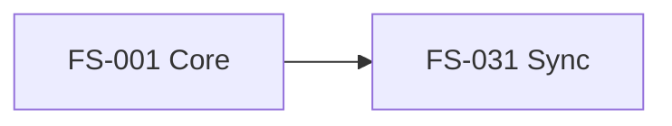

# Delivery Plans Architecture Analysis

**Date**: 2025-11-13
**Context**: Increment 0031 - External Tool Status Sync
**Decision**: Where do delivery plans belong in SpecWeave's internal docs structure?

---

## Question

Should delivery planning artifacts (ADO Delivery Plans, JIRA Roadmaps, GitHub Projects) be stored in:
- `internal/specs/` (with features)?
- `internal/delivery/` (with CI/CD)?
- Somewhere else?

## Answer: `internal/delivery/` ✅

**Rationale**: Delivery plans are about **WHEN and HOW we ship**, not **WHAT we're building**.

---

## Information Architecture Clarification

| Folder | Answers | Contains | Examples |
|--------|---------|----------|----------|
| **strategy/** | **WHY?** | Business rationale | PRDs, market research, ROI analysis |
| **specs/** | **WHAT?** | Feature details | Epics (FS-*), User Stories (US-*), Acceptance Criteria |
| **architecture/** | **HOW? (Technical)** | System design | HLDs, ADRs, component diagrams |
| **delivery/** | **WHEN + HOW WE SHIP?** | Release planning | Git workflow, CI/CD, DORA metrics, **delivery plans** |
| **operations/** | **HOW WE RUN?** | Production ops | Runbooks, incidents, monitoring |

**Key Insight**: Delivery plans are **execution-level** (sprint/quarter timelines), not **strategic-level** (3-year vision).

---

## Proposed Structure

```
.specweave/docs/internal/delivery/
├── guides/                        # Existing: How-to guides
│   ├── increment-lifecycle.md
│   └── branch-strategy.md
├── metrics/                       # Existing: DORA metrics
│   └── dora-metrics.md
├── ci-cd/                        # Existing: Automation
│   └── pipeline-configuration.md
└── plans/                        # ✨ NEW: Delivery planning
    ├── 2025-q4-platform.md       # Q4 2025 delivery plan
    ├── 2026-q1-features.md       # Q1 2026 delivery plan
    └── README.md                 # How delivery plans work
```

---

## Delivery Plan File Format

**File**: `.specweave/docs/internal/delivery/plans/2025-q4-platform.md`

```yaml
---
id: delivery-2025-q4
title: "Q4 2025 Platform Modernization"
timeline: "Oct 1 - Dec 31, 2025"
external_tools:
  ado_plan:
    name: "Q4 2025 Platform"
    url: "https://dev.azure.com/org/project/_plans/planId=123"
  jira_roadmap:
    name: "2025 Product Roadmap"
    url: "https://company.atlassian.net/jira/plans/456"
  github_project:
    name: "Platform Modernization"
    url: "https://github.com/orgs/company/projects/10"
epics:
  - id: FS-001
    title: "Core Framework Architecture"
    timeline: "Oct 1 - Nov 15"
    status: "completed"
  - id: FS-031
    title: "External Tool Status Sync"
    timeline: "Dec 1 - Dec 31"
    status: "in-progress"
    depends_on: [FS-001]
---

# Q4 2025 Platform Modernization

## Overview
Strategic delivery plan for platform modernization initiative...

## Timeline

### October-November: Foundation
- **FS-001**: Core Framework Architecture
  - Status: ✅ Completed (Nov 15)
  - Delivered: Increment lifecycle, living docs sync

### December: Integration
- **FS-031**: External Tool Status Sync
  - Status: 🚧 In Progress
  - Depends on: FS-001
  - Target: Dec 31, 2025

## External Plans
- [ADO Delivery Plan](https://dev.azure.com/org/project/_plans/planId=123)
- [JIRA Roadmap](https://company.atlassian.net/jira/plans/456)
- [GitHub Project](https://github.com/orgs/company/projects/10)

## Dependencies


## Risks
- FS-031 depends on FS-001 completion
- ADO API rate limits may impact sync performance
```

---

## Epic Frontmatter Changes

**Epics reference delivery plans** (bidirectional linking):

**File**: `.specweave/docs/internal/specs/default/FS-031-external-tool-status-sync/README.md`

```yaml
---
id: FS-031
title: "External Tool Status Sync"
# ... existing fields ...
delivery:
  plan: "delivery-2025-q4"              # Link to delivery plan
  plan_file: "../../delivery/plans/2025-q4-platform.md"
  timeline: "Dec 1-31, 2025"
external_tools:
  ado:
    epic: 123
    plan: 456                            # ADO Delivery Plan ID
    plan_url: "https://dev.azure.com/org/project/_plans/planId=456"
  jira:
    epic: "PLAT-123"
    roadmap: 789
    roadmap_url: "https://company.atlassian.net/jira/plans/789"
  github:
    milestone: 10
    project: 20                          # GitHub Project ID
    project_url: "https://github.com/orgs/company/projects/20"
---
```

---

## Key Benefits

### 1. Clear Separation of Concerns
- **specs/** = Feature definition (WHAT)
- **delivery/** = Release coordination (WHEN)

### 2. Cohesion
All shipping-related docs together:
- Git workflow
- CI/CD pipelines
- DORA metrics
- Release strategy
- **Delivery plans** ← New addition!

### 3. Cross-Project by Nature
- Delivery plans span multiple epics
- Naturally fit with other cross-project delivery docs

### 4. Traceability
Clear flow:
```
Strategy → Specs → Architecture → Delivery → Operations
   WHY       WHAT       HOW        WHEN       RUN
```

---

## Implementation Phases

### Phase 1: Metadata in Epic Frontmatter (Immediate)
- Add `delivery.plan` field to epic frontmatter
- Add `external_tools.*.plan_url` for tool-specific links
- **No new sync logic** - just metadata

### Phase 2: Delivery Plan Files (Optional)
- Create `delivery/plans/` folder
- Add delivery plan template
- Document in delivery guides

### Phase 3: Sync Commands (Future)
```bash
# Link epic to ADO delivery plan
/specweave-ado:link-plan FS-031 --plan-id 456

# Sync all epics in a delivery plan
/specweave:sync-delivery-plan 2025-q4
```

---

## Migration

**Existing Epics**: No changes required
- Epics without delivery plans work fine (solo devs)
- Add `delivery` frontmatter when needed (enterprises)

**No Breaking Changes**: This is additive, not disruptive.

---

## Decision

✅ **Delivery plans belong in `internal/delivery/plans/`**

**Reasons**:
1. Delivery plans are about WHEN (not WHAT)
2. Cohesion with CI/CD, DORA metrics, git workflow
3. Cross-project by nature (like other delivery docs)
4. Clear separation from feature specs

**Action**: Update architecture docs to reflect this structure.
