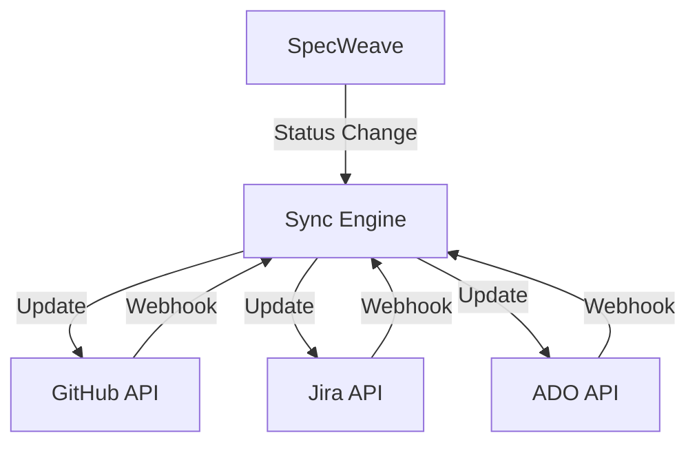

# Universal Hierarchy Design - Detailed Structure

**Date**: 2025-11-14
**Related**: ADR-0032, Increment 0031
**Status**: Design Complete - Ready for Implementation

---

## Table of Contents

1. [New Folder Structure](#new-folder-structure)
2. [File Templates](#file-templates)
3. [Migration Mapping](#migration-mapping)
4. [Cross-Project Examples](#cross-project-examples)
5. [Implementation Checklist](#implementation-checklist)

---

## New Folder Structure

### Complete Directory Tree

```
.specweave/docs/internal/specs/
├── README.md                                      # Project overview (updated)
│
├── _epics/                                        # ✨ NEW: Cross-project epics (themes)
│   ├── EPIC-2025-Q4-platform/
│   │   └── EPIC.md                                # Epic overview + linked features
│   ├── EPIC-2025-Q3-ux-refresh/
│   │   └── EPIC.md
│   └── EPIC-2026-Q1-scalability/
│       └── EPIC.md
│
├── _features/                                     # ✨ NEW: Cross-project features
│   ├── FS-25-11-12-external-tool-sync/
│   │   └── FEATURE.md                             # Feature overview (high-level)
│   ├── FS-25-11-10-user-authentication/
│   │   └── FEATURE.md
│   ├── FS-25-11-05-dashboard-redesign/
│   │   └── FEATURE.md
│   └── FS-25-10-28-cicd-automation/
│       └── FEATURE.md
│
├── backend/                                       # Backend project
│   ├── README.md                                  # Backend project overview
│   ├── FS-25-11-12-external-tool-sync/            # Feature impl for backend
│   │   ├── README.md                              # Feature context (backend-specific)
│   │   ├── us-001-backend-api.md                  # User stories
│   │   ├── us-002-webhook-handler.md
│   │   └── us-003-database-schema.md
│   ├── FS-25-11-10-user-authentication/           # Another feature
│   │   ├── README.md
│   │   ├── us-001-oauth-api.md
│   │   └── us-002-jwt-tokens.md
│   └── FS-25-10-20-notification-service/          # Backend-only feature
│       ├── README.md
│       └── us-001-email-notifications.md
│
├── frontend/                                      # Frontend project
│   ├── README.md                                  # Frontend project overview
│   ├── FS-25-11-12-external-tool-sync/            # SAME feature, different impl
│   │   ├── README.md                              # Feature context (frontend-specific)
│   │   ├── us-001-status-display-ui.md            # User stories
│   │   └── us-002-manual-sync-button.md
│   ├── FS-25-11-10-user-authentication/           # SAME feature
│   │   ├── README.md
│   │   ├── us-001-login-form.md
│   │   └── us-002-session-handling.md
│   └── FS-25-11-05-dashboard-redesign/            # Frontend-only feature
│       ├── README.md
│       ├── us-001-new-layout.md
│       └── us-002-dark-mode.md
│
├── mobile/                                        # Mobile project (optional)
│   ├── README.md                                  # Mobile project overview
│   └── FS-25-11-10-user-authentication/           # SAME feature (if needed)
│       ├── README.md
│       └── us-001-biometric-login.md
│
└── infrastructure/                                # Infrastructure project (optional)
    ├── README.md                                  # Infrastructure project overview
    └── FS-25-10-28-cicd-automation/               # Infrastructure-specific feature
        ├── README.md
        └── us-001-github-actions.md
```

### Key Structural Principles

1. **_epics/** - Cross-project strategic themes
   - One epic can contain multiple features
   - Maps to: Jira Initiative/Theme, ADO Epic, GitHub Organization Project

2. **_features/** - Cross-project feature definitions
   - High-level "what" (not "how")
   - Links to all project-specific implementations
   - Maps to: Jira Epic, ADO Feature/Capability, GitHub Milestone

3. **{project}/** - Project-specific implementations
   - Each project (backend, frontend, mobile) has its own folder
   - Contains FS-* subfolders for features implemented in that project
   - One feature can appear in multiple projects!

4. **{project}/FS-*/** - Feature implementation for specific project
   - README.md explains feature context for this project
   - us-*.md files are user stories specific to this project

---

## File Templates

### 1. Epic File Template (`_epics/EPIC-*/EPIC.md`)

```yaml
---
id: EPIC-2025-Q4-platform
title: "2025 Q4 Platform Improvements"
type: epic
status: in-progress
priority: P0
created: 2025-10-01
last_updated: 2025-11-14
quarter: 2025-Q4
# External Tool Mapping
external_tools:
  jira:
    type: initiative
    key: null
    url: null
  ado:
    type: epic
    id: null
    url: null
  github:
    type: organization-project
    id: null
    url: null
---

# EPIC-2025-Q4: Platform Improvements

## Strategic Overview

**Business Goal**: Improve platform stability, performance, and developer experience to support 10x user growth in 2026.

**Key Objectives**:
- 99.9% uptime (up from 99.5%)
- 50% reduction in deployment time
- 80% reduction in manual sync work
- Complete observability across all services

## Features in This Epic

### Phase 1: Foundation (Oct-Nov 2025)
- [FS-25-10-28: CI/CD Automation](../../_features/FS-25-10-28-cicd-automation/FEATURE.md)
- [FS-25-11-10: User Authentication Overhaul](../../_features/FS-25-11-10-user-authentication/FEATURE.md)

### Phase 2: Integration (Nov-Dec 2025)
- [FS-25-11-12: External Tool Status Sync](../../_features/FS-25-11-12-external-tool-sync/FEATURE.md)
- [FS-25-11-20: Real-Time Monitoring](../../_features/FS-25-11-20-real-time-monitoring/FEATURE.md)

### Phase 3: Polish (Dec 2025)
- [FS-25-12-01: Performance Optimization](../../_features/FS-25-12-01-performance-optimization/FEATURE.md)

## Success Metrics

| Metric | Target | Current | Status |
|--------|--------|---------|--------|
| Uptime | 99.9% | 99.5% | 🟡 In Progress |
| Deployment Time | 5 min | 15 min | 🟡 In Progress |
| Manual Sync Work | 2 hours/week | 10 hours/week | 🔴 Not Started |
| Observability Coverage | 100% | 60% | 🟡 In Progress |

## Timeline

**Start**: 2025-10-01
**Target Completion**: 2025-12-31 (Q4 end)
**Current Phase**: Phase 2 (Integration)

## Stakeholders

- **Sponsor**: CTO
- **Product Owner**: Head of Engineering
- **Technical Lead**: SpecWeave Core Team
- **QA Lead**: QA Manager

## Dependencies

- **External**: GitHub API, Jira API, Azure DevOps API
- **Internal**: Auth service, Notification service, Metrics service

## Risks

| Risk | Impact | Mitigation |
|------|--------|------------|
| API rate limits | High | Implement caching, batch operations |
| Team capacity | Medium | Prioritize P0/P1 features, defer P2/P3 |
| Third-party API changes | Medium | Version pinning, adapter pattern |

## External Tool Integration

**Jira Initiative**: Not yet synced
**Azure DevOps Epic**: Not yet synced
**GitHub Organization Project**: Not yet synced

---

**Created**: 2025-10-01
**Last Updated**: 2025-11-14
**Next Review**: 2025-12-01
```

### 2. Feature File Template (`_features/FS-*/FEATURE.md`)

```yaml
---
id: FS-25-11-12-external-tool-sync
title: "External Tool Status Synchronization"
type: feature
status: in-progress
priority: P1
created: 2025-11-12
last_updated: 2025-11-14
epic: EPIC-2025-Q4-platform
# Projects implementing this feature
projects:
  - backend
  - frontend
# External Tool Mapping
external_tools:
  github:
    type: milestone
    id: 5
    url: https://github.com/anton-abyzov/specweave/milestone/5
  jira:
    type: epic
    key: SPEC-123
    url: https://company.atlassian.net/browse/SPEC-123
  ado:
    type: feature
    id: 456
    url: https://dev.azure.com/org/project/_workitems/edit/456
---

# FS-25-11-12: External Tool Status Synchronization

## Feature Overview

Enable automatic bidirectional synchronization of increment status between SpecWeave and external tools (GitHub, Jira, Azure DevOps). Eliminate manual work by syncing status changes, rich content, and task-level traceability.

**Problem**: Users must manually update status in multiple tools, leading to inconsistencies and wasted time.

**Solution**: Automatic sync triggered by status changes in either SpecWeave or external tools.

## Business Value

- **Time Savings**: 5-10 minutes per increment (50% reduction in manual work)
- **Consistency**: Single source of truth with automatic propagation
- **Traceability**: Complete history from epic → feature → user story → task
- **Team Alignment**: Stakeholders see real-time progress without asking

## Projects Implementing This Feature

### Backend
- API endpoints for status sync
- Webhook handlers for external events
- Database schema for sync state
- Background jobs for retry logic

### Frontend
- UI for displaying sync status
- Manual sync triggers
- Conflict resolution UI
- Real-time status updates

## User Stories (Cross-Project View)

### Backend User Stories (3)
- [US-001: Backend API for Status Sync](../../backend/FS-25-11-12-external-tool-sync/us-001-backend-api.md)
- [US-002: Webhook Handler for External Events](../../backend/FS-25-11-12-external-tool-sync/us-002-webhook-handler.md)
- [US-003: Database Schema for Sync State](../../backend/FS-25-11-12-external-tool-sync/us-003-database-schema.md)

### Frontend User Stories (2)
- [US-001: Status Display UI](../../frontend/FS-25-11-12-external-tool-sync/us-001-status-ui.md)
- [US-002: Manual Sync Button](../../frontend/FS-25-11-12-external-tool-sync/us-002-manual-sync.md)

### Total: 5 User Stories

## Implementation History

| Increment | Projects | Stories Implemented | Status | Completion Date |
|-----------|----------|---------------------|--------|-----------------|
| [0031](../../../../increments/0031-external-tool-status-sync/) | Backend, Frontend | 5 stories | ✅ Complete | 2025-11-14 |

## Architecture



## Technical Stack

- **Backend**: Node.js 18+, PostgreSQL, Redis
- **Frontend**: React 18+, TypeScript
- **External APIs**: @octokit/rest, Jira REST API, Azure DevOps REST API

## Dependencies

- **Requires**: Increment 0011 (Multi-project sync)
- **Enhances**: GitHub plugin, Jira plugin, ADO plugin

## Success Metrics

| Metric | Target | Current |
|--------|--------|---------|
| Sync Accuracy | 95%+ | TBD |
| Sync Latency | <2s | TBD |
| Manual Work Reduction | 50%+ | TBD |
| User Satisfaction | 90%+ | TBD |

## External Tool Integration

**GitHub Milestone**: https://github.com/anton-abyzov/specweave/milestone/5
**Jira Epic**: https://company.atlassian.net/browse/SPEC-123
**Azure DevOps Feature**: https://dev.azure.com/org/project/_workitems/edit/456

---

**Created**: 2025-11-12
**Last Updated**: 2025-11-14
**Status**: In Progress
```

### 3. Project README Template (`{project}/README.md`)

```yaml
---
project: backend
title: "Backend Services"
type: project
status: active
created: 2024-01-01
last_updated: 2025-11-14
tech_stack:
  - Node.js 18+
  - PostgreSQL 14+
  - Redis 7+
  - Docker
team:
  - Backend Team Lead
  - 3 Backend Engineers
  - 1 DevOps Engineer
---

# Backend Services Project

## Project Overview

Backend services for SpecWeave platform, including APIs, background jobs, and data persistence.

## Tech Stack

- **Runtime**: Node.js 18+
- **Framework**: Express.js 4.x
- **Database**: PostgreSQL 14+ (primary), Redis 7+ (cache/queue)
- **ORM**: Prisma 5.x
- **Testing**: Jest, Supertest
- **Deployment**: Docker, Kubernetes (AWS EKS)

## Active Features

| Feature | User Stories | Status | Priority | Completion Date |
|---------|--------------|--------|----------|-----------------|
| [FS-25-11-12: External Tool Sync](./FS-25-11-12-external-tool-sync/) | 3 | ✅ Complete | P1 | 2025-11-14 |
| [FS-25-11-10: User Authentication](./FS-25-11-10-user-authentication/) | 2 | 🚧 In Progress | P0 | TBD |
| [FS-25-10-28: CI/CD Automation](./FS-25-10-28-cicd-automation/) | 1 | 🚧 In Progress | P1 | TBD |

## Structure

Each feature folder contains:
- **README.md** - Feature context for backend (tech stack, dependencies)
- **us-NNN-{name}.md** - User stories specific to backend

## Recent Increments

- [0031: External Tool Status Sync](../../../increments/0031-external-tool-status-sync/) (2025-11-14)
- [0030: User Authentication Overhaul](../../../increments/0030-user-authentication/) (2025-11-10)
- [0029: CI/CD Automation](../../../increments/0029-cicd-automation/) (2025-10-28)

## External Tool Integration

**GitHub Repository**: https://github.com/anton-abyzov/specweave-backend
**Jira Project**: https://company.atlassian.net/browse/BACKEND
**Azure DevOps Project**: https://dev.azure.com/org/backend

---

**Last Updated**: 2025-11-14
```

### 4. Feature Context Template (`{project}/FS-*/README.md`)

```yaml
---
id: FS-25-11-12-external-tool-sync-backend
title: "External Tool Status Sync - Backend Implementation"
feature: FS-25-11-12-external-tool-sync
project: backend
type: feature-context
status: completed
priority: P1
created: 2025-11-12
completed: 2025-11-14
---

# Backend Implementation: External Tool Status Sync

**Feature**: [FS-25-11-12: External Tool Status Sync](../../../_features/FS-25-11-12-external-tool-sync/FEATURE.md)

## Backend-Specific Context

This feature requires backend to provide:
1. **REST API endpoints** for triggering status sync
2. **Webhook handlers** for receiving external tool events
3. **Database schema** for tracking sync state and history
4. **Background jobs** for retry logic and batch operations

## Tech Stack

- **API Framework**: Express.js 4.x
- **Database**: PostgreSQL 14+ (sync state, audit logs)
- **Cache/Queue**: Redis 7+ (job queue, rate limiting)
- **External APIs**:
  - GitHub: @octokit/rest (v20.x)
  - Jira: Jira REST API v3
  - Azure DevOps: azure-devops-node-api (v12.x)

## User Stories (Backend)

- [US-001: Backend API for Status Sync](./us-001-backend-api.md)
- [US-002: Webhook Handler for External Events](./us-002-webhook-handler.md)
- [US-003: Database Schema for Sync State](./us-003-database-schema.md)

## Dependencies

### External Services
- GitHub API (rate limit: 5000 req/hour with OAuth)
- Jira REST API (rate limit: varies by plan)
- Azure DevOps REST API (rate limit: varies by plan)

### Internal Services
- **Auth Service**: Provides OAuth tokens for external tools
- **Notification Service**: Sends alerts on sync failures
- **Metrics Service**: Tracks sync latency and success rate

## Database Schema

```sql
-- Sync state table
CREATE TABLE external_tool_sync_state (
  id UUID PRIMARY KEY,
  increment_id VARCHAR(100) NOT NULL,
  tool_type VARCHAR(50) NOT NULL,  -- 'github', 'jira', 'ado'
  external_id VARCHAR(100) NOT NULL,
  status VARCHAR(50) NOT NULL,     -- 'synced', 'pending', 'failed'
  last_synced_at TIMESTAMPTZ,
  created_at TIMESTAMPTZ DEFAULT NOW(),
  updated_at TIMESTAMPTZ DEFAULT NOW()
);

-- Sync history (audit log)
CREATE TABLE external_tool_sync_history (
  id UUID PRIMARY KEY,
  increment_id VARCHAR(100) NOT NULL,
  tool_type VARCHAR(50) NOT NULL,
  action VARCHAR(50) NOT NULL,     -- 'status_update', 'content_sync'
  old_status VARCHAR(50),
  new_status VARCHAR(50),
  success BOOLEAN NOT NULL,
  error_message TEXT,
  created_at TIMESTAMPTZ DEFAULT NOW()
);
```

## API Endpoints

### POST /api/sync/status
**Request**:
```json
{
  "incrementId": "0031-external-tool-status-sync",
  "status": "completed",
  "tools": ["github", "jira", "ado"]
}
```

**Response**:
```json
{
  "success": true,
  "results": {
    "github": { "synced": true, "issueNumber": 45 },
    "jira": { "synced": true, "key": "SPEC-123" },
    "ado": { "synced": true, "id": 456 }
  }
}
```

### POST /api/webhooks/github
Receives GitHub webhook events (issue closed, reopened, etc.)

### POST /api/webhooks/jira
Receives Jira webhook events (status changed, etc.)

### POST /api/webhooks/ado
Receives Azure DevOps webhook events (work item state changed, etc.)

## Testing Strategy

- **Unit Tests**: 90% coverage (sync logic, status mapping, conflict resolution)
- **Integration Tests**: 85% coverage (GitHub API, Jira API, ADO API)
- **E2E Tests**: 100% critical paths (full sync workflow)

## Performance Targets

- **Sync Latency**: <2 seconds per increment
- **Batch Operations**: <5 seconds for 10 increments
- **Webhook Processing**: <500ms per event

## Security

- OAuth tokens stored in environment variables (GITHUB_TOKEN, JIRA_API_TOKEN, AZURE_DEVOPS_PAT)
- No secrets in config files
- Rate limiting per external tool
- Audit logging for all sync operations

## Related Features

- [FS-25-11-10: User Authentication](../FS-25-11-10-user-authentication/) (provides OAuth tokens)
- [FS-25-10-20: Notification Service](../FS-25-10-20-notification-service/) (sends sync failure alerts)

---

**Implementation**: [Increment 0031](../../../../increments/0031-external-tool-status-sync/)
**Completion Date**: 2025-11-14
```

### 5. User Story Template (`{project}/FS-*/us-NNN-{name}.md`)

```yaml
---
id: us-001-backend-api
title: "Backend API for Status Sync"
feature: FS-25-11-12-external-tool-sync
project: backend
type: user-story
status: completed
priority: P1
created: 2025-11-12
completed: 2025-11-14
# External Tool Mapping
external_tools:
  github:
    type: issue
    number: 45
    url: https://github.com/anton-abyzov/specweave/issues/45
  jira:
    type: story
    key: SPEC-124
    url: https://company.atlassian.net/browse/SPEC-124
  ado:
    type: user-story
    id: 457
    url: https://dev.azure.com/org/project/_workitems/edit/457
---

# US-001: Backend API for Status Sync

**Feature**: [FS-25-11-12: External Tool Status Sync](../../../../_features/FS-25-11-12-external-tool-sync/FEATURE.md)
**Project**: Backend

## User Story

**As a** SpecWeave user
**I want** a backend API that syncs increment status with external tools
**So that** my increments are always in sync with GitHub/Jira/ADO

## Acceptance Criteria

- [ ] **AC-US1-01**: POST /api/sync/status endpoint accepts increment ID and status (P1, testable)
- [ ] **AC-US1-02**: Endpoint validates status against configured mappings (P1, testable)
- [ ] **AC-US1-03**: Successful sync returns 200 with sync confirmation (P1, testable)
- [ ] **AC-US1-04**: Failed sync returns 4xx/5xx with error details (P1, testable)
- [ ] **AC-US1-05**: Endpoint supports batch operations (sync multiple increments) (P2, testable)
- [ ] **AC-US1-06**: Retry logic with exponential backoff on failures (P2, testable)

## Business Rationale

External stakeholders (PM, clients, executives) need to see increment status in their preferred tool (GitHub, Jira, ADO) without manual updates. Automating sync saves 5-10 minutes per increment and ensures consistency.

## Implementation

Implemented in:
- **Increment**: [0031-external-tool-status-sync](../../../../increments/0031-external-tool-status-sync/)
- **Tasks**:
  - [T-001: Create API endpoint](../../../../increments/0031-external-tool-status-sync/tasks.md#t-001-create-api-endpoint)
  - [T-002: Add validation](../../../../increments/0031-external-tool-status-sync/tasks.md#t-002-add-validation)
  - [T-003: Write unit tests](../../../../increments/0031-external-tool-status-sync/tasks.md#t-003-write-unit-tests)
  - [T-004: Write integration tests](../../../../increments/0031-external-tool-status-sync/tasks.md#t-004-write-integration-tests)

## Test Plan

### Unit Tests (`backend/tests/sync-api.test.ts`)
- Valid sync request returns 200
- Invalid increment ID returns 404
- Invalid status returns 400
- Validation logic works correctly

### Integration Tests (`backend/tests/sync-api.integration.test.ts`)
- Sync with GitHub API succeeds
- Sync with Jira API succeeds
- Sync with ADO API succeeds
- Retry logic works on failures

### E2E Tests (`tests/e2e/sync-workflow.spec.ts`)
- Complete sync workflow (SpecWeave → GitHub → Jira → ADO)

## Related Stories

- [US-002: Webhook Handler](./us-002-webhook-handler.md) (receives external events)
- [Frontend US-001](../../frontend/FS-25-11-12-external-tool-sync/us-001-status-ui.md) (consumes this API)

## External Tool Links

- **GitHub Issue #45**: https://github.com/anton-abyzov/specweave/issues/45
- **Jira Story SPEC-124**: https://company.atlassian.net/browse/SPEC-124
- **ADO User Story #457**: https://dev.azure.com/org/project/_workitems/edit/457

---

**Created**: 2025-11-12
**Completed**: 2025-11-14
**Tested**: ✅ All tests passing
```

---

## Migration Mapping

### Old Structure → New Structure

#### Example 1: Single-Project Feature (No Cross-Project)

**OLD** (Feature only in `default/`):
```
.specweave/docs/internal/specs/
└── default/
    └── intelligent-model-selection/
        ├── FEATURE.md
        ├── us-001-*.md
        └── us-002-*.md
```

**NEW** (Single project = "backend"):
```
.specweave/docs/internal/specs/
├── _features/
│   └── FS-25-09-15-intelligent-model-selection/
│       └── FEATURE.md                            # Cross-project overview
└── backend/
    └── FS-25-09-15-intelligent-model-selection/
        ├── README.md                              # Backend-specific context
        ├── us-001-*.md
        └── us-002-*.md
```

#### Example 2: Cross-Project Feature (Backend + Frontend)

**OLD** (Can't represent cross-project):
```
.specweave/docs/internal/specs/
└── default/
    └── external-tool-status-sync/
        ├── FEATURE.md
        ├── us-001-*.md                            # Mixed backend + frontend stories
        └── us-002-*.md
```

**NEW** (Properly separated):
```
.specweave/docs/internal/specs/
├── _features/
│   └── FS-25-11-12-external-tool-sync/
│       └── FEATURE.md                            # Cross-project overview
├── backend/
│   └── FS-25-11-12-external-tool-sync/
│       ├── README.md                              # Backend context
│       ├── us-001-backend-api.md                  # Backend stories
│       └── us-002-webhook-handler.md
└── frontend/
    └── FS-25-11-12-external-tool-sync/
        ├── README.md                              # Frontend context
        ├── us-001-status-ui.md                    # Frontend stories
        └── us-002-manual-sync-button.md
```

#### Example 3: Epic with Multiple Features

**NEW** (Epic support):
```
.specweave/docs/internal/specs/
├── _epics/
│   └── EPIC-2025-Q4-platform/
│       └── EPIC.md                                # Strategic theme
├── _features/
│   ├── FS-25-11-12-external-tool-sync/
│   │   └── FEATURE.md                            # Feature 1
│   ├── FS-25-11-10-user-authentication/
│   │   └── FEATURE.md                            # Feature 2
│   └── FS-25-10-28-cicd-automation/
│       └── FEATURE.md                            # Feature 3
└── (projects implement features...)
```

---

## Cross-Project Examples

### Example 1: User Authentication Feature

**Feature**: FS-25-11-10-user-authentication

**Projects Involved**: Backend, Frontend, Mobile

**Structure**:
```
_features/
└── FS-25-11-10-user-authentication/
    └── FEATURE.md                                # High-level: OAuth, JWT, session management

backend/
└── FS-25-11-10-user-authentication/
    ├── README.md                                  # Backend: OAuth API, JWT tokens, Redis sessions
    ├── us-001-oauth-api.md                        # Backend: Implement OAuth 2.0 flow
    ├── us-002-jwt-tokens.md                       # Backend: Generate/validate JWT
    └── us-003-session-management.md               # Backend: Redis session store

frontend/
└── FS-25-11-10-user-authentication/
    ├── README.md                                  # Frontend: Login UI, session handling
    ├── us-001-login-form.md                       # Frontend: Login/signup forms
    ├── us-002-session-handling.md                 # Frontend: Token refresh, logout
    └── us-003-protected-routes.md                 # Frontend: Route guards

mobile/
└── FS-25-11-10-user-authentication/
    ├── README.md                                  # Mobile: Biometric auth, secure storage
    ├── us-001-biometric-login.md                  # Mobile: Face ID/Touch ID
    └── us-002-secure-token-storage.md             # Mobile: Keychain/Keystore
```

**External Tool Mapping**:
- **GitHub**: Milestone "FS-25-11-10: User Authentication"
  - Issue #50: "Backend OAuth API" (backend/us-001)
  - Issue #51: "Frontend Login Form" (frontend/us-001)
  - Issue #52: "Mobile Biometric Login" (mobile/us-001)
- **Jira**: Epic "SPEC-100: User Authentication"
  - Story "SPEC-101: Backend OAuth API"
  - Story "SPEC-102: Frontend Login Form"
  - Story "SPEC-103: Mobile Biometric Login"
- **Azure DevOps**: Feature #200 "User Authentication"
  - User Story #201: "Backend OAuth API"
  - User Story #202: "Frontend Login Form"
  - User Story #203: "Mobile Biometric Login"

### Example 2: Dashboard Redesign (Frontend-Only)

**Feature**: FS-25-11-05-dashboard-redesign

**Projects Involved**: Frontend only

**Structure**:
```
_features/
└── FS-25-11-05-dashboard-redesign/
    └── FEATURE.md                                # High-level: New layout, dark mode, widgets

frontend/
└── FS-25-11-05-dashboard-redesign/
    ├── README.md                                  # Frontend: React components, CSS-in-JS
    ├── us-001-new-layout.md                       # Frontend: Grid layout system
    ├── us-002-dark-mode.md                        # Frontend: Theme toggle
    └── us-003-custom-widgets.md                   # Frontend: Drag-and-drop widgets
```

**External Tool Mapping**:
- **GitHub**: Milestone "FS-25-11-05: Dashboard Redesign"
  - Issue #60: "New Grid Layout"
  - Issue #61: "Dark Mode Toggle"
- **Jira**: Epic "SPEC-110: Dashboard Redesign"
  - Story "SPEC-111: New Grid Layout"
  - Story "SPEC-112: Dark Mode Toggle"

---

## Implementation Checklist

### Phase 1: Structure Creation
- [ ] Create `_epics/` folder
- [ ] Create `_features/` folder
- [ ] Create project folders (backend/, frontend/, mobile/, infrastructure/)
- [ ] Create README.md for each project

### Phase 2: Migration Script
- [ ] Detect which features are cross-project vs single-project
- [ ] Extract feature creation dates from increment metadata
- [ ] Create FS-YY-MM-DD folders in `_features/`
- [ ] Create FS-YY-MM-DD folders in each project
- [ ] Move user stories to project-specific folders
- [ ] Create README.md for each feature context

### Phase 3: Code Updates
- [ ] Update HierarchyMapper to support `_features/`, `_epics/`, and project folders
- [ ] Update SpecDistributor to write to new locations
- [ ] Update GitHub sync to map features → milestones
- [ ] Update Jira sync to map features → epics
- [ ] Update ADO sync to map features → features/capabilities

### Phase 4: Testing
- [ ] Test migration script with existing specs
- [ ] Test living docs sync with new structure
- [ ] Test external tool sync with new hierarchy
- [ ] Run full test suite

### Phase 5: Documentation
- [ ] Update public documentation
- [ ] Update CLAUDE.md
- [ ] Create migration guide for users

---

**Design Complete**: 2025-11-14
**Ready for Implementation**: Yes
**Next Step**: Update `hierarchy-mapper.ts` to support new structure
