# Comprehensive Archiving Flow - Visual Diagram

**Date**: 2025-11-19
**Increment**: 0047-us-task-linkage

## Complete Archiving Flow

### Single Command Does Everything

```mermaid
sequenceDiagram
    participant User
    participant Archive as /specweave:archive
    participant IncArchiver as IncrementArchiver
    participant FeatArchiver as FeatureArchiver
    participant FS as File System

    User->>Archive: /specweave:archive 0047
    Archive->>IncArchiver: archive({ increments: ['0047'] })

    Note over IncArchiver: 1. Validation Checks
    IncArchiver->>IncArchiver: shouldArchive(0047)?
    IncArchiver->>IncArchiver: ✓ Status: completed
    IncArchiver->>IncArchiver: ✓ No active external sync
    IncArchiver->>IncArchiver: ✓ No duplicates in _archive

    Note over IncArchiver: 2. Move Increment
    IncArchiver->>FS: fs.move(increments/0047, increments/_archive/0047)
    FS-->>IncArchiver: ✓ Moved

    Note over IncArchiver: 3. AUTOMATIC Feature Archiving
    IncArchiver->>IncArchiver: updateReferences(0047)
    IncArchiver->>FeatArchiver: archiveFeatures({ updateLinks: true })

    Note over FeatArchiver: 4. Extract Feature ID
    FeatArchiver->>FeatArchiver: 0047 → FS-047

    Note over FeatArchiver: 5. Check Archive Criteria
    FeatArchiver->>FeatArchiver: getAllIncrements(FS-047)
    FeatArchiver->>FeatArchiver: Are all increments archived? ✓ YES

    Note over FeatArchiver: 6. Archive Shared Feature
    FeatArchiver->>FS: fs.move(_features/FS-047, _features/_archive/FS-047)
    FS-->>FeatArchiver: ✓ Moved

    Note over FeatArchiver: 7. Archive Project-Specific Features
    FeatArchiver->>FeatArchiver: archiveProjectSpecificFolders(FS-047)
    FeatArchiver->>FS: fs.move(specs/specweave/FS-047, specs/specweave/_archive/FS-047)
    FS-->>FeatArchiver: ✓ Moved

    Note over FeatArchiver: 8. Update Links
    FeatArchiver->>FeatArchiver: updateAllLinks()
    FeatArchiver->>FS: Update *.md files
    FeatArchiver->>FS: /_features/FS-047/ → /_features/_archive/FS-047/
    FeatArchiver->>FS: /specs/specweave/FS-047/ → /specs/specweave/_archive/FS-047/
    FS-->>FeatArchiver: ✓ Updated

    FeatArchiver-->>IncArchiver: { archivedFeatures: ['FS-047'], updatedLinks: 12 }
    IncArchiver-->>Archive: { archived: ['0047'], totalSize: 2.4MB }
    Archive-->>User: ✅ Archived 0047 + FS-047 (all locations)
```



## Directory Changes

### Before Archiving

```
.specweave/
├── increments/
│   └── 0047-us-task-linkage/          ← Active increment
│       ├── spec.md
│       ├── plan.md
│       ├── tasks.md
│       └── metadata.json
│
└── docs/internal/specs/
    ├── _features/
    │   └── FS-047/                    ← Shared feature
    │       ├── FEATURE.md
    │       ├── us-001-*.md
    │       └── us-002-*.md
    │
    └── specweave/
        └── FS-047/                    ← Project-specific feature
            ├── README.md
            ├── us-001-*.md
            └── us-002-*.md
```

### After `/specweave:archive 0047`

```
.specweave/
├── increments/
│   └── _archive/
│       └── 0047-us-task-linkage/      ← MOVED HERE ✓
│           ├── spec.md
│           ├── plan.md
│           ├── tasks.md
│           └── metadata.json
│
└── docs/internal/specs/
    ├── _features/
    │   └── _archive/
    │       └── FS-047/                ← MOVED HERE ✓
    │           ├── FEATURE.md
    │           ├── us-001-*.md
    │           └── us-002-*.md
    │
    └── specweave/
        └── _archive/
            └── FS-047/                ← MOVED HERE ✓
                ├── README.md
                ├── us-001-*.md
                └── us-002-*.md
```

**Result**: All three locations archived with a single command! ✅

## Link Updates

### Before Archiving

```markdown
<!-- In README.md -->
See [FS-047 Feature](.specweave/docs/internal/specs/_features/FS-047/FEATURE.md)
See [FS-047 Implementation](.specweave/docs/internal/specs/specweave/FS-047/README.md)
```

### After `/specweave:archive 0047`

```markdown
<!-- In README.md -->
See [FS-047 Feature](.specweave/docs/internal/specs/_features/_archive/FS-047/FEATURE.md)
See [FS-047 Implementation](.specweave/docs/internal/specs/specweave/_archive/FS-047/README.md)
```

**Result**: All markdown links updated automatically! ✅

## Architecture Components

### 1. Increment-to-Feature Mapping


**Logic**:
- **Greenfield** (native SpecWeave): `increment XXXX` → `FS-XXX`
- **Brownfield** (imported): Uses explicit `feature:` from spec.md frontmatter

### 2. Archive Trigger Conditions

```mermaid
graph TD
    A[Feature FS-047] --> B{All increments<br/>archived?}
    B -->|NO| C[Skip archiving<br/>Feature stays active]
    B -->|YES| D{Any active<br/>projects?}
    D -->|YES| E[Skip archiving<br/>Feature stays active]
    D -->|NO| F[✅ Archive FS-047<br/>All locations]

    F --> G[_features/_archive/FS-047]
    F --> H[specweave/_archive/FS-047]
    F --> I[Update all links]

    style F fill:#c8e6c9
    style G fill:#c8e6c9
    style H fill:#c8e6c9
    style I fill:#c8e6c9
    style C fill:#ffcdd2
    style E fill:#ffcdd2
```



**Safety**: Features archived ONLY when:
1. ✅ ALL linked increments are in `_archive/`
2. ✅ NO active User Stories in project folders

### 3. Project-Specific Archiving


**Logic**: Finds ALL project folders with the feature and archives each one

## Code Flow

### IncrementArchiver.archiveIncrement()

```typescript
// Location: src/core/increment/increment-archiver.ts:252-288

async archiveIncrement(increment: string) {
  // 1. Duplicate check
  const duplicates = await detectDuplicatesByNumber(incrementNumber, rootDir);
  if (archiveDuplicates.length > 0) throw new Error('...');

  // 2. Move increment
  await fs.move(
    '.specweave/increments/0047-us-task-linkage',
    '.specweave/increments/_archive/0047-us-task-linkage'
  );

  // 3. Clear cache
  IncrementNumberManager.clearCache();

  // 4. AUTOMATIC feature archiving
  await this.updateReferences(increment);
}
```

### IncrementArchiver.updateReferences()

```typescript
// Location: src/core/increment/increment-archiver.ts:318-344

async updateReferences(increment: string) {
  // Import FeatureArchiver dynamically
  const { FeatureArchiver } = await import('../living-docs/feature-archiver.js');
  const featureArchiver = new FeatureArchiver(this.rootDir);

  // Archive features whose all increments are archived
  const result = await featureArchiver.archiveFeatures({
    dryRun: false,
    updateLinks: true,           // ← Updates markdown links
    preserveActiveFeatures: true, // ← Safety check
    archiveOrphanedFeatures: false,
    archiveOrphanedEpics: false
  });

  // Log results
  if (result.archivedFeatures.length > 0) {
    this.logger.success(
      `Archived ${result.archivedFeatures.length} features linked to increment ${increment}`
    );
  }
}
```

### FeatureArchiver.archiveProjectSpecificFolders()

```typescript
// Location: src/core/living-docs/feature-archiver.ts:256-272

async archiveProjectSpecificFolders(featureId: string) {
  // Get all project folders with this feature
  const projectPattern = path.join(this.specsDir, '*', featureId);
  const projectFolders = await glob(projectPattern, {
    ignore: ['**/node_modules/**', '**/_features/**', '**/_epics/**', '**/_archive/**']
  });

  // Archive each project folder
  for (const folder of projectFolders) {
    const projectId = path.basename(path.dirname(folder));
    const archivePath = path.join(this.specsDir, projectId, '_archive', featureId);

    await fs.ensureDir(path.dirname(archivePath));
    await fs.move(folder, archivePath, { overwrite: false });

    console.log(`  ✅ Archived ${projectId}/${featureId}`);
  }
}
```

## Restoration Flow

### Unarchiving (Reverse Process)

```bash
# Restore increment 0047 (ALSO restores FS-047 from all archive locations)
/specweave:restore 0047
```

**What happens**:
1. Move increment: `_archive/0047` → `increments/0047`
2. Move shared feature: `_features/_archive/FS-047` → `_features/FS-047`
3. Move project features: `specs/specweave/_archive/FS-047` → `specs/specweave/FS-047`
4. Update all links (reverse direction)

**Location**: `src/core/living-docs/feature-archiver.ts:609-640` (restoreFeature)

## Summary

### ✅ What's Already Implemented

1. **Increment Archiving**: `/specweave:archive 0047`
   - Moves increment to `_archive/`
   - AUTOMATICALLY triggers feature archiving

2. **Feature Archiving** (Automatic):
   - Archives `_features/FS-047` → `_features/_archive/FS-047`
   - Archives `specs/{project}/FS-047` → `specs/{project}/_archive/FS-047`
   - Updates all markdown links

3. **Safety Checks**:
   - Only archives when ALL increments archived
   - Preserves features with active projects
   - Prevents duplicates

4. **Restoration**:
   - `/specweave:restore 0047` reverses everything
   - Restores feature from all archive locations

### ❌ What's NOT Needed

1. ~~Create new archiving logic~~ (Already exists!)
2. ~~Add feature-to-increment mapping~~ (Already implemented!)
3. ~~Manual two-step process~~ (Single command does everything!)

### ✅ Recommended Workflow

**Simple**:
```bash
# Archive everything (increment + all feature locations)
/specweave:archive 0047
```

**That's it!** No need for `/specweave:archive-features` - it's automatic!

---

**Conclusion**: The comprehensive archiving architecture requested is **fully implemented** and **working as designed**. No changes needed! 🎉
