# Bidirectional Sync Architecture Analysis

**Date**: 2025-11-19
**Increment**: 0047-us-task-linkage
**Author**: Architecture Review
**Status**: Critical Missing Functionality Identified

---

## Executive Summary

**CRITICAL GAP IDENTIFIED**: The current US-Task Linkage architecture (increment 0047) only supports **unidirectional sync** (Internal → Living Docs → External Tool). This is fundamentally incomplete for real-world brownfield projects where:

1. **External items already exist** (GitHub Issues, JIRA Epics, ADO Work Items created before SpecWeave adoption)
2. **Teams continue creating items externally** (GitHub-first workflow, JIRA boards, ADO backlogs)
3. **Mixed origin items must coexist** (internal planning + external stakeholder requests)

This analysis proposes a **complete bidirectional sync architecture** with:
- **Origin tracking** (Internal vs External via ID suffix)
- **Initial import** (pull existing items after `specweave init`)
- **ID collision resolution** (sequential numbering with suffix)
- **Bidirectional updates** (sync in both directions)

---

## Current State (Incomplete Architecture)

### What We Have Now


**Flow**: Internal ONLY → External

**Problems**:
1. ❌ No way to import existing GitHub issues created before SpecWeave adoption
2. ❌ No way to handle stakeholder-created JIRA epics (external origin)
3. ❌ No origin tracking (can't tell if US-001 was created internally or externally)
4. ❌ ID collisions inevitable (internal US-010 conflicts with imported GitHub issue)
5. ❌ Living docs only show internally-created items

---

## Required Architecture (Bidirectional Sync)

### Complete Bidirectional Flow

```mermaid
graph TB
    subgraph "SpecWeave Core"
        A[spec.md]
        B[tasks.md]
        C[Living Docs]
    end

    subgraph "External Tools"
        D[GitHub Issues]
        E[JIRA Epics]
        F[ADO Work Items]
    end

    G[specweave init] -->|1. Initial Import| D
    G -->|1. Initial Import| E
    G -->|1. Initial Import| F

    D -->|2. Create Internal Items with E suffix| A
    E -->|2. Create Internal Items with E suffix| A
    F -->|2. Create Internal Items with E suffix| A

    A -->|3. Sync to Living Docs| C
    B -->|3. Sync to Living Docs| C

    A -->|4. Push Internal → External| D
    A -->|4. Push Internal → External| E
    A -->|4. Push Internal → External| F

    D -->|5. Pull External Updates| A
    E -->|5. Pull External Updates| A
    F -->|5. Pull External Updates| A

    style G fill:#FFD700
    style A fill:#90EE90
    style B fill:#90EE90
    style C fill:#87CEEB
    style D fill:#FFB6C1
    style E fill:#FFB6C1
    style F fill:#FFB6C1
```



**Key Features**:
1. ✅ **Initial Import**: Pull existing items from external tools on `specweave init`
2. ✅ **Origin Tracking**: ID suffix distinguishes internal (US-001) vs external (US-001E)
3. ✅ **Bidirectional Updates**: Sync flows both ways (internal ↔ external)
4. ✅ **ID Collision Resolution**: Sequential numbering continues across both types
5. ✅ **Living Docs Integration**: Mix of internal and external items in same folder

---

## ID Scheme with Origin Marker

### Design Principle

**Every User Story and Task gets an ID that permanently indicates its origin.**

### ID Format

```
Internal Items:  US-001, US-002, US-010, T-001, T-005
External Items:  US-001E, US-002E, US-011E, T-001E, T-006E
                             ↑
                          E suffix = External origin
```

### ID Assignment Rules

| Scenario | Internal ID | External ID | Example |
|----------|-------------|-------------|---------|
| First increment (greenfield) | US-001 | - | US-001, US-002, US-003 |
| After external import | US-001 | US-002E, US-003E | US-001 (internal), US-002E (GitHub), US-003E (JIRA) |
| Mixed creation | US-001, US-004 | US-002E, US-003E, US-005E | US-001, US-002E, US-003E, US-004, US-005E |
| Next available ID | US-006 | US-007E | Sequential, suffix indicates origin |

### Sequential Numbering Logic

```typescript
function getNextUserStoryId(existingIds: string[], origin: 'internal' | 'external'): string {
  // Extract numeric part from all IDs (ignore suffix)
  const numbers = existingIds.map(id => {
    const match = id.match(/US-(\d+)E?/);
    return match ? parseInt(match[1], 10) : 0;
  });

  const maxNumber = Math.max(0, ...numbers);
  const nextNumber = maxNumber + 1;
  const paddedNumber = String(nextNumber).padStart(3, '0');

  return origin === 'external'
    ? `US-${paddedNumber}E`  // US-011E
    : `US-${paddedNumber}`;  // US-011
}
```

**Example Sequence**:
```
Increment 0047 (internal):  US-001, US-002, US-003, US-004, US-005, US-006
GitHub import (external):   US-007E, US-008E
JIRA import (external):     US-009E, US-010E
Next internal:              US-011
Next external (GitHub):     US-012E
```

**No Conflicts**: Internal US-010 and External US-010E can both exist (different origin).

---

## Initial Import After `specweave init`

### When It Happens

```bash
# User initializes SpecWeave in existing project
specweave init .

# After basic setup, CLI detects external tool configuration
✓ Initialized SpecWeave structure
✓ Created .specweave/ directory
✓ Detected GitHub remote: https://github.com/anton-abyzov/specweave

? Import existing GitHub issues? (Y/n)
? Time range for import? (default: last 1 month)
  1. Last 1 week
  2. Last 1 month (recommended)
  3. Last 3 months
  4. Last 6 months
  5. All time (may take a while)

> 2

⏳ Importing GitHub issues from last 1 month...
  Found 47 issues (12 open, 35 closed)

  Filtering by labels: enhancement, bug, feature...
  Selected 12 issues for import

  Creating User Stories:
  ✓ US-001E: [FS-043][US-001] Status Line Shows Correct Active Increment
  ✓ US-002E: [FS-043][US-002] AC Status Sync
  ...
  ✓ US-012E: [FS-047][US-006] Migration Tooling

✅ Imported 12 User Stories from GitHub
✅ Updated living docs: .specweave/docs/internal/specs/specweave/
✅ Ready to create internal items (next ID: US-013)
```

### Import Configuration

**Environment Variables**:
```bash
# .env
SPECWEAVE_EXTERNAL_IMPORT_ENABLED=true
SPECWEAVE_IMPORT_TIME_RANGE_MONTHS=1
SPECWEAVE_IMPORT_PAGE_SIZE=100
SPECWEAVE_IMPORT_LABEL_FILTER="enhancement,feature"
```

**Config File**:
```json
// .specweave/config.json
{
  "externalImport": {
    "enabled": true,
    "timeRangeMonths": 1,
    "pageSize": 100,
    "github": {
      "labelFilter": ["enhancement", "feature", "bug"],
      "stateFilter": ["open", "closed"],
      "excludeLabels": ["duplicate", "invalid"]
    },
    "jira": {
      "jqlFilter": "project = SPEC AND created >= -30d",
      "issueTypes": ["Epic", "Story"]
    },
    "ado": {
      "wiqlFilter": "[System.CreatedDate] >= @Today - 30",
      "workItemTypes": ["Epic", "User Story"]
    }
  }
}
```

### Pagination Support

**GitHub API** (rate limit: 5000 requests/hour):
```typescript
async function importGitHubIssues(timeRangeMonths: number): Promise<ExternalUserStory[]> {
  const octokit = new Octokit({ auth: process.env.GITHUB_TOKEN });
  const since = new Date();
  since.setMonth(since.getMonth() - timeRangeMonths);

  const issues: ExternalUserStory[] = [];
  let page = 1;
  const perPage = 100;  // GitHub max

  while (true) {
    const response = await octokit.issues.listForRepo({
      owner: 'anton-abyzov',
      repo: 'specweave',
      since: since.toISOString(),
      state: 'all',
      labels: 'enhancement,feature',
      per_page: perPage,
      page: page
    });

    if (response.data.length === 0) break;

    // Convert GitHub issues to User Stories
    response.data.forEach(issue => {
      issues.push(convertGitHubIssueToUS(issue, 'external'));
    });

    page++;

    // Rate limit check
    if (page > 10) {
      console.log('⚠️  Large import detected. Continue? (Y/n)');
      // Interactive confirmation
    }
  }

  return issues;
}
```

**JIRA API** (pagination via `startAt`):
```typescript
async function importJiraIssues(timeRangeMonths: number): Promise<ExternalUserStory[]> {
  const jira = new JiraClient({ host: process.env.JIRA_HOST, ... });
  const jql = `project = SPEC AND created >= -${timeRangeMonths * 30}d`;

  const issues: ExternalUserStory[] = [];
  let startAt = 0;
  const maxResults = 50;  // JIRA default

  while (true) {
    const response = await jira.searchJira(jql, { startAt, maxResults });

    if (response.issues.length === 0) break;

    response.issues.forEach(issue => {
      issues.push(convertJiraIssueToUS(issue, 'external'));
    });

    startAt += response.issues.length;
    if (startAt >= response.total) break;
  }

  return issues;
}
```

**ADO API** (pagination via `continuationToken`):
```typescript
async function importADOWorkItems(timeRangeMonths: number): Promise<ExternalUserStory[]> {
  const ado = new AzureDevOpsClient({ orgUrl: process.env.ADO_ORG_URL, ... });
  const wiql = `SELECT [System.Id] FROM WorkItems WHERE [System.CreatedDate] >= @Today - ${timeRangeMonths * 30}`;

  const issues: ExternalUserStory[] = [];
  let continuationToken: string | undefined;

  while (true) {
    const response = await ado.wit.queryByWiql({ query: wiql }, { continuationToken });

    if (!response.workItems || response.workItems.length === 0) break;

    // Batch get work item details
    const ids = response.workItems.map(wi => wi.id);
    const details = await ado.wit.getWorkItems(ids);

    details.forEach(item => {
      issues.push(convertADOWorkItemToUS(item, 'external'));
    });

    continuationToken = response.continuationToken;
    if (!continuationToken) break;
  }

  return issues;
}
```

---

## ID Collision Resolution

### Problem: Mixed Internal and External IDs

**Scenario**:
```
Day 1 (Internal Planning):
  - Create US-001: User Authentication (internal)
  - Create US-002: Payment Integration (internal)
  - Create US-003: Admin Dashboard (internal)

Day 2 (External Import from GitHub):
  - Import GH-#456: Database Migration (created by external team)
  - Import GH-#457: Performance Optimization (created by external team)

  Question: What IDs should these get?
  ❌ WRONG: US-001E, US-002E (conflicts with internal IDs semantically)
  ✅ CORRECT: US-004E, US-005E (continues sequential numbering)

Day 3 (Internal Planning):
  - Create US-006: Reporting Module (internal, continues sequence)

Day 4 (External Import from JIRA):
  - Import JIRA-SPEC-789: API Rate Limiting
  - Assign: US-007E (continues sequence)
```

**Result**: `US-001, US-002, US-003, US-004E, US-005E, US-006, US-007E`

### Algorithm: Next Available ID

```typescript
interface UserStoryMetadata {
  id: string;           // US-001 or US-001E
  origin: 'internal' | 'external';
  externalId?: string;  // GitHub #456, JIRA-SPEC-789, ADO-12345
  externalUrl?: string; // Full URL to external item
}

function getNextAvailableUSId(
  existingUSs: UserStoryMetadata[],
  origin: 'internal' | 'external'
): string {
  // Extract all numeric IDs (strip US- prefix and E suffix)
  const allNumbers = existingUSs.map(us => {
    const match = us.id.match(/US-(\d+)E?/);
    return match ? parseInt(match[1], 10) : 0;
  });

  // Find max ID across BOTH internal and external
  const maxId = Math.max(0, ...allNumbers);
  const nextId = maxId + 1;
  const paddedId = String(nextId).padStart(3, '0');

  // Apply suffix based on origin
  return origin === 'external' ? `US-${paddedId}E` : `US-${paddedId}`;
}

// Example usage:
const existing = [
  { id: 'US-001', origin: 'internal' },
  { id: 'US-002', origin: 'internal' },
  { id: 'US-003', origin: 'internal' },
  { id: 'US-004E', origin: 'external', externalId: 'GH-#456' },
  { id: 'US-005E', origin: 'external', externalId: 'GH-#457' }
];

getNextAvailableUSId(existing, 'internal');  // US-006
getNextAvailableUSId(existing, 'external'); // US-007E
```

### Conflict Scenarios and Resolution

| Scenario | Internal IDs | External IDs | Next Internal | Next External | Notes |
|----------|--------------|--------------|---------------|---------------|-------|
| Greenfield (no external) | US-001, US-002, US-003 | - | US-004 | US-004E | First external starts at 004E |
| Import before any internal | - | US-001E, US-002E | US-003 | US-003E | External gets lower IDs |
| Mixed creation | US-001, US-002, US-004 | US-003E, US-005E | US-006 | US-007E | Sequential across both |
| Sparse numbering | US-001, US-010 | US-005E | US-011 | US-012E | Gaps allowed, max wins |

---

## Living Docs Structure with Mixed Origins

### Folder Organization

**Option 1: Single Folder (Recommended)**
```
.specweave/docs/internal/specs/specweave/FS-047/
├── FEATURE.md                                    # Feature overview
├── us-001-explicit-us-task-linkage.md           # Internal US
├── us-002-ac-task-mapping.md                    # Internal US
├── us-003-automatic-living-docs-sync.md         # Internal US
├── us-004e-github-imported-issue.md             # External US (GitHub)
├── us-005e-jira-epic-integration.md             # External US (JIRA)
├── us-006-progress-tracking.md                  # Internal US
└── us-007e-ado-work-item-sync.md                # External US (ADO)
```

**Key Points**:
- ✅ Lowercase IDs in filenames: `us-004e` (not `us-004E`)
- ✅ Suffix in filename distinguishes origin
- ✅ Mix internal and external in same feature folder
- ✅ No separate folders needed

**Option 2: Separate Folders (Not Recommended)**
```
.specweave/docs/internal/specs/specweave/FS-047/
├── internal/
│   ├── us-001-explicit-us-task-linkage.md
│   ├── us-002-ac-task-mapping.md
│   └── us-003-automatic-living-docs-sync.md
└── external/
    ├── us-004e-github-imported-issue.md
    ├── us-005e-jira-epic-integration.md
    └── us-007e-ado-work-item-sync.md
```

**Problems**:
- ❌ Harder to navigate (two folders instead of one)
- ❌ Breaks alphabetical sorting (US-001, US-002, US-003, then jump to external/)
- ❌ Complicates linking (../../external/us-004e vs ../us-004e)

**Verdict**: **Use Option 1** (single folder, suffix in filename)

### User Story Markdown with Origin Badge

**Internal User Story** (`us-001-explicit-us-task-linkage.md`):
```markdown
---
id: US-001
title: Explicit US-Task Linkage in tasks.md
feature: FS-047
origin: internal
status: completed
---

# US-001: Explicit US-Task Linkage in tasks.md

**Origin**: 🏠 Internal

**As a** developer implementing an increment
**I want** tasks to explicitly declare which User Story they belong to
**So that** I can trace implementation back to requirements

...
```

**External User Story** (`us-004e-github-imported-issue.md`):
```markdown
---
id: US-004E
title: Status Line Shows Correct Active Increment
feature: FS-043
origin: external
externalSource: github
externalId: '#638'
externalUrl: https://github.com/anton-abyzov/specweave/issues/638
importedAt: 2025-11-19T10:30:00Z
status: open
---

# US-004E: Status Line Shows Correct Active Increment

**Origin**: 🔗 [GitHub #638](https://github.com/anton-abyzov/specweave/issues/638)
**Imported**: 2025-11-19

**As a** developer tracking progress
**I want** the Claude Code status line to show the active increment
**So that** I know which increment is currently being worked on

...
```

**Origin Badges**:
- 🏠 **Internal**: Created in SpecWeave increment
- 🔗 **GitHub**: Imported from GitHub issue
- 🎫 **JIRA**: Imported from JIRA epic
- 📋 **ADO**: Imported from Azure DevOps work item

---

## Bidirectional Sync Flows

### Flow 1: Internal → External (Push)

**Scenario**: Create User Story in SpecWeave, push to GitHub


**Result**:
- spec.md: `US-001` (internal ID, no E suffix)
- Living docs: `us-001-title.md` with link to GitHub #638
- GitHub: Issue #638 with title `[FS-047][US-001] Title`
- Metadata: `{ id: 'US-001', origin: 'internal', externalId: 'GH-#638' }`

### Flow 2: External → Internal (Pull)

**Scenario**: Import existing GitHub issue created before SpecWeave


**Result**:
- spec.md: `US-004E` (external ID, E suffix)
- Living docs: `us-004e-title.md` with origin badge [GitHub #456]
- Metadata: `{ id: 'US-004E', origin: 'external', externalId: 'GH-#456', externalUrl: '...' }`

### Flow 3: External Update → Internal Sync

**Scenario**: External stakeholder updates GitHub issue, sync to SpecWeave


**Result**:
- spec.md: US-004E status updated to `completed`
- Living docs: AC checkboxes updated
- No new ID creation (existing US-004E updated)

---

## Origin Metadata Structure

### spec.md Frontmatter (Extended)

```yaml
---
increment: 0047-us-task-linkage
title: "US-Task Linkage Architecture"
type: feature
priority: P0
status: active
created: 2025-11-19
epic: FS-047
test_mode: test-after
coverage_target: 90

# NEW: External import tracking
external_items:
  - id: US-004E
    origin: external
    source: github
    external_id: '#638'
    external_url: https://github.com/anton-abyzov/specweave/issues/638
    imported_at: 2025-11-19T10:30:00Z
    sync_direction: bidirectional

  - id: US-005E
    origin: external
    source: jira
    external_id: SPEC-789
    external_url: https://company.atlassian.net/browse/SPEC-789
    imported_at: 2025-11-19T11:00:00Z
    sync_direction: bidirectional
---
```

### User Story Metadata in spec.md

**Internal User Story**:
```markdown
### US-001: Explicit US-Task Linkage in tasks.md

**Origin**: Internal
**As a** developer implementing an increment
...
```

**External User Story**:
```markdown
### US-004E: Status Line Shows Correct Active Increment

**Origin**: External ([GitHub #638](https://github.com/anton-abyzov/specweave/issues/638))
**Imported**: 2025-11-19
**External Status**: Open
**Sync**: Bidirectional

**As a** developer tracking progress
...
```

### Task Metadata in tasks.md

**Internal Task**:
```markdown
### T-001: Create task parser with US linkage extraction

**User Story**: US-001
**Satisfies ACs**: AC-US1-01, AC-US1-03
**Origin**: Internal
**Status**: [x] completed
...
```

**External Task**:
```markdown
### T-010E: Fix status line display bug

**User Story**: US-004E
**Satisfies ACs**: AC-US4E-01, AC-US4E-02
**Origin**: External ([GitHub #638 - Subtask](https://github.com/anton-abyzov/specweave/issues/638#task-10))
**External ID**: GH-#638-T10
**Sync**: Bidirectional
**Status**: [ ] pending
...
```

---

## Required New User Stories

### US-007: External Item Import on Init

**As a** team adopting SpecWeave in a brownfield project
**I want** to import existing external items (GitHub/JIRA/ADO) during initialization
**So that** I don't lose historical context and can continue from current state

**Acceptance Criteria**:
- **AC-US7-01**: After `specweave init`, CLI prompts to import from detected external tools
- **AC-US7-02**: Import pulls items from configurable time range (default: 1 month)
- **AC-US7-03**: Pagination support for large imports (100+ items)
- **AC-US7-04**: Imported items get E suffix (US-001E, T-001E)
- **AC-US7-05**: Import updates living docs with external items
- **AC-US7-06**: Import preserves external metadata (ID, URL, creation date)
- **AC-US7-07**: Interactive confirmation before importing large datasets
- **AC-US7-08**: Support GitHub, JIRA, and Azure DevOps imports

### US-008: ID Collision Resolution

**As a** developer creating mixed internal/external items
**I want** ID generation to avoid collisions between internal and external IDs
**So that** every item has a unique identifier with clear origin

**Acceptance Criteria**:
- **AC-US8-01**: ID generator detects highest sequential number (ignoring suffix)
- **AC-US8-02**: New internal items use next sequential number (no suffix)
- **AC-US8-03**: New external items use next sequential number + E suffix
- **AC-US8-04**: Mixed IDs allowed in same increment (US-001, US-002E, US-003, US-004E)
- **AC-US8-05**: ID uniqueness validation before assignment
- **AC-US8-06**: Legacy IDs preserved during migration (no renumbering)

### US-009: Origin Tracking and Metadata

**As a** PM managing mixed internal/external items
**I want** clear origin indicators for every User Story and Task
**So that** I know which items were created internally vs imported

**Acceptance Criteria**:
- **AC-US9-01**: Every US/Task has origin field in metadata (internal | external)
- **AC-US9-02**: Origin determines sync direction (internal → external, external → internal)
- **AC-US9-03**: External items preserve original external ID for reference
- **AC-US9-04**: Living docs show origin badge (🏠 Internal, 🔗 GitHub, 🎫 JIRA, 📋 ADO)
- **AC-US9-05**: Origin immutable after creation (can't change internal ↔ external)
- **AC-US9-06**: Sync logs track origin-based update conflicts

---

## Implementation Impact

### Components Requiring Changes

| Component | Current State | Required Changes | Effort |
|-----------|---------------|------------------|--------|
| **ID Generator** | Sequential (US-001, US-002) | Add suffix logic, collision detection | 4 hours |
| **spec.md Parser** | Parse internal IDs only | Parse US-XXXE and T-XXXE formats | 3 hours |
| **tasks.md Parser** | Parse internal IDs only | Parse T-XXXE format, extract origin | 3 hours |
| **Living Docs Sync** | Internal → Living Docs only | Bidirectional sync (internal ↔ external) | 8 hours |
| **GitHub Sync** | Internal → GitHub only | Pull external → Internal, detect origin | 12 hours |
| **JIRA Sync** | Internal → JIRA only | Pull external → Internal, pagination | 12 hours |
| **ADO Sync** | Internal → ADO only | Pull external → Internal, WIQL support | 12 hours |
| **Validator** | Validate internal IDs | Validate both internal and external IDs | 4 hours |
| **Progress Tracker** | Track internal progress | Track mixed internal/external progress | 3 hours |
| **Init Command** | Create structure only | Add import flow, external tool detection | 8 hours |
| **PM Agent** | Generate internal items | Support mixed internal/external context | 4 hours |

**Total Additional Effort**: ~73 hours (~9 days)

### New Files Required

```
src/
├── importers/
│   ├── github-importer.ts         # NEW: GitHub issue import
│   ├── jira-importer.ts            # NEW: JIRA epic import
│   ├── ado-importer.ts             # NEW: ADO work item import
│   └── import-coordinator.ts       # NEW: Orchestrate all imports
│
├── id-generators/
│   ├── us-id-generator.ts          # MODIFIED: Add E suffix logic
│   ├── task-id-generator.ts        # MODIFIED: Add E suffix logic
│   └── id-collision-resolver.ts    # NEW: Detect and resolve collisions
│
├── sync/
│   ├── bidirectional-sync.ts       # NEW: Two-way sync orchestration
│   ├── origin-tracker.ts           # NEW: Track item origin metadata
│   └── external-update-detector.ts # NEW: Detect external changes
│
tests/
├── unit/importers/                 # NEW: Import tests
├── unit/id-generators/             # NEW: ID generation tests
└── integration/sync/               # NEW: Bidirectional sync tests
```

---

## Configuration Schema

### .specweave/config.json

```json
{
  "externalImport": {
    "enabled": true,
    "autoImportOnInit": true,
    "timeRangeMonths": 1,
    "pageSize": 100,

    "github": {
      "enabled": true,
      "labelFilter": ["enhancement", "feature", "bug"],
      "stateFilter": ["open", "closed"],
      "excludeLabels": ["duplicate", "invalid", "wontfix"],
      "assigneeFilter": null,
      "milestoneFilter": null
    },

    "jira": {
      "enabled": false,
      "jqlFilter": "project = SPEC AND created >= -30d",
      "issueTypes": ["Epic", "Story"],
      "statusFilter": ["Open", "In Progress", "Resolved"]
    },

    "ado": {
      "enabled": false,
      "wiqlFilter": "[System.CreatedDate] >= @Today - 30",
      "workItemTypes": ["Epic", "User Story"],
      "areaPathFilter": null,
      "iterationPathFilter": null
    }
  },

  "sync": {
    "direction": "bidirectional",  // internal-to-external | external-to-internal | bidirectional
    "conflictResolution": "prompt", // prompt | external-wins | internal-wins | manual
    "syncInterval": 300,            // seconds (5 minutes)
    "batchSize": 50
  },

  "idGeneration": {
    "externalSuffix": "E",
    "paddingDigits": 3,
    "allowGaps": true,
    "validateUniqueness": true
  }
}
```

---

## Migration Path for Existing Projects

### Scenario: Existing SpecWeave Project (40+ Increments)

**Challenge**: Existing increments use internal-only IDs (US-001, US-002, ..., US-047)

**Options**:

#### Option 1: Preserve Existing IDs (Recommended)
```
Existing increments (0001-0046):  US-001, US-002, ..., US-200 (all internal)
External import (first time):     US-201E, US-202E, US-203E
New internal (0047+):              US-204, US-205
```

**Pros**:
- ✅ No renumbering of existing items
- ✅ Clear boundary (all IDs < 201 are pre-import internal)
- ✅ Zero migration cost

**Cons**:
- ❌ Non-sequential numbering (gaps if external import is small)

#### Option 2: Renumber with Suffix (Not Recommended)
```
Existing increments (0001-0046):  Renumber all to US-001I, US-002I, ..., US-200I
External import (first time):     US-001E, US-002E, US-003E
New internal (0047+):              US-201I, US-202I
```

**Pros**:
- ✅ Clear suffix indicates internal origin

**Cons**:
- ❌ Massive migration effort (update 40+ increments, living docs, external links)
- ❌ Breaks existing external tool references
- ❌ High risk of breaking links

**Verdict**: **Use Option 1** (preserve existing IDs)

---

## Risks and Mitigation

| Risk | Impact | Likelihood | Mitigation |
|------|--------|------------|------------|
| **External API rate limits hit during import** | Import fails halfway | Medium | Pagination + rate limit monitoring + retry logic |
| **ID collisions despite suffix** | Duplicate IDs created | Low | Validation before assignment, abort on conflict |
| **Large imports (1000+ items) freeze CLI** | Poor UX, timeout | Medium | Batch import, progress bar, interactive confirmation |
| **External updates conflict with internal edits** | Data loss, desync | High | Conflict detection + prompt for resolution + audit log |
| **Performance degradation (bidirectional sync)** | Slow commands | Medium | Caching, debouncing, incremental sync |
| **Complexity explosion (3 external tools × 2 directions)** | Bugs, maintenance burden | High | Abstraction layer, shared sync logic, comprehensive tests |

---

## Success Criteria

### Functional Requirements Met

- ✅ Import existing GitHub issues/JIRA epics/ADO items after `specweave init`
- ✅ ID suffix distinguishes internal (US-001) vs external (US-001E)
- ✅ Sequential numbering continues across both types
- ✅ Living docs show mixed internal and external items
- ✅ Bidirectional sync: internal ↔ external
- ✅ Origin metadata preserved (externalId, externalUrl, importedAt)
- ✅ Conflict detection and resolution

### Performance Requirements Met

- ✅ Import 100 items in < 30 seconds
- ✅ Pagination handles 1000+ items without freezing
- ✅ Bidirectional sync completes in < 2 seconds (95th percentile)
- ✅ ID collision detection < 100ms

### Quality Requirements Met

- ✅ 95%+ import accuracy (correct mapping)
- ✅ Zero ID collisions in production
- ✅ 100% of external items have origin metadata
- ✅ Comprehensive tests (unit, integration, E2E)
- ✅ Clear error messages for import/sync failures

---

## Conclusion

**This analysis reveals a fundamental architectural gap in increment 0047**. The current US-Task Linkage design only supports **unidirectional sync** (Internal → External), which is insufficient for real-world brownfield projects where:

1. External items already exist (pre-SpecWeave adoption)
2. Stakeholders continue creating items externally (GitHub-first workflow)
3. Mixed internal/external items must coexist

**The solution requires**:
- **Origin tracking** via ID suffix (E = External)
- **Initial import** after `specweave init`
- **ID collision resolution** (sequential numbering with suffix)
- **Bidirectional sync** (internal ↔ external)

**Impact**:
- +3 new User Stories (US-007, US-008, US-009)
- +15 new Acceptance Criteria
- +8 new tasks (~73 hours)
- Total increment effort: 183 hours (~23 days)

**Recommendation**: **Proceed with bidirectional sync architecture** as critical missing functionality. This is not optional - it's essential for SpecWeave adoption in brownfield projects.

---

**Next Steps**:
1. ✅ Update spec.md with US-007, US-008, US-009
2. ✅ Update plan.md with bidirectional sync architecture
3. ✅ Update tasks.md with new implementation tasks
4. ✅ Create ADR-0085: Bidirectional Sync Architecture Decision
5. ✅ Begin implementation of import and ID generation components
