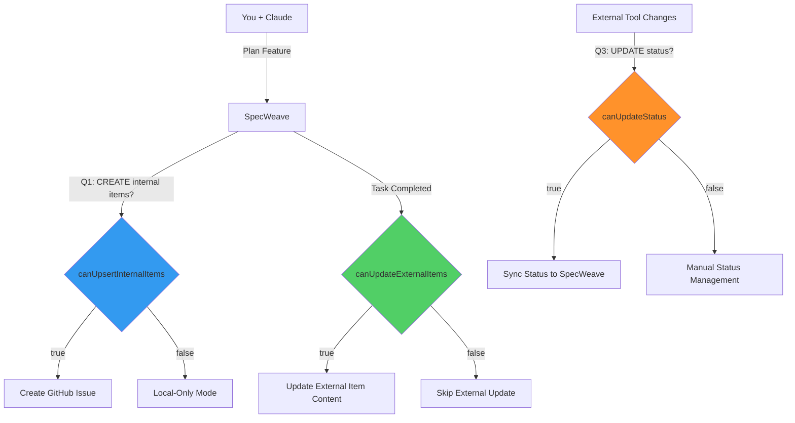
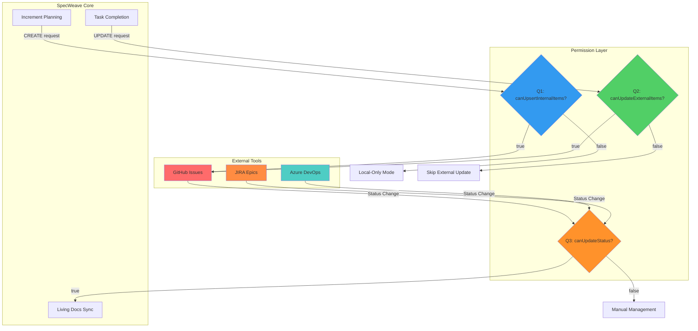
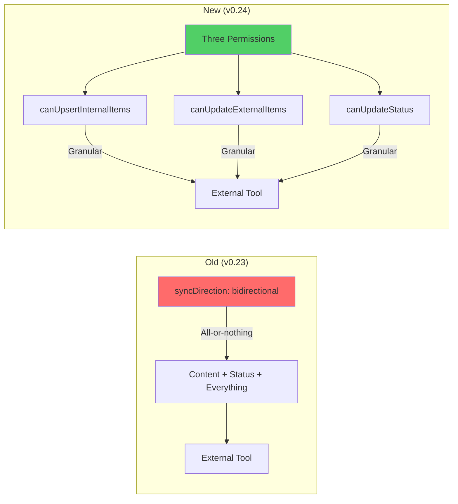

# SpecWeave Documentation Update Plan - v0.24.0

**Date**: 2025-11-20
**Increment**: 0047 - US-Task Linkage
**Objective**: Update ALL documentation to reflect three-permission architecture, remove "bidirectional sync" terminology, and create user-focused content to attract new users

---

## Executive Summary

### What Changed in v0.24.0

**MAJOR ARCHITECTURE CHANGE**: Replaced binary "bidirectional sync" flag with granular **Three-Permission Architecture**:

| Old (v0.23) | New (v0.24) |
|-------------|-------------|
| `syncDirection: "bidirectional"` | Three independent permissions |
| All-or-nothing control | Granular control per operation type |

**New Permissions**:
1. **canUpsertInternalItems** (`false` default) - CREATE + UPDATE internal items
2. **canUpdateExternalItems** (`false` default) - UPDATE external items (full content)
3. **canUpdateStatus** (`false` default) - UPDATE status (both types)

### Terminology Clarification

**CRITICAL**: Two different "bidirectional" concepts exist:

1. **Bidirectional Linking** (Task ↔ User Story) - **KEEP THIS TERM**
   - Internal traceability feature (v0.18.0+)
   - Links tasks to user stories automatically
   - Production-ready, no changes needed
   - File: `.specweave/docs/public/guides/bidirectional-linking.md` ✅

2. **Bidirectional Sync** (SpecWeave ↔ External Tools) - **DEPRECATED**
   - Old external tool sync pattern
   - Replaced with three-permission architecture
   - Files: `spec-bidirectional-sync.md`, `bidirectional-sync.md` (glossary) ❌

---

## Documentation Audit Results

### Files Requiring Updates (Priority Order)

#### P0 - Critical (User-Facing)

| File | Issue | Action |
|------|-------|--------|
| `README.md` | Section "AI Manages Your Enterprise Tools" heavily uses "bidirectional" | Rewrite to explain three permissions + add diagram |
| `.specweave/docs/public/guides/spec-bidirectional-sync.md` | Full guide on OLD architecture | Rename to `external-tool-sync.md`, complete rewrite |
| `.specweave/docs/public/glossary/terms/bidirectional-sync.md` | Detailed deprecated guide (1300 lines) | Shorten to migration guide only (300 lines) |

#### P1 - Important (Public Guides)

| File | Issue | Action |
|------|-------|--------|
| `.specweave/docs/public/guides/status-sync-guide.md` | May reference old terminology | Review and update |
| `.specweave/docs/public/guides/github-integration.md` | May reference old terminology | Review and update |
| `.specweave/docs/public/guides/sync-strategies.md` | May reference old terminology | Review and update |
| `.specweave/docs/public/guides/multi-project-sync-architecture.md` | May reference old terminology | Review and update |

#### P2 - Internal (ADRs, HLD)

| File | Issue | Action |
|------|-------|--------|
| `.specweave/docs/internal/architecture/adr/0031-003-bidirectional-sync-implementation.md` | Old ADR with deprecated terminology | Add deprecation notice, link to new ADR |
| `.specweave/docs/internal/architecture/hld/hld-external-tool-status-sync.md` | May reference old patterns | Review and update |

---

## Detailed Update Plan

### Phase 1: Critical User-Facing Content (P0)

#### Task 1: Update README.md

**Current Issues**:
- Line 140: "The SpecWeave Solution: Bidirectional AI Integration"
- Line 190: "Bidirectional sync, task tracking, auto-close, multi-repo"
- Line 329: "🤖 **AI-Native Enterprise Sync** - Claude updates JIRA/GitHub/ADO automatically (bidirectional!)"

**Proposed Changes**:

**Section 1** - "AI Manages Your Enterprise Tools" → Add Architecture Diagram:



**Section 2** - Replace "Bidirectional" with "Three-Permission Sync":

```markdown
### The SpecWeave Solution: AI-Powered Three-Permission Sync

**Control EXACTLY what Claude updates**:

1. **Q1: Can Claude CREATE and UPDATE work items it created?**
   - Answer: Yes → Claude creates GitHub issues when you plan
   - Answer: No → Local-only mode, no external items

2. **Q2: Can Claude UPDATE work items created externally?**
   - Answer: Yes → Claude updates PM-created issues
   - Answer: No → External items remain read-only

3. **Q3: Can Claude UPDATE status?**
   - Answer: Yes → Issue closures sync both ways
   - Answer: No → Manual status management

**Zero Manual Work**: Answer 3 questions during `specweave init`, Claude handles the rest.
```

**Section 3** - Update Feature Table:

| Platform | Status | Capabilities |
|----------|--------|--------------|
| **GitHub Issues** | ✅ Production | Three-permission sync, task tracking, auto-close, multi-repo |
| **JIRA** | ✅ Production | Three-permission sync, Epic/Story sync, status updates, comments |
| **Azure DevOps** | ✅ Production | Three-permission sync, Work items, hierarchy, area paths |

#### Task 2: Rewrite `spec-bidirectional-sync.md` → `external-tool-sync.md`

**New Structure**:

```markdown
# External Tool Synchronization

**Automatic synchronization between SpecWeave and external tools (GitHub, JIRA, Azure DevOps).**

## Overview

SpecWeave implements **three-permission sync** with granular control over different sync operations:

| Permission | Default | Controls | Example |
|------------|---------|----------|---------|
| **canUpsertInternalItems** | false | CREATE + UPDATE internal items | Creating GitHub issue on `/specweave:increment` |
| **canUpdateExternalItems** | false | UPDATE external items (full content) | Updating PM-created GitHub issue |
| **canUpdateStatus** | false | UPDATE status (both types) | Syncing issue closures |

---

## Architecture: Three Independent Permissions

[DIAGRAM HERE - see README.md diagram above]

### Permission 1: canUpsertInternalItems (CREATE + UPDATE)

**What it controls**:
- Creating new work items in external tools (GitHub issues, JIRA epics, ADO features)
- Updating content of SpecWeave-originated items (title, description, ACs, tasks)

**Flow**:
```
/specweave:increment "feature"
  → Claude generates spec
  → canUpsertInternalItems=true?
  → CREATE GitHub issue #42
  → As tasks complete
  → UPDATE issue content
```

**When to enable**:
- ✅ Solo developer: Create your own issues
- ✅ Team collaboration: Push SpecWeave work to external tool
- ❌ Read-only observer: Don't create items

### Permission 2: canUpdateExternalItems (Full Content Updates)

**What it controls**:
- Updating externally-originated work items (PM-created issues)
- Full content sync: title, description, ACs, tasks, comments

**Flow**:
```
PM creates GitHub issue #100
  → SpecWeave imports to living docs
  → Developer implements feature
  → canUpdateExternalItems=true?
  → UPDATE issue #100 with progress
```

**When to enable**:
- ✅ Team collaboration: Update PM-created work
- ✅ Stakeholder visibility: Keep external items current
- ❌ Read-only: External items stay as snapshots

### Permission 3: canUpdateStatus (Status Sync)

**What it controls**:
- Status field updates (Open/Closed, To Do/Done)
- Works for BOTH internal and external items

**Flow**:
```
GitHub issue #42 closed
  → canUpdateStatus=true?
  → Sync closure to SpecWeave
  → Update increment status
```

**When to enable**:
- ✅ Track external closures: Know when team closes issues
- ✅ Sync status updates: Keep systems aligned
- ❌ Manual management: Handle status yourself

---

## Configuration

**Enable Permissions** (`.specweave/config.json`):

```json
{
  "sync": {
    "enabled": true,
    "settings": {
      "canUpsertInternalItems": true,   // Q1: CREATE + UPDATE internal
      "canUpdateExternalItems": true,   // Q2: UPDATE external
      "canUpdateStatus": true           // Q3: UPDATE status
    },
    "activeProfile": "github-main",
    "profiles": {
      "github-main": {
        "provider": "github",
        "config": {
          "owner": "myorg",
          "repo": "myrepo"
        }
      }
    }
  }
}
```

---

## Common Workflows

### Workflow 1: Solo Developer (Create Own Issues)

```json
{
  "sync": {
    "settings": {
      "canUpsertInternalItems": true,   // Create my items
      "canUpdateExternalItems": false,  // No external items
      "canUpdateStatus": false          // Don't track status
    }
  }
}
```

**Use Case**: Individual working alone, creating GitHub issues for tracking

### Workflow 2: Team Collaboration (Full Sync)

```json
{
  "sync": {
    "settings": {
      "canUpsertInternalItems": true,   // Create and update my items
      "canUpdateExternalItems": true,   // Update PM-created items
      "canUpdateStatus": true           // Track issue closures
    }
  }
}
```

**Use Case**: Team using GitHub for collaboration, need full sync

### Workflow 3: Read-Only Observer (Status Only)

```json
{
  "sync": {
    "settings": {
      "canUpsertInternalItems": false,  // Don't create items
      "canUpdateExternalItems": false,  // Don't update external
      "canUpdateStatus": true           // Only pull status
    }
  }
}
```

**Use Case**: Contractor observing project, needs status updates only

---

## Migration from v0.23 (Bidirectional Sync)

**Old (v0.23)**:
```json
{
  "sync": {
    "settings": {
      "syncDirection": "bidirectional"  // ← Binary flag
    }
  }
}
```

**New (v0.24)**:
```json
{
  "sync": {
    "settings": {
      "canUpsertInternalItems": true,   // ← Granular control
      "canUpdateExternalItems": true,
      "canUpdateStatus": true
    }
  }
}
```

**Automatic Migration**: SpecWeave auto-migrates your config on upgrade.

**Manual Migration**:
```bash
npx tsx scripts/migrate-sync-permissions.ts
```

**See**: [Bidirectional Sync Migration Guide](../glossary/terms/bidirectional-sync.md)

---

## See Also

- [GitHub Integration](github-integration.md) - GitHub-specific setup
- [JIRA Integration](jira-integration.md) - JIRA-specific setup
- [Status Sync Guide](status-sync-guide.md) - Status synchronization details
```

#### Task 3: Update Glossary Term `bidirectional-sync.md`

**Current**: 1300 lines detailed guide
**New**: 300 line migration guide

**Proposed Structure**:

```markdown
# Bidirectional Sync (DEPRECATED)

> **⚠️ DEPRECATED as of v0.24.0**: Replaced with **Three-Permission Architecture**.
> This page exists for migration reference only.

---

## Quick Migration

**Old Config**:
```json
{
  "syncDirection": "bidirectional"
}
```

**New Config**:
```json
{
  "canUpsertInternalItems": true,
  "canUpdateExternalItems": true,
  "canUpdateStatus": true
}
```

**Auto-Migration**: Run `npx tsx scripts/migrate-sync-permissions.ts`

---

## What Changed?

### Old: Binary Flag (All-or-Nothing)

```
syncDirection: "bidirectional"
  ↓
Everything syncs in both directions (content + status)
```

**Problem**: No granular control.
- Can't create internal items without updating external items
- Can't update status without updating content
- No separation of concerns

### New: Three Independent Permissions

```
canUpsertInternalItems (Q1: CREATE + UPDATE internal?)
canUpdateExternalItems (Q2: UPDATE external?)
canUpdateStatus (Q3: UPDATE status?)
```

**Solution**: Fine-grained control.
- Enable only what you need
- Separate creation, content updates, and status updates
- Clear security boundaries

---

## Migration Mapping

| Old Terminology | New Permission Combination | Use Case |
|----------------|---------------------------|----------|
| `syncDirection: "bidirectional"` | All 3 = `true` | Team collaboration (full sync) |
| `syncDirection: "export"` | `canUpsertInternalItems: true`, others `false` | Solo developer |
| `syncDirection: "import"` | `canUpdateStatus: true`, others `false` | Read-only observer |
| `syncDirection: null` | All 3 = `false` | Disabled |

---

## For More Information

**New Documentation**:
- [External Tool Synchronization](../guides/external-tool-sync.md) - Complete guide
- [Three-Permission Architecture](../guides/sync-strategies.md) - Architecture details
- [GitHub Integration](../guides/github-integration.md) - Platform-specific setup

**Implementation**:
- Increment 0047 Final Summary: `.specweave/increments/0047-us-task-linkage/reports/FINAL-IMPLEMENTATION-SUMMARY-2025-11-20.md`
- CHANGELOG: `CHANGELOG.md` (v0.24.0 section)
```

---

### Phase 2: Public Guides (P1)

#### Files to Review and Update:

1. **status-sync-guide.md** - Check for "bidirectional" mentions
2. **github-integration.md** - Update sync configuration examples
3. **sync-strategies.md** - Rewrite to explain three permissions
4. **multi-project-sync-architecture.md** - Update diagrams and terminology

**Pattern**:
- Search for "bidirectional sync" (NOT "bidirectional linking")
- Replace with "three-permission sync" or "full sync (all permissions enabled)"
- Update config examples to use three permission flags
- Add links to new `external-tool-sync.md` guide

---

### Phase 3: Internal Docs (P2)

#### ADRs Requiring Updates:

| ADR | Current Title | Action |
|-----|--------------|--------|
| `0031-003-bidirectional-sync-implementation.md` | Bidirectional Sync Implementation | Add deprecation notice |

**Template for Deprecation Notice**:

```markdown
> **⚠️ DEPRECATED as of v0.24.0**: This ADR describes the original "bidirectional sync" pattern which has been replaced with the **Three-Permission Architecture** (increment 0047).
>
> **See**: `.specweave/docs/internal/architecture/adr/XXXX-three-permission-architecture.md` (new ADR)
>
> This ADR is preserved for historical reference only.

---

# ADR-0031-003: Bidirectional Sync Implementation (DEPRECATED)

[Original content follows...]
```

---

## Diagrams to Create

### Diagram 1: Three-Permission Architecture (Mermaid)



### Diagram 2: Sync Flow Comparison (Before vs After)



---

## Success Criteria

### Completion Checklist

- [ ] README.md updated with three-permission model and diagram
- [ ] `spec-bidirectional-sync.md` renamed and rewritten as `external-tool-sync.md`
- [ ] Glossary `bidirectional-sync.md` shortened to migration guide only
- [ ] All public guides reviewed and updated (status-sync, github-integration, etc.)
- [ ] Deprecated ADRs marked with deprecation notices
- [ ] All diagrams created in Mermaid format
- [ ] All cross-references verified (no broken links)
- [ ] CHANGELOG.md updated with documentation changes

### Validation Tests

1. **Link Verification**: Run `find .specweave -name "*.md" -exec grep -l "bidirectional sync" {} \;`
   - Only `bidirectional-linking.md` should appear (Task ↔ US linking)
   - NO results for external tool sync context

2. **Terminology Audit**: Search for "bidirectional" in all docs
   - "Bidirectional linking" (Task ↔ US) = KEEP
   - "Bidirectional sync" (SpecWeave ↔ External) = REMOVE

3. **Config Examples**: Verify all config examples use three permissions
   - NO `syncDirection` field
   - YES `canUpsertInternalItems`, `canUpdateExternalItems`, `canUpdateStatus`

---

## Timeline Estimate

| Phase | Tasks | Estimated Time |
|-------|-------|----------------|
| Phase 1 (P0) | README, external-tool-sync.md, glossary | 4-6 hours |
| Phase 2 (P1) | Public guides (4 files) | 2-3 hours |
| Phase 3 (P2) | Internal ADRs (1 file) | 1 hour |
| Diagrams | 2 Mermaid diagrams | 1 hour |
| Validation | Link checks, terminology audit | 1 hour |
| **Total** | | **9-12 hours** |

---

## Notes

**Critical Distinction**:
- **Bidirectional Linking** (Task ↔ User Story) - KEEP THIS TERM ✅
- **Bidirectional Sync** (SpecWeave ↔ External Tools) - REPLACE WITH "Three-Permission Sync" ❌

**Files to Preserve As-Is**:
- `.specweave/docs/public/guides/bidirectional-linking.md` (Task ↔ US traceability)
- Any references to "bidirectional linking" in context of internal traceability

**Files Requiring Complete Rewrite**:
- `spec-bidirectional-sync.md` → `external-tool-sync.md`
- `bidirectional-sync.md` (glossary) → Shorten to migration guide

**Files Requiring Terminology Updates Only**:
- README.md
- status-sync-guide.md
- github-integration.md
- sync-strategies.md
- multi-project-sync-architecture.md

---

**Last Updated**: 2025-11-20
**Author**: Claude (Sonnet 4.5)
**Increment**: 0047 - US-Task Linkage
**Status**: ✅ PLAN COMPLETE, READY FOR EXECUTION
