# External-First Format Preservation Analysis

**Date**: 2025-11-19
**Increment**: 0047-us-task-linkage
**Author**: Architecture Enhancement
**Status**: Critical Workflow Documentation
**Priority**: P0 (Affects external tool sync behavior)

---

## Executive Summary

This analysis documents the **external-first workflow with format preservation** - a critical use case where externally-originated items (GitHub issues, JIRA tickets, ADO work items) are imported into SpecWeave living docs and later implemented via increments, while **preserving their original external format**.

**Key Principle**: SpecWeave-originated items enforce our format standards (`[FS-XXX][US-YYY]`), but external items preserve their original format and receive only **non-invasive updates** (comments, not title/description rewrites).

---

## The Critical Use Case

### Scenario: External-First Implementation

**Step 1: External Item Creation**
```
External stakeholder creates GitHub issue:
  Title: "My-Specific-Item"
  Description: Custom format, no ACs/Tasks
  Created: 2025-01-15
```

**Step 2: Import to Living Docs**
```bash
$ specweave init
# Detects GitHub issue "My-Specific-Item"
# Imports to living docs:
#   .specweave/docs/internal/specs/FS-888/
#     ├── us-001-my-specific-item.md  (with E suffix internally)
#     └── us-002-other-external.md
```

**Step 3: Manual Increment Creation**
```bash
$ specweave increment "Implement FS-888 from living specs"
# Creates increment 0088 referencing FS-888
# PM agent reads living docs US-001E, generates spec.md with ACs
```

**Step 4: Task Completion & Sync**
```
Developer completes tasks in increment 0088
→ Hook triggers: Increment → Living Docs sync (one-way)
→ Living docs US-001E updated with completed tasks
→ Hook triggers: Living Docs → External Tool sync
→ **CRITICAL DECISION POINT**:
   ❓ Do we rewrite GitHub issue title to "[FS-888][US-001]"?
   ❓ Do we rewrite description with ACs/Tasks?
   ❓ Or do we preserve original format?
```

**ANSWER**: **Preserve original format, add comments only.**

---

## Format Preservation Rules

### Rule 1: Item Origin Determines Sync Behavior

| Origin Type | Title Format | Description Format | Update Mechanism | Status Updates |
|-------------|--------------|-------------------|------------------|----------------|
| **Internal** (SpecWeave-created) | ✅ Enforce `[FS-XXX][US-YYY]` | ✅ Enforce AC/Task structure | **Full Rewrite** (title, description, status) | ✅ Yes (if bidirectional=true) |
| **External** (Imported) | ❌ Preserve original | ❌ Preserve original | **Comment-Only** (non-invasive) | ✅ Yes (if bidirectional=true) |

**Why Different Behavior?**
- **Internal items**: We control the format, so we enforce standards for consistency
- **External items**: External tool owns the format, we're "guests" adding completion info

### Rule 2: Sync Behavior Matrix

```
┌─────────────────────────────────────────────────────────────────────┐
│ INTERNAL US (SpecWeave-created)                                    │
├─────────────────────────────────────────────────────────────────────┤
│ bidirectional=false (default):                                     │
│   → Title: UPDATE to [FS-047][US-001] format                       │
│   → Description: UPDATE with ACs, Tasks, Progress                  │
│   → Comments: ADD completion updates                               │
│   → Status: NO UPDATE (push-only)                                  │
│                                                                     │
│ bidirectional=true (advanced):                                     │
│   → Title: UPDATE to [FS-047][US-001] format                       │
│   → Description: UPDATE with ACs, Tasks, Progress                  │
│   → Comments: ADD completion updates                               │
│   → Status: UPDATE (open ↔ closed sync)                            │
└─────────────────────────────────────────────────────────────────────┘

┌─────────────────────────────────────────────────────────────────────┐
│ EXTERNAL US (Imported from external tool)                          │
├─────────────────────────────────────────────────────────────────────┤
│ bidirectional=false (default):                                     │
│   → Title: PRESERVE original ("My-Specific-Item")                  │
│   → Description: PRESERVE original (no AC/Task injection)          │
│   → Comments: ADD completion updates (ONLY update mechanism)       │
│   → Status: NO UPDATE (pull-only from external)                    │
│                                                                     │
│ bidirectional=true (advanced):                                     │
│   → Title: PRESERVE original ("My-Specific-Item")                  │
│   → Description: PRESERVE original (no AC/Task injection)          │
│   → Comments: ADD completion updates                               │
│   → Status: UPDATE (open ↔ closed sync)                            │
└─────────────────────────────────────────────────────────────────────┘
```

### Rule 3: Comment-Based Updates for External Items

**What Gets Added as Comments**:

1. **Task Completion**: "✅ [FS-888][T-042] Implement API endpoint - Completed by @anton"
2. **AC Satisfaction**: "✅ [AC-US1-03] All users can authenticate via OAuth - Satisfied by T-042, T-043"
3. **Progress Updates**: "📊 Progress: 8/11 tasks completed (73%)"
4. **Increment Closure**: "🎉 Increment 0088 completed! All acceptance criteria satisfied."

**What Does NOT Get Updated**:
- ❌ Issue title (remains "My-Specific-Item")
- ❌ Issue description (remains original format)
- ❌ Issue body structure (no AC/Task checklist injection)
- ❌ Status (if bidirectional=false)

---

## Sync Flow Diagrams

### Internal US Sync Flow (Default: bidirectional=false)

```mermaid
graph TB
    A[Increment 0047<br/>T-042 completed] -->|Hook: post-task-completion| B[Living Docs US-001]
    B -->|Sync Service| C{Check Origin}
    C -->|origin=internal| D[Full Sync Mode]
    D -->|Update Title| E[GitHub Issue #645<br/>Title: [FS-047][US-001] Title]
    D -->|Update Description| F[Description: ACs + Tasks]
    D -->|Add Comment| G[Comment: T-042 completed]
    D -.->|No Status Update<br/>bidirectional=false| H[Status: open<br/>unchanged]

    style A fill:#90EE90
    style B fill:#87CEEB
    style E fill:#FFB6C1
```

### External US Sync Flow (Default: bidirectional=false)

```mermaid
graph TB
    A[Increment 0088<br/>T-042 completed] -->|Hook: post-task-completion| B[Living Docs US-001E]
    B -->|Sync Service| C{Check Origin}
    C -->|origin=external| D[Comment-Only Mode]
    D -.->|Preserve Title| E[GitHub Issue #638<br/>Title: My-Specific-Item<br/>UNCHANGED]
    D -.->|Preserve Description| F[Description: Original format<br/>UNCHANGED]
    D -->|Add Comment ONLY| G[Comment: ✅ [FS-888][T-042] completed]
    D -.->|No Status Update<br/>bidirectional=false| H[Status: open<br/>unchanged]

    style A fill:#90EE90
    style B fill:#87CEEB
    style E fill:#FFB6C1
    style G fill:#FFD700
```

### External US Sync Flow (bidirectional=true)

```mermaid
graph TB
    A[Increment 0088<br/>All tasks completed] -->|Hook: post-task-completion| B[Living Docs US-001E]
    B -->|Sync Service| C{Check Origin}
    C -->|origin=external| D[Comment-Only Mode<br/>+ Status Update]
    D -.->|Preserve Title| E[GitHub Issue #638<br/>Title: My-Specific-Item<br/>UNCHANGED]
    D -.->|Preserve Description| F[Description: Original format<br/>UNCHANGED]
    D -->|Add Comment| G[Comment: 🎉 All ACs satisfied]
    D -->|Update Status ONLY| H[Status: open → closed<br/>bidirectional=true]

    style A fill:#90EE90
    style B fill:#87CEEB
    style E fill:#FFB6C1
    style G fill:#FFD700
    style H fill:#90EE90
```



---

## Implementation Requirements

### 1. Origin Metadata in Living Docs

**File**: `.specweave/docs/internal/specs/FS-888/us-001-my-specific-item.md`

```yaml
---
id: US-001E
title: My-Specific-Item
origin: external                           # NEW: Determines sync behavior
external_source: github                    # github | jira | ado
external_id: "GH-#638"                     # External tool item ID
external_url: "https://github.com/..."    # Direct link
external_title: "My-Specific-Item"        # Original title (preserved)
imported_at: "2025-01-15T10:30:00Z"       # Import timestamp
format_preservation: true                  # NEW: Preserve external format
---

# User Story: My-Specific-Item

**Origin**: 🔗 GitHub Issue [#638](https://github.com/...)
**Status**: In Progress
**Imported**: 2025-01-15

## Description
_Original description from GitHub issue (preserved)_

## Acceptance Criteria
_Parsed from external item or manually added_

- [ ] **AC-US1-01**: Criterion 1
- [ ] **AC-US1-02**: Criterion 2

## Tasks
_Linked from increment 0088_

- [ ] [T-042](../../../../increments/0088/tasks.md#T-042): Implement feature
- [ ] [T-043](../../../../increments/0088/tasks.md#T-043): Add tests
```

### 2. Sync Service Enhancement

**File**: `src/sync/living-docs-to-external.ts`

```typescript
export interface ExternalSyncOptions {
  origin: 'internal' | 'external';
  formatPreservation: boolean;  // NEW: Preserve external format
  bidirectional: boolean;
  conflictResolution: 'prompt' | 'external-wins' | 'internal-wins';
}

export class LivingDocsToExternalSync {
  async syncUserStory(us: UserStory, options: ExternalSyncOptions): Promise<void> {
    const externalItem = await this.fetchExternalItem(us.externalId);

    if (options.origin === 'external' && options.formatPreservation) {
      // Comment-only mode for external items
      await this.addCompletionComment(externalItem, us);

      // Status update ONLY if bidirectional enabled
      if (options.bidirectional) {
        await this.updateStatus(externalItem, us.status);
      }

      // NEVER update title or description for external items
    } else {
      // Full sync mode for internal items
      await this.updateTitle(externalItem, us);
      await this.updateDescription(externalItem, us);
      await this.addCompletionComment(externalItem, us);

      // Status update if bidirectional enabled
      if (options.bidirectional) {
        await this.updateStatus(externalItem, us.status);
      }
    }
  }

  private async addCompletionComment(
    externalItem: ExternalItem,
    us: UserStory
  ): Promise<void> {
    const completedTasks = us.tasks.filter(t => t.status === 'completed');
    const satisfiedACs = this.getSatisfiedACs(completedTasks);

    const comment = this.buildCompletionComment({
      featureId: us.featureId,
      tasks: completedTasks,
      acs: satisfiedACs,
      progress: `${completedTasks.length}/${us.tasks.length} tasks`,
    });

    await this.postComment(externalItem, comment);
  }

  private buildCompletionComment(data: CompletionData): string {
    return `
## ✅ SpecWeave Progress Update

**Feature**: [${data.featureId}](link-to-living-docs)
**Progress**: ${data.progress}

### Completed Tasks
${data.tasks.map(t => `- ✅ [${t.id}] ${t.title}`).join('\n')}

### Satisfied Acceptance Criteria
${data.acs.map(ac => `- ✅ **${ac.id}**: ${ac.title}`).join('\n')}

---
_Updated by SpecWeave on ${new Date().toISOString()}_
    `.trim();
  }

  // NEVER called for external items with format preservation
  private async updateTitle(item: ExternalItem, us: UserStory): Promise<void> {
    const newTitle = `[${us.featureId}][${us.id}] ${us.title}`;
    await this.externalClient.updateTitle(item.id, newTitle);
  }

  // NEVER called for external items with format preservation
  private async updateDescription(item: ExternalItem, us: UserStory): Promise<void> {
    const description = this.buildDescription(us);
    await this.externalClient.updateDescription(item.id, description);
  }
}
```

### 3. Config Schema Update

**File**: `.specweave/config.json`

```json
{
  "sync": {
    "bidirectional": false,

    "formatPreservation": {
      "enabled": true,              // NEW: Enable format preservation
      "applyTo": "external-only",   // NEW: external-only | all | none
      "updateMechanism": "comments" // NEW: comments | full-rewrite
    },

    "externalItems": {
      "preserveTitle": true,        // NEW: Keep original title
      "preserveDescription": true,  // NEW: Keep original description
      "addComments": true,          // NEW: Add completion comments
      "updateStatus": false         // NEW: Update status (if bidirectional=true)
    },

    "internalItems": {
      "enforceFormat": true,        // NEW: Enforce [FS-XXX][US-YYY] format
      "updateAll": true,            // NEW: Update title, description, status
      "addComments": true           // NEW: Also add comments
    }
  }
}
```

---

## Origin Detection Algorithm

### During Import (`specweave init`)

```typescript
export class ExternalImporter {
  async importItem(externalItem: ExternalItem): Promise<UserStory> {
    // Detect it's external (created BEFORE SpecWeave import)
    const origin = 'external';

    // Generate FS-XXX ID based on creation date (chronological)
    const featureId = await this.allocateFeatureId(externalItem.createdAt);

    // Generate US-XXXE ID (with E suffix for external)
    const usId = await this.allocateUSId(featureId, 'external');

    // Create living docs file with origin metadata
    const us: UserStory = {
      id: usId,
      title: externalItem.title,           // Preserve original title
      origin: 'external',                   // Mark as external
      externalSource: 'github',
      externalId: `GH-#${externalItem.number}`,
      externalUrl: externalItem.url,
      externalTitle: externalItem.title,   // Store original for reference
      formatPreservation: true,             // Enable format preservation
      importedAt: new Date().toISOString(),
    };

    await this.createLivingDocsFile(us);
    return us;
  }
}
```

### During Increment Creation

```typescript
export async function incrementCommand(title: string): Promise<void> {
  // Check if referencing external US from living docs
  const externalUS = await findExternalUSInLivingDocs(title);

  if (externalUS) {
    console.log(`📋 Creating increment for external US: ${externalUS.id}`);
    console.log(`   Origin: ${externalUS.externalSource} ${externalUS.externalId}`);
    console.log(`   Format preservation: ENABLED (original format will be preserved)`);

    // PM agent reads external US from living docs
    const spec = await pmAgent.generateSpec({
      title,
      externalUS,
      origin: 'external',
    });

    // Increment created with spec.md referencing external US
    // Tasks completed → Living Docs → External Tool (comment-only updates)
  } else {
    // Normal internal US workflow
    const spec = await pmAgent.generateSpec({ title, origin: 'internal' });
    // Full sync mode (title, description, status updates)
  }
}
```

---

## Comment Format Examples

### Task Completion Comment

```markdown
## ✅ Task Completed

**Feature**: [FS-888](link) - My Feature
**User Story**: [US-001E](link) - My-Specific-Item
**Task**: [T-042](link) - Implement API endpoint

**Status**: ✅ Completed
**Completed by**: @anton-abyzov
**Completed at**: 2025-11-19 14:30 UTC

### Acceptance Criteria Satisfied
- ✅ **AC-US1-03**: All users can authenticate via OAuth

### Related Tasks
- [T-043](link) - Add integration tests (in progress)
- [T-044](link) - Update documentation (pending)

---
_Updated by SpecWeave | [View Living Docs](link-to-living-docs)_
```

### Increment Completion Comment

```markdown
## 🎉 Increment Completed

**Increment**: [0088-implement-fs-888](link)
**Feature**: [FS-888](link) - My Feature
**User Story**: [US-001E](link) - My-Specific-Item

### Summary
All acceptance criteria have been satisfied! This external item has been fully implemented.

### Completed Tasks (11/11)
- ✅ [T-042](link) - Implement API endpoint
- ✅ [T-043](link) - Add integration tests
- ✅ [T-044](link) - Update documentation
_... (8 more tasks)_

### Acceptance Criteria (100%)
- ✅ **AC-US1-01**: Users can sign up with email
- ✅ **AC-US1-02**: Users can sign in with password
- ✅ **AC-US1-03**: All users can authenticate via OAuth

### Test Coverage
- **Unit Tests**: 42 tests, 100% passing
- **Integration Tests**: 15 tests, 100% passing
- **E2E Tests**: 8 tests, 100% passing
- **Coverage**: 94% (target: 90%)

---
_Completed by SpecWeave on 2025-11-19 | [View Living Docs](link)_
```

### Progress Update Comment (Partial Completion)

```markdown
## 📊 Progress Update

**Feature**: [FS-888](link) - My Feature
**User Story**: [US-001E](link) - My-Specific-Item
**Progress**: 8/11 tasks completed (73%)

### Recently Completed
- ✅ [T-042](link) - Implement API endpoint
- ✅ [T-043](link) - Add integration tests

### In Progress
- 🔄 [T-044](link) - Update documentation

### Pending
- ⏳ [T-045](link) - Deploy to staging
- ⏳ [T-046](link) - Performance testing

### Acceptance Criteria Status
- ✅ **AC-US1-01**: Users can sign up (satisfied by T-042)
- ✅ **AC-US1-02**: Users can sign in (satisfied by T-042, T-043)
- ⏳ **AC-US1-03**: OAuth authentication (pending T-044, T-045)

---
_Updated by SpecWeave on 2025-11-19 | [View Living Docs](link)_
```

---

## Validation Rules

### Validation 1: Format Preservation for External Items

```typescript
function validateExternalItemSync(us: UserStory, syncedItem: ExternalItem): void {
  if (us.origin === 'external' && us.formatPreservation) {
    // CRITICAL: Title MUST NOT be changed
    if (syncedItem.title !== us.externalTitle) {
      throw new Error(
        `Format preservation violation: External item title was modified.\n` +
        `  Expected: "${us.externalTitle}"\n` +
        `  Actual: "${syncedItem.title}"\n` +
        `  External items MUST preserve original title.`
      );
    }

    // CRITICAL: Description MUST NOT be replaced
    if (syncedItem.description.includes('## Acceptance Criteria')) {
      throw new Error(
        `Format preservation violation: External item description was modified.\n` +
        `  External items MUST NOT have AC/Task structure injected.\n` +
        `  Use comments for completion updates instead.`
      );
    }
  }
}
```

### Validation 2: Comment-Only Updates

```typescript
function validateCommentOnlyMode(
  us: UserStory,
  syncActions: SyncAction[]
): void {
  if (us.origin === 'external' && us.formatPreservation) {
    const invalidActions = syncActions.filter(
      action => action.type === 'update_title' || action.type === 'update_description'
    );

    if (invalidActions.length > 0) {
      throw new Error(
        `Invalid sync actions for external item ${us.id}:\n` +
        `  External items can ONLY add comments, not update title/description.\n` +
        `  Invalid actions: ${invalidActions.map(a => a.type).join(', ')}\n` +
        `  Use comment-only mode for external items.`
      );
    }
  }
}
```

---

## Migration Impact

### Affected Components

1. **Living Docs Sync Hook** (`plugins/specweave/lib/hooks/sync-living-docs.js`)
   - Add origin detection logic
   - Route to comment-only mode for external items
   - Route to full sync mode for internal items

2. **External Tool Clients** (`src/external-tools/github-client.ts`, etc.)
   - Add `addComment()` method
   - Enhance `updateIssue()` to skip title/description for external items
   - Add origin-aware sync logic

3. **Living Docs Generator** (`src/generators/spec/living-docs-generator.ts`)
   - Add origin metadata to frontmatter
   - Include format preservation flag
   - Store external title for validation

4. **Import Service** (`src/importers/external-importer.ts`)
   - Detect external origin during import
   - Set formatPreservation=true for external items
   - Store externalTitle for future validation

### New Tests Required

1. **Unit Tests**:
   - `format-preservation.test.ts` - Validate external title/description preservation
   - `comment-builder.test.ts` - Validate completion comment format
   - `origin-detection.test.ts` - Validate origin metadata parsing

2. **Integration Tests**:
   - `external-item-sync.test.ts` - Full external item workflow (import → increment → sync)
   - `internal-item-sync.test.ts` - Full internal item workflow (create → sync)
   - `mixed-origin-sync.test.ts` - Mixed internal/external items in same increment

3. **E2E Tests**:
   - `external-first-workflow.e2e.test.ts` - Complete external-first scenario
   - `format-preservation.e2e.test.ts` - Validate external format not modified

---

## Summary of Changes Needed

### Spec.md Updates

**New User Story**: US-014 - External Item Format Preservation

**Acceptance Criteria**:
- AC-US14-01: External items preserve original title (never rewrite to [FS-XXX][US-YYY])
- AC-US14-02: External items preserve original description (no AC/Task injection)
- AC-US14-03: Completion updates via comments only (non-invasive)
- AC-US14-04: Status updates ONLY if bidirectional=true
- AC-US14-05: Internal items enforce standard format (full rewrite allowed)

### Plan.md Updates

**New Section**: 7. Format Preservation for External Items

**Components**:
- Origin detection algorithm
- Sync mode routing (comment-only vs full-rewrite)
- Comment format builder
- Validation for format preservation

### Tasks.md Updates

**New Tasks**:
- T-XXX: Implement origin metadata in living docs frontmatter
- T-XXX: Add comment-only sync mode for external items
- T-XXX: Build completion comment formatter
- T-XXX: Add format preservation validation
- T-XXX: Update external tool clients with comment API
- T-XXX: Write integration tests for external-first workflow

---

## Conclusion

**This external-first format preservation workflow ensures**:

✅ **Respect for external ownership**: External tools own the format, we don't rewrite
✅ **Non-invasive updates**: Comments provide completion info without disrupting original content
✅ **Flexibility**: Bidirectional config allows status sync when needed
✅ **Consistency**: Internal items still enforce our format standards
✅ **Traceability**: Comments link back to SpecWeave living docs for full context

**Implementation Priority**: P0 (Critical for external tool integration)
**Estimated Effort**: +3-4 days to increment 0047 timeline
**Risk**: Medium (new sync logic, comment formatting, validation)

**Proceed with spec/plan/tasks updates based on this analysis!**
