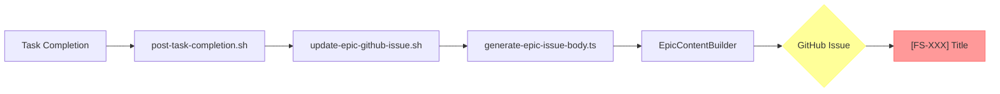

# GitHub Issue Title Format Fix Plan

**Date**: 2025-11-19
**Reporter**: User (ultrathink)
**Increment**: 0047-us-task-linkage

## Problem Statement

GitHub issues are being created with INCORRECT title formats. There are THREE incorrect variants found:

### Current Issues on GitHub (All WRONG)

1. ❌ **[SP-US-006] Migration Tooling** (#637, #636)
   - Format: `[SP-US-006]` (SP prefix, missing Feature ID)
   - Should be: `[FS-047][US-006] Migration Tooling`

2. ❌ **[SP-FS-047-specweave] ask Linkage Architecture** (#629)
   - Format: `[SP-FS-047-specweave]` (SP prefix, project name included)
   - Should be: `[FS-047][US-XXX] US Title` (needs US-ID)

3. ❌ **[FS-047] ask Linkage Architecture** (#628)
   - Format: `[FS-047]` (Feature-only, missing US-ID)
   - Should be: `[FS-047][US-XXX] US Title`

4. ❌ **[FS-043] Fix spec.md/metadata.json Desync + Add Validation Tools** (#627)
   - Format: `[FS-043]` (Feature-only, missing US-ID)
   - Should be: `[FS-043][US-XXX] US Title`

### ONLY Correct Format

✅ **[FS-XXX][US-YYY] User Story Title**

**Example**: `[FS-043][US-001] Status Line Shows Correct Active Increment`

## Root Cause Analysis

### 1. Feature/Epic-Level Sync (Root Cause #1)

**File**: `plugins/specweave/hooks/post-increment-planning.sh` (lines 419-460)

Creates INCREMENT-level issues with Feature-only titles:

```bash
# Line 409: Generate FS-XX-XX-XX prefix from date
issue_prefix="FS-${year}-${month}-${day}"

# Line 419-423: Create title with ONLY Feature prefix
log_debug "Title: [$issue_prefix] $title"
local issue_body=$(cat <<EOF
# [$issue_prefix] $title
...
EOF
)

# Line 460: Create GitHub issue
node scripts/create-github-issue-with-protection.js \
  --title "[$issue_prefix] $title" \    # ❌ WRONG: No US-ID!
  --body "$issue_body" \
  --pattern "[$issue_prefix]" \
  --labels "specweave,increment" \
  --repo "$repo"
```

**Problem**: This creates issues at the **INCREMENT level** (Feature-only), not at the **User Story level**.

**User's Requirement**: GitHub issues should ONLY be created for **User Stories**, not for Features/Increments.

### 2. UserStoryIssueBuilder (CORRECT in Code)

**File**: `plugins/specweave-github/lib/user-story-issue-builder.ts` (line 94)

```typescript
// 3. Build issue title
const title = `[${this.featureId}][${frontmatter.id}] ${frontmatter.title}`;
```

**Status**: ✅ CORRECT format in code!

**Used by**: `GitHubFeatureSync` class when syncing User Stories

### 3. SP- Prefix Mystery

The `[SP-US-006]` and `[SP-FS-047-specweave]` formats don't exist in current codebase.

**Hypothesis**:
1. These may have been created by an **older version** of sync code (before UserStoryIssueBuilder)
2. OR created **manually** during testing
3. OR created by a **different script** not in current codebase

**Evidence**:
- All SP- prefixed issues created: 2025-11-19 (TODAY)
- `git log` shows NO history of "SP-" in plugins/specweave-github/**/*.ts
- Current code doesn't generate SP- prefix anywhere

## Issue Creation Paths

### Path 1: Increment Planning Hook (WRONG)

```mermaid
graph LR
    A[/specweave:increment] --> B[post-increment-planning.sh]
    B --> C[create_github_issue function]
    C --> D[create-github-issue-with-protection.js]
    D --> E{GitHub Issue}
    E --> F["[FS-XXX] Title"]

    style F fill:#f99,stroke:#f66
    style E fill:#ff9,stroke:#ff6
```

**Output**: `[FS-XXX] Title` ❌

**Problem**: Feature-level issue, no US-ID

### Path 2: User Story Sync (CORRECT)

```mermaid
graph LR
    A[/specweave-github:sync] --> B[GitHubFeatureSync]
    B --> C[UserStoryIssueBuilder]
    C --> D[buildIssueBody]
    D --> E{GitHub Issue}
    E --> F["[FS-XXX][US-YYY] Title"]

    style F fill:#9f9,stroke:#6f6
    style E fill:#9ff,stroke:#6ff
```

**Output**: `[FS-XXX][US-YYY] Title` ✅

**Status**: CORRECT!

### Path 3: Epic Sync (DEPRECATED, WRONG)



**Output**: `[FS-XXX] Title` ❌

**Status**: DEPRECATED (from previous analysis)

## Fix Plan

### Phase 1: Disable Feature/Increment-Level Sync

**Goal**: Stop creating Feature-only GitHub issues entirely

#### Fix 1.1: Disable post-increment-planning Hook

**File**: `plugins/specweave/hooks/post-increment-planning.sh` (lines 687-752)

**Change**:
```bash
# ============================================================================
# INCREMENT-LEVEL GITHUB ISSUE CREATION (DEPRECATED v0.24.0+)
# ============================================================================
#
# ⚠️  DEPRECATED: SpecWeave now syncs ONLY at User Story level.
#
# Feature/Increment-level issues like "[FS-047] Title" are NO LONGER created.
# Instead, use:
#   /specweave-github:sync FS-047
#
# This creates PROPER User Story-level issues:
#   [FS-047][US-001] User Story Title
#   [FS-047][US-002] User Story Title
#   etc.
#
# @see .specweave/increments/0047-us-task-linkage/reports/GITHUB-TITLE-FORMAT-FIX-PLAN.md
# ============================================================================

if [ "$SPECWEAVE_ENABLE_INCREMENT_GITHUB_SYNC" = "true" ]; then
  log_info ""
  log_info "🔗 Creating INCREMENT-level GitHub issue (DEPRECATED)..."
  log_info "   ⚠️  This will create [FS-XXX] format (wrong!)"
  log_info "   ✅  Use /specweave-github:sync for [FS-XXX][US-YYY] format"

  # ... existing code (kept for backward compatibility) ...
else
  log_info ""
  log_info "✅ Increment-level GitHub sync disabled (correct behavior)"
  log_info "   Use /specweave-github:sync for User Story-level issues"
  log_debug "Increment GitHub sync skipped (sync at User Story level only)"
fi
```

#### Fix 1.2: Disable Epic Sync Hook

**File**: `plugins/specweave-github/hooks/post-task-completion.sh` (lines 204-233)

**Change**:
```bash
# ============================================================================
# EPIC GITHUB ISSUE SYNC (DEPRECATED v0.24.0+)
# ============================================================================
#
# ⚠️  DEPRECATED: SpecWeave now syncs ONLY at User Story level.
#
# Feature/Epic-level issues are no longer updated.
# Use /specweave-github:sync instead.
#
# ============================================================================

if [ "$SPECWEAVE_ENABLE_EPIC_SYNC" = "true" ]; then
  echo "[$(date)] [GitHub] 🔄 Checking for Epic GitHub issue update (DEPRECATED)..." >> "$DEBUG_LOG" 2>/dev/null || true
  # ... existing code (kept for backward compatibility) ...
else
  echo "[$(date)] [GitHub] ℹ️  Epic sync disabled (sync at User Story level only)" >> "$DEBUG_LOG" 2>/dev/null || true
fi
```

### Phase 2: Deprecate Scripts

#### Script 2.1: update-epic-github-issue.sh

**File**: `scripts/update-epic-github-issue.sh`

**Add deprecation banner** (lines 1-20):
```bash
#!/bin/bash
#
# ⚠️  DEPRECATED: Update Epic GitHub Issue with Fresh Data
#
# This script is DEPRECATED as of v0.24.0 (Increment 0047)
#
# Reason:
#   SpecWeave now syncs ONLY at User Story level (US-XXX).
#   Feature/Epic-level (FS-XXX) GitHub issues are deprecated.
#
# Migration:
#   OLD: ./scripts/update-epic-github-issue.sh 0047-us-task-linkage
#   NEW: /specweave-github:sync FS-047
#
# To force-run anyway (NOT recommended):
#   export SPECWEAVE_FORCE_EPIC_SYNC=true
#   ./scripts/update-epic-github-issue.sh 0047-us-task-linkage
#
# @see .specweave/increments/0047-us-task-linkage/reports/GITHUB-TITLE-FORMAT-FIX-PLAN.md
#

if [ "$SPECWEAVE_FORCE_EPIC_SYNC" != "true" ]; then
  echo "⚠️  ERROR: This script is deprecated"
  echo ""
  echo "   Use /specweave-github:sync instead:"
  echo "   /specweave-github:sync FS-047"
  echo ""
  echo "   This creates User Story-level issues:"
  echo "   [FS-047][US-001] Title"
  echo "   [FS-047][US-002] Title"
  echo ""
  echo "   To force-run anyway: export SPECWEAVE_FORCE_EPIC_SYNC=true"
  exit 2
fi

# ... rest of script (kept for emergency backward compatibility) ...
```

#### Script 2.2: generate-epic-issue-body.ts

**File**: `scripts/generate-epic-issue-body.ts`

**Add deprecation notice** (lines 1-15):
```typescript
#!/usr/bin/env tsx
/**
 * ⚠️  DEPRECATED: Generate hierarchical GitHub issue body for Epic
 *
 * This script is DEPRECATED as of v0.24.0 (Increment 0047)
 *
 * Reason:
 *   SpecWeave now syncs ONLY at User Story level (US-XXX).
 *   Feature/Epic-level (FS-XXX) GitHub issues are deprecated.
 *
 * Migration:
 *   Use /specweave-github:sync FS-047 instead
 *
 * @see .specweave/increments/0047-us-task-linkage/reports/GITHUB-TITLE-FORMAT-FIX-PLAN.md
 */

console.warn('⚠️  WARNING: generate-epic-issue-body.ts is deprecated');
console.warn('   Use /specweave-github:sync for User Story-level sync');
console.warn('');

// ... rest of script ...
```

### Phase 3: Update Tests

#### Test 3.1: Skip Epic Sync Tests

**File**: `tests/integration/external-tools/github/github-epic-sync-duplicate-prevention.test.ts`

**Change**:
```typescript
describe.skip('GitHub Epic Sync - Duplicate Prevention (DEPRECATED v0.24.0+)', () => {
  //
  // ⚠️  DEPRECATED: This test suite validates Feature/Epic-level GitHub sync
  //
  // Reason:
  //   SpecWeave now syncs ONLY at User Story level ([FS-XXX][US-YYY]).
  //   Feature-level ([FS-XXX]) GitHub issues are deprecated.
  //
  // See: .specweave/increments/0047-us-task-linkage/reports/GITHUB-TITLE-FORMAT-FIX-PLAN.md
  //

  // ... existing tests (preserved but skipped) ...
});
```

#### Test 3.2: Update Feature Sync Tests

**File**: `tests/integration/external-tools/github/github-feature-sync-idempotency.test.ts`

**Review and Update**:
- These tests validate `GitHubFeatureSync` which is CORRECT
- Tests should verify `[FS-XXX][US-YYY]` format
- Update any tests that expect `[FS-XXX]` format (Feature-only)

**Example Fix**:
```typescript
// ❌ WRONG
expect(issueTitle).toMatch(/\[FS-\d+\]/);

// ✅ CORRECT
expect(issueTitle).toMatch(/\[FS-\d+\]\[US-\d+\]/);
```

### Phase 4: Clean Up Existing Issues

#### Manual Cleanup Steps

**Step 4.1: List All Incorrectly Formatted Issues**

```bash
# Feature-only issues (no US-ID)
gh issue list --repo anton-abyzov/specweave --search "is:open [FS- in:title" \
  --json number,title --jq '.[] | select(.title | test("\\[FS-\\d+\\]\\s[^\\[]")) | "\(.number): \(.title)"'

# SP-prefixed issues
gh issue list --repo anton-abyzov/specweave --search "is:open [SP- in:title" \
  --json number,title --jq '.[] | "\(.number): \(.title)"'
```

**Expected Output**:
```
628: [FS-047] ask Linkage Architecture
627: [FS-043] Fix spec.md/metadata.json Desync + Add Validation Tools
637: [SP-US-006] Migration Tooling
636: [SP-US-006] Migration Tooling
634: [SP-US-005] Progress Tracking by User Story
635: [SP-US-005] Progress Tracking by User Story
633: [SP-US-004] AC Coverage Validation
632: [SP-US-003] Automatic Living Docs Sync
631: [SP-US-002] AC-Task Mapping
630: [SP-US-001] Explicit US-Task Linkage in tasks.md
629: [SP-FS-047-specweave] ask Linkage Architecture
```

**Step 4.2: Close All Incorrect Issues**

```bash
# Create script to close all incorrect issues
cat > /tmp/close-incorrect-issues.sh <<'EOF'
#!/bin/bash

REPO="anton-abyzov/specweave"

# Issues to close (all incorrect formats)
ISSUES=(627 628 629 630 631 632 633 634 635 636 637)

COMMENT="Closing incorrect issue format.

SpecWeave now creates GitHub issues ONLY at User Story level with format:
\`[FS-XXX][US-YYY] User Story Title\`

This issue used an incorrect format (Feature-only or SP-prefixed).

Replacement issues will be created via:
\`/specweave-github:sync FS-XXX\`

See: .specweave/increments/0047-us-task-linkage/reports/GITHUB-TITLE-FORMAT-FIX-PLAN.md"

for ISSUE in "${ISSUES[@]}"; do
  echo "Closing issue #$ISSUE..."
  gh issue close "$ISSUE" --repo "$REPO" --comment "$COMMENT"
done

echo "✅ All incorrect issues closed"
EOF

chmod +x /tmp/close-incorrect-issues.sh
bash /tmp/close-incorrect-issues.sh
```

**Step 4.3: Create Correct Issues**

```bash
# Sync FS-043 (creates proper [FS-043][US-XXX] issues)
/specweave-github:sync FS-043

# Sync FS-047 (creates proper [FS-047][US-XXX] issues)
/specweave-github:sync FS-047

# Verify format
gh issue list --repo anton-abyzov/specweave --search "is:open FS-043 in:title OR FS-047 in:title" \
  --json number,title --jq '.[] | "\(.number): \(.title)"'

# Expected format:
# XXX: [FS-043][US-001] Status Line Shows Correct Active Increment
# XXX: [FS-043][US-002] spec.md and metadata.json Stay in Sync
# XXX: [FS-047][US-001] Explicit US-Task Linkage in tasks.md
# XXX: [FS-047][US-002] AC-Task Mapping
# etc.
```

**Step 4.4: Remove external_tools from FEATURE.md**

```bash
# Edit .specweave/docs/internal/specs/_features/FS-043/FEATURE.md
# Remove:
#   external_tools:
#     github:
#       id: 627
#       url: https://github.com/anton-abyzov/specweave/issues/627

# Edit .specweave/docs/internal/specs/_features/FS-047/FEATURE.md
# Remove:
#   external_tools:
#     github:
#       id: 628
#       url: https://github.com/anton-abyzov/specweave/issues/628

# Features should ONLY have Milestones, not Issues:
#   external_tools:
#     github:
#       type: milestone
#       id: 10
#       url: https://github.com/anton-abyzov/specweave/milestone/10
```

### Phase 5: Update Documentation

#### Doc 5.1: Update CLAUDE.md

**File**: `CLAUDE.md`

**Add section**:
```markdown
### 11. GitHub Issue Format Policy (v0.24.0+)

**CRITICAL**: ALL GitHub issues MUST use User Story-level format.

**ONLY Correct Format**:
```
[FS-XXX][US-YYY] User Story Title
```

**Examples**:
- ✅ `[FS-043][US-001] Status Line Shows Correct Active Increment`
- ✅ `[FS-047][US-002] AC-Task Mapping`

**Incorrect Formats** (NEVER use):
- ❌ `[FS-047]` (Feature-only, missing US-ID)
- ❌ `[SP-US-006]` (SP prefix, missing Feature ID)
- ❌ `[SP-FS-047-specweave]` (SP prefix, project name)

**How to Create Issues**:
```bash
# CORRECT way (creates [FS-XXX][US-YYY] issues)
/specweave-github:sync FS-047

# WRONG way (deprecated, creates [FS-XXX] issues)
/specweave:increment "feature"  # ← This no longer creates GitHub issues
```

**Why This Matters**:
- Features are tracked via GitHub **Milestones** (not Issues)
- User Stories are tracked via GitHub **Issues**
- Tasks are tracked as **checkboxes** in User Story issue body

**Architecture**:
```
Feature (FS-047)
  ↓ GitHub Milestone
  ├─ User Story (US-001) → GitHub Issue #630: [FS-047][US-001] Title
  ├─ User Story (US-002) → GitHub Issue #631: [FS-047][US-002] Title
  └─ User Story (US-003) → GitHub Issue #632: [FS-047][US-003] Title
```

**See Also**:
- `.specweave/increments/0047-us-task-linkage/reports/GITHUB-TITLE-FORMAT-FIX-PLAN.md`
- `plugins/specweave-github/lib/user-story-issue-builder.ts:94`
```

## Validation Checklist

After implementing all phases:

- [ ] **No Feature-only issues created**
  ```bash
  # Should return EMPTY
  gh issue list --repo anton-abyzov/specweave --search "is:open created:>=$(date -I)" \
    | grep -E "\[FS-[0-9]+\]\s[^\[]"
  ```

- [ ] **All issues have [FS-XXX][US-YYY] format**
  ```bash
  gh issue list --repo anton-abyzov/specweave --search "is:open created:>=$(date -I)" \
    --json title --jq '.[].title' \
    | grep -E "^\[FS-[0-9]+\]\[US-[0-9]+\]"
  ```

- [ ] **No SP- prefixed issues**
  ```bash
  # Should return EMPTY
  gh issue list --repo anton-abyzov/specweave --search "is:open [SP- in:title"
  ```

- [ ] **Hooks disabled by default**
  ```bash
  # Complete a task - should NOT see "Creating Epic issue" or "Updating Epic issue"
  tail -f .specweave/logs/hooks-debug.log | grep -i epic
  ```

- [ ] **User Story sync works**
  ```bash
  /specweave-github:sync FS-999
  # Should create [FS-999][US-001], [FS-999][US-002], etc.
  ```

- [ ] **Tests pass (with Epic tests skipped)**
  ```bash
  npm run test:integration -- github
  # Should show: "Skipped GitHub Epic Sync - Duplicate Prevention"
  # Should show: "✓ GitHubFeatureSync - Idempotency Integration Tests"
  ```

## Migration Guide (For Users)

If you have existing SpecWeave projects with Feature-level issues:

1. **List all Feature-level issues**:
   ```bash
   gh issue list --search "[FS- in:title" --json number,title
   ```

2. **For each Feature with incorrect issues**:
   ```bash
   # Close old issues
   gh issue close 627 --comment "Replaced by User Story-level issues"

   # Create new User Story-level issues
   /specweave-github:sync FS-043
   ```

3. **Update FEATURE.md** (remove issue links, keep milestone):
   ```yaml
   external_tools:
     github:
       type: milestone  # ✅ KEEP this
       id: 10
       url: https://github.com/owner/repo/milestone/10
       # issue: 627  # ❌ REMOVE this
       # url: https://...issues/627  # ❌ REMOVE this
   ```

4. **Update hooks** (if custom):
   - Remove calls to `update-epic-github-issue.sh`
   - Remove Epic sync from `post-task-completion.sh`

## Summary

**Problems Found**:
1. ❌ Feature/Increment-level issues created by hooks
2. ❌ SP-prefixed issues (unknown origin, likely manual)
3. ❌ Feature-only titles missing US-ID

**Solution**:
1. ✅ Disable Feature/Increment-level sync in hooks
2. ✅ Deprecate Epic sync scripts
3. ✅ Skip/update Epic sync tests
4. ✅ Close all incorrect issues manually
5. ✅ Use ONLY `/specweave-github:sync` command
6. ✅ Enforce format: `[FS-XXX][US-YYY] Title`

**Impact**: Minimal
- User Story sync (GitHubFeatureSync) already works correctly
- Feature-level sync already optional (hooks check env vars)
- No breaking changes to UserStoryIssueBuilder

**Timeline**: 2-3 hours (implementation + testing + cleanup)

---

**Next Steps**:
1. ✅ Get user approval for fix plan
2. Implement Phase 1 (disable hooks)
3. Implement Phase 2 (deprecate scripts)
4. Implement Phase 3 (update tests)
5. Execute Phase 4 (close incorrect issues, create correct ones)
6. Update Phase 5 (documentation)
7. Validate with checklist

**References**:
- UserStoryIssueBuilder: `plugins/specweave-github/lib/user-story-issue-builder.ts:94`
- Post-increment hook: `plugins/specweave/hooks/post-increment-planning.sh:419-460`
- Epic sync hook: `plugins/specweave-github/hooks/post-task-completion.sh:204-233`
- Feature sync tests: `tests/integration/external-tools/github/github-feature-sync-idempotency.test.ts`
