# SpecWeave Sync Architecture Diagrams (v0.24.0)

**Purpose**: Visual explanations of three-permission sync architecture for user-facing documentation

---

## Diagram 1: Three-Permission Decision Flow

**Use in**: README.md, external-tool-sync.md, getting-started guide

```mermaid
graph TB
    A[👤 You + Claude] -->|"Plan feature:\n/specweave:increment"| B{Q1: canUpsertInternalItems}
    B -->|"✅ true\n(CREATE + UPDATE)"| C[📝 Create GitHub Issue #42]
    B -->|"❌ false\n(Local-only)"| D[💻 Local Mode Only]

    E[✅ Task T-001 Completed] -->|"Update content?"| F{Q2: canUpdateExternalItems}
    F -->|"✅ true\n(Full content sync)"| G[📤 Update Issue #42\nTitle, Description, ACs, Tasks]
    F -->|"❌ false\n(Read-only)"| H[📋 Living Docs Only]

    I[🔔 Issue #42 Closed in GitHub] -->|"Sync status?"| J{Q3: canUpdateStatus}
    J -->|"✅ true\n(Status sync)"| K[✅ Mark Increment Complete]
    J -->|"❌ false\n(Manual)"| L[👤 Manual Status Management]

    style B fill:#339af0,stroke:#1971c2,stroke-width:3px,color:#fff
    style F fill:#51cf66,stroke:#2f9e44,stroke-width:3px,color:#fff
    style J fill:#ff8c42,stroke:#e8590c,stroke-width:3px,color:#fff
    style C fill:#d0ebff
    style G fill:#d3f9d8
    style K fill:#ffe3c6
```

**Legend**:
- 🔵 Blue: Q1 - Internal item creation and updates
- 🟢 Green: Q2 - External item content updates
- 🟠 Orange: Q3 - Status synchronization

---

## Diagram 2: Complete Sync Flow (End-to-End)

**Use in**: external-tool-sync.md, architecture guides

```mermaid
sequenceDiagram
    participant User as 👤 Developer
    participant SW as SpecWeave
    participant Perm as Permission Layer
    participant Ext as External Tool

    Note over User,Ext: Phase 1: Planning

    User->>SW: /specweave:increment "user auth"
    SW->>SW: Generate spec.md, tasks.md
    SW->>Perm: Request: CREATE issue
    Perm->>Perm: Check: canUpsertInternalItems?
    alt canUpsertInternalItems = true
        Perm->>Ext: ✅ CREATE GitHub Issue #42
        Ext-->>SW: Issue URL
        SW->>SW: Update metadata.json
    else canUpsertInternalItems = false
        Perm->>SW: ❌ Skip (local-only mode)
    end

    Note over User,Ext: Phase 2: Implementation

    User->>SW: Complete T-001
    SW->>SW: Mark [x] T-001 in tasks.md
    SW->>Perm: Request: UPDATE content
    Perm->>Perm: Check: canUpdateExternalItems?
    alt canUpdateExternalItems = true
        Perm->>Ext: ✅ UPDATE Issue #42 content
        Ext-->>Perm: Success
    else canUpdateExternalItems = false
        Perm->>SW: ❌ Skip (living docs only)
    end

    Note over User,Ext: Phase 3: Status Sync

    User->>Ext: Close Issue #42 (in GitHub)
    Ext->>Perm: Event: Issue closed
    Perm->>Perm: Check: canUpdateStatus?
    alt canUpdateStatus = true
        Perm->>SW: ✅ UPDATE increment status
        SW->>SW: Mark increment complete
    else canUpdateStatus = false
        Perm->>Ext: ❌ Skip (manual management)
    end
```

---

## Diagram 3: Before vs After Architecture

**Use in**: Migration guides, CHANGELOG

---

## Diagram 4: Common Workflows

**Use in**: README.md, getting-started guide

---

## Diagram 5: Permission Matrix

**Use in**: Configuration guides, troubleshooting

```mermaid
graph TB
    A[Which operations do you need?]
    A --> B{Create own\nwork items?}
    B -->|Yes| C[canUpsertInternalItems: true]
    B -->|No| D[canUpsertInternalItems: false]

    C --> E{Update\nexternal items?}
    D --> E

    E -->|Yes| F[canUpdateExternalItems: true]
    E -->|No| G[canUpdateExternalItems: false]

    F --> H{Sync\nstatus?}
    G --> H

    H -->|Yes| I[canUpdateStatus: true]
    H -->|No| J[canUpdateStatus: false]

    I --> K[✅ Configuration Complete]
    J --> K

    style C fill:#339af0
    style F fill:#51cf66
    style I fill:#ff8c42
    style K fill:#d3f9d8,stroke:#2f9e44,stroke-width:3px
```

---

## Diagram 6: Sync Direction Flow (Data Flow)

**Use in**: Technical documentation, ADRs

---

## Diagram 7: Living Docs Sync Architecture

**Use in**: Living docs guides, sync architecture docs

**Key Point**: Increment → Living Docs is ALWAYS one-way (immutable). Only Living Docs → External Tools uses three-permission control.

---

## Usage Guidelines

### Where to Use Each Diagram

| Diagram | README.md | external-tool-sync.md | Migration Guides | Technical Docs |
|---------|-----------|----------------------|------------------|----------------|
| #1 - Decision Flow | ✅ Primary | ✅ Overview | ❌ | ❌ |
| #2 - Complete Flow | ❌ | ✅ Primary | ❌ | ✅ |
| #3 - Before/After | ❌ | ❌ | ✅ Primary | ✅ |
| #4 - Workflows | ✅ Secondary | ✅ Examples | ✅ | ❌ |
| #5 - Permission Matrix | ❌ | ✅ Config | ✅ | ❌ |
| #6 - Data Flow | ❌ | ❌ | ❌ | ✅ Primary |
| #7 - Living Docs | ❌ | ✅ | ❌ | ✅ |

### Color Scheme

**Consistent colors across all diagrams**:
- 🔵 **Blue (#339af0)**: Q1 - canUpsertInternalItems (CREATE + UPDATE internal)
- 🟢 **Green (#51cf66)**: Q2 - canUpdateExternalItems (UPDATE external)
- 🟠 **Orange (#ff8c42)**: Q3 - canUpdateStatus (Status sync)
- 🔴 **Red (#ff6b6b)**: Deprecated/Old architecture
- ⚪ **Gray (#868e96)**: Disabled permissions

### Accessibility

All diagrams follow accessibility best practices:
- ✅ Color + shape + text labels (not color-only)
- ✅ High contrast (WCAG AAA compliant)
- ✅ Text alternatives provided in documentation
- ✅ Logical reading order (left-to-right, top-to-bottom)

---

**Created**: 2025-11-20
**Author**: Claude (Sonnet 4.5)
**Version**: v0.24.0
**Status**: ✅ READY FOR USE IN DOCUMENTATION
