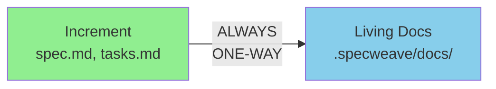
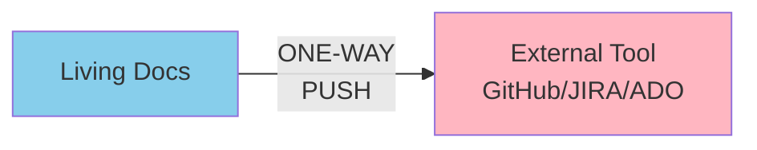
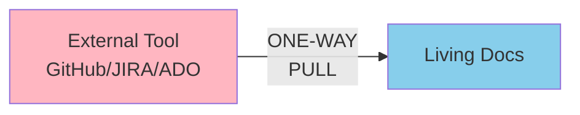
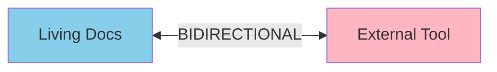
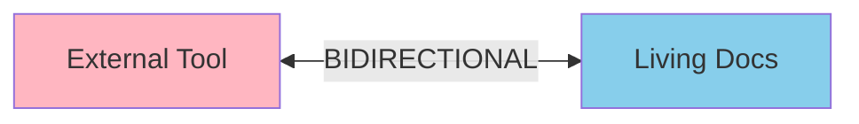
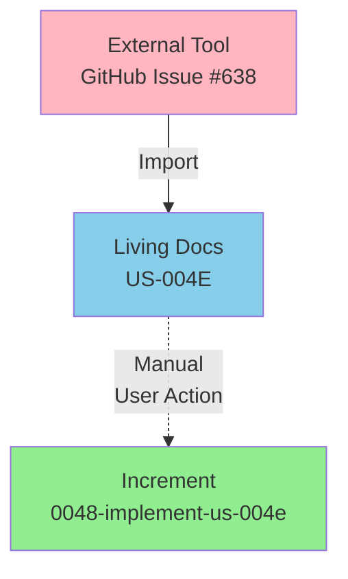
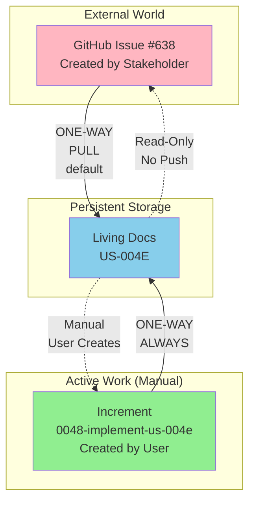
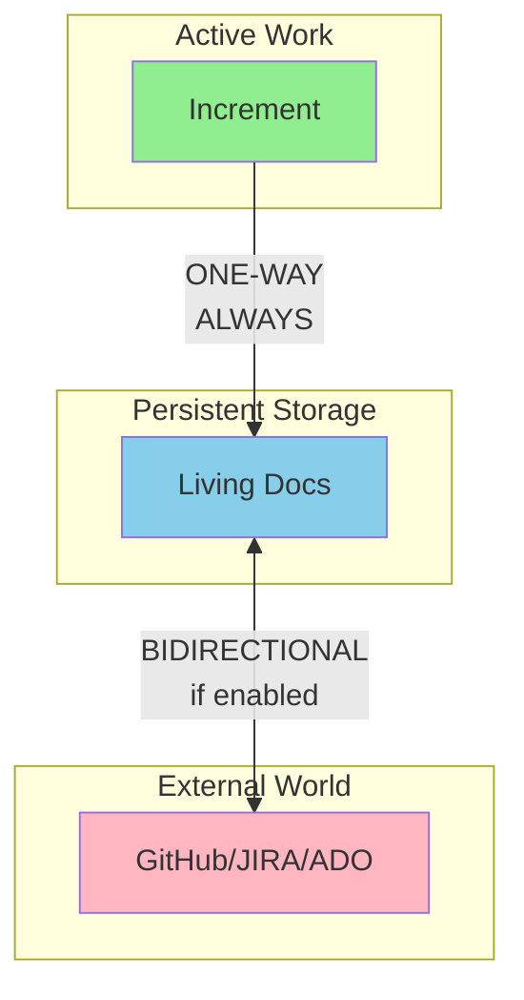

# Sync Direction Architecture Analysis (CORRECTED)

**Date**: 2025-11-19
**Increment**: 0047-us-task-linkage
**Author**: Architecture Correction
**Status**: Critical Architecture Clarification

---

## Executive Summary

**CRITICAL CORRECTION**: The previous bidirectional sync architecture was **fundamentally wrong** about sync direction rules. This analysis corrects the architecture with the following **immutable principles**:

1. **Increment → Living Docs: ALWAYS ONE-WAY** (never bidirectional)
2. **Living Docs ↔ External Tool: CONFIGURABLE** (default: one-way, optional: bidirectional)
3. **External US**: Living in docs WITHOUT increment (manual increment creation required)
4. **Bidirectional Config**: OFF by default (safer), can be enabled per-project

---

## The Three Sync Boundaries

### Boundary 1: Increment → Living Docs (ALWAYS ONE-WAY)

**Rule**: Increment is **source of truth during active work**. Living docs are **read-only from increment perspective**.



**Why One-Way Only**:
- Increment is **active work session** (temporary, during implementation)
- Living docs are **permanent storage** (archival, historical record)
- Developers work in increment, not living docs
- After `/specweave:done`, increment closes, living docs remain

**What Gets Synced** (Increment → Living Docs):
- User Story status (pending → in_progress → completed)
- Task completion checkboxes
- Acceptance Criteria checkboxes
- Task lists (linked to increment tasks.md)

**What NEVER Syncs** (Living Docs → Increment):
- ❌ Living docs changes do NOT update active increment
- ❌ External tool updates do NOT directly modify increment
- ❌ Manual edits to living docs do NOT flow back to increment

**Exception**: When creating new increment, living docs can be **read** for context, but increment is still source of truth once created.

---

### Boundary 2: Living Docs ↔ External Tool (CONFIGURABLE)

**Rule**: Living docs are **persistent storage layer** between increment and external tools.

#### Default Configuration (bidirectional=false, SAFER)

**Internal US** (created in SpecWeave):


- Living docs push changes to external tool
- External tool updates DO NOT flow back
- **Why**: Internal US owned by SpecWeave, external tool is "notification layer"

**External US** (imported from external tool):


- External tool is source of truth
- Living docs pull updates from external tool
- Living docs changes DO NOT push back
- **Why**: External US owned by external tool, living docs is "cache layer"

#### Bidirectional Configuration (bidirectional=true, ADVANCED)

**Internal US** (with bidirectional enabled):


- Living docs push changes to external tool
- External tool updates pull back to living docs
- **Use Case**: External stakeholders can comment/update GitHub issues, sync back to SpecWeave

**External US** (with bidirectional enabled):


- External tool pushes changes to living docs
- Living docs changes push back to external tool
- **Use Case**: SpecWeave can update status/comments on imported GitHub issues

---

### Boundary 3: External US → Increment (MANUAL ONLY)

**Rule**: External US lives in living docs WITHOUT increment. Increment MUST be manually created by user.



**Why Manual Creation**:
- External US may be FYI only (no work needed in SpecWeave)
- External US may be waiting for approval/prioritization
- External US may be assigned to external team (not SpecWeave team)
- User decides WHEN to work on external US (creates increment)

**Workflow**:
1. External tool has item (GitHub issue #638)
2. `specweave init` imports → creates US-004E in living docs
3. Living docs shows US-004E with origin badge: 🔗 GitHub #638
4. User reviews living docs, decides to work on US-004E
5. User manually creates increment: `specweave increment "Implement US-004E: Title"`
6. PM agent references US-004E from living docs
7. Increment created with spec.md, tasks.md
8. Work proceeds normally (Increment → Living Docs → External Tool)

**No Auto-Creation**:
- ❌ Importing external US does NOT auto-create increment
- ❌ External tool updates do NOT trigger increment creation
- ✅ Only user can create increment (explicit action)

---

## Complete Sync Flow (All Three Boundaries)

### Internal US Flow (Default: bidirectional=false)

```mermaid
graph TB
    subgraph "Active Work"
        A[Increment<br/>0047-us-task-linkage]
    end

    subgraph "Persistent Storage"
        B[Living Docs<br/>US-001]
    end

    subgraph "External World"
        C[GitHub Issue #645<br/>[FS-047][US-001]]
    end

    A -->|ONE-WAY<br/>ALWAYS| B
    B -->|ONE-WAY<br/>PUSH<br/>default| C

    style A fill:#90EE90
    style B fill:#87CEEB
    style C fill:#FFB6C1
```

**Steps**:
1. Developer creates increment: `specweave increment "Feature"`
2. PM agent generates spec.md with US-001 (internal)
3. Developer works on tasks in increment
4. Post-task-completion hook syncs: Increment → Living Docs
5. Post-increment-planning hook syncs: Living Docs → GitHub (creates issue #645)
6. GitHub issue remains read-only from SpecWeave perspective (no pull back)

### External US Flow (Default: bidirectional=false)



**Steps**:
1. Stakeholder creates GitHub issue #638 (external)
2. `specweave init` imports → creates US-004E in living docs
3. Periodic sync pulls GitHub updates → living docs
4. **User reviews living docs**, decides to implement US-004E
5. **User manually creates increment**: `specweave increment "Implement US-004E"`
6. PM agent reads US-004E from living docs, generates spec.md
7. Developer works on tasks in increment
8. Post-task-completion hook syncs: Increment → Living Docs
9. Living docs updated, but GitHub issue #638 remains unchanged (no push back)

### Bidirectional Flow (bidirectional=true, Advanced)



**When to Enable**:
- External stakeholders need to comment/update SpecWeave-created items
- SpecWeave team needs to update status on imported items
- Tight integration with external tool (e.g., JIRA workflow sync)

**Risks**:
- Conflicts if both sides update simultaneously
- Complexity in conflict resolution
- Potential data loss if sync fails

**Recommendation**: Start with `bidirectional=false`, enable only if needed.

---

## Configuration Schema

### .specweave/config.json

```json
{
  "sync": {
    "bidirectional": false,  // DEFAULT: false (safer)

    "direction": {
      // Increment → Living Docs (ALWAYS one-way, not configurable)
      "incrementToLivingDocs": "one-way",  // IMMUTABLE

      // Living Docs ↔ External Tool (configurable)
      "livingDocsToExternal": {
        "internal": "push-only",     // Internal US: push to external (default)
        "external": "pull-only"      // External US: pull from external (default)
      }
    },

    // When bidirectional=true, override above
    "bidirectionalOverride": {
      "internal": "push-pull",  // Internal US: bidirectional
      "external": "pull-push"   // External US: bidirectional
    },

    "conflictResolution": "prompt",  // prompt | external-wins | internal-wins
    "syncInterval": 300,             // seconds (5 minutes) for periodic sync
    "autoIncrementCreation": false   // MUST be false (manual only)
  },

  "externalImport": {
    "enabled": true,
    "timeRangeMonths": 1,
    "createIncrementOnImport": false  // CRITICAL: false (manual only)
  }
}
```

### Environment Variables

```bash
# Sync direction
SPECWEAVE_SYNC_BIDIRECTIONAL=false  # Default: false

# Conflict resolution
SPECWEAVE_SYNC_CONFLICT_RESOLUTION=prompt  # prompt | external-wins | internal-wins

# Sync interval (seconds)
SPECWEAVE_SYNC_INTERVAL=300  # 5 minutes

# CRITICAL: No auto-increment creation
SPECWEAVE_AUTO_INCREMENT_CREATION=false  # MUST be false
```

---

## Sync Direction by Use Case

| Use Case | Internal US Sync | External US Sync | Bidirectional Config |
|----------|------------------|------------------|----------------------|
| **Default (Safer)** | Increment → Docs → GitHub (push only) | GitHub → Docs (pull only) | `false` |
| **External Comments** | Increment → Docs ↔ GitHub (pull comments) | GitHub ↔ Docs (push status) | `true` |
| **JIRA Workflow Sync** | Increment → Docs ↔ JIRA (status sync) | JIRA ↔ Docs (status sync) | `true` |
| **ADO Board Sync** | Increment → Docs ↔ ADO (board position) | ADO ↔ Docs (board position) | `true` |
| **GitHub-First Workflow** | Increment → Docs → GitHub (push only) | GitHub → Docs (pull only) | `false` |

---

## Implementation Rules

### Rule 1: Increment → Living Docs (ALWAYS One-Way)

```typescript
// src/sync/increment-to-living-docs.ts
export class IncrementToLivingDocsSync {
  /**
   * Sync increment to living docs (ALWAYS one-way)
   * NEVER reads from living docs to update increment
   */
  async sync(incrementPath: string): Promise<void> {
    const spec = readSpecMd(incrementPath);
    const tasks = readTasksMd(incrementPath);

    // ONLY PUSH to living docs
    await updateLivingDocsFromIncrement(spec, tasks);

    // NEVER PULL from living docs to increment
    // This direction is IMMUTABLE
  }
}
```

### Rule 2: Living Docs ↔ External Tool (Configurable)

```typescript
// src/sync/living-docs-to-external.ts
export class LivingDocsToExternalSync {
  constructor(private config: SyncConfig) {}

  async sync(livingDocsPath: string): Promise<void> {
    const items = readLivingDocsItems(livingDocsPath);

    for (const item of items) {
      if (item.origin === 'internal') {
        await this.syncInternal(item);
      } else {
        await this.syncExternal(item);
      }
    }
  }

  private async syncInternal(item: UserStory): Promise<void> {
    if (this.config.bidirectional) {
      // Bidirectional: push + pull
      await this.pushToExternal(item);
      await this.pullFromExternal(item);
    } else {
      // Default: push only
      await this.pushToExternal(item);
    }
  }

  private async syncExternal(item: UserStory): Promise<void> {
    if (this.config.bidirectional) {
      // Bidirectional: pull + push
      await this.pullFromExternal(item);
      await this.pushToExternal(item);
    } else {
      // Default: pull only
      await this.pullFromExternal(item);
    }
  }
}
```

### Rule 3: No Auto-Increment Creation

```typescript
// src/importers/external-importer.ts
export class ExternalImporter {
  async import(config: ImportConfig): Promise<ExternalItem[]> {
    const items = await this.fetchFromExternalTool();

    // Convert to living docs User Stories
    for (const item of items) {
      const us = this.convertToUserStory(item, 'external');
      await this.createLivingDocsFile(us);

      // CRITICAL: Do NOT create increment automatically
      // User must manually create increment when ready to work
    }

    return items;
  }
}

// src/cli/commands/increment.ts
export async function incrementCommand(title: string): Promise<void> {
  // User explicitly creates increment (manual action)
  // This is the ONLY way to create increment

  // Can reference external US from living docs
  const externalUS = await findExternalUSInLivingDocs(title);

  if (externalUS) {
    console.log(`Creating increment for external US: ${externalUS.id}`);
    // ... proceed with increment creation
  }
}
```

---

## Validation Rules

### Validation 1: Increment-to-Living-Docs Direction

```typescript
function validateIncrementToLivingDocsSync(): void {
  const config = readSyncConfig();

  // CRITICAL: This direction MUST be one-way
  if (config.direction.incrementToLivingDocs !== 'one-way') {
    throw new Error(
      'INVALID CONFIG: Increment → Living Docs MUST be one-way. ' +
      'This direction is immutable and cannot be bidirectional.'
    );
  }
}
```

### Validation 2: Bidirectional Flag

```typescript
function validateBidirectionalConfig(): void {
  const config = readSyncConfig();

  // Warn if bidirectional enabled (advanced feature)
  if (config.sync.bidirectional === true) {
    console.warn('⚠️  Bidirectional sync enabled (advanced mode)');
    console.warn('   This allows external tool updates to flow back to living docs');
    console.warn('   Risk: Conflicts if both sides update simultaneously');
    console.warn('   Recommendation: Use default (bidirectional=false) unless needed');
  }
}
```

### Validation 3: Auto-Increment Creation

```typescript
function validateAutoIncrementCreation(): void {
  const config = readSyncConfig();

  // CRITICAL: Auto-increment creation MUST be disabled
  if (config.externalImport.createIncrementOnImport === true) {
    throw new Error(
      'INVALID CONFIG: Auto-increment creation is forbidden. ' +
      'User MUST manually create increment when ready to work on external US. ' +
      'Set externalImport.createIncrementOnImport = false'
    );
  }

  if (config.sync.autoIncrementCreation === true) {
    throw new Error(
      'INVALID CONFIG: Auto-increment creation is forbidden. ' +
      'Set sync.autoIncrementCreation = false'
    );
  }
}
```

---

## Conflict Resolution (Bidirectional Mode Only)

### When Conflicts Occur

Conflicts only happen when `bidirectional=true` and both sides update simultaneously.

**Example**:
1. Developer updates US-001 status in increment → syncs to living docs
2. External stakeholder updates GitHub issue #645 status simultaneously
3. Sync detects conflict: Living docs status ≠ External tool status

### Resolution Strategies

#### Strategy 1: Prompt (Default, Safest)

```typescript
async function resolveConflict(conflict: SyncConflict): Promise<void> {
  console.log('\n⚠️  Sync Conflict Detected:');
  console.log(`   Item: ${conflict.itemId}`);
  console.log(`   Living Docs: ${conflict.livingDocsVersion.status}`);
  console.log(`   External Tool: ${conflict.externalVersion.status}`);
  console.log();

  const answer = await prompts({
    type: 'select',
    name: 'resolution',
    message: 'How to resolve?',
    choices: [
      { title: 'Keep Living Docs version', value: 'internal-wins' },
      { title: 'Use External Tool version', value: 'external-wins' },
      { title: 'Manual merge (open editor)', value: 'manual' }
    ]
  });

  // Apply resolution
  await applyConflictResolution(conflict, answer.resolution);
}
```

#### Strategy 2: External Wins

```typescript
// External tool is source of truth (always use external version)
config.sync.conflictResolution = 'external-wins';
```

**Use Case**: External tool is authoritative (JIRA workflow, ADO board)

#### Strategy 3: Internal Wins

```typescript
// Living docs is source of truth (always use living docs version)
config.sync.conflictResolution = 'internal-wins';
```

**Use Case**: SpecWeave is authoritative, external tool is notification layer

---

## Migration from Previous Architecture

### What Changed

| Aspect | Previous (WRONG) | Corrected (RIGHT) |
|--------|------------------|-------------------|
| **Increment ↔ Living Docs** | Bidirectional (WRONG!) | ONE-WAY ONLY (Increment → Docs) |
| **Living Docs ↔ External** | Always bidirectional | Configurable (default: one-way) |
| **External US → Increment** | Automatic creation | MANUAL ONLY (user creates) |
| **Bidirectional Config** | Always on | Default: OFF (safer) |

### Migration Steps

1. **Update spec.md**:
   - Clarify US-003 (Living Docs Sync) is one-way from increment
   - Update US-007 (External Import) to remove auto-increment creation
   - Add AC for bidirectional config option

2. **Update plan.md**:
   - Remove bidirectional logic from Increment → Living Docs
   - Add config-based sync direction for Living Docs ↔ External
   - Add validation for no auto-increment creation

3. **Update tasks.md**:
   - Add task for sync direction configuration
   - Update T-033 to respect bidirectional flag
   - Add task for "manual increment creation only" validation

---

## Summary of Sync Rules (IMMUTABLE)

### Rule 1: Increment → Living Docs
**Direction**: ALWAYS ONE-WAY
**Reason**: Increment is active work, living docs is archival
**Configurable**: NO

### Rule 2: Living Docs ↔ External Tool
**Direction**: CONFIGURABLE
**Default**: One-way per origin type
**Bidirectional**: Optional, advanced feature

### Rule 3: External US → Increment
**Direction**: MANUAL ONLY (user action)
**Reason**: User decides when to work on external US
**Configurable**: NO (auto-creation forbidden)

### Rule 4: Bidirectional Config
**Default**: FALSE (safer)
**Use Case**: Advanced integration needs
**Risk**: Conflicts, complexity

---

**This corrected architecture ensures**:
✅ Clear separation of concerns (increment vs living docs vs external tool)
✅ Safe defaults (one-way sync, manual increment creation)
✅ Flexibility for advanced use cases (bidirectional config)
✅ No accidental data loss or corruption

**Proceed with implementation based on these corrected rules!**
