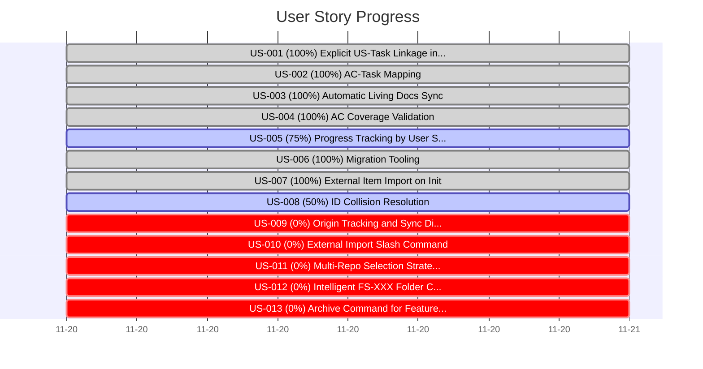

# User Story Progress Chart

**Increment**: 0047-us-task-linkage
**Generated**: 2025-11-20T14:33:38.706Z

## Summary

**User Stories**: 13 total
- ✅ Completed: 6
- 🔄 In Progress: 2
- ⏳ Pending: 5

**Tasks**: 28/47 completed (60%)

## Progress Visualization

## Detailed Progress

| User Story | Title | Tasks | Progress | Status |
|------------|-------|-------|----------|--------|
| US-001 | Explicit US-Task Linkage in tasks.md | 4/4 | [██████████] 100% | ✅ done |
| US-002 | AC-Task Mapping | 3/3 | [██████████] 100% | ✅ done |
| US-003 | Automatic Living Docs Sync | 5/5 | [██████████] 100% | ✅ done |
| US-004 | AC Coverage Validation | 3/3 | [██████████] 100% | ✅ done |
| US-005 | Progress Tracking by User Story | 3/4 | [████████░░] 75% | 🔄 active |
| US-006 | Migration Tooling | 3/3 | [██████████] 100% | ✅ done |
| US-007 | External Item Import on Init | 5/5 | [██████████] 100% | ✅ done |
| US-008 | ID Collision Resolution | 2/4 | [█████░░░░░] 50% | 🔄 active |
| US-009 | Origin Tracking and Sync Direction Configuration | 0/4 | [░░░░░░░░░░] 0% | ⏳ pending |
| US-010 | External Import Slash Command | 0/2 | [░░░░░░░░░░] 0% | ⏳ pending |
| US-011 | Multi-Repo Selection Strategy (GitHub Init) | 0/4 | [░░░░░░░░░░] 0% | ⏳ pending |
| US-012 | Intelligent FS-XXX Folder Creation with Chronological ID Allocation | 0/3 | [░░░░░░░░░░] 0% | ⏳ pending |
| US-013 | Archive Command for Features and Epics | 0/3 | [░░░░░░░░░░] 0% | ⏳ pending |

---

**Note**: This chart is auto-generated. Run `npx tsx scripts/generate-us-progress-chart.ts 0047-us-task-linkage` to update.
