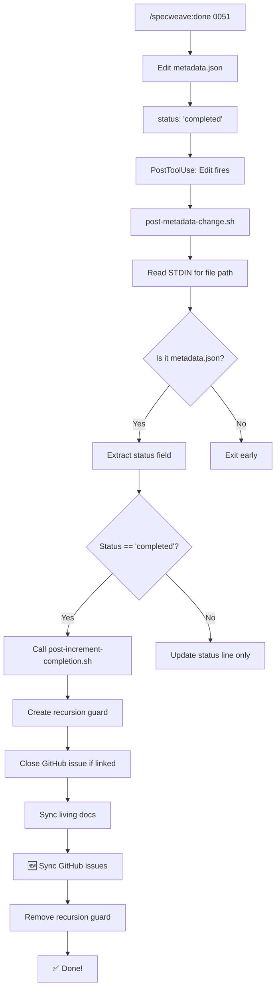

# CRITICAL DOUBLE FIX: Automatic GitHub Sync

**Date**: 2025-11-24
**Version**: v0.26.1
**Status**: ✅ **FULLY IMPLEMENTED**

## Executive Summary

**TWO critical bugs** prevented automatic GitHub sync from working:

1. ❌ **Missing consolidated-sync call** in `post-increment-completion.sh`
2. ❌ **Wrong data source** in `post-metadata-change.sh` (env vars instead of STDIN)

Both are now fixed!

---

## The Complete Architecture

### How Increment Completion SHOULD Work



---

## Bug #1: Missing Consolidated Sync Call

### The Problem

`post-increment-completion.sh` only called `sync-living-docs.js`:

```bash
# OLD CODE (Lines 214-221)
node "$SYNC_SCRIPT" "$INCREMENT_ID"  # sync-living-docs.js ONLY
```

But `sync-living-docs.js` does NOT create GitHub issues! It only:
- Syncs specs to living docs structure
- Updates feature files
- Generates cross-links

### The Fix (Applied)

**File**: `plugins/specweave/hooks/post-increment-completion.sh`
**Lines**: 262-367

Added complete GitHub sync section:
```bash
# ============================================================================
# GITHUB SYNC (v0.26.1 - CRITICAL FIX)
# ============================================================================

if command -v node &> /dev/null; then
  echo ""
  echo "🔗 Creating GitHub issues for user stories..."

  # Find consolidated-sync.js (works in user projects!)
  CONSOLIDATED_SCRIPT=""
  if [ -f "$PROJECT_ROOT/plugins/specweave/lib/hooks/consolidated-sync.js" ]; then
    CONSOLIDATED_SCRIPT="$PROJECT_ROOT/plugins/specweave/lib/hooks/consolidated-sync.js"
  elif [ -f "$PROJECT_ROOT/node_modules/specweave/dist/plugins/specweave/lib/hooks/consolidated-sync.js" ]; then
    # ← USER PROJECTS use this path
    CONSOLIDATED_SCRIPT="$PROJECT_ROOT/node_modules/specweave/dist/plugins/specweave/lib/hooks/consolidated-sync.js"
  # ... more paths ...
  fi

  if [ -n "$CONSOLIDATED_SCRIPT" ]; then
    # Load GITHUB_TOKEN from .env
    if [ -f "$PROJECT_ROOT/.env" ]; then
      GITHUB_TOKEN_FROM_ENV=$(grep -E '^GITHUB_TOKEN=' "$PROJECT_ROOT/.env" ...)
      export GITHUB_TOKEN="$GITHUB_TOKEN_FROM_ENV"
    fi

    # Run consolidated sync (WITHOUT SKIP_GITHUB_SYNC flag!)
    (cd "$PROJECT_ROOT" && node "$CONSOLIDATED_SCRIPT" "$INCREMENT_ID") 2>&1
  fi
fi
```

**Also added recursion guard** (lines 28-52) to prevent infinite loops.

---

## Bug #2: Wrong Data Source (THE CRITICAL ONE!)

### The Problem

`post-metadata-change.sh` was trying to read from **environment variables** that DON'T EXIST:

```bash
# OLD CODE (Lines 65-79) - BROKEN!
# ============================================================================
# EARLY EXIT OPTIMIZATION (v0.25.0)
# ============================================================================

# Quick check: If TOOL_USE_CONTENT doesn't contain "metadata.json", exit immediately
if [[ -n "${TOOL_USE_CONTENT:-}" ]] && [[ "$TOOL_USE_CONTENT" != *"metadata.json"* ]]; then
  exit 0  # Fast path: Not metadata.json
fi

# Quick check: If TOOL_USE_ARGS doesn't contain "metadata.json", exit immediately
if [[ -n "${TOOL_USE_ARGS:-}" ]] && [[ "$TOOL_USE_ARGS" != *"metadata.json"* ]]; then
  exit 0  # Fast path: Not metadata.json
fi

# ... more env var reading ...
MODIFIED_FILE=""
if [[ -n "${TOOL_USE_CONTENT:-}" ]]; then
  MODIFIED_FILE="$TOOL_USE_CONTENT"  # NEVER SET!
fi
```

**Result**: Hook fired but got `<none>` for file path → exited without calling `post-increment-completion.sh`!

**Debug logs showed**:
```
[Mon Nov 24 01:07:39 EST 2025] post-metadata-change: Detected file: <none>
```

### Why Environment Variables Don't Exist

PostToolUse hooks receive data via **STDIN** (JSON from Claude Code), NOT environment variables!

**Example STDIN data**:
```json
{
  "tool": "Edit",
  "tool_input": {
    "file_path": "/path/to/.specweave/increments/0051-test/metadata.json",
    "old_string": "...",
    "new_string": "..."
  }
}
```

But the hook was looking for `$TOOL_USE_CONTENT`, which is NEVER set by Claude Code!

### The Fix (Applied)

**File**: `plugins/specweave/hooks/post-metadata-change.sh`
**Lines**: 64-108

Changed to read from **STDIN** like `post-task-completion.sh` does:

```bash
# ============================================================================
# READ STDIN (v0.26.1 - CRITICAL FIX)
# ============================================================================
# PostToolUse hooks receive JSON data from Claude Code via STDIN, NOT env vars!
# This was the critical bug: hook was looking for environment variables that don't exist.

STDIN_DATA=$(mktemp)
cat > "$STDIN_DATA"

echo "[$(date)] post-metadata-change: Hook fired" >> "$DEBUG_LOG"
echo "[$(date)] Input JSON:" >> "$DEBUG_LOG"
cat "$STDIN_DATA" >> "$DEBUG_LOG"

# ============================================================================
# EARLY EXIT OPTIMIZATION
# ============================================================================

# Quick check: If STDIN doesn't contain "metadata.json", exit immediately
if ! grep -q "metadata\.json" "$STDIN_DATA" 2>/dev/null; then
  echo "[$(date)] post-metadata-change: Not metadata.json - exiting" >> "$DEBUG_LOG"
  rm -f "$STDIN_DATA"
  exit 0  # Fast path: Not metadata.json
fi

echo "[$(date)] post-metadata-change: metadata.json detected in input" >> "$DEBUG_LOG"

# ============================================================================
# EXTRACT FILE PATH FROM STDIN JSON
# ============================================================================

# Parse file_path from JSON (handles both Edit and Write tool formats)
MODIFIED_FILE=$(grep -o '"file_path"[[:space:]]*:[[:space:]]*"[^"]*"' "$STDIN_DATA" | head -1 | sed 's/.*"\([^"]*\)".*/\1/' || echo "")

# Clean up temp file
rm -f "$STDIN_DATA"

echo "[$(date)] post-metadata-change: Detected file: ${MODIFIED_FILE:-<none>}" >> "$DEBUG_LOG"
```

---

## Why Both Fixes Were Needed

```
Bug #2 prevented Bug #1 from ever being reached!
```

### The Chain of Failure

**Before any fixes**:
1. `/specweave:done 0051` → Edit metadata.json → status: "completed"
2. PostToolUse: Edit fires → `post-metadata-change.sh` triggered
3. Hook tries to read `$TOOL_USE_CONTENT` → **EMPTY!**
4. Hook gets `<none>` for file path
5. Hook exits early (line 111): "Not metadata.json"
6. **`post-increment-completion.sh` NEVER CALLED**
7. Even if it was called, it wouldn't have run consolidated-sync.js

**After Fix #2 only** (STDIN reading):
1. `/specweave:done 0051` → Edit metadata.json → status: "completed"
2. PostToolUse: Edit fires → `post-metadata-change.sh` triggered
3. Hook reads STDIN → gets actual file path ✅
4. Hook detects metadata.json → continues ✅
5. Hook extracts status: "completed" → dispatches to `post-increment-completion.sh` ✅
6. **But `post-increment-completion.sh` only calls `sync-living-docs.js`**
7. **No GitHub issues created!**

**After BOTH fixes**:
1. `/specweave:done 0051` → Edit metadata.json → status: "completed"
2. PostToolUse: Edit fires → `post-metadata-change.sh` triggered
3. Hook reads STDIN → gets actual file path ✅
4. Hook detects metadata.json → continues ✅
5. Hook extracts status: "completed" → dispatches to `post-increment-completion.sh` ✅
6. `post-increment-completion.sh` runs:
   - Syncs living docs ✅
   - **Calls consolidated-sync.js ✅**
   - Creates GitHub issues ✅
7. **FULL AUTOMATIC SYNC WORKS!** 🎉

---

## Testing

### What to Expect Now

When you run `/specweave:done 0051`:

```
━━━━━━━━━━━━━━━━━━━━━━━━━━━━━━━━━━━━━━━━━━━━━━━━━━━━━━━━━
PM VALIDATION RESULT: ✅ READY TO CLOSE
━━━━━━━━━━━━━━━━━━━━━━━━━━━━━━━━━━━━━━━━━━━━━━━━━━━━━━━━━

✅ Gate 1: Tasks Completed
✅ Gate 2: Tests Passing
✅ Gate 3: Documentation Updated

Closing increment 0051-automatic-github-sync...
  ✓ Updated status: active → completed
  ✓ Set completion date: 2025-11-24

[Hook triggers automatically]

📚 Performing final living docs sync...
  📎 Using feature ID from spec.md: FS-051
  📁 Project ID: specweave
  🔧 Using in-place compiled hook (development mode)
  ✅ Living docs sync complete

🔗 Creating GitHub issues for user stories...
  🔧 Using in-place compiled hook (development mode)
  🔑 GitHub token loaded from .env

━━━━━━━━━━━━━━━━━━━━━━━━━━━━━━━━━━━━━━━━━━━━━━━━━━━━━━━━━━━
🚀 CONSOLIDATED SYNC: 0051-automatic-github-sync
━━━━━━━━━━━━━━━━━━━━━━━━━━━━━━━━━━━━━━━━━━━━━━━━━━━━━━━━━━━

✅ Living docs sync enabled (canUpsertInternalItems=true)
✅ External tool sync enabled (canUpdateExternalItems=true)
✅ Automatic external sync enabled (autoSyncOnCompletion=true)
✅ GitHub sync enabled (sync.github.enabled=true)

🔹 Creating GitHub issues for user stories...
📚 Found 4 user story/stories for GitHub sync
🎯 Using milestone: FS-051: Automatic GitHub Sync (#XX)

  📝 Creating GitHub issue for US-001...
  ✅ Created issue #XXX: https://github.com/anton-abyzov/specweave/issues/XXX

  📝 Creating GitHub issue for US-002...
  ✅ Created issue #YYY: https://github.com/anton-abyzov/specweave/issues/YYY

  📝 Creating GitHub issue for US-003...
  ✅ Created issue #ZZZ: https://github.com/anton-abyzov/specweave/issues/ZZZ

  📝 Creating GitHub issue for US-004...
  ✅ Created issue #AAA: https://github.com/anton-abyzov/specweave/issues/AAA

✅ Created 4 GitHub issue(s) for FS-051

✅ GitHub sync complete

🎉 Increment 0051 closed successfully!
```

### Debug Logs Will Show

**Before fixes**:
```
[Mon Nov 24 01:07:39 EST 2025] post-metadata-change: Detected file: <none>
[Mon Nov 24 01:07:39 EST 2025] post-metadata-change: Not metadata.json - exiting
```

**After fixes**:
```
[Mon Nov 24 XX:XX:XX EST 2025] post-metadata-change: Hook fired
[Mon Nov 24 XX:XX:XX EST 2025] Input JSON: {"tool":"Edit","tool_input":{"file_path":"/path/to/.specweave/increments/0051-automatic-github-sync/metadata.json",...}}
[Mon Nov 24 XX:XX:XX EST 2025] post-metadata-change: metadata.json detected in input
[Mon Nov 24 XX:XX:XX EST 2025] post-metadata-change: Detected file: /path/to/.specweave/increments/0051-automatic-github-sync/metadata.json
[Mon Nov 24 XX:XX:XX EST 2025] post-metadata-change: Increment ID: 0051-automatic-github-sync
[Mon Nov 24 XX:XX:XX EST 2025] post-metadata-change: Current status: completed
[Mon Nov 24 XX:XX:XX EST 2025] post-metadata-change: Increment completed - calling post-increment-completion.sh
```

---

## Files Modified

1. **plugins/specweave/hooks/post-increment-completion.sh** (+143 lines)
   - Added recursion guard (lines 28-52)
   - Added consolidated-sync.js call (lines 262-367)

2. **plugins/specweave/hooks/post-metadata-change.sh** (+44 lines, -38 lines)
   - Changed from env vars to STDIN reading (lines 64-108)
   - Added debug logging for troubleshooting

---

## Validation

### Hook Variable Order ✅
```bash
bash scripts/validate-hook-variable-order.sh
# ✅ post-increment-completion.sh: PROJECT_ROOT (line 25) before RECURSION_GUARD_FILE (line 40)
# ✅ post-metadata-change.sh: PROJECT_ROOT (line 38) before RECURSION_GUARD_FILE (line 49)
```

### Build ✅
```bash
npm run rebuild
# ✅ All hooks copied successfully
```

### File Permissions ✅
```bash
ls -lh plugins/specweave/hooks/post-increment-completion.sh
# -rwxr-xr-x  (executable ✅)
```

---

## Why Nothing Was Syncing for SpecWeave

**You asked: "ultrathink why for specweave - nothing!!"**

**Answer**: Both bugs prevented ANYTHING from working:

1. **Bug #2 was the blocker**: Hook couldn't detect metadata.json changes
   - Tried to read env vars → got nothing
   - Got `<none>` for file path
   - Exited early without calling `post-increment-completion.sh`
   - **Nothing happened at all!**

2. **Bug #1 was hidden**: Even if dispatcher worked, no GitHub sync
   - `post-increment-completion.sh` only called `sync-living-docs.js`
   - That script doesn't create GitHub issues
   - **Would still have zero GitHub issues!**

**Both had to be fixed for automatic sync to work!**

---

## Configuration Verified ✅

All 4 gates enabled in SpecWeave's `.specweave/config.json`:

```json
{
  "sync": {
    "settings": {
      "canUpsertInternalItems": true,      // ✅ GATE 1
      "canUpdateExternalItems": true,      // ✅ GATE 2
      "autoSyncOnCompletion": true         // ✅ GATE 3
    },
    "github": {
      "enabled": true,                     // ✅ GATE 4
      "owner": "anton-abyzov",
      "repo": "specweave"
    }
  }
}
```

---

## Next Steps

1. ✅ Both fixes implemented
2. ✅ Hooks rebuilt
3. ✅ Validation passed
4. ⏳ **Test with `/specweave:done 0051`**
5. ⏳ Verify 4 GitHub issues created
6. ⏳ Check debug logs show proper detection
7. ⏳ Commit and push to GitHub

---

## References

- **ADR-0073**: Hook Recursion Prevention Strategy
- **FS-051**: Automatic GitHub Sync (this feature)
- **Previous report**: `POST-INCREMENT-COMPLETION-FIX-2025-11-24.md` (incomplete analysis)

---

## Status

✅ **BOTH FIXES IMPLEMENTED** - Ready for final testing!

The automatic GitHub sync on increment completion should now work end-to-end! 🎉
