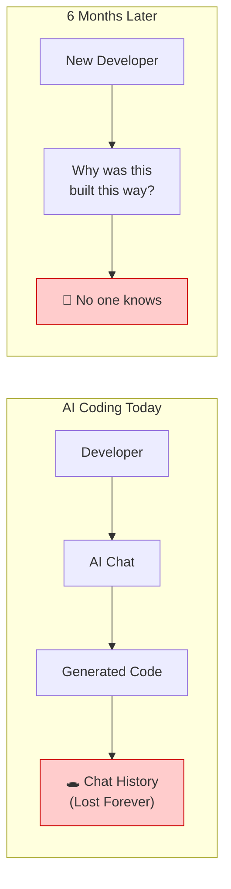
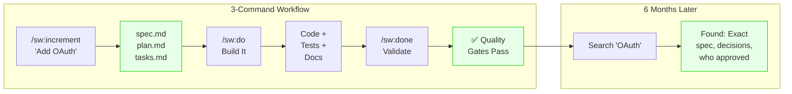
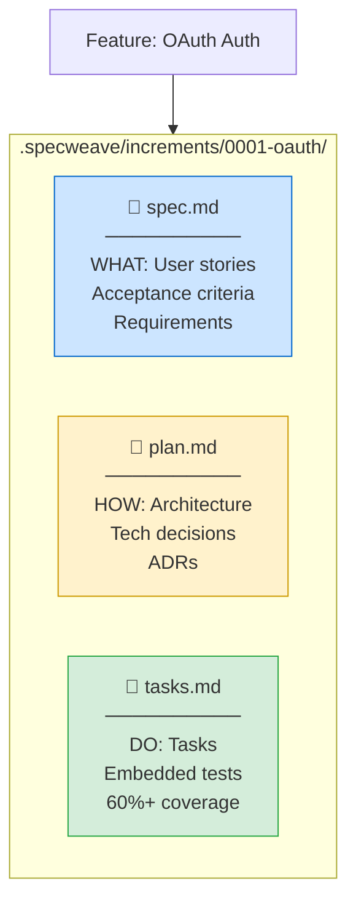
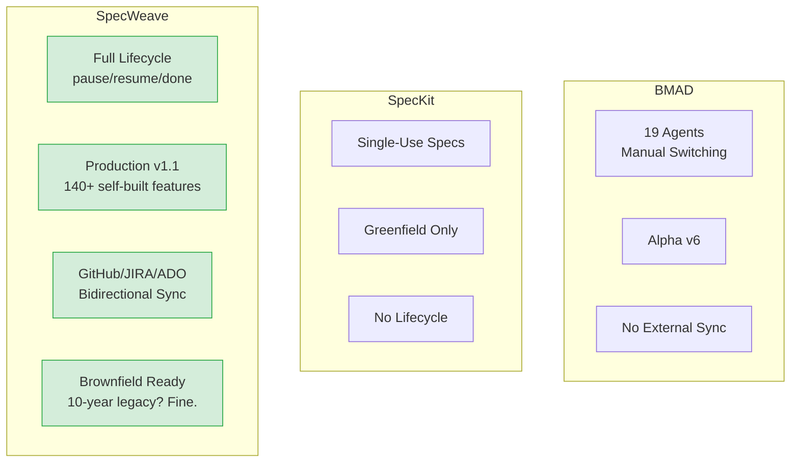
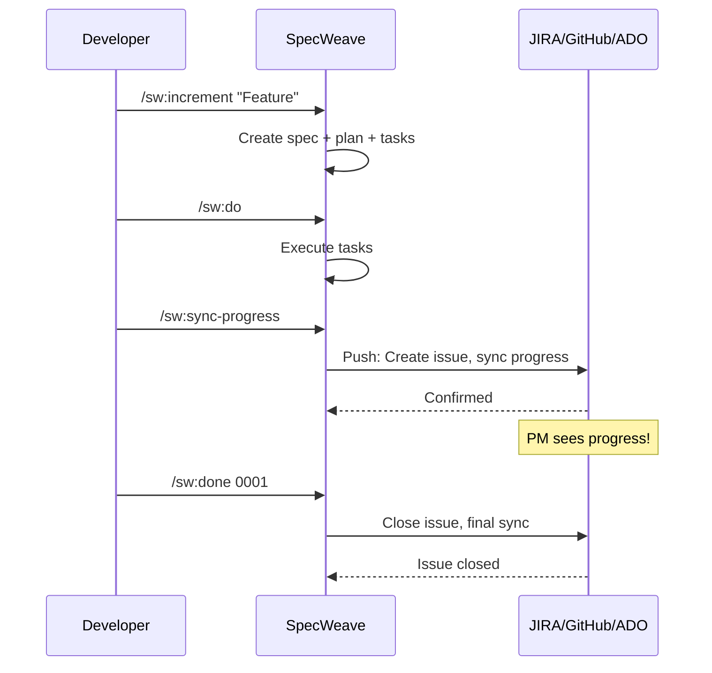
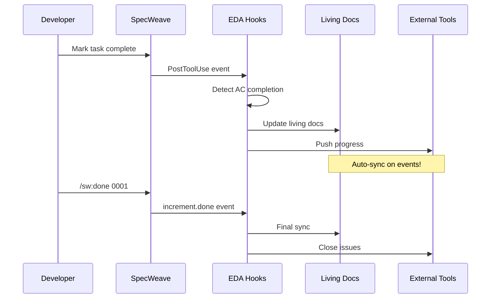
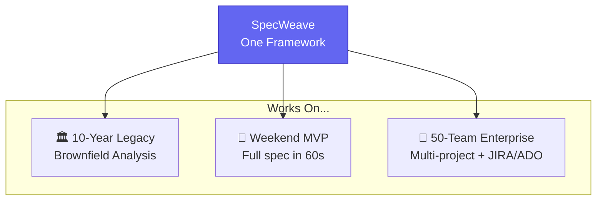
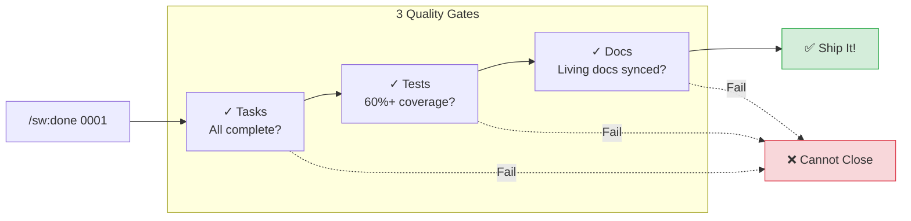
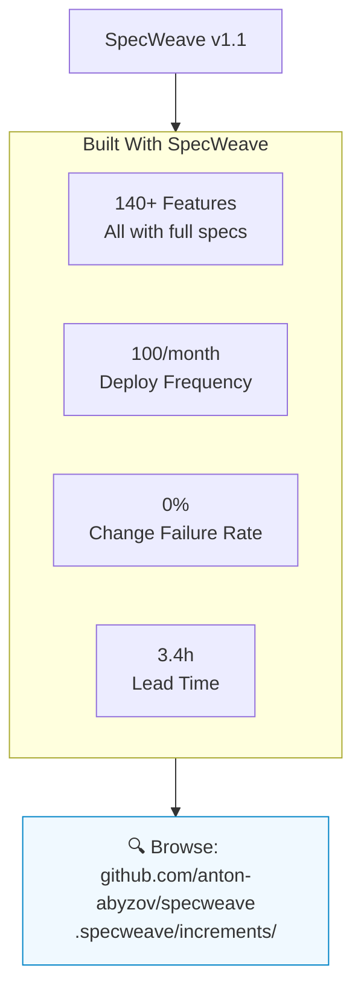

# SpecWeave Key Diagrams for YouTube Video

> **Version Reference**: v1.1.x (production)
> Copy these Mermaid diagrams to Excalidraw for video production.

---

## 1. THE PROBLEM (Before SpecWeave)

---

## 2. THE SOLUTION (SpecWeave Core Flow)

---

## 3. THREE-FILE FOUNDATION

---

## 4. COMPETITOR COMPARISON

---

## 5. EXTERNAL SYNC FLOW

---

## 6. LIVING DOCS FLOW (Event-Driven)

---

## 7. WORKS EVERYWHERE

---

## 8. QUALITY GATES

---

## 9. DOGFOODING PROOF

---

## HOW TO USE IN EXCALIDRAW

1. Copy any Mermaid diagram above
2. Go to https://mermaid.live/ to render
3. Export as SVG
4. Import SVG into Excalidraw
5. Customize colors/fonts as needed

Or use the Excalidraw Mermaid plugin to paste directly.

---

## SUGGESTED VIDEO FLOW

1. **Hook (0:00-0:30)**: Show Problem diagram - "Where do your AI specs go?"
2. **Solution (0:30-2:00)**: Show Solution flow + Three-File Foundation
3. **Comparison (2:00-3:00)**: Show Competitor Comparison
4. **Demo (3:00-8:00)**: Live coding with SpecWeave
5. **External Sync (8:00-9:00)**: Show sync to JIRA/GitHub
6. **Proof (9:00-10:00)**: Show Dogfooding stats
7. **CTA (10:00-10:30)**: Install command + links
