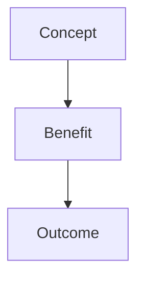
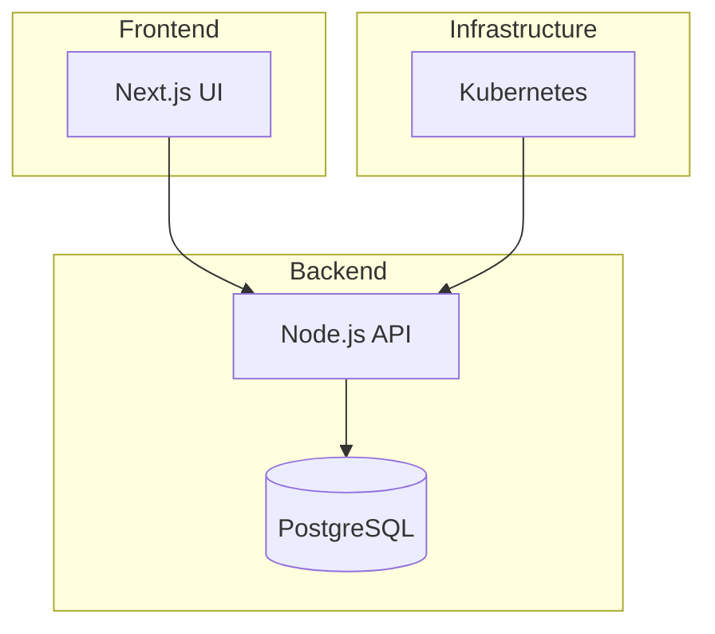
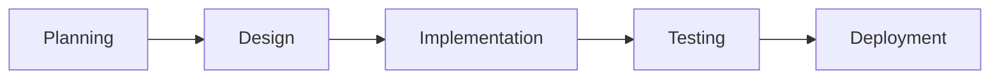
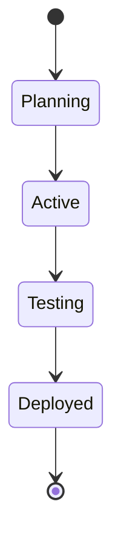
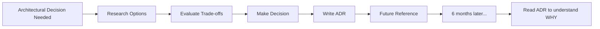

# Glossary & Educational Content Design

**Date**: 2025-11-04
**Status**: Design Phase
**Goal**: Transform public docs into comprehensive enterprise software development learning resource

---

## Overview

Create a comprehensive glossary and educational content structure that:
1. **Explains all technical terms** used in SpecWeave docs
2. **Teaches enterprise software development** from first principles
3. **Uses simple diagrams** to visualify concepts (Mermaid)
4. **Integrates SpecWeave** - show how it addresses each concept
5. **Bidirectional links** - glossary ↔ guides ↔ existing docs

---

## Structure

```
.specweave/docs/public/
├── glossary/
│   ├── README.md                    # Alphabetical index + intro
│   ├── index-by-category.md         # Category-based navigation
│   │
│   ├── terms/                       # Individual term pages
│   │   ├── adr.md                   # Architecture Decision Record
│   │   ├── api.md                   # Application Programming Interface
│   │   ├── e2e.md                   # End-to-End testing
│   │   ├── iac.md                   # Infrastructure as Code
│   │   ├── rfc.md                   # Request for Comments
│   │   ├── microservices.md
│   │   ├── monorepo.md
│   │   ├── ci-cd.md
│   │   └── ... (50+ terms)
│   │
│   └── categories/                  # Category landing pages
│       ├── architecture.md
│       ├── infrastructure.md
│       ├── backend.md
│       ├── frontend.md
│       ├── testing.md
│       ├── devops.md
│       └── collaboration.md
│
├── learn/                           # Learning guides (new!)
│   ├── README.md                    # Learning path overview
│   │
│   ├── foundations/                 # Fundamentals
│   │   ├── enterprise-app-development.md  # 101 guide
│   │   ├── software-lifecycle.md          # SDLC explained
│   │   ├── architecture-patterns.md       # Common patterns
│   │   └── why-documentation-matters.md
│   │
│   ├── infrastructure/              # Infrastructure & Operations
│   │   ├── what-is-infrastructure.md
│   │   ├── iac-fundamentals.md            # IaC with Terraform/K8s
│   │   ├── containers-and-orchestration.md
│   │   ├── ci-cd-pipelines.md
│   │   └── observability.md
│   │
│   ├── backend/                     # Backend Development
│   │   ├── backend-fundamentals.md
│   │   ├── api-design.md                  # REST, GraphQL, gRPC
│   │   ├── nodejs-guide.md                # Node.js, Express, NestJS
│   │   ├── database-design.md
│   │   └── microservices-vs-monolith.md
│   │
│   ├── frontend/                    # Frontend Development
│   │   ├── frontend-fundamentals.md
│   │   ├── react-vs-angular-vs-vue.md     # Framework comparison
│   │   ├── nextjs-guide.md                # Why Next.js
│   │   ├── state-management.md
│   │   └── ui-component-libraries.md
│   │
│   ├── testing/                     # Testing & Quality
│   │   ├── testing-fundamentals.md
│   │   ├── testing-pyramid.md
│   │   ├── e2e-testing.md                 # Playwright, Cypress
│   │   ├── tdd-explained.md
│   │   └── test-coverage.md
│   │
│   ├── ml-ai/                       # ML/AI Integration
│   │   ├── ml-fundamentals.md
│   │   ├── integrating-ml-models.md
│   │   ├── llm-integration.md
│   │   └── ai-assisted-development.md
│   │
│   └── collaboration/               # Team Collaboration
│       ├── git-workflows.md
│       ├── code-review.md
│       ├── documentation-strategy.md
│       └── agile-scrum-kanban.md
│
└── ... (existing docs)
```

---

## Term Template

Each glossary term follows this structure:

```markdown
---
id: term-name
title: Term Name
sidebar_label: Term Name
---

# Term Name

## Definition

Clear, concise explanation (1-2 sentences).

## What Problem Does It Solve?

Why does this concept exist? What pain point does it address?

## How It Works

Detailed explanation with diagram:



## Real-World Example

Concrete example from enterprise software development.

## How SpecWeave Uses This

How SpecWeave implements/addresses this concept.

Example:
- Commands: `/specweave:*`
- Files: `.specweave/docs/internal/architecture/adr/`
- Workflow: Step-by-step

## Related Terms

- [Related Term 1](/docs/glossary/terms/related-1) - How they're connected
- [Related Term 2](/docs/glossary/terms/related-2) - How they're connected
- [Category](/docs/glossary/categories/category-name) - Category link

## Learn More

- [Deep Dive Guide](/docs/learn/category/guide-name)
- [Official Documentation](external-link)
- [Tutorial](/docs/guides/tutorial-name)

---

**Category**: Architecture | Infrastructure | Backend | Frontend | Testing | DevOps | Collaboration

**Tags**: `#architecture` `#design` `#patterns`
```

---

## Conceptual Categories

### 1. Software Development Lifecycle (SDLC)
- Agile, Scrum, Kanban
- Sprint, Increment, Iteration
- Product Backlog, User Story
- Acceptance Criteria (AC)
- Definition of Done (DoD)

### 2. Architecture & Design
- Architecture Decision Record (ADR)
- High-Level Design (HLD)
- Low-Level Design (LLD)
- Request for Comments (RFC)
- Design Patterns
- SOLID Principles
- Domain-Driven Design (DDD)
- Microservices vs Monolith

### 3. Infrastructure & Operations
- Infrastructure as Code (IaC)
- Terraform, Kubernetes (K8s)
- Containerization (Docker)
- Container Orchestration
- CI/CD Pipeline
- Continuous Integration (CI)
- Continuous Deployment (CD)
- Observability
- Monitoring & Alerting
- SLI, SLO, SLA

### 4. Frontend Development
- React, Angular, Vue
- Next.js, Nuxt.js
- Server-Side Rendering (SSR)
- Static Site Generation (SSG)
- Single Page Application (SPA)
- State Management (Redux, Zustand)
- Component Library
- Design System

### 5. Backend Development
- API (Application Programming Interface)
- REST, GraphQL, gRPC
- Node.js, Express, NestJS
- Microservices
- API Gateway
- Service Mesh
- Database (SQL, NoSQL)
- ORM (Object-Relational Mapping)
- Message Queue (RabbitMQ, Kafka)

### 6. Testing & Quality
- End-to-End (E2E) Testing
- Integration Testing
- Unit Testing
- Test-Driven Development (TDD)
- Behavior-Driven Development (BDD)
- Test Coverage
- Regression Testing
- Smoke Testing
- Acceptance Testing
- Test Pyramid

### 7. DevOps & Tools
- Version Control (Git)
- GitHub, GitLab, Bitbucket
- Pull Request (PR)
- Code Review
- CI/CD Tools (GitHub Actions, Jenkins)
- Container Registry
- Artifact Repository
- Feature Flags

### 8. Collaboration & Management
- Jira, Azure DevOps (ADO)
- Epic, Story, Task
- Milestone
- Release Management
- Branching Strategy (GitFlow, Trunk-Based)
- Semantic Versioning (SemVer)
- Changelog

### 9. Security & Compliance
- OWASP Top 10
- Authentication vs Authorization
- JWT, OAuth2
- HTTPS, TLS/SSL
- Security Scanning
- GDPR, HIPAA, SOC 2

### 10. Performance & Scalability
- Load Balancing
- Caching (Redis, CDN)
- Horizontal vs Vertical Scaling
- Performance Testing
- Profiling
- Rate Limiting

---

## Learning Guide Structure

Each learning guide follows this pattern:

### Foundations Guides
**Target Audience**: Beginners, new to enterprise software

**Contents**:
1. **Enterprise App Development 101**
   - What is an enterprise application?
   - Typical architecture (3-tier, microservices)
   - Development lifecycle (SDLC)
   - Roles (PM, Architect, DevOps, QA)
   - Simple diagram showing end-to-end flow

2. **Software Lifecycle Explained**
   - Planning → Design → Implementation → Testing → Deployment
   - Agile vs Waterfall
   - Why documentation matters at each stage
   - How SpecWeave supports each stage

### Infrastructure Guides
**Target Audience**: Developers learning DevOps/Infrastructure

**Contents**:
1. **What is Infrastructure?**
   - Servers, databases, networks
   - On-premise vs Cloud (AWS, Azure, GCP)
   - Why infrastructure matters

2. **IaC Fundamentals**
   - Manual setup vs IaC
   - Terraform basics
   - Kubernetes basics
   - How SpecWeave tracks IaC changes

3. **CI/CD Pipelines**
   - What is CI/CD?
   - GitHub Actions example
   - Deployment strategies
   - How SpecWeave integrates with pipelines

### Backend Guides
**Target Audience**: Backend developers

**Contents**:
1. **Backend Fundamentals**
   - What is a backend?
   - API vs UI
   - Database design

2. **API Design**
   - REST principles
   - GraphQL vs REST
   - API contracts
   - How SpecWeave tracks API specs

3. **Node.js Guide**
   - Why Node.js is popular
   - Express vs NestJS vs Fastify
   - Best practices
   - How SpecWeave works with Node.js projects

### Frontend Guides
**Target Audience**: Frontend developers

**Contents**:
1. **Frontend Fundamentals**
   - What is a frontend?
   - SPA vs SSR vs SSG
   - Component-based architecture

2. **React vs Angular vs Vue**
   - Framework comparison
   - When to use which
   - Why React is most popular
   - SpecWeave with React/Next.js

3. **Next.js Guide**
   - Why Next.js over plain React
   - SSR, SSG, ISR explained
   - Best practices

### Testing Guides
**Target Audience**: All developers + QA

**Contents**:
1. **Testing Fundamentals**
   - Why test?
   - Testing pyramid
   - Unit, Integration, E2E

2. **E2E Testing**
   - What is E2E?
   - Playwright vs Cypress
   - How SpecWeave embeds tests in tasks.md

3. **TDD Explained**
   - Red-Green-Refactor
   - When to use TDD
   - SpecWeave's TDD workflow

### ML/AI Guides
**Target Audience**: Developers integrating ML/AI

**Contents**:
1. **ML Fundamentals**
   - What is ML?
   - Model training vs inference
   - Common frameworks (TensorFlow, PyTorch)

2. **Integrating ML Models**
   - API-based integration
   - Edge deployment
   - Model versioning

3. **AI-Assisted Development**
   - Claude Code, Cursor, Copilot
   - How SpecWeave uses AI
   - Best practices

---

## Diagram Standards

All diagrams use **Mermaid** for consistency:

### Architecture Diagrams


### Workflow Diagrams


### Lifecycle Diagrams


---

## Implementation Plan

### Phase 1: Core Glossary (High Priority)
**Terms**: 50+ most common terms
- ADR, RFC, HLD, LLD
- API, REST, GraphQL
- E2E, TDD, BDD
- IaC, Terraform, K8s
- Microservices, Monolith
- CI/CD, Pipeline
- React, Next.js, Angular
- Node.js, Express

### Phase 2: Learning Guides (High Priority)
**Guides**: 6 core guides
1. Enterprise App Development 101
2. Infrastructure & IaC Fundamentals
3. Backend Development Guide
4. Frontend Development Guide
5. Testing Strategies
6. ML/AI Integration

### Phase 3: Update Existing Docs (Medium Priority)
- Add glossary links to all existing docs
- Update faq.md with glossary references
- Update workflows with glossary links

### Phase 4: Bidirectional Links (Medium Priority)
- Ensure all glossary terms link to guides
- Ensure all guides link back to glossary
- Create category landing pages

### Phase 5: Advanced Content (Low Priority)
- Advanced architecture patterns
- Performance optimization
- Security best practices
- Compliance guides

---

## Success Metrics

- ✅ 50+ glossary terms created
- ✅ 6+ learning guides published
- ✅ 100% of existing docs have glossary links
- ✅ All diagrams in Mermaid format
- ✅ Bidirectional links working
- ✅ Docusaurus builds without errors

---

## Example: ADR Term

```markdown
---
id: adr
title: Architecture Decision Record (ADR)
sidebar_label: ADR
---

# Architecture Decision Record (ADR)

## Definition

An **Architecture Decision Record (ADR)** is a document that captures an important architectural decision made during software development, along with its context and consequences.

## What Problem Does It Solve?

**Problem**: 6 months after making an architectural decision, no one remembers WHY we chose PostgreSQL over MongoDB, or JWT over sessions.

**Solution**: ADRs preserve the **decision-making context**:
- What options were considered?
- Why was option X chosen over Y?
- What were the trade-offs?
- What are the consequences?

## How It Works



**ADR Structure**:
1. **Title**: Short noun phrase (e.g., "Use PostgreSQL for primary database")
2. **Status**: Proposed | Accepted | Deprecated | Superseded
3. **Context**: What is the issue we're facing?
4. **Decision**: What we decided to do
5. **Consequences**: What becomes easier/harder as a result

## Real-World Example

**Scenario**: Your team is choosing between PostgreSQL and MongoDB for a new project.

**Without ADR**:
- Decision made in Slack conversation
- 6 months later: "Why did we use Postgres? MongoDB would be better for this feature!"
- No record of why Postgres was chosen
- Time wasted revisiting old decisions

**With ADR**:
```markdown
# ADR-001: Use PostgreSQL for Primary Database

## Status
Accepted

## Context
We need a database for user management, transactions, and reporting.

Options considered:
- PostgreSQL (relational, ACID, strong consistency)
- MongoDB (document store, flexible schema)

## Decision
Use PostgreSQL because:
1. Strong ACID guarantees needed for transactions
2. Complex joins required for reporting
3. Team has more PostgreSQL experience
4. Schema changes are infrequent (stable data model)

## Consequences
✅ Easier: Transactions, data integrity, complex queries
❌ Harder: Schema migrations (require planning)
```

6 months later: Read ADR-001, understand decision, move forward.

## How SpecWeave Uses ADRs

SpecWeave stores ADRs in **`.specweave/docs/internal/architecture/adr/`**:

```
.specweave/docs/internal/architecture/adr/
├── 0001-use-typescript.md
├── 0002-plugin-architecture.md
├── 0003-claude-code-first.md
└── README.md
```

**Workflow**:
1. **During Planning**: Architect creates ADR for major decisions
2. **During Implementation**: Reference ADR for context
3. **After Completion**: ADR status changes to "Accepted"
4. **Future Reference**: Read ADR to understand why

**Commands**:
- No specific command (ADRs are markdown files)
- Created manually during `/specweave:inc` planning phase
- Referenced in `plan.md`

## Related Terms

- [RFC (Request for Comments)](/docs/glossary/terms/rfc) - Similar but for feature specifications
- [HLD (High-Level Design)](/docs/glossary/terms/hld) - Technical design document
- [Architecture](/docs/glossary/categories/architecture) - Category page
- [Living Documentation](/docs/guides/core-concepts/living-documentation) - How docs stay current

## Learn More

- [Architecture & Design Guide](/docs/learn/foundations/architecture-patterns)
- [How to Write ADRs](/docs/guides/adr-writing-guide)
- [SpecWeave Architecture](/docs/guides/core-concepts/architecture)

---

**Category**: Architecture & Design

**Tags**: `#architecture` `#design` `#decision` `#documentation`
```

---

## Next Steps

1. ✅ Create glossary/terms/ directory structure
2. ✅ Create 50+ term files (ADR, API, E2E, etc.)
3. ✅ Create learn/ directory structure
4. ✅ Create 6+ learning guides
5. ✅ Generate Mermaid diagrams for all guides
6. ✅ Update existing docs with glossary links
7. ✅ Create bidirectional links
8. ✅ Update sidebars.ts with new structure
9. ✅ Test Docusaurus build
10. ✅ Validate all links

---

**Status**: Design Complete, Ready for Implementation
