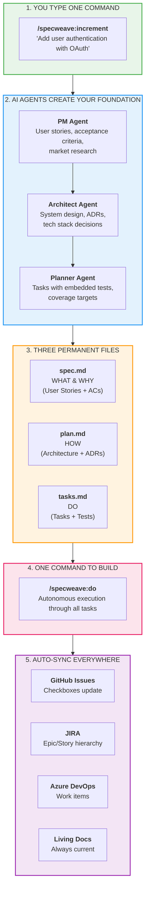
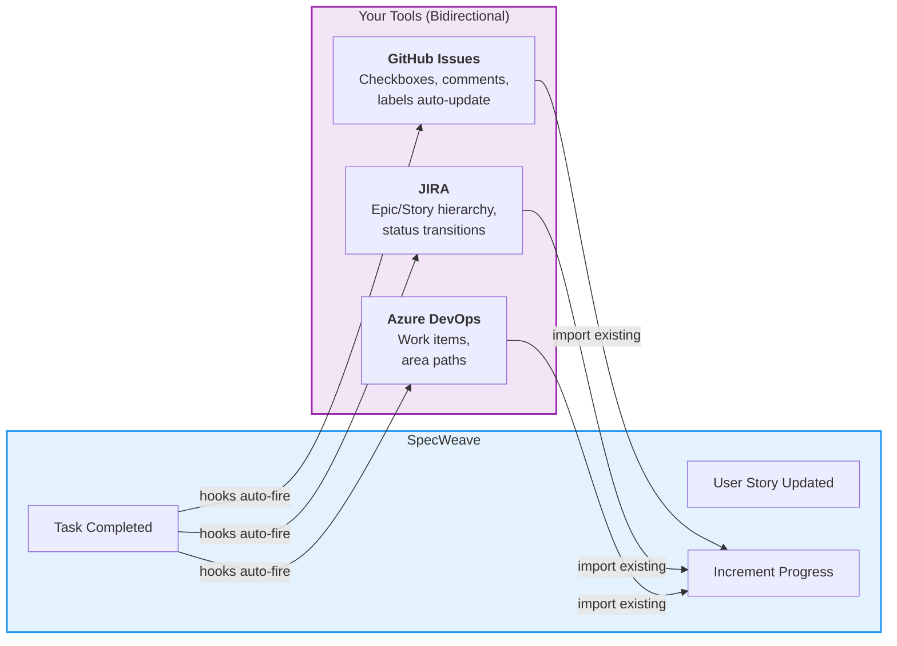
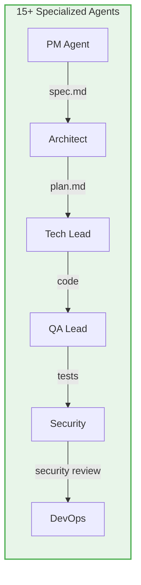

# SpecWeave

**The AI Development Framework That Doesn't Lose Your Work**

[](https://www.npmjs.com/package/specweave)
[](https://opensource.org/licenses/MIT)
[](https://discord.gg/UYg4BGJ65V)
[](https://www.youtube.com/@antonabyzov)

---

## What Makes SpecWeave Different

Every AI coding tool promises productivity. But after the chat ends:

- **Your specs disappear** into chat history
- **Your architecture decisions are forgotten**
- **Your tests are never written**
- **Your GitHub/JIRA stays outdated**
- **New team members start from zero**

**SpecWeave is the only framework where AI decisions become permanent, searchable documentation.**

```
Your Idea → Spec (permanent) → Plan (permanent) → Tasks (permanent) → Code → Living Docs (auto-synced)
```

---

## The Workflow


```mermaid
flowchart TB
    subgraph INPUT["1. YOU TYPE ONE COMMAND"]
        A["<b>/specweave:increment</b><br/>'Add user authentication with OAuth'"]
    end

    subgraph AGENTS["2. AI AGENTS CREATE YOUR FOUNDATION"]
        direction TB
        PM["<b>PM Agent</b><br/>User stories, acceptance criteria,<br/>market research"]
        ARCH["<b>Architect Agent</b><br/>System design, ADRs,<br/>tech stack decisions"]
        PLAN["<b>Planner Agent</b><br/>Tasks with embedded tests,<br/>coverage targets"]
        PM --> ARCH --> PLAN
    end

    subgraph OUTPUT["3. THREE PERMANENT FILES"]
        direction LR
        SPEC["<b>spec.md</b><br/>WHAT & WHY<br/>(User Stories + ACs)"]
        PLANF["<b>plan.md</b><br/>HOW<br/>(Architecture + ADRs)"]
        TASKS["<b>tasks.md</b><br/>DO<br/>(Tasks + Tests)"]
    end

    subgraph EXECUTE["4. ONE COMMAND TO BUILD"]
        B["<b>/specweave:do</b><br/>Autonomous execution through all tasks"]
    end

    subgraph SYNC["5. AUTO-SYNC EVERYWHERE"]
        direction LR
        GH["<b>GitHub Issues</b><br/>Checkboxes update"]
        JIRA["<b>JIRA</b><br/>Epic/Story hierarchy"]
        ADO["<b>Azure DevOps</b><br/>Work items"]
        DOCS["<b>Living Docs</b><br/>Always current"]
    end

    INPUT --> AGENTS
    AGENTS --> OUTPUT
    OUTPUT --> EXECUTE
    EXECUTE --> SYNC

    style INPUT fill:#e8f5e9,stroke:#4caf50,stroke-width:2px
    style AGENTS fill:#e3f2fd,stroke:#2196f3,stroke-width:2px
    style OUTPUT fill:#fff3e0,stroke:#ff9800,stroke-width:2px
    style EXECUTE fill:#fce4ec,stroke:#e91e63,stroke-width:2px
    style SYNC fill:#f3e5f5,stroke:#9c27b0,stroke-width:2px
```

---

## Quick Start

```bash
npm install -g specweave
cd your-project
specweave init .
```

Then in Claude Code:
```bash
/specweave:increment "User authentication with OAuth"  # AI creates spec + plan + tasks
/specweave:do                                          # Autonomous implementation
/specweave:done 0001                                   # Quality-validated completion
```

**[Full Quickstart Guide](https://spec-weave.com/docs/guides/getting-started/quickstart)**

---

## Why SpecWeave Over Alternatives?

### vs. BMAD Method (18K GitHub Stars)

| Aspect | BMAD | SpecWeave |
|--------|------|-----------|
| **Focus** | Greenfield microservices | **Brownfield + Greenfield** |
| **Context Efficiency** | Context crashes documented | **70%+ token reduction** |
| **Multi-Repo** | Single repo focus | **Multi-project mode** |
| **External Sync** | None | **GitHub/JIRA/ADO bidirectional** |
| **Quality Gates** | Optional | **3-gate PM validation** |
| **Learning Curve** | Steep (YAML/agents) | Medium (CLI commands) |

### vs. GitHub Spec Kit

| Aspect | Spec Kit | SpecWeave |
|--------|----------|-----------|
| **Maturity** | Experimental | **Production-ready** |
| **Brownfield** | Not supported | **Core strength** |
| **Implementation Quality** | "Poor" (user reports) | **Quality gates enforce standards** |
| **Human Oversight** | Batch execution | **Milestone validation** |
| **Enterprise Features** | None | **Compliance, multi-team, DORA** |

---

## External Tool Integration

SpecWeave keeps your project management tools in sync **automatically**:


```mermaid
flowchart LR
    subgraph SPECWEAVE["SpecWeave"]
        TASK["Task Completed"]
        US["User Story Updated"]
        INC["Increment Progress"]
    end

    subgraph EXTERNAL["Your Tools (Bidirectional)"]
        GH["<b>GitHub Issues</b><br/>Checkboxes, comments,<br/>labels auto-update"]
        JIRA["<b>JIRA</b><br/>Epic/Story hierarchy,<br/>status transitions"]
        ADO["<b>Azure DevOps</b><br/>Work items,<br/>area paths"]
    end

    TASK -->|"hooks auto-fire"| GH
    TASK -->|"hooks auto-fire"| JIRA
    TASK -->|"hooks auto-fire"| ADO

    GH -->|"import existing"| INC
    JIRA -->|"import existing"| INC
    ADO -->|"import existing"| INC

    style SPECWEAVE fill:#e3f2fd,stroke:#2196f3,stroke-width:2px
    style EXTERNAL fill:#f3e5f5,stroke:#9c27b0,stroke-width:2px
```

| Platform | Capabilities |
|----------|--------------|
| **GitHub Issues** | Create, update, close, bidirectional sync, checkbox tracking |
| **JIRA** | Epic/Story hierarchy, bidirectional sync, custom fields |
| **Azure DevOps** | Work items, area paths, bidirectional sync |
| **Linear** | Coming Q1 2026 |

---

## What You Get

| Before | After SpecWeave |
|--------|-----------------|
| Specs in chat history | **Permanent, searchable specs** |
| Manual JIRA/GitHub updates | **Auto-sync on every task** |
| Tests? Maybe later... | **Tests embedded in tasks (60%+ enforced)** |
| Architecture in your head | **ADRs captured automatically** |
| "Ask John, he knows" | **Living docs, always current** |
| Onboarding: 2 weeks | **Onboarding: 1 day** |

---

## DORA Metrics Integration

SpecWeave automatically calculates your team's [DORA metrics](https://dora.dev/) from GitHub data:

```bash
npm run metrics:dora
```

| Metric | What It Measures | Elite Performance |
|--------|------------------|-------------------|
| **Deployment Frequency** | How often you release | Multiple per day |
| **Lead Time for Changes** | Commit to production | Less than 1 day |
| **Change Failure Rate** | % of releases causing issues | 0-15% |
| **Mean Time to Recovery** | Time to restore service | Less than 1 hour |

**Connect your spec-driven workflow directly to industry-standard metrics.**

---

## The Three-File Foundation

Every feature generates three permanent files:

```
.specweave/increments/0001-user-authentication/
├── spec.md    ← WHAT: User stories, acceptance criteria, requirements
├── plan.md    ← HOW: Architecture, tech decisions, ADRs
└── tasks.md   ← DO: Implementation tasks with embedded tests
```

### spec.md (WHAT)
```markdown
## User Stories

### US-001: User Login
As a user, I want to log in with OAuth so that I don't need to remember passwords.

**Acceptance Criteria:**
- [x] AC-US1-01: Google OAuth integration works
- [x] AC-US1-02: Session persists across browser refresh
- [ ] AC-US1-03: Logout clears all tokens
```

### tasks.md (DO)
```markdown
### T-001: Implement OAuth Service
**User Story**: US-001
**Satisfies ACs**: AC-US1-01, AC-US1-02
**Status**: [x] completed

**Embedded Tests** (AC-US1-01):
- test_google_oauth_redirects_correctly
- test_callback_exchanges_code_for_token
- test_user_profile_is_fetched
```

---

## Key Features

### Autonomous Multi-Agent Orchestration


```mermaid
flowchart LR
    subgraph AGENTS["15+ Specialized Agents"]
        PM["PM Agent"]
        ARCH["Architect"]
        TECH["Tech Lead"]
        QA["QA Lead"]
        SEC["Security"]
        DEVOPS["DevOps"]
    end

    PM -->|"spec.md"| ARCH
    ARCH -->|"plan.md"| TECH
    TECH -->|"code"| QA
    QA -->|"tests"| SEC
    SEC -->|"security review"| DEVOPS

    style AGENTS fill:#e8f5e9,stroke:#4caf50,stroke-width:2px
```

- **PM Agent**: User stories, acceptance criteria, market analysis
- **Architect Agent**: System design, ADRs, tech stack decisions
- **Tech Lead Agent**: Implementation, code review, best practices
- **QA Lead Agent**: Test strategy, E2E tests, coverage validation
- **Security Agent**: Threat modeling, OWASP, vulnerability assessment
- **DevOps Agent**: IaC, Kubernetes, CI/CD pipelines

### Living Documentation

Documentation updates **after every task** via hooks:
- Strategic specs sync to `.specweave/docs/`
- ADRs captured automatically
- Runbooks and SLOs generated
- No manual doc updates ever

### Quality Gates

Three gates before any increment closes:
1. **Tasks**: All tasks marked complete
2. **Tests**: 60%+ coverage minimum (configurable)
3. **Documentation**: Living docs updated

### Token Efficiency

70%+ context reduction through:
- Progressive plugin loading (load only what you need)
- Skills auto-activate based on keywords
- Context optimizer removes irrelevant specs
- Sub-agent parallelization isolates context

---

## Commands Reference

| Command | Purpose |
|---------|---------|
| `/specweave:increment "feature"` | Plan new increment (PM → Architect → Tasks) |
| `/specweave:do` | Execute all tasks autonomously |
| `/specweave:done 0001` | Complete with quality gate validation |
| `/specweave:progress` | Show real-time status |
| `/specweave:validate 0001` | Run quality checks |
| `/specweave:sync-progress` | Sync to GitHub/JIRA/ADO |
| `/specweave:tdd-cycle` | Full red-green-refactor workflow |

**[Full Command Reference](https://spec-weave.com/docs/commands/overview)**

---

## Brownfield & Greenfield

**New Projects**: Start spec-driven from day one.

**Existing Projects**:
```bash
specweave init .
/specweave:import-docs ~/exports/notion --source=notion
```

Import from Notion, Confluence, GitHub Wiki. AI classifies docs automatically and creates retroactive specifications.

---

## Requirements

- Node.js 20+
- Claude Code (recommended) or compatible AI assistant
- Git repository

---

## Community

- **[Documentation](https://spec-weave.com)** - Full guides and tutorials
- **[Discord](https://discord.gg/UYg4BGJ65V)** - Get help, share tips
- **[YouTube](https://www.youtube.com/@antonabyzov)** - Video tutorials
- **[GitHub Issues](https://github.com/anton-abyzov/specweave/issues)** - Bug reports and features

---

## Contributing

```bash
git clone https://github.com/anton-abyzov/specweave.git
cd specweave
npm install && npm run build
npm test
```

**[Contributor Guide](https://spec-weave.com/docs/guides/contributing)**

---

## License

MIT - [github.com/anton-abyzov/specweave](https://github.com/anton-abyzov/specweave)

---

**Stop losing your AI work. Start building permanent knowledge.**

```bash
npm install -g specweave
```
