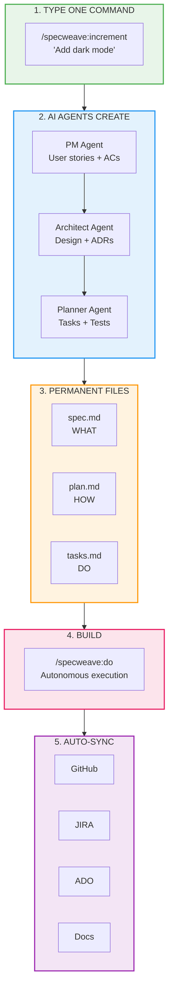
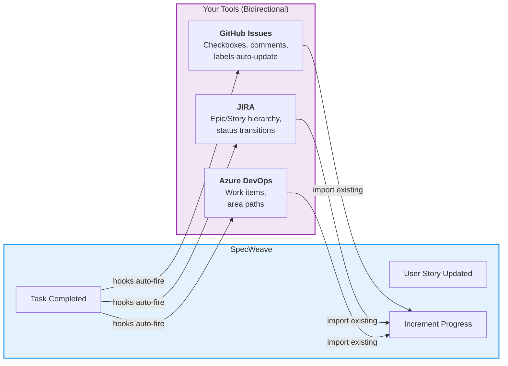
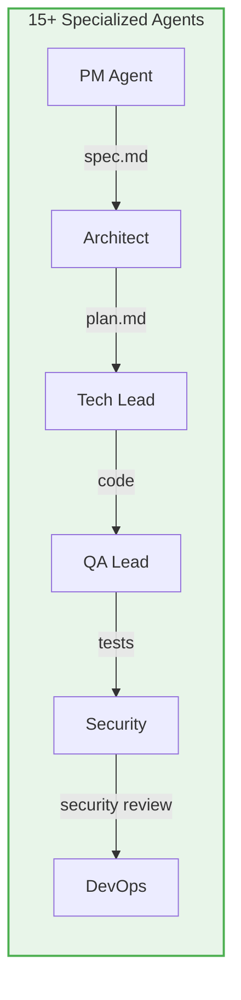

# SpecWeave

**The AI Development Framework That Doesn't Lose Your Work**

[](https://www.npmjs.com/package/specweave)
[](https://opensource.org/licenses/MIT)
[](https://discord.gg/UYg4BGJ65V)
[](https://www.youtube.com/@antonabyzov)

---

## 🔄 Built With SpecWeave (Dogfooding)

> **SpecWeave is 100% built using SpecWeave.** Every feature, every bug fix, every release — all spec-driven.

This isn't just a framework we made — it's the framework we use every day. Our entire development workflow runs on SpecWeave:
- **60+ completed increments** with full specs, plans, and tasks
- **Living docs** that auto-update after every task
- **DORA metrics** tracking real delivery performance

[](https://github.com/anton-abyzov/specweave/blob/develop/.specweave/docs/internal/delivery/dora-metrics.md)
[](https://github.com/anton-abyzov/specweave/blob/develop/.specweave/docs/internal/delivery/dora-metrics.md)
[](https://github.com/anton-abyzov/specweave/blob/develop/.specweave/docs/internal/delivery/dora-metrics.md)
[](https://github.com/anton-abyzov/specweave/blob/develop/.specweave/docs/internal/delivery/dora-metrics.md)

**[→ Live Dashboard](https://spec-weave.com/docs/metrics)** | **[→ Detailed Report](https://github.com/anton-abyzov/specweave/blob/develop/.specweave/metrics/dora-report.md)** | **[→ Browse Our Increments](https://github.com/anton-abyzov/specweave/tree/develop/.specweave/increments)**

---

## What Makes SpecWeave Different

Every AI coding tool promises productivity. But after the chat ends:

- **Your specs disappear** into chat history
- **Your architecture decisions are forgotten**
- **Your tests are never written**
- **Your GitHub/JIRA stays outdated**
- **New team members start from zero**

**SpecWeave is the only framework where AI decisions become permanent, searchable documentation.**

```
┌──────────┐    ┌──────────┐    ┌──────────┐    ┌──────────┐    ┌──────────┐    ┌──────────┐
│  Your    │    │   Spec   │    │   Plan   │    │  Tasks   │    │   Code   │    │  Living  │
│  Idea    │───▶│(permanent│───▶│(permanent│───▶│(permanent│───▶│          │───▶│   Docs   │
│          │    │    ✓)    │    │    ✓)    │    │    ✓)    │    │          │    │(auto-sync│
└──────────┘    └──────────┘    └──────────┘    └──────────┘    └──────────┘    └──────────┘
```

---

## The Workflow


```mermaid
flowchart TB
    subgraph INPUT["1. TYPE ONE COMMAND"]
        A["/specweave:increment<br/>'Add dark mode'"]
    end

    subgraph AGENTS["2. AI AGENTS CREATE"]
        direction TB
        PM["PM Agent<br/>User stories + ACs"]
        ARCH["Architect Agent<br/>Design + ADRs"]
        PLAN["Planner Agent<br/>Tasks + Tests"]
        PM --> ARCH --> PLAN
    end

    subgraph OUTPUT["3. PERMANENT FILES"]
        direction LR
        SPEC["spec.md<br/>WHAT"]
        PLANF["plan.md<br/>HOW"]
        TASKS["tasks.md<br/>DO"]
    end

    subgraph EXECUTE["4. BUILD"]
        B["/specweave:do<br/>Autonomous execution"]
    end

    subgraph SYNC["5. AUTO-SYNC"]
        direction LR
        GH["GitHub"]
        JIRA["JIRA"]
        ADO["ADO"]
        DOCS["Docs"]
    end

    INPUT --> AGENTS
    AGENTS --> OUTPUT
    OUTPUT --> EXECUTE
    EXECUTE --> SYNC

    style INPUT fill:#e8f5e9,stroke:#4caf50,stroke-width:2px
    style AGENTS fill:#e3f2fd,stroke:#2196f3,stroke-width:2px
    style OUTPUT fill:#fff3e0,stroke:#ff9800,stroke-width:2px
    style EXECUTE fill:#fce4ec,stroke:#e91e63,stroke-width:2px
    style SYNC fill:#f3e5f5,stroke:#9c27b0,stroke-width:2px
```

---

## Quick Start

```bash
npm install -g specweave
cd your-project
specweave init .
```

Then in Claude Code:
```bash
/specweave:increment "Add dark mode toggle"  # AI creates spec + plan + tasks
/specweave:do                                # Autonomous implementation
/specweave:done 0001                         # Quality-validated completion
```

**Pro tip**: Use `/specweave:next` to flow through the entire cycle. One command auto-closes completed work and suggests what's next — review specs/tasks when needed, otherwise just keep clicking "next".

**[Full Quickstart Guide](https://spec-weave.com/docs/guides/getting-started/quickstart)**

---

## Key Strengths

- **Brownfield + Greenfield** — Works with existing codebases, not just new projects
- **70%+ Token Reduction** — Progressive loading, context optimizer, sub-agent isolation
- **Multi-Project Mode** — Manage multiple repos with shared specs and cross-project sync
- **Bidirectional Sync** — GitHub Issues, JIRA, Azure DevOps stay in sync automatically
- **3-Gate Quality Validation** — Tasks, tests (60%+), and docs verified before closing
- **15+ Specialized Agents** — PM, Architect, Tech Lead, QA, Security, DevOps work autonomously
- **Living Documentation** — Specs auto-update after every task via hooks

---

## External Tool Integration

SpecWeave keeps your project management tools in sync **automatically**:


```mermaid
flowchart LR
    subgraph SPECWEAVE["SpecWeave"]
        TASK["Task Completed"]
        US["User Story Updated"]
        INC["Increment Progress"]
    end

    subgraph EXTERNAL["Your Tools (Bidirectional)"]
        GH["<b>GitHub Issues</b><br/>Checkboxes, comments,<br/>labels auto-update"]
        JIRA["<b>JIRA</b><br/>Epic/Story hierarchy,<br/>status transitions"]
        ADO["<b>Azure DevOps</b><br/>Work items,<br/>area paths"]
    end

    TASK -->|"hooks auto-fire"| GH
    TASK -->|"hooks auto-fire"| JIRA
    TASK -->|"hooks auto-fire"| ADO

    GH -->|"import existing"| INC
    JIRA -->|"import existing"| INC
    ADO -->|"import existing"| INC

    style SPECWEAVE fill:#e3f2fd,stroke:#2196f3,stroke-width:2px
    style EXTERNAL fill:#f3e5f5,stroke:#9c27b0,stroke-width:2px
```

| Platform | Capabilities |
|----------|--------------|
| **GitHub Issues** | Create, update, close, bidirectional sync, checkbox tracking |
| **JIRA** | Epic/Story hierarchy, bidirectional sync, custom fields |
| **Azure DevOps** | Work items, area paths, bidirectional sync |
| **Linear** | Coming Q1 2026 |

---

## What You Get

| Before | After SpecWeave |
|--------|-----------------|
| Specs in chat history | **Permanent, searchable specs** |
| Manual JIRA/GitHub updates | **Auto-sync on every task** |
| Tests? Maybe later... | **Tests embedded in tasks (60%+ enforced)** |
| Architecture in your head | **ADRs captured automatically** |
| "Ask John, he knows" | **Living docs, always current** |
| Onboarding: 2 weeks | **Onboarding: 1 day** |

---

## The Three-File Foundation

Every feature generates three permanent files:

```
.specweave/increments/0001-dark-mode/
├── spec.md    ← WHAT: User stories, acceptance criteria, requirements
├── plan.md    ← HOW: Architecture, tech decisions, ADRs
└── tasks.md   ← DO: Implementation tasks with embedded tests
```

### spec.md (WHAT)
```markdown
## User Stories

### US-001: Dark Mode Toggle
As a user, I want to toggle dark mode so that I can reduce eye strain at night.

**Acceptance Criteria:**
- [x] AC-US1-01: Toggle switch in settings persists preference
- [x] AC-US1-02: Theme applies to all components instantly
- [ ] AC-US1-03: System preference detected on first visit
```

### tasks.md (DO)
```markdown
### T-001: Implement Theme Provider
**User Story**: US-001
**Satisfies ACs**: AC-US1-01, AC-US1-02
**Status**: [x] completed

**Embedded Tests** (AC-US1-01):
- test_theme_toggle_persists_to_localstorage
- test_theme_applies_to_all_components
- test_toggle_updates_ui_instantly
```

---

## Key Features

### Autonomous Multi-Agent Orchestration


```mermaid
flowchart LR
    subgraph AGENTS["15+ Specialized Agents"]
        PM["PM Agent"]
        ARCH["Architect"]
        TECH["Tech Lead"]
        QA["QA Lead"]
        SEC["Security"]
        DEVOPS["DevOps"]
    end

    PM -->|"spec.md"| ARCH
    ARCH -->|"plan.md"| TECH
    TECH -->|"code"| QA
    QA -->|"tests"| SEC
    SEC -->|"security review"| DEVOPS

    style AGENTS fill:#e8f5e9,stroke:#4caf50,stroke-width:2px
```

- **PM Agent**: User stories, acceptance criteria, market analysis
- **Architect Agent**: System design, ADRs, tech stack decisions
- **Tech Lead Agent**: Implementation, code review, best practices
- **QA Lead Agent**: Test strategy, E2E tests, coverage validation
- **Security Agent**: Threat modeling, OWASP, vulnerability assessment
- **DevOps Agent**: IaC, Kubernetes, CI/CD pipelines

### Living Documentation

Documentation updates **after every task** via hooks:
- Strategic specs sync to `.specweave/docs/`
- ADRs captured automatically
- Runbooks and SLOs generated
- No manual doc updates ever

### Quality Gates

Three gates before any increment closes:
1. **Tasks**: All tasks marked complete
2. **Tests**: 60%+ coverage minimum (configurable)
3. **Documentation**: Living docs updated

### Token Efficiency

70%+ context reduction through:
- Progressive plugin loading (load only what you need)
- Skills auto-activate based on keywords
- Context optimizer removes irrelevant specs
- Sub-agent parallelization isolates context

---

## Commands Reference

| Command | Purpose |
|---------|---------|
| `/specweave:increment "feature"` | Plan new increment (PM → Architect → Tasks) |
| `/specweave:do` | Execute all tasks autonomously |
| `/specweave:done 0001` | Complete with quality gate validation |
| `/specweave:progress` | Show real-time status |
| `/specweave:validate 0001` | Run quality checks |
| `/specweave:sync-progress` | Sync to GitHub/JIRA/ADO |
| `/specweave:tdd-cycle` | Full red-green-refactor workflow |

**[Full Command Reference](https://spec-weave.com/docs/commands/overview)**

---

## Brownfield & Greenfield

**New Projects**: Start spec-driven from day one.

**Existing Projects**:
```bash
specweave init .
/specweave:import-docs ~/exports/notion --source=notion
```

Import from Notion, Confluence, GitHub Wiki. AI classifies docs automatically and creates retroactive specifications.

---

## Requirements

- Node.js 20+
- Claude Code with **Claude Opus 4.5** (recommended) — [released Nov 2025](https://www.anthropic.com/news/claude-opus-4-5)
- Git repository

---

## Community

- **[Documentation](https://spec-weave.com)** - Full guides and tutorials
- **[Discord](https://discord.gg/UYg4BGJ65V)** - Get help, share tips
- **[YouTube](https://www.youtube.com/@antonabyzov)** - Video tutorials
- **[GitHub Issues](https://github.com/anton-abyzov/specweave/issues)** - Bug reports and features

---

## Contributing

```bash
git clone https://github.com/anton-abyzov/specweave.git
cd specweave
npm install && npm run build
npm test
```

**[Contributor Guide](https://spec-weave.com/docs/guides/contributing)**

---

## License

MIT - [github.com/anton-abyzov/specweave](https://github.com/anton-abyzov/specweave)

---

**Stop losing your AI work. Start building permanent knowledge.**

```bash
npm install -g specweave
```
