# SpecWeave

> **1 Senior Developer = Full Engineering Team**

The framework that turns solo builders into unicorn-level engineering teams.

[](https://opensource.org/licenses/MIT)
[](https://github.com/anton-abyzov/specweave/actions/workflows/test.yml)
[](https://github.com/anton-abyzov/specweave/actions/workflows/e2e-smoke-test.yml)
[](https://discord.gg/UYg4BGJ65V)
[](https://www.youtube.com/@antonabyzov)

---

## 📊 Engineering Metrics (DORA)

[](https://github.com/anton-abyzov/specweave/blob/develop/.specweave/docs/internal/delivery/dora-metrics.md)
[](https://github.com/anton-abyzov/specweave/blob/develop/.specweave/docs/internal/delivery/dora-metrics.md)
[](https://github.com/anton-abyzov/specweave/blob/develop/.specweave/docs/internal/delivery/dora-metrics.md)
[](https://github.com/anton-abyzov/specweave/blob/develop/.specweave/docs/internal/delivery/dora-metrics.md)

**SpecWeave builds SpecWeave using SpecWeave.** These are real metrics from our own development.

**[→ Live Dashboard](https://spec-weave.com/docs/metrics)** | **[→ Detailed Report](https://github.com/anton-abyzov/specweave/blob/develop/.specweave/metrics/dora-report.md)**

---

## 🦄 The Solo Builder Revolution

**The Truth Nobody Talks About:**
- **Stripe:** Started with 2 engineers
- **Instagram:** 1 engineer (Kevin Systrom) until 100M users
- **WhatsApp:** 32 engineers serving 450M users (14M users per engineer!)
- **Plaid:** 3 founding engineers built a $13B company

**What they had that you don't:**
- Enterprise-grade documentation processes
- Architecture decision records (ADRs)
- Living runbooks and operational docs
- Spec-driven development discipline

**With SpecWeave:**
- ✅ **You get ALL of that** - automatically
- ✅ **You ARE the full team** - PM + Architect + QA + DevOps + Tech Writer
- ✅ **You CAN build unicorns** - solo, with enterprise-grade quality

### What This Replaces:

| Role | Annual Cost | SpecWeave Replacement |
|------|-------------|----------------------|
| Product Manager | $150K | Auto-generated PRDs + User Stories |
| System Architect | $180K | Auto-generated ADRs + HLD |
| Tech Writer | $100K | Living docs auto-sync |
| QA Lead | $130K | BDD tests embedded |
| DevOps Engineer | $150K | Production runbooks included |
| **Total Team Cost** | **$710K/year** | **$0** (free framework) |

**ROI:** ♾️ (infinite)

**You're not hiring a team. You're automating one.** 🚀

---

## If You Get Hit By A Bus

Your startup dies with you.

Every architecture decision. Every API choice. Every "weird workaround because..."

All in your head. Zero documentation.

**AI made you 10x faster at digging your own grave.**

---

## Want to Scale? Get Enterprise-Ready.

You can't land Fortune 500 clients with tribal knowledge.
You can't pass SOC2 audit with "ask Dave."
You can't sell your startup when the codebase is a mystery.

**The companies making REAL money?**
- They have **PRDs** (Product Requirements)
- They have **ADRs** (Architecture Decision Records)
- They have **HLDs** (High-Level Design docs)
- They have **runbooks** (How to actually run this)

This isn't bureaucracy. **This is how you get paid.**

But for solo devs and small teams? Impossible to maintain manually.

---

## SpecWeave: Enterprise Standards, Solo Builder Capability

**The Power Formula:**
```
1 Senior + SpecWeave + Claude Code = Full Engineering Team
```

Living documentation that updates automatically after every task.
The same processes Fortune 500 uses. Without the team. Without the manual work.

### For Juniors:
- ✅ **Code like seniors** - Enterprise patterns from day one
- ✅ **Think like architects** - ADRs teach you system design
- ✅ **Test like QA leads** - BDD embedded in every task

### For Seniors:
- ✅ **Build like unicorns** - Solo founder → Unicorn-level product
- ✅ **Ship enterprise-grade** - Pass SOC2, land Fortune 500 deals
- ✅ **Replace entire teams** - PM + Architect + QA + DevOps + Tech Writer

### For CTOs:
- ✅ **Manage without meetings** - Docs are source of truth
- ✅ **Scale without chaos** - Standards enforced automatically
- ✅ **Audit-ready always** - ISO, SOC2, compliance built-in

**AI speed + Enterprise reliability + Solo capability = Infinite leverage** 🚀

---

## 🤖 AI Manages Your Enterprise Tools (Not Just Your Code!)

**Here's what makes SpecWeave revolutionary:**

Other AI tools write code. **SpecWeave's AI runs your entire engineering operation.**

### The Problem with Traditional AI Coding

```
You → AI → Code ✅
You → Manual → Update JIRA ❌ (3 hours/week wasted)
You → Manual → Update GitHub ❌ (2 hours/week wasted)
You → Manual → Write docs ❌ (4 hours/week wasted)
```

**Total waste**: 9 hours/week = $35K/year per developer

### The SpecWeave Solution: AI with Three-Permission Sync

**Control EXACTLY what Claude updates with three simple questions**:

```mermaid
graph TB
    A[👤 You + Claude] -->|"Plan feature:\n/specweave:increment"| B{Q1: Can Claude CREATE\nand UPDATE work items\nit created?}
    B -->|"✅ Yes"| C[📝 Create GitHub Issue #142]
    B -->|"❌ No"| D[💻 Local Mode Only]

    E[✅ Task Complete] -->|"Update content?"| F{Q2: Can Claude UPDATE\nwork items created\nexternally?}
    F -->|"✅ Yes"| G[📤 Update PM-Created Issues]
    F -->|"❌ No"| H[📋 Living Docs Only]

    I[🔔 Issue Closed] -->|"Sync status?"| J{Q3: Can Claude UPDATE\nstatus of work items?}
    J -->|"✅ Yes"| K[✅ Sync Status]
    J -->|"❌ No"| L[👤 Manual Management]

    style B fill:#339af0,stroke:#1971c2,stroke-width:3px,color:#fff
    style F fill:#51cf66,stroke:#2f9e44,stroke-width:3px,color:#fff
    style J fill:#ff8c42,stroke:#e8590c,stroke-width:3px,color:#fff
```



**Answer 3 questions during `specweave init`, Claude handles everything else**:

```
You → Claude → EVERYTHING (automatic!)

/specweave:increment "User authentication"

Claude creates:
✅ Spec.md (user stories, acceptance criteria)
✅ JIRA Epic + 5 Stories (auto-created if Q1=Yes)
✅ GitHub Issue #142 (auto-created if Q1=Yes)
✅ Tasks with embedded tests (BDD format)

/specweave:do

Claude implements Task 1:
✅ Code (AuthService.ts, tests, 92% coverage)
✅ JIRA Story → "Done" (if Q2=Yes, updated automatically!)
✅ GitHub checkbox → ✓ (if Q2=Yes, updated automatically!)
✅ Docs synced (ADRs, architecture, runbooks)
```

**Your team/client/manager sees updates in real-time. Zero manual work.**

### What This Means in Practice

**For Solo Founders**:
- ✅ Appear like a full engineering team to investors
- ✅ Professional JIRA/ADO tracking (without the overhead)
- ✅ 80% of time coding, 20% everything else (not 50/50!)

**For Agencies/Consultants**:
- ✅ Client A (JIRA) + Client B (ADO) + Client C (GitHub) = Zero context-switching
- ✅ Clients see real-time updates (without you doing PM work)
- ✅ Reclaim 20+ hours/month = $3K-$5K more billable time

**For Small Teams (2-10 people)**:
- ✅ No dedicated PM needed (Claude orchestrates everything)
- ✅ Save $130K/year OR free up senior dev to build
- ✅ Management self-service (no "What's the status?" meetings)

**For Enterprises**:
- ✅ SOC2/ISO audit trails (automatic compliance documentation)
- ✅ Real-time visibility (management dashboards fed by AI)
- ✅ Multi-project tracking (unlimited repos, one SpecWeave instance)

### Supported Enterprise Platforms

| Platform | Status | Capabilities |
|----------|--------|--------------|
| **GitHub Issues** | ✅ Production | Three-permission sync, task tracking, auto-close, multi-repo |
| **JIRA** | ✅ Production | Three-permission sync, Epic/Story sync, status updates, comments |
| **Azure DevOps** | ✅ Production | Three-permission sync, Work items, hierarchy, area paths |
| **Linear** | 🔄 Coming Q1 2026 | Full integration planned |
| **Asana** | 🔄 Coming Q2 2026 | Full integration planned |

### Real ROI Example

**5-person engineering team**:
- **Before SpecWeave**: 3 hours/week/person on JIRA/PM = 780 hours/year = **$58,500 wasted**
- **After SpecWeave**: 0 hours (Claude does it) = **$58,500 saved**

**Plus intangibles**:
- ✅ 30% more features shipped (time reclaimed)
- ✅ Audit-ready always (compliance automatic)
- ✅ Real-time visibility (stakeholders self-service)
- ✅ Professional appearance (even as solo founder)

**[→ Multi-Project Sync Guide](https://spec-weave.com/docs/integrations/multi-project-sync)** | **[→ 5-Minute Setup](https://spec-weave.com/docs/guides/getting-started/quickstart)**

---

## Works for Both

**🌱 Greenfield** (New Projects)
- Start with best practices from day one
- Spec-driven development from the beginning
- Clean, documented, maintainable

**🏭 Brownfield** (Existing Projects)
- Import docs from Notion, Confluence, Wiki
- AI-powered classification (85%+ accuracy)
- Gradual migration without disruption

**[→ Brownfield Import Guide](https://spec-weave.com/docs/workflows/brownfield)**

---

## Quick Start

### Greenfield (New Project)
```bash
# Install SpecWeave
npm install -g specweave

# Initialize with Strategic Init (AI-powered research)
specweave init my-project

# Strategic Init guides you through 6 phases:
# Phase 1: Vision & Market Research
# Phase 2: Scaling & Performance Goals
# Phase 3: Data & Compliance Detection
# Phase 4: Budget & Cloud Credits
# Phase 5: Methodology & Organization
# Phase 6: Repository Selection (optional)

# Result: Architecture recommendation, team plan, cost estimates
cd my-project

# Start building
/specweave:increment "User authentication"  # Plan increment
/specweave:do                               # Implement tasks
/specweave:done 0001                        # Complete increment
```

### Multi-Project Setup
```bash
# Initialize with multiple projects
specweave init --projects backend,frontend,mobile

# Tasks automatically split by project keyword detection
# Each project gets its own user stories and GitHub issues
```

### Brownfield (Existing Project)
```bash
# Initialize SpecWeave in existing project
cd my-existing-project
specweave init .

# Import existing docs
/specweave:import-docs ~/Downloads/notion-export --source=notion

# Continue normally
/specweave:increment "Add dark mode"
```

**[→ Complete Quickstart Guide](https://spec-weave.com/docs/guides/getting-started/quickstart)** | **[→ Strategic Init Guide](https://spec-weave.com/docs/guides/strategic-init)**

---

## Real-World Example

**Scenario**: Building authentication for SaaS app

```bash
# 1. Plan increment (PM Agent creates spec with user stories)
/specweave:increment "User authentication with OAuth"

# Result:
# ✅ spec.md - User stories, acceptance criteria
# ✅ plan.md - Architecture, implementation steps
# ✅ tasks.md - Tasks with embedded tests (BDD format)

# 2. Implement (auto-pauses if blocked, resumes when ready)
/specweave:do

# While you work:
# - Living docs sync automatically after each task
# - Tests embedded in tasks guide implementation
# - ADRs document "why we chose X over Y"
# - GitHub issues auto-sync (optional)

# 3. Complete (Quality Judge validates)
/specweave:done 0001

# Result:
# ✅ Code implemented
# ✅ Tests passing (90% coverage)
# ✅ Docs synced (ADRs, HLDs, runbooks)
# ✅ GitHub issues updated
# ✅ New dev can onboard in 1 hour (not 1 week!)
```

---

## Key Features

### Strategic Init - AI-Powered Architecture Planning (NEW!)

- 🎯 **Research-Driven Discovery** - Answer 6 phases of questions about your product
- 🏗️ **Architecture Recommendations** - Tech stack, scaling strategy, cost projections
- 🔒 **Compliance Detection** - Auto-detects 30+ standards (HIPAA, GDPR, SOC2, etc.)
- 👥 **Smart Team Planning** - Current and future team structure, hiring roadmap
- ☁️ **Cloud Credits Discovery** - AWS Activate, Azure Startup, GCP eligibility
- 📦 **Repository Selection** - Batch select 1-100+ repos with intelligent routing

### Production Features

- 🤖 **AI-Native Enterprise Sync** - Claude updates JIRA/GitHub/ADO automatically (three-permission control)
- 📚 **Living Documentation** - Auto-updates after every task (no manual sync!)
- 🧪 **Test-Aware Planning** - Embedded tests in BDD format (Given/When/Then)
- 🎯 **Disciplined Progress** - Can't start increment N+1 until N is DONE
- ⏸️ **Intelligent Pausing** - Auto-detects blockers, pauses with context, resumes when ready
- 🔄 **Smart Reopen** - Report "broken" → Auto-detects what to reopen, respects WIP limits
- 👥 **Multi-Project Tracking** - Unlimited JIRA/ADO/GitHub repos, intelligent routing
- 🤖 **AI Agents** - PM, Architect, Quality Judge guide your work
- 🔧 **CI/CD Auto-Fix** - Workflow failures auto-fixed by Claude (just mention `@claude`)
- 🌍 **Multilingual** - Work in 11 languages (FREE translation)
- 🏢 **Multi-Project Organization** - Organize by team/repo/microservice

**[→ Complete Feature List](https://spec-weave.com/docs/overview/features)**

---

## 🔧 CI/CD Auto-Fix

**Workflow fails? Claude fixes it automatically.**

When any GitHub Actions workflow fails, SpecWeave automatically:
1. Creates an issue mentioning `@claude`
2. Claude analyzes the failure logs
3. Claude creates a PR with the fix
4. You review and merge
5. Workflow re-runs and passes ✅

**Manual Trigger**:
```markdown
@claude This workflow failed: https://github.com/your-org/repo/actions/runs/12345

Please analyze the logs and create a fix PR.
```

**Automatic** (via GitHub Actions):
- Detects failures automatically
- No manual intervention needed
- Works 24/7 in the cloud
- Zero cost (uses GitHub Actions free tier)

**Common fixes**:
- TypeScript compilation errors
- Test failures
- Linting violations
- Missing imports
- Type mismatches
- Configuration issues

**[→ Setup Guide](https://spec-weave.com/docs/features/cicd-autofix)**

---

## 🔄 Smart Reopen (v0.19.0)

**Production bug? Just say "it's broken" - AI figures out what to reopen.**

### Auto-Detection Feature

Report issues naturally:
```
"The GitHub sync isn't working"
```

SpecWeave automatically:
1. 🔍 Scans recent work (active + 7 days completed)
2. 🎯 Finds related items (relevance scoring)
3. 💡 Suggests exact reopen command
4. ⚠️  Validates WIP limits

```bash
# Suggested by AI:
/specweave:reopen 0031 --reason "GitHub sync failing"

# Result:
✅ Increment 0031 reopened
⚠️  WIP LIMIT: 3/2 active (EXCEEDED)
📋 Reopened 5 tasks
💡 Continue work: /specweave:do 0031
```

### Three Reopen Levels

**Task-Level** (Surgical Fix):
```bash
/specweave:reopen 0031 --task T-003 --reason "API rate limiting"
```

**User Story-Level** (Feature Fix):
```bash
/specweave:reopen 0031 --user-story US-001 --reason "AC not met"
```

**Increment-Level** (Systemic Fix):
```bash
/specweave:reopen 0031 --reason "Multiple production issues"
```

### Complete Audit Trail

Every reopen is tracked:
```json
{
  "reopened": {
    "count": 1,
    "history": [
      {
        "date": "2025-11-14T15:30:00Z",
        "reason": "GitHub sync failing",
        "previousStatus": "completed"
      }
    ]
  }
}
```

**WIP Limits Respected** - No more "I'll just squeeze in one more fix" chaos!

---

## 📖 Documentation

**Complete guides, tutorials, and API reference:**

### **[spec-weave.com](https://spec-weave.com)**

**Start here:**
- 🚀 [Quickstart Guide](https://spec-weave.com/docs/guides/getting-started/quickstart) - 5-minute setup
- 📘 [Complete Workflow](https://spec-weave.com/docs/workflows/overview) - End-to-end journey
- 📋 [Commands Reference](https://spec-weave.com/docs/commands/status-management) - All commands
- ❓ [FAQ](https://spec-weave.com/docs/faq) - Common questions

---

## Community

- 💬 **[Discord](https://discord.gg/UYg4BGJ65V)** - Get help, share tips
- 🎥 **[YouTube](https://www.youtube.com/@antonabyzov)** - Tutorials, demos
- 🐛 **[GitHub Issues](https://github.com/anton-abyzov/specweave/issues)** - Report bugs
- 💡 **[Discussions](https://github.com/anton-abyzov/specweave/discussions)** - Q&A, feature requests

---

## Contributing

```bash
# Setup
git clone https://github.com/anton-abyzov/specweave.git
cd specweave
npm install && npm run build

# Test
npm test
```

**[→ Contributor Guide](https://spec-weave.com/docs/guides/contributing)**

---

## Best with Claude Code

SpecWeave works best with **[Claude Code](https://claude.com/claude-code)** (native plugins, auto-activating skills, lifecycle hooks).

Also works with: Cursor, GitHub Copilot, ChatGPT (manual workflow).

**[→ Tool Comparison](https://spec-weave.com/docs/overview/features#claude-code-native)**

---

## License

MIT - [github.com/anton-abyzov/specweave](https://github.com/anton-abyzov/specweave)

---

**Get started**: `npm install -g specweave` → **[Read the Docs](https://spec-weave.com)**
