# SpecWeave

> **Spec-Driven Development Framework for Claude Code**

[](https://opensource.org/licenses/MIT)
[](https://www.npmjs.com/package/specweave)

**Define WHAT and WHY before HOW. Specifications evolve with code, never diverge.**

### Engineering Metrics (DORA)

[](https://spec-weave.com/docs/metrics)
[](https://spec-weave.com/docs/metrics)
[](https://spec-weave.com/docs/metrics)
[](https://spec-weave.com/docs/metrics)

[View detailed metrics dashboard →](https://spec-weave.com/docs/metrics)

---

## What is SpecWeave?

SpecWeave is a **disciplined development framework** that acts as your AI tutor, guiding you through structured, incremental software delivery. Built for **Claude Code**, it replaces "vibe coding" with a disciplined approach: complete one thing fully before starting the next.

**The Core Philosophy**: You can't build a stats chart feature when you haven't built the UI components yet. SpecWeave enforces natural dependencies, ensuring you build in the right order and complete each increment before moving forward.

Think of it as **"structured coding with a tutor"** - SpecWeave understands your intent, guides you through the right steps, and helps you not miss anything.

## Key Features (v0.7.0)

### 🧪 Test-Aware Planning
- **Embedded test plans** in tasks (no separate tests.md)
- **Bidirectional AC↔Task↔Test linking** for full traceability
- **Coverage validation** ensures every critical path is tested
- **BDD format** (Given/When/Then) for clarity

### 🎯 The Iron Rule: Disciplined Progress
- **Complete before starting**: Cannot start increment N+1 until N is DONE
- **Natural dependencies**: Build UI before stats charts, foundation before features
- **Big increments allowed**: Not forcing tiny steps - increments can be substantial
- **SpecWeave enforces**: Acts as your tutor, preventing chaos and missed steps

### ⏸️ Smart Status Management
- **Pause when blocked**: Waiting for API keys, design assets, reviews
- **Resume when ready**: Pick up where you left off with full context
- **Abandon obsolete work**: Requirements changed, experiment failed
- **Status tracking** (active, paused, completed, abandoned)
- **NOT for parallel work**: Pause is for blocked work, not working on multiple things

### 📚 Living Documentation
- **Auto-updates** after every task via Claude Code hooks
- **Strategy docs** separate from increment specs
- **ADRs** for architecture decisions
- **Never outdated** - syncs automatically

### 🤖 Intelligent Agents
- **PM Agent** - Requirements gathering, user stories
- **Architect Agent** - Technical design, component breakdown
- **test-aware-planner** - Generates tasks with embedded tests
- **Quality Judge** - Validates increment completeness

---

## Installation

**Prerequisites**: Node.js 18+, Claude Code

```bash
# Install SpecWeave CLI
npm install -g specweave

# Initialize your project (auto-installs plugins!)
specweave init my-project
cd my-project

# Done! Slash commands ready immediately
```

**What just happened?**
1. ✅ Created `.specweave/` structure (increments, docs, logs)
2. ✅ Auto-installed `specweave` plugin globally via `/plugin install`
3. ✅ Slash commands like `/specweave:inc` immediately available
4. ✅ Skills and agents ready to use

---

## Quick Start

```bash
# 1. Plan increment (creates spec, plan, tasks with embedded tests)
/inc "User authentication"  # or /specweave:inc

# 2. Implement (auto-resumes from last task)
/do                          # or /specweave:do

# 3. Blocked? Pause it
/pause 0001 --reason="Waiting for API keys"

# 4. Resume when ready
/resume 0001

# 5. Check progress
/status  # Shows active, paused, completed increments

# 6. Complete increment
/done 0001
```

**New to SpecWeave?** Check out the [FAQ](https://spec-weave.com/docs/faq) for answers to common questions about specs architecture, living docs, and workflow.

### Status Management (NEW in v0.7.0)

```bash
# Pause when blocked
/pause 0002 --reason="Waiting for design approval"

# Resume when unblocked
/resume 0002

# Abandon if obsolete
/abandon 0003 --reason="Requirements changed"

# Check status (rich output)
/status

📊 Increment Status Overview

🔥 Active (1):
  🔧 0001-auth [feature] (60% done, 2 days old)

⏸️  Paused (1):
  🔄 0002-payments [feature] (paused 3 days)
     Reason: Waiting for Stripe API keys

✅ Completed (2):
  0000-setup, 0003-refactor
```

### Test Coverage (NEW in v0.7.0)

```bash
# Validate test coverage
/validate-coverage

📊 Coverage Report
✅ AC Coverage: 90% (18/20 criteria)
✅ Task Coverage: 85% (34/40 tasks)
⚠️  Missing tests: T-015, T-023
```

---

## How It Works

### Claude Code Native Architecture

SpecWeave is built **100% on Claude Code's native plugin system**:

```
Core Plugin (always loaded):
├── Skills (9)     → Auto-activate based on context
├── Agents (22)    → PM, Architect, QA work autonomously
├── Commands (22)  → /specweave:inc, /specweave:do, etc.
└── Hooks (8)      → Auto-update docs after every task

Optional Plugins (install on demand):
├── specweave-github   → GitHub Issues sync
├── specweave-figma    → Design integration
├── specweave-frontend → React, Next.js expertise
└── 15+ more plugins   → Load only what you need
```

**Result**: 75%+ context reduction (12K tokens vs 50K in older approaches)

### The Workflow

**1. Specification Phase** (`/specweave:inc`)
- PM agent does market research
- Creates `spec.md` (requirements)
- Architect creates `plan.md` (design)
- Auto-generates `tasks.md` from plan
- QA creates test strategy

**2. Implementation Phase** (`/specweave:do`)
- Auto-resumes from next incomplete task
- Hooks run after EVERY task completion:
  - Syncs living docs
  - Updates architectural decisions
  - Maintains test coverage

**3. Validation Phase** (`/specweave:progress`)
- Shows task completion percentage
- Identifies next action
- Optional quality gates via LLM-as-judge

**4. Repeat** - Start next increment (auto-closes previous)

**Visual Workflow**:

```mermaid
sequenceDiagram
    participant User
    participant PM as PM Agent
    participant Architect
    participant TestPlanner as Test-Aware Planner
    participant Developer
    participant Hooks

    User->>PM: /specweave:inc "User Authentication"

    Note over PM: Step 1: Analyze Feature
    PM->>PM: Detect: Large feature (OAuth, 2FA)<br/>3+ increments likely

    alt Major Feature Detected
        PM->>User: 💡 Suggest: Create living docs spec?<br/>Reason: Large feature, brownfield links
        User->>PM: Decision: Yes/No
        opt User says YES
            PM->>PM: Create living docs spec<br/>.specweave/docs/internal/specs/spec-0005-authentication/
        end
    end

    Note over PM: Step 2: Create Increment Spec
    PM->>PM: Create increment spec<br/>.specweave/increments/0007-basic-login/spec.md
    PM->>PM: Generate user stories (US-001 to US-003)

    PM->>Architect: Create technical plan
    Architect->>Architect: Design architecture, components
    Architect->>Architect: Create plan.md with test strategy

    Architect->>TestPlanner: Generate tasks with embedded tests
    TestPlanner->>TestPlanner: Create tasks.md (BDD format)

    Note over Developer: Implementation Phase
    Developer->>Developer: /specweave:do (implement T-001)
    Developer->>Hooks: Task T-001 complete ✅

    Hooks->>Hooks: post-task-completion hook fires
    Hooks->>Hooks: Update living docs (ADRs, HLDs)
    Hooks->>Hooks: Sync to PM tool (Jira, ADO)

    Developer->>Developer: Continue with T-002, T-003...
    Developer->>User: All tasks complete ✅

    User->>PM: /specweave:done 0007
    PM->>PM: Validate: All tasks done, tests passing
    PM->>PM: Update living docs spec<br/>(mark US-001 to US-003 complete)
    PM->>User: Increment 0007 complete ✅

    style PM fill:#FFB6C1
    style Architect fill:#87CEEB
    style TestPlanner fill:#98FB98
    style Hooks fill:#FFD700
```

**Key Enhancements** (NEW in v0.8.0):
- 🤖 **PM Agent Validation**: Auto-suggests living docs spec for major features
- 🔗 **Living Docs Integration**: Hooks auto-sync to permanent specs
- 📋 **PM Tool Sync**: Auto-updates Jira/ADO/GitHub on task completion

---

## Specs Architecture: Two Locations

**SpecWeave uses specs in TWO locations for different purposes:**

### 1. Living Docs Specs (Permanent Knowledge Base)
**Location**: `.specweave/docs/internal/specs/spec-0005-authentication/spec.md`

- ✅ **Permanent** - Never deleted, serves as historical record
- ✅ **Comprehensive** - ALL user stories (US-001 to US-020), complete feature scope
- ✅ **Brownfield links** - References to existing project documentation
- ✅ **External PM tools** - Linked to Jira epics, ADO features, GitHub milestones
- ✅ **One spec → Many increments** - Large features span 3-10 increments

**When to create**: Major features requiring permanent documentation, brownfield integration, or external PM tool tracking.

### 2. Increment Specs (Implementation Snapshot)
**Location**: `.specweave/increments/0007-basic-login/spec.md`

- ⏳ **Temporary** - Can be deleted after increment completes
- 🎯 **Focused** - Subset of user stories (US-001 to US-003) for THIS increment only
- 📝 **Implementation guide** - "What am I building RIGHT NOW?"
- 🔗 **References living docs** - Points to permanent spec for complete context

**Always created**: Every increment gets its own spec.md (required).

### Real-World Example

**Large Feature: Authentication System**

```
Living Docs (Permanent):
.specweave/docs/internal/specs/spec-0005-authentication/spec.md
  → Contains ALL 20 user stories
  → Links to existing legacy auth docs
  → Linked to Jira epic AUTH-123

Increment 1 (Temporary):
.specweave/increments/0007-basic-login/spec.md
  → Implements: US-001, US-002, US-003 only
  → References: SPEC-0005-authentication

Increment 2 (Temporary):
.specweave/increments/0012-oauth/spec.md
  → Implements: US-010, US-011, US-012 only
  → References: SPEC-0005-authentication
```

**Result**: One permanent spec → Many temporary increment snapshots

**Why this matters**: Living docs = permanent knowledge base. Increment specs = focused implementation guides. You get both historical record AND clear focus for current work.

**Visual Representation**:

```mermaid
graph LR
    LivingDocs[Living Docs Spec<br/>spec-0005-authentication<br/>📚 Permanent Knowledge Base]
    Inc1[Increment 0007<br/>Basic Login<br/>📝 Temporary Snapshot]
    Inc2[Increment 0012<br/>OAuth Integration<br/>📝 Temporary Snapshot]
    Inc3[Increment 0018<br/>Two-Factor Auth<br/>📝 Temporary Snapshot]

    LivingDocs -->|"References:<br/>US-001 to US-003"| Inc1
    LivingDocs -->|"References:<br/>US-010 to US-012"| Inc2
    LivingDocs -->|"References:<br/>US-018 to US-020"| Inc3

    LivingDocs -.->|"Links to"| Brownfield[Existing Docs<br/>Legacy Auth System]
    LivingDocs -.->|"Links to"| PMTool[Jira Epic AUTH-123<br/>ADO Work Item #456]

    Inc1 -->|"Can delete<br/>after completion"| Trash1[🗑️]
    Inc2 -->|"Can delete<br/>after completion"| Trash2[🗑️]
    Inc3 -->|"Can delete<br/>after completion"| Trash3[🗑️]

    style LivingDocs fill:#90EE90,stroke:#228B22,stroke-width:3px
    style Inc1 fill:#FFE4B5,stroke:#FFA500,stroke-width:2px
    style Inc2 fill:#FFE4B5,stroke:#FFA500,stroke-width:2px
    style Inc3 fill:#FFE4B5,stroke:#FFA500,stroke-width:2px
    style Brownfield fill:#E0E0E0,stroke:#808080
    style PMTool fill:#E0E0E0,stroke:#808080
```



**Learn more**: See [FAQ - Specs Architecture](https://spec-weave.com/docs/faq#specs-architecture) for detailed explanations.

---

## For Brownfield Projects

**The hardest challenge in software development**: adding structure to existing codebases.

```bash
# Initialize in existing project
cd my-existing-project
specweave init .

# Analyze and document existing code
"Analyze my authentication module and create comprehensive documentation"

# SpecWeave creates:
# ✅ Retroactive specifications (WHAT/WHY)
# ✅ Architecture diagrams (HLDs, C4 Model)
# ✅ Decision records (ADRs)
# ✅ Baseline tests (regression prevention)
# ✅ Living documentation (auto-updates from now on)

# Now safe to modify
/specweave:inc "Add OAuth to authentication"
# ✅ Updates existing specs
# ✅ Extends architecture docs
# ✅ Prevents regression with baseline tests
```

**Brownfield Excellence**:
- ✅ Merge existing docs (wikis, legacy CLAUDE.md files)
- ✅ Create complex architecture (ADRs, HLDs, Specs, C4 diagrams)
- ✅ Living documentation from day one
- ✅ Regression prevention via baseline tests
- ✅ Knowledge preservation (no more tribal knowledge)

---

## Multi-Repo & Microservices

**SpecWeave enforces ONE root-level `.specweave/` folder** - nested folders are not supported.

For huge projects with multiple repos:

```bash
# Create parent folder
mkdir my-big-project
cd my-big-project
specweave init .

# Clone repos as subdirectories
git clone https://github.com/myorg/auth-service.git
git clone https://github.com/myorg/payment-service.git
git clone https://github.com/myorg/frontend.git

# Result: ONE .specweave/ for entire system
# ✅ Cross-service increments natural
# ✅ System-wide architecture in one place
# ✅ Each repo keeps its own git history
```

---

## Project Structure

```
my-project/
├── .specweave/              # Framework directory
│   ├── increments/          # Feature development
│   │   ├── 0001-feature-name/
│   │   │   ├── spec.md      # WHAT & WHY
│   │   │   ├── plan.md      # HOW (architecture)
│   │   │   ├── tasks.md     # Auto-generated tasks
│   │   │   ├── tests.md     # Test strategy
│   │   │   └── reports/     # Analysis, logs, scripts
│   │   └── 0002-next-feature/
│   ├── docs/
│   │   ├── internal/        # Strategy, architecture, ADRs, Specs
│   │   └── public/          # User-facing docs
│   └── logs/
│
├── src/                     # Your code
└── tests/                   # Your tests
```

**Key Principle**: ALL AI-generated files go in increment folders, NOT in project root.

---

## Documentation

- 📖 **[spec-weave.com](https://spec-weave.com)** - Complete documentation
- ❓ **[FAQ - Specs Architecture](https://spec-weave.com/docs/faq)** - Common questions answered
- 📦 **[npmjs.com/package/specweave](https://www.npmjs.com/package/specweave)** - npm package
- 🐙 **[GitHub](https://github.com/anton-abyzov/specweave)** - Source code
- 📋 **CLAUDE.md** - Auto-created in your project after `specweave init`

---

## Contributing

**Development Setup:**

```bash
# Clone and setup
git clone https://github.com/anton-abyzov/specweave.git
cd specweave
npm install
npm run build

# Run tests
npm test
```

**To Contribute:**
1. Fork repository
2. Create feature branch: `git checkout -b features/002-new-feature`
3. Follow SpecWeave conventions (see CLAUDE.md)
4. Add tests (minimum 3 test cases)
5. Create PR to `develop` branch

---

## Why Claude Code?

SpecWeave is designed **Claude Code-first** because Claude Code provides industry-leading capabilities:

- ✅ **Native Plugin Marketplace** - No compilation, instant installation
- ✅ **Auto-Activating Skills** - No manual @ mentions needed
- ✅ **Isolated Agent Contexts** - True role separation
- ✅ **Pre/Post Lifecycle Hooks** - Automated living docs sync
- ✅ **MCP Protocol** - Industry standard for context management

**Other tools** (Cursor, Copilot) have legacy adapter support but lack automation features.

---

## Status & License

**Status**: Beta - Ready for testing and contributions
**License**: MIT
**Repository**: [github.com/anton-abyzov/specweave](https://github.com/anton-abyzov/specweave)

---

## Acknowledgments

SpecWeave is inspired by:
- [spec-kit](https://github.com/github/spec-kit) - GitHub's specification toolkit
- [BMAD-METHOD](https://github.com/bmad-code-org/BMAD-METHOD) - Agentic agile framework
- [Claude Code](https://claude.com/claude-code) - Anthropic's native plugin system
- [C4 Model](https://c4model.com/) - Software architecture diagrams

---

**SpecWeave** - Replace vibe coding with spec-driven development.

**Get started**: `npm install -g specweave` → `specweave init my-project`
