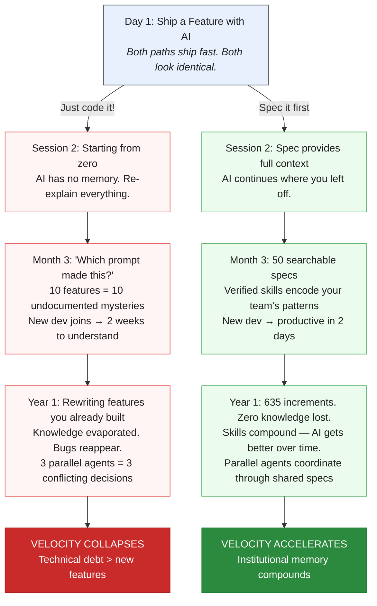

# The Spec Divergence

Use this Mermaid diagram on the introduction page to visualize why specs matter.

## Diagram: The Divergence

## Stronger Arguments (suggested copy for the introduction page)

Replace the current bullet list with this narrative:

### The Session Amnesia Problem

Every AI coding session starts from zero. Session 47 has no idea what session 46 did. Without specs, you're paying for context-building over and over — explaining the same codebase, the same constraints, the same decisions.

### The Parallel Chaos Problem

Run 3 AI agents in parallel without specs = 3 agents making conflicting decisions. No shared source of truth. No coordination layer. The more agents you add, the more chaos you create.

### The Knowledge Drain

When a developer leaves, their prompting patterns leave too. The "how we do things here" lives in chat history that no one will ever search. Six months later, the team is rewriting features they already built — because no one documented they existed.

### The Brownfield Wall

AI tools hit a wall when they encounter undocumented decisions from 3 years ago. Multi-repo codebases with hundreds of services and zero architectural docs are where AI assistants fail hardest — right where you need them most.

### Why Specs + Skills Change Everything

**Specs** are persistent requirements that survive sessions, team changes, and tool migrations. They tell AI WHAT to build and WHY.

**Skills** are verified, reusable expertise — not just prompts, but validated patterns that any AI agent can follow consistently. They tell AI HOW your team builds.

Together, they create a coordination layer that compounds:
- Spec #1 feels like overhead
- Spec #635 feels like compound interest
- Every spec makes every future session faster — because AI has more context to build on
- Every skill encodes a lesson learned — so the team never makes the same mistake twice

**The proof**: SpecWeave itself was built with 635+ increments. Every feature specified. Every decision traceable. Zero knowledge lost.
