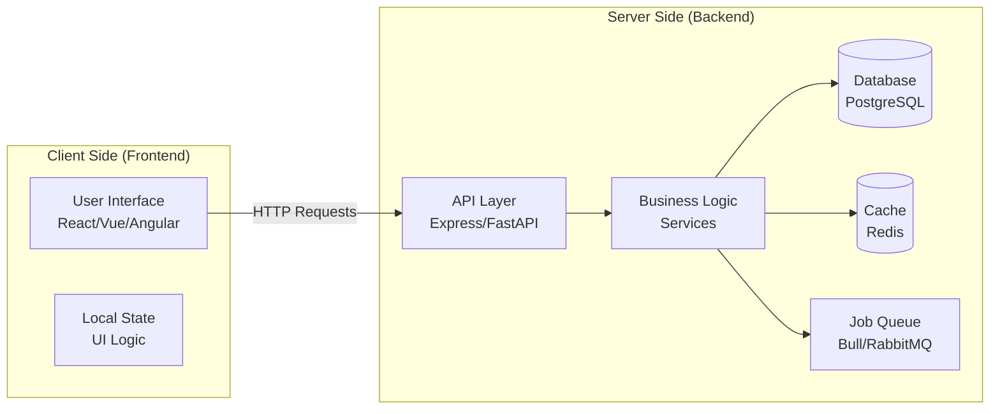
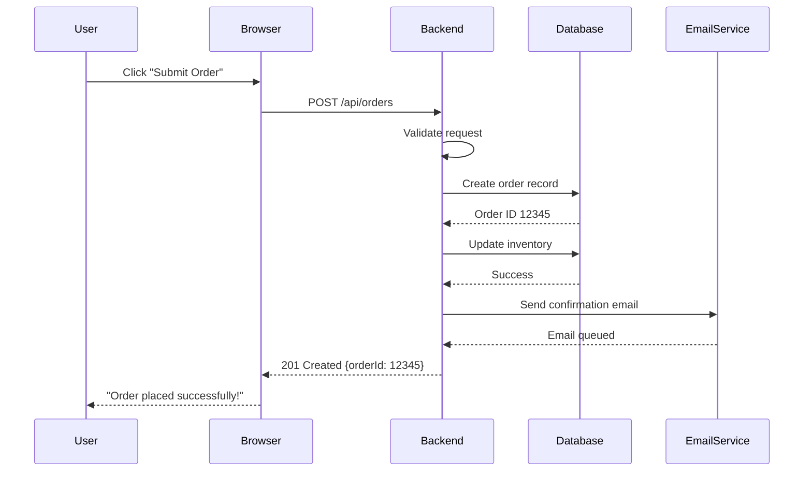
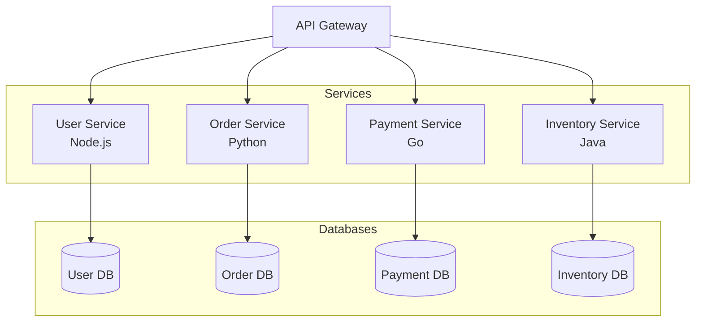
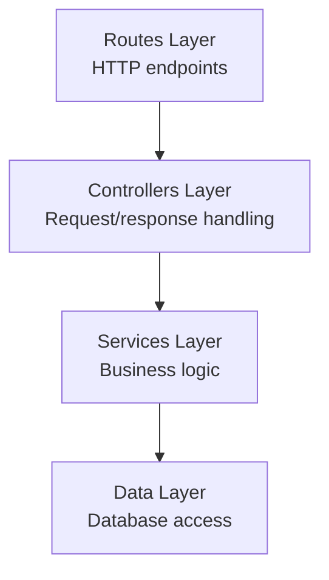
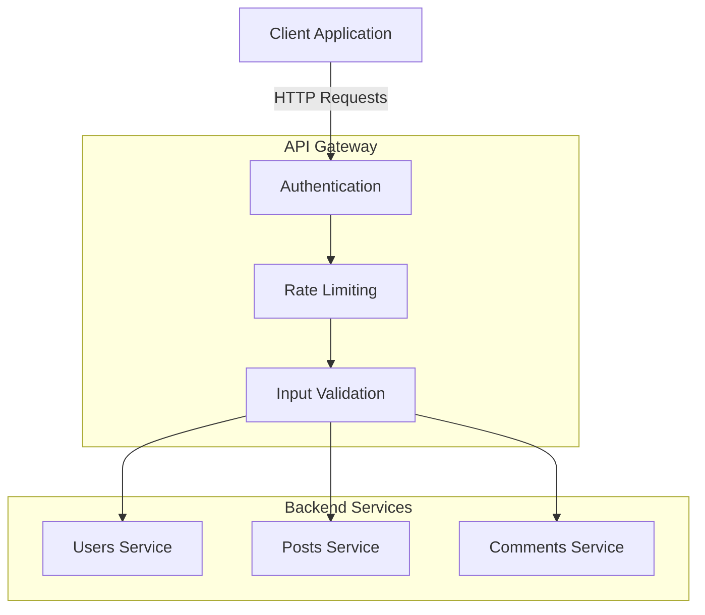
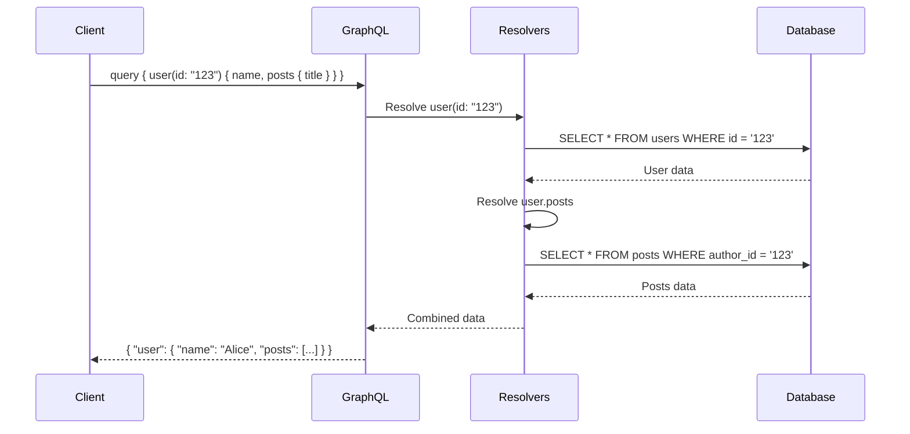

# Backend Development Fundamentals

## Table of Contents

1. [Introduction](#introduction)
2. [What is Backend Development?](#what-is-backend-development)
3. [Backend Architecture Patterns](#backend-architecture-patterns)
4. [Node.js & Express.js Basics](#nodejs--expressjs-basics)
5. [REST API Design](#rest-api-design)
6. [GraphQL Fundamentals](#graphql-fundamentals)
7. [Database Patterns](#database-patterns)
8. [Authentication & Authorization](#authentication--authorization)
9. [Error Handling & Validation](#error-handling--validation)
10. [Testing Backend Services](#testing-backend-services)
11. [Performance & Scalability](#performance--scalability)
12. [How SpecWeave Fits In](#how-specweave-fits-in)
13. [Best Practices](#best-practices)
14. [Common Pitfalls](#common-pitfalls)
15. [Next Steps](#next-steps)

## Introduction

Backend development powers the invisible engine behind every application you use. When you click "Login" on a website, post a photo on social media, or make an online purchase, backend services handle authentication, data storage, business logic, and countless other critical operations.

This guide covers modern backend development from first principles, teaching you:
- What backend services actually do and how they work
- How to build robust REST and GraphQL APIs
- Database design patterns and transaction management
- Authentication, authorization, and security fundamentals
- How to test, monitor, and scale backend services
- How SpecWeave helps you document and evolve backend architectures

By the end, you'll understand how to architect, build, and maintain production-grade backend systems.

## What is Backend Development?

**Backend** refers to server-side logic, databases, and APIs that power application functionality invisible to end users.

### Frontend vs. Backend



**Frontend Responsibilities:**
- Display data to users (rendering UI)
- Handle user interactions (clicks, form input)
- Client-side validation (quick feedback)
- Routing between pages/views

**Backend Responsibilities:**
- Process business logic (calculate prices, apply discounts)
- Persist data (save to database)
- Authenticate users (verify identity)
- Authorize actions (check permissions)
- Integrate with third-party services (payment processors, email providers)
- Background jobs (send emails, generate reports)

### Request/Response Flow



### Why Backend Matters

**Security**: Backend validates ALL inputs (never trust client)
**Data Integrity**: Enforces business rules and constraints
**Performance**: Optimizes queries, caching, and resource usage
**Scalability**: Handles millions of requests across distributed systems
**Integration**: Connects to databases, APIs, message queues, etc.

## Backend Architecture Patterns

### Monolithic Architecture

**Single codebase** containing all functionality:

```
monolith/
├── src/
│   ├── controllers/     # HTTP request handlers
│   ├── services/        # Business logic
│   ├── models/          # Database schemas
│   ├── middleware/      # Auth, logging, etc.
│   └── utils/           # Helper functions
├── tests/
└── server.js            # Entry point
```

**Pros:**
- Simple to develop and deploy (one codebase)
- Easy to debug (all code in one place)
- No distributed system complexity

**Cons:**
- Hard to scale (all-or-nothing)
- Difficult to maintain at large scale
- Technology lock-in (entire app uses same stack)

### Microservices Architecture

**Multiple services**, each owning a specific domain:



**Pros:**
- Independent scaling (scale only what needs it)
- Technology flexibility (use best tool for each service)
- Team autonomy (separate teams own separate services)

**Cons:**
- Distributed system complexity (network calls, latency)
- Difficult to test (require multiple services running)
- Operational overhead (monitoring, deployment)

### Layered Architecture

Organize code by technical responsibility:



**Example Structure:**
```javascript
// routes/user.routes.js - Routes layer
router.post('/users', userController.createUser);

// controllers/user.controller.js - Controller layer
async function createUser(req, res) {
  try {
    const user = await userService.createUser(req.body);
    res.status(201).json(user);
  } catch (error) {
    res.status(400).json({ error: error.message });
  }
}

// services/user.service.js - Service layer
async function createUser(userData) {
  // Validate business rules
  if (await userExists(userData.email)) {
    throw new Error('User already exists');
  }

  // Hash password
  const hashedPassword = await bcrypt.hash(userData.password, 10);

  // Create user
  return await userRepository.create({
    ...userData,
    password: hashedPassword
  });
}

// repositories/user.repository.js - Data layer
async function create(userData) {
  const user = await prisma.user.create({
    data: userData
  });
  return user;
}
```

**Benefits:**
- Clear separation of concerns
- Easy to test (mock each layer)
- Maintainable (changes isolated to layers)

## Node.js & Express.js Basics

Node.js is a JavaScript runtime for building fast, scalable backend services. Express.js is the most popular Node.js web framework.

### Hello World Server

```javascript
// server.js
const express = require('express');
const app = express();

// Middleware to parse JSON bodies
app.use(express.json());

// Simple route
app.get('/hello', (req, res) => {
  res.json({ message: 'Hello, World!' });
});

// Start server
const PORT = process.env.PORT || 3000;
app.listen(PORT, () => {
  console.log(`Server running on port ${PORT}`);
});
```

### Middleware Pattern

Middleware functions process requests before reaching route handlers:

```javascript
// Logger middleware
function logRequest(req, res, next) {
  console.log(`${req.method} ${req.url}`);
  next(); // Pass to next middleware
}

// Auth middleware
function requireAuth(req, res, next) {
  const token = req.headers.authorization;

  if (!token) {
    return res.status(401).json({ error: 'No token provided' });
  }

  try {
    const decoded = jwt.verify(token, process.env.JWT_SECRET);
    req.user = decoded; // Attach user to request
    next();
  } catch (error) {
    res.status(401).json({ error: 'Invalid token' });
  }
}

// Apply middleware
app.use(logRequest); // Global middleware
app.get('/protected', requireAuth, (req, res) => {
  // Only reached if auth succeeds
  res.json({ data: 'Secret data', user: req.user });
});
```

### Complete CRUD API Example

```javascript
// models/user.model.js
const { PrismaClient } = require('@prisma/client');
const prisma = new PrismaClient();

// repositories/user.repository.js
class UserRepository {
  async findAll() {
    return await prisma.user.findMany({
      select: { id: true, email: true, name: true }
    });
  }

  async findById(id) {
    return await prisma.user.findUnique({
      where: { id },
      select: { id: true, email: true, name: true }
    });
  }

  async create(userData) {
    return await prisma.user.create({
      data: userData,
      select: { id: true, email: true, name: true }
    });
  }

  async update(id, userData) {
    return await prisma.user.update({
      where: { id },
      data: userData,
      select: { id: true, email: true, name: true }
    });
  }

  async delete(id) {
    return await prisma.user.delete({
      where: { id }
    });
  }
}

module.exports = new UserRepository();

// services/user.service.js
const bcrypt = require('bcrypt');
const userRepository = require('../repositories/user.repository');

class UserService {
  async getAllUsers() {
    return await userRepository.findAll();
  }

  async getUserById(id) {
    const user = await userRepository.findById(id);
    if (!user) {
      throw new Error('User not found');
    }
    return user;
  }

  async createUser(userData) {
    // Validate
    if (!userData.email || !userData.password) {
      throw new Error('Email and password required');
    }

    // Check if user exists
    const existing = await userRepository.findByEmail(userData.email);
    if (existing) {
      throw new Error('User already exists');
    }

    // Hash password
    const hashedPassword = await bcrypt.hash(userData.password, 10);

    // Create user
    return await userRepository.create({
      ...userData,
      password: hashedPassword
    });
  }

  async updateUser(id, userData) {
    // Verify user exists
    await this.getUserById(id);

    // Hash password if provided
    if (userData.password) {
      userData.password = await bcrypt.hash(userData.password, 10);
    }

    return await userRepository.update(id, userData);
  }

  async deleteUser(id) {
    await this.getUserById(id); // Verify exists
    return await userRepository.delete(id);
  }
}

module.exports = new UserService();

// controllers/user.controller.js
const userService = require('../services/user.service');

class UserController {
  async getAll(req, res) {
    try {
      const users = await userService.getAllUsers();
      res.json(users);
    } catch (error) {
      res.status(500).json({ error: error.message });
    }
  }

  async getById(req, res) {
    try {
      const user = await userService.getUserById(req.params.id);
      res.json(user);
    } catch (error) {
      const status = error.message === 'User not found' ? 404 : 500;
      res.status(status).json({ error: error.message });
    }
  }

  async create(req, res) {
    try {
      const user = await userService.createUser(req.body);
      res.status(201).json(user);
    } catch (error) {
      res.status(400).json({ error: error.message });
    }
  }

  async update(req, res) {
    try {
      const user = await userService.updateUser(req.params.id, req.body);
      res.json(user);
    } catch (error) {
      const status = error.message === 'User not found' ? 404 : 400;
      res.status(status).json({ error: error.message });
    }
  }

  async delete(req, res) {
    try {
      await userService.deleteUser(req.params.id);
      res.status(204).send();
    } catch (error) {
      const status = error.message === 'User not found' ? 404 : 500;
      res.status(status).json({ error: error.message });
    }
  }
}

module.exports = new UserController();

// routes/user.routes.js
const express = require('express');
const router = express.Router();
const userController = require('../controllers/user.controller');
const { requireAuth } = require('../middleware/auth');

router.get('/users', requireAuth, userController.getAll);
router.get('/users/:id', requireAuth, userController.getById);
router.post('/users', userController.create);
router.put('/users/:id', requireAuth, userController.update);
router.delete('/users/:id', requireAuth, userController.delete);

module.exports = router;

// server.js
const express = require('express');
const userRoutes = require('./routes/user.routes');

const app = express();
app.use(express.json());
app.use('/api', userRoutes);

const PORT = process.env.PORT || 3000;
app.listen(PORT, () => {
  console.log(`Server running on port ${PORT}`);
});
```

## REST API Design

REST (Representational State Transfer) is an architectural style for designing networked applications.

### REST Principles

**1. Resource-Based URLs:**
```
GET    /api/users          # List all users
GET    /api/users/123      # Get user 123
POST   /api/users          # Create user
PUT    /api/users/123      # Update user 123
DELETE /api/users/123      # Delete user 123
```

**2. HTTP Methods (Verbs):**
- `GET`: Retrieve data (idempotent, safe)
- `POST`: Create new resource
- `PUT`: Update entire resource
- `PATCH`: Update partial resource
- `DELETE`: Remove resource

**3. HTTP Status Codes:**
```javascript
// Success
200 OK              // Request succeeded
201 Created         // Resource created
204 No Content      // Success with no response body

// Client Errors
400 Bad Request     // Invalid request data
401 Unauthorized    // Authentication required
403 Forbidden       // Authenticated but not authorized
404 Not Found       // Resource doesn't exist
409 Conflict        // Conflicting state (e.g., duplicate email)
422 Unprocessable   // Validation errors

// Server Errors
500 Internal Error  // Something went wrong on server
503 Unavailable     // Server temporarily down
```

### REST API Example

```javascript
// GET /api/posts?page=2&limit=10
app.get('/api/posts', async (req, res) => {
  const { page = 1, limit = 10, author } = req.query;

  const filters = {};
  if (author) filters.authorId = author;

  const posts = await prisma.post.findMany({
    where: filters,
    skip: (page - 1) * limit,
    take: parseInt(limit),
    include: {
      author: { select: { id: true, name: true } }
    },
    orderBy: { createdAt: 'desc' }
  });

  const total = await prisma.post.count({ where: filters });

  res.json({
    data: posts,
    pagination: {
      page: parseInt(page),
      limit: parseInt(limit),
      total,
      pages: Math.ceil(total / limit)
    }
  });
});

// POST /api/posts
app.post('/api/posts', requireAuth, async (req, res) => {
  const { title, content } = req.body;

  // Validation
  if (!title || !content) {
    return res.status(400).json({
      error: 'Validation failed',
      details: {
        title: !title ? 'Title is required' : null,
        content: !content ? 'Content is required' : null
      }
    });
  }

  const post = await prisma.post.create({
    data: {
      title,
      content,
      authorId: req.user.id
    },
    include: {
      author: { select: { id: true, name: true } }
    }
  });

  res.status(201).json(post);
});

// PATCH /api/posts/123
app.patch('/api/posts/:id', requireAuth, async (req, res) => {
  const { id } = req.params;
  const updates = req.body;

  // Verify post exists and user owns it
  const post = await prisma.post.findUnique({ where: { id } });
  if (!post) {
    return res.status(404).json({ error: 'Post not found' });
  }
  if (post.authorId !== req.user.id) {
    return res.status(403).json({ error: 'Not authorized' });
  }

  const updated = await prisma.post.update({
    where: { id },
    data: updates,
    include: {
      author: { select: { id: true, name: true } }
    }
  });

  res.json(updated);
});
```

### REST API Architecture



## GraphQL Fundamentals

GraphQL is a query language for APIs that gives clients precise control over data fetching.

### REST vs. GraphQL

**REST Problem**: Over-fetching and under-fetching

```javascript
// REST: Get user and their posts (2 requests)
GET /api/users/123          // Returns full user object (over-fetching)
GET /api/users/123/posts    // Returns all post fields (over-fetching)

// Or: Get posts with author data
GET /api/posts?include=author  // Returns full author objects (over-fetching)
```

**GraphQL Solution**: Request exactly what you need

```graphql
# Single request, precise data
query {
  user(id: "123") {
    id
    name
    email
    posts {
      id
      title
      publishedAt
    }
  }
}
```

### GraphQL Schema

```graphql
# schema.graphql
type User {
  id: ID!
  email: String!
  name: String!
  posts: [Post!]!
  createdAt: DateTime!
}

type Post {
  id: ID!
  title: String!
  content: String!
  author: User!
  comments: [Comment!]!
  publishedAt: DateTime
}

type Comment {
  id: ID!
  text: String!
  author: User!
  post: Post!
}

type Query {
  user(id: ID!): User
  users(limit: Int, offset: Int): [User!]!
  post(id: ID!): Post
  posts(authorId: ID, limit: Int): [Post!]!
}

type Mutation {
  createUser(email: String!, name: String!, password: String!): User!
  createPost(title: String!, content: String!): Post!
  deletePost(id: ID!): Boolean!
}
```

### GraphQL Resolvers

```javascript
// resolvers.js
const resolvers = {
  Query: {
    user: async (parent, { id }, context) => {
      return await context.prisma.user.findUnique({
        where: { id }
      });
    },

    posts: async (parent, { authorId, limit }, context) => {
      return await context.prisma.post.findMany({
        where: authorId ? { authorId } : {},
        take: limit || 10,
        orderBy: { createdAt: 'desc' }
      });
    }
  },

  Mutation: {
    createUser: async (parent, { email, name, password }, context) => {
      const hashedPassword = await bcrypt.hash(password, 10);

      return await context.prisma.user.create({
        data: {
          email,
          name,
          password: hashedPassword
        }
      });
    },

    createPost: async (parent, { title, content }, context) => {
      // Require authentication
      if (!context.user) {
        throw new Error('Not authenticated');
      }

      return await context.prisma.post.create({
        data: {
          title,
          content,
          authorId: context.user.id
        }
      });
    }
  },

  User: {
    posts: async (parent, args, context) => {
      return await context.prisma.post.findMany({
        where: { authorId: parent.id }
      });
    }
  },

  Post: {
    author: async (parent, args, context) => {
      return await context.prisma.user.findUnique({
        where: { id: parent.authorId }
      });
    },

    comments: async (parent, args, context) => {
      return await context.prisma.comment.findMany({
        where: { postId: parent.id }
      });
    }
  }
};
```

### GraphQL Request Flow



## Database Patterns

### SQL vs. NoSQL

**SQL (Relational)**: PostgreSQL, MySQL, SQL Server
```sql
-- Structured schema with relationships
CREATE TABLE users (
  id SERIAL PRIMARY KEY,
  email VARCHAR(255) UNIQUE NOT NULL,
  name VARCHAR(255) NOT NULL
);

CREATE TABLE posts (
  id SERIAL PRIMARY KEY,
  user_id INTEGER REFERENCES users(id),
  title VARCHAR(255) NOT NULL,
  content TEXT
);
```

**NoSQL (Document)**: MongoDB, DynamoDB
```javascript
// Flexible, nested documents
{
  "_id": "507f1f77bcf86cd799439011",
  "email": "alice@example.com",
  "name": "Alice",
  "posts": [
    {
      "title": "My First Post",
      "content": "Hello world!",
      "publishedAt": "2025-01-15T10:30:00Z"
    }
  ]
}
```

### Database Transactions

**ACID Properties:**
- **Atomicity**: All operations succeed or all fail
- **Consistency**: Database remains in valid state
- **Isolation**: Concurrent transactions don't interfere
- **Durability**: Committed data persists after crashes

```javascript
// Example: Transfer money between accounts
async function transferMoney(fromId, toId, amount) {
  // Start transaction
  return await prisma.$transaction(async (tx) => {
    // Deduct from sender
    const sender = await tx.account.update({
      where: { id: fromId },
      data: { balance: { decrement: amount } }
    });

    // Verify sender has sufficient funds
    if (sender.balance < 0) {
      throw new Error('Insufficient funds'); // Rollback transaction
    }

    // Add to receiver
    await tx.account.update({
      where: { id: toId },
      data: { balance: { increment: amount } }
    });

    // Both operations succeed or both fail
  });
}
```

### Query Optimization

**N+1 Query Problem:**
```javascript
// ❌ BAD: N+1 queries (1 for posts, N for authors)
const posts = await prisma.post.findMany(); // 1 query
for (const post of posts) {
  const author = await prisma.user.findUnique({
    where: { id: post.authorId }  // N queries
  });
}

// ✅ GOOD: Single query with join
const posts = await prisma.post.findMany({
  include: {
    author: true  // Eager loading (1 query with JOIN)
  }
});
```

**Indexing:**
```sql
-- Create index for frequently queried columns
CREATE INDEX idx_posts_author_id ON posts(author_id);
CREATE INDEX idx_posts_published_at ON posts(published_at);

-- Composite index for combined queries
CREATE INDEX idx_posts_author_published ON posts(author_id, published_at);
```

## Authentication & Authorization

### Authentication (Who are you?)

**JWT (JSON Web Tokens):**
```javascript
const jwt = require('jsonwebtoken');

// Login: Generate JWT
app.post('/api/auth/login', async (req, res) => {
  const { email, password } = req.body;

  // Find user
  const user = await prisma.user.findUnique({ where: { email } });
  if (!user) {
    return res.status(401).json({ error: 'Invalid credentials' });
  }

  // Verify password
  const valid = await bcrypt.compare(password, user.password);
  if (!valid) {
    return res.status(401).json({ error: 'Invalid credentials' });
  }

  // Generate JWT
  const token = jwt.sign(
    { userId: user.id, email: user.email },
    process.env.JWT_SECRET,
    { expiresIn: '7d' }
  );

  res.json({ token, user: { id: user.id, email: user.email, name: user.name } });
});

// Middleware: Verify JWT
function requireAuth(req, res, next) {
  const authHeader = req.headers.authorization;

  if (!authHeader || !authHeader.startsWith('Bearer ')) {
    return res.status(401).json({ error: 'No token provided' });
  }

  const token = authHeader.substring(7);

  try {
    const decoded = jwt.verify(token, process.env.JWT_SECRET);
    req.user = decoded; // Attach user to request
    next();
  } catch (error) {
    res.status(401).json({ error: 'Invalid or expired token' });
  }
}
```

### Authorization (What can you do?)

**Role-Based Access Control (RBAC):**
```javascript
// Middleware: Check user role
function requireRole(role) {
  return async (req, res, next) => {
    const user = await prisma.user.findUnique({
      where: { id: req.user.userId },
      include: { roles: true }
    });

    if (!user.roles.some(r => r.name === role)) {
      return res.status(403).json({ error: 'Forbidden' });
    }

    next();
  };
}

// Usage
app.delete('/api/users/:id', requireAuth, requireRole('admin'), async (req, res) => {
  // Only admins can delete users
});
```

**Resource-Based Authorization:**
```javascript
// Middleware: Verify ownership
function requireOwnership(resourceType) {
  return async (req, res, next) => {
    const resourceId = req.params.id;
    const userId = req.user.userId;

    const resource = await prisma[resourceType].findUnique({
      where: { id: resourceId }
    });

    if (!resource) {
      return res.status(404).json({ error: 'Not found' });
    }

    if (resource.userId !== userId) {
      return res.status(403).json({ error: 'Not authorized' });
    }

    next();
  };
}

// Usage
app.put('/api/posts/:id', requireAuth, requireOwnership('post'), async (req, res) => {
  // Only post owner can update
});
```

## Error Handling & Validation

### Global Error Handler

```javascript
// Custom error class
class AppError extends Error {
  constructor(message, statusCode) {
    super(message);
    this.statusCode = statusCode;
    this.isOperational = true; // Distinguish from programming errors
  }
}

// Global error middleware
function errorHandler(err, req, res, next) {
  let { statusCode = 500, message } = err;

  // Log errors
  console.error(err);

  // Don't expose internal errors to clients
  if (!err.isOperational) {
    statusCode = 500;
    message = 'Internal server error';
  }

  res.status(statusCode).json({
    error: message,
    ...(process.env.NODE_ENV === 'development' && { stack: err.stack })
  });
}

app.use(errorHandler);

// Usage in routes
app.get('/api/users/:id', async (req, res, next) => {
  try {
    const user = await prisma.user.findUnique({
      where: { id: req.params.id }
    });

    if (!user) {
      throw new AppError('User not found', 404);
    }

    res.json(user);
  } catch (error) {
    next(error); // Pass to error handler
  }
});
```

### Input Validation

```javascript
const { z } = require('zod');

// Define schema
const createUserSchema = z.object({
  email: z.string().email('Invalid email format'),
  name: z.string().min(2, 'Name must be at least 2 characters'),
  password: z.string().min(8, 'Password must be at least 8 characters')
});

// Validation middleware
function validate(schema) {
  return (req, res, next) => {
    try {
      schema.parse(req.body);
      next();
    } catch (error) {
      res.status(400).json({
        error: 'Validation failed',
        details: error.errors.map(e => ({
          field: e.path.join('.'),
          message: e.message
        }))
      });
    }
  };
}

// Usage
app.post('/api/users', validate(createUserSchema), async (req, res) => {
  // Request body is validated
  const user = await userService.createUser(req.body);
  res.status(201).json(user);
});
```

## Testing Backend Services

See [Testing Fundamentals](/docs/public/learn/testing/testing-fundamentals) for comprehensive testing coverage.

**Quick overview:**

```javascript
// Unit test (service layer)
describe('UserService', () => {
  test('createUser hashes password', async () => {
    const userData = { email: 'test@example.com', password: 'password123' };
    const user = await userService.createUser(userData);

    expect(user.password).not.toBe('password123');
    expect(await bcrypt.compare('password123', user.password)).toBe(true);
  });
});

// Integration test (API endpoints)
describe('POST /api/users', () => {
  test('creates user with valid data', async () => {
    const response = await request(app)
      .post('/api/users')
      .send({ email: 'test@example.com', password: 'password123', name: 'Test' });

    expect(response.status).toBe(201);
    expect(response.body.email).toBe('test@example.com');
  });
});
```

## Performance & Scalability

### Caching

```javascript
const redis = require('redis');
const client = redis.createClient();

// Cache middleware
function cache(duration) {
  return async (req, res, next) => {
    const key = `cache:${req.originalUrl}`;

    // Check cache
    const cached = await client.get(key);
    if (cached) {
      return res.json(JSON.parse(cached));
    }

    // Store original send function
    const originalSend = res.json.bind(res);

    // Override send to cache response
    res.json = (body) => {
      client.setEx(key, duration, JSON.stringify(body));
      originalSend(body);
    };

    next();
  };
}

// Usage
app.get('/api/posts', cache(300), async (req, res) => {
  // Cached for 5 minutes
});
```

### Database Connection Pooling

```javascript
const { Pool } = require('pg');

// Create connection pool
const pool = new Pool({
  host: 'localhost',
  database: 'myapp',
  max: 20, // Maximum connections
  idleTimeoutMillis: 30000
});

// Use pooled connections
app.get('/api/users', async (req, res) => {
  const client = await pool.connect();
  try {
    const result = await client.query('SELECT * FROM users');
    res.json(result.rows);
  } finally {
    client.release(); // Return connection to pool
  }
});
```

### Rate Limiting

```javascript
const rateLimit = require('express-rate-limit');

const limiter = rateLimit({
  windowMs: 15 * 60 * 1000, // 15 minutes
  max: 100, // Max 100 requests per window
  message: 'Too many requests, please try again later'
});

app.use('/api/', limiter);
```

## How SpecWeave Fits In

### Backend Increment Planning

```bash
/specweave:inc "0015-user-authentication-api"
```

**Spec includes:**
- API endpoints (REST or GraphQL)
- Database schema changes
- Authentication flow
- Error handling requirements
- Performance targets
- Security considerations

### API Contract Documentation

```markdown
# .specweave/docs/internal/architecture/api-contracts.md

## POST /api/auth/login

**Description**: Authenticate user and return JWT

**Request:**
```json
{
  "email": "user@example.com",
  "password": "secretPassword123"
}
```

**Response (200 OK):**
```json
{
  "token": "eyJhbGciOiJIUzI1NiIsInR5cCI6IkpXVCJ9...",
  "user": {
    "id": "123",
    "email": "user@example.com",
    "name": "John Doe"
  }
}
```

**Errors:**
- `401 Unauthorized`: Invalid credentials
- `400 Bad Request`: Missing email or password
```

### Architecture Decisions

```markdown
# .specweave/docs/internal/architecture/adr/0012-postgres-over-mongodb.md

## Status
Accepted

## Context
Need to choose database for user and order management.

## Decision
Use PostgreSQL (relational SQL database).

## Rationale
- Complex relationships (users, orders, products, inventory)
- Need ACID transactions (order processing)
- Strong consistency requirements
- Team has PostgreSQL experience

## Consequences
**Positive:**
- Data integrity guaranteed
- Complex queries with JOINs
- Mature ecosystem and tooling

**Negative:**
- Less flexible schema (migrations required)
- Vertical scaling limits (vs. NoSQL horizontal scaling)
```

### Test Coverage in Tasks

```markdown
## T-003: Implement User Authentication API

**AC**: AC-US1-01, AC-US1-02

**Test Plan** (BDD format):
- **Given** valid credentials → **When** POST /api/auth/login → **Then** return JWT token
- **Given** invalid credentials → **When** POST /api/auth/login → **Then** return 401 error

**Test Cases**:
- [Unit Testing](/docs/glossary/terms/unit-testing) (`auth.service.test.js`): validateCredentials, generateToken, hashPassword → 90% coverage
- [Integration Testing](/docs/glossary/terms/integration-testing) (`auth.api.test.js`): POST /login endpoint, token validation → 85% coverage
- **Overall: 87% coverage**

**Implementation**: AuthService, JWT middleware, password hashing (bcrypt)
```

## Best Practices

1. **Use Environment Variables**: Never hardcode secrets
2. **Validate All Inputs**: Never trust client data
3. **Use Prepared Statements**: Prevent SQL injection
4. **Implement Rate Limiting**: Protect against abuse
5. **Log Strategically**: Log errors, not sensitive data
6. **Use HTTPS**: Encrypt data in transit
7. **Handle Errors Gracefully**: Don't expose internals
8. **Test Thoroughly**: Unit, integration, E2E tests
9. **Monitor Performance**: APM tools (DataDog, New Relic)
10. **Document APIs**: OpenAPI/Swagger specs

## Common Pitfalls

### 1. Exposing Sensitive Data

❌ **Wrong**:
```javascript
app.get('/api/users/:id', async (req, res) => {
  const user = await prisma.user.findUnique({ where: { id: req.params.id } });
  res.json(user); // Includes password hash!
});
```

✅ **Correct**:
```javascript
app.get('/api/users/:id', async (req, res) => {
  const user = await prisma.user.findUnique({
    where: { id: req.params.id },
    select: { id: true, email: true, name: true } // Exclude password
  });
  res.json(user);
});
```

### 2. Not Handling Async Errors

❌ **Wrong**:
```javascript
app.get('/api/users', async (req, res) => {
  const users = await prisma.user.findMany(); // Unhandled rejection!
  res.json(users);
});
```

✅ **Correct**:
```javascript
app.get('/api/users', async (req, res, next) => {
  try {
    const users = await prisma.user.findMany();
    res.json(users);
  } catch (error) {
    next(error); // Pass to error handler
  }
});
```

### 3. SQL Injection Vulnerability

❌ **Wrong**:
```javascript
const userId = req.params.id;
const user = await db.query(`SELECT * FROM users WHERE id = ${userId}`); // SQL injection!
```

✅ **Correct**:
```javascript
const userId = req.params.id;
const user = await db.query('SELECT * FROM users WHERE id = $1', [userId]); // Prepared statement
```

## Next Steps

**Deepen Your Knowledge:**
- [Frontend Fundamentals](/docs/public/learn/frontend/frontend-fundamentals) - Learn how frontend connects to backend APIs
- [Testing Fundamentals](/docs/public/learn/testing/testing-fundamentals) - Master backend testing strategies
- [Infrastructure & IaC](/docs/public/learn/infrastructure/iac-fundamentals) - Deploy backend services

**Hands-On Practice:**
1. Build complete REST API (users, posts, comments)
2. Implement JWT authentication
3. Add database transactions
4. Write [unit tests](/docs/glossary/terms/unit-testing) and [integration tests](/docs/glossary/terms/integration-testing)
5. Deploy to cloud ([Docker](/docs/glossary/terms/docker) + [Kubernetes](/docs/glossary/terms/kubernetes))

**SpecWeave Integration:**
- Create backend increment: `/specweave:inc "api-development"`
- Document API contracts in architecture docs
- Use embedded test plans in tasks.md
- Track API evolution via living documentation

**Further Reading:**
- [Node.js Documentation](https://nodejs.org/docs/)
- [Express.js Guide](https://expressjs.com/en/guide/routing.html)
- [GraphQL Documentation](https://graphql.org/learn/)
- [REST API Best Practices](https://restfulapi.net/)
- [Database Design Patterns](https://www.postgresql.org/docs/)
