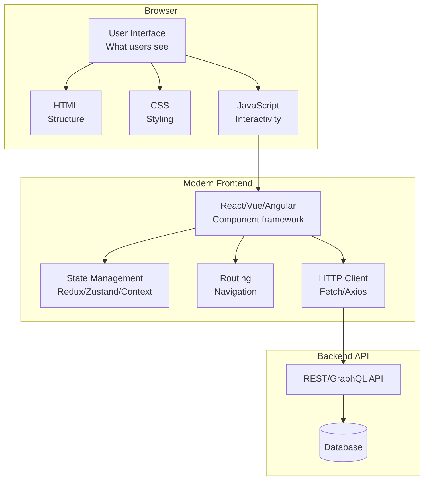
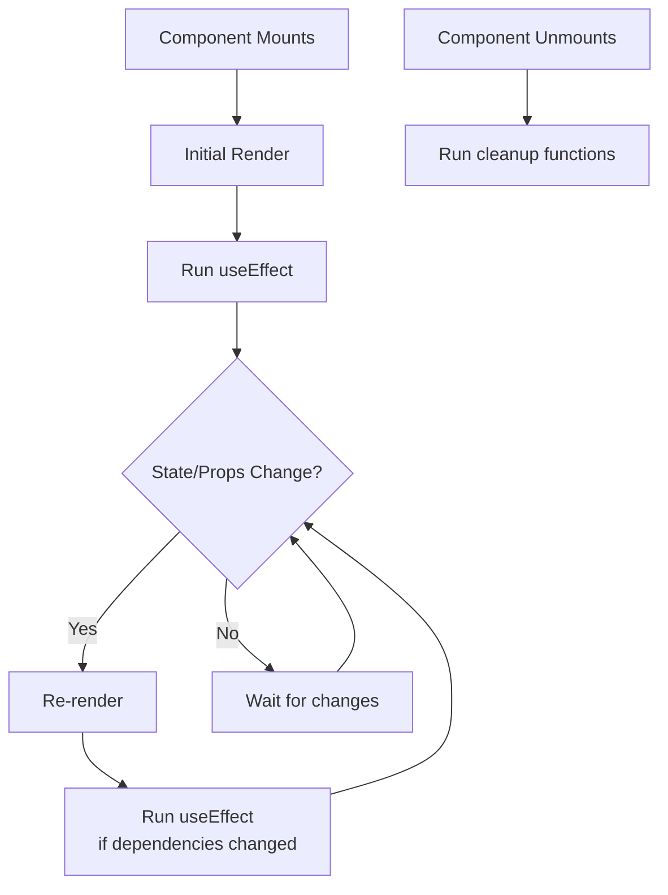
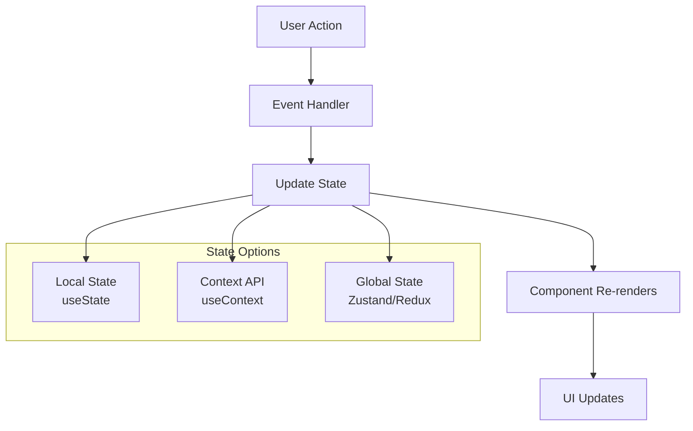
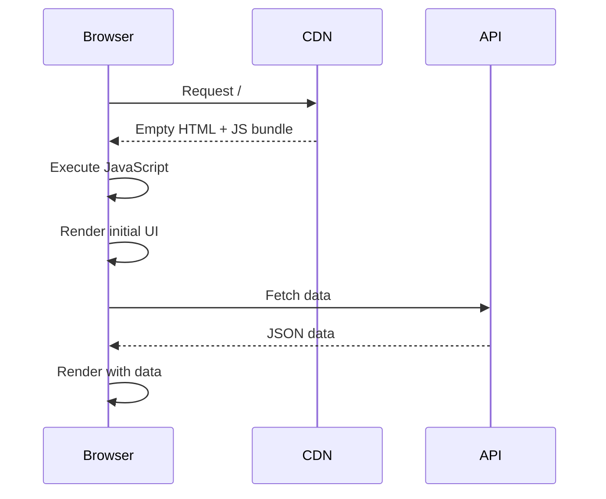
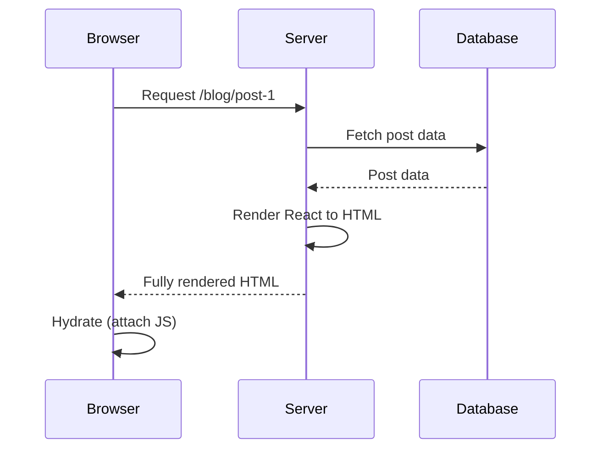
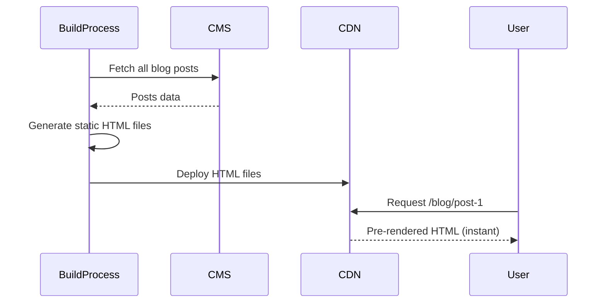

# Frontend Development Fundamentals

## Table of Contents

1. [Introduction](#introduction)
2. [What is Frontend Development?](#what-is-frontend-development)
3. [Modern Frontend Landscape](#modern-frontend-landscape)
4. [React Fundamentals](#react-fundamentals)
5. [Component Patterns](#component-patterns)
6. [State Management](#state-management)
7. [Next.js Framework](#nextjs-framework)
8. [SPA vs SSR vs SSG](#spa-vs-ssr-vs-ssg)
9. [Routing & Navigation](#routing--navigation)
10. [Data Fetching Patterns](#data-fetching-patterns)
11. [Styling Approaches](#styling-approaches)
12. [Performance Optimization](#performance-optimization)
13. [Accessibility (a11y)](#accessibility-a11y)
14. [Testing Frontend Applications](#testing-frontend-applications)
15. [How SpecWeave Fits In](#how-specweave-fits-in)
16. [Best Practices](#best-practices)
17. [Common Pitfalls](#common-pitfalls)
18. [Next Steps](#next-steps)

## Introduction

Frontend development creates the user-facing interfaces that people interact with daily. Every website you visit, every mobile app you use, every interactive experience online - that's frontend development at work. Modern frontend has evolved from simple HTML pages to sophisticated, dynamic applications rivaling native desktop software.

This comprehensive guide teaches you:
- Core concepts of modern frontend development
- React and Next.js frameworks from first principles
- State management, routing, and data fetching patterns
- When to use SPA, [SSR](/docs/glossary/terms/ssr), or [SSG](/docs/glossary/terms/ssg)
- Performance optimization and accessibility
- How to test frontend applications thoroughly
- How SpecWeave helps document frontend architectures

## What is Frontend Development?

**Frontend** (client-side) refers to everything users see and interact with in their browser or mobile app.

### The Frontend Stack



**Core Responsibilities:**
- **Display data**: Render information from backend
- **Handle user input**: Forms, clicks, keyboard, touch
- **Navigate between views**: Routing and state management
- **Communicate with backend**: HTTP requests (REST/GraphQL)
- **Optimize performance**: Fast loading, smooth interactions
- **Ensure accessibility**: Usable by everyone, including assistive technologies

### Frontend vs Backend

| Aspect | Frontend | Backend |
|--------|----------|---------|
| **Runs on** | User's browser | Server |
| **Languages** | JavaScript, TypeScript | JavaScript, Python, Go, etc. |
| **Data source** | API calls | Database queries |
| **Performance** | Depends on user's device | Depends on server resources |
| **Security** | Public code (view source) | Private code |
| **Storage** | localStorage, cookies | Database, file storage |

## Modern Frontend Landscape

### Evolution of Frontend

**1. Traditional Web (1990s-2000s):**
```html
<!-- Server renders entire page -->
<html>
  <body>
    <h1>Welcome, John!</h1>
    <ul>
      <li>Product 1</li>
      <li>Product 2</li>
    </ul>
  </body>
</html>
```
- **Every click = full page reload**
- Slow, poor user experience
- Limited interactivity

**2. AJAX Era (2005+):**
```javascript
// Fetch data without page reload
fetch('/api/products')
  .then(response => response.json())
  .then(products => {
    updateDOM(products); // Update part of page
  });
```
- **Partial page updates**
- Better user experience
- Still manual DOM manipulation (jQuery era)

**3. Modern Frameworks (2010+):**
```jsx
// React component
function ProductList() {
  const [products, setProducts] = useState([]);

  useEffect(() => {
    fetch('/api/products')
      .then(res => res.json())
      .then(setProducts);
  }, []);

  return (
    <ul>
      {products.map(p => <li key={p.id}>{p.name}</li>)}
    </ul>
  );
}
```
- **Component-based architecture**
- Declarative UI (describe what, not how)
- Virtual DOM (efficient updates)
- Rich ecosystem

### Why React?

**React** dominates modern frontend (used by Facebook, Netflix, Airbnb, etc.):

**Key Advantages:**
1. **Component-based**: Reusable UI pieces
2. **Declarative**: Describe UI state, React handles updates
3. **Virtual DOM**: Efficient rendering
4. **Huge ecosystem**: Libraries for everything
5. **React Native**: Share code with mobile apps

## React Fundamentals

### Components

Components are reusable pieces of UI:

```jsx
// Function component (modern approach)
function Button({ label, onClick }) {
  return (
    <button className="btn" onClick={onClick}>
      {label}
    </button>
  );
}

// Usage
<Button label="Click me" onClick={() => alert('Clicked!')} />
```

### JSX Syntax

JSX mixes HTML-like syntax with JavaScript:

```jsx
function UserCard({ user }) {
  return (
    <div className="card">
      <h2>{user.name}</h2>
      <p>Email: {user.email}</p>
      {user.isPremium && <span className="badge">Premium</span>}
    </div>
  );
}
```

### Props (Properties)

Pass data from parent to child components:

```jsx
// Parent component
function App() {
  const user = { name: 'Alice', email: 'alice@example.com' };

  return <UserCard user={user} />;
}

// Child component receives props
function UserCard({ user }) {
  return <div>{user.name}</div>;
}
```

### State

State is component-local data that changes over time:

```jsx
import { useState } from 'react';

function Counter() {
  const [count, setCount] = useState(0); // Initial state = 0

  return (
    <div>
      <p>Count: {count}</p>
      <button onClick={() => setCount(count + 1)}>
        Increment
      </button>
    </div>
  );
}
```

### Component Lifecycle



**Lifecycle with Hooks:**

```jsx
import { useState, useEffect } from 'react';

function UserProfile({ userId }) {
  const [user, setUser] = useState(null);
  const [loading, setLoading] = useState(true);

  // Runs after component mounts and when userId changes
  useEffect(() => {
    setLoading(true);

    fetch(`/api/users/${userId}`)
      .then(res => res.json())
      .then(data => {
        setUser(data);
        setLoading(false);
      });

    // Cleanup function (runs before re-running effect or unmounting)
    return () => {
      console.log('Cleaning up');
    };
  }, [userId]); // Re-run when userId changes

  if (loading) return <div>Loading...</div>;
  if (!user) return <div>User not found</div>;

  return (
    <div>
      <h1>{user.name}</h1>
      <p>{user.email}</p>
    </div>
  );
}
```

### Common Hooks

**useState**: Manage local state
```jsx
const [value, setValue] = useState(initialValue);
```

**useEffect**: Side effects (API calls, subscriptions)
```jsx
useEffect(() => {
  // Effect code
  return () => {
    // Cleanup
  };
}, [dependencies]);
```

**useContext**: Access context values
```jsx
const theme = useContext(ThemeContext);
```

**useRef**: Reference DOM elements
```jsx
const inputRef = useRef(null);
<input ref={inputRef} />
```

**useMemo**: Memoize expensive computations
```jsx
const expensiveValue = useMemo(() => computeExpensiveValue(a, b), [a, b]);
```

**useCallback**: Memoize functions
```jsx
const memoizedCallback = useCallback(() => {
  doSomething(a, b);
}, [a, b]);
```

## Component Patterns

### Controlled vs Uncontrolled Components

**Controlled** (React controls value):
```jsx
function ControlledInput() {
  const [value, setValue] = useState('');

  return (
    <input
      value={value}
      onChange={(e) => setValue(e.target.value)}
    />
  );
}
```

**Uncontrolled** (DOM controls value):
```jsx
function UncontrolledInput() {
  const inputRef = useRef(null);

  const handleSubmit = () => {
    console.log(inputRef.current.value); // Read from DOM
  };

  return <input ref={inputRef} />;
}
```

### Composition

Build complex UIs from simple components:

```jsx
// Base components
function Card({ children }) {
  return <div className="card">{children}</div>;
}

function CardHeader({ children }) {
  return <div className="card-header">{children}</div>;
}

function CardBody({ children }) {
  return <div className="card-body">{children}</div>;
}

// Compose into complex UI
function UserCard({ user }) {
  return (
    <Card>
      <CardHeader>
        <h2>{user.name}</h2>
      </CardHeader>
      <CardBody>
        <p>Email: {user.email}</p>
        <p>Role: {user.role}</p>
      </CardBody>
    </Card>
  );
}
```

### Render Props

Share code between components using a prop whose value is a function:

```jsx
function DataFetcher({ url, render }) {
  const [data, setData] = useState(null);
  const [loading, setLoading] = useState(true);

  useEffect(() => {
    fetch(url)
      .then(res => res.json())
      .then(data => {
        setData(data);
        setLoading(false);
      });
  }, [url]);

  return render({ data, loading });
}

// Usage
<DataFetcher
  url="/api/users"
  render={({ data, loading }) => (
    loading ? <div>Loading...</div> : <UserList users={data} />
  )}
/>
```

### Higher-Order Components (HOC)

Function that takes a component and returns a new component:

```jsx
// HOC that adds authentication
function withAuth(Component) {
  return function AuthenticatedComponent(props) {
    const { user, loading } = useAuth();

    if (loading) return <div>Loading...</div>;
    if (!user) return <div>Please log in</div>;

    return <Component {...props} user={user} />;
  };
}

// Usage
const ProtectedDashboard = withAuth(Dashboard);
```

### Custom Hooks

Extract reusable logic:

```jsx
// Custom hook
function useAPI(url) {
  const [data, setData] = useState(null);
  const [loading, setLoading] = useState(true);
  const [error, setError] = useState(null);

  useEffect(() => {
    setLoading(true);

    fetch(url)
      .then(res => res.json())
      .then(data => {
        setData(data);
        setLoading(false);
      })
      .catch(err => {
        setError(err);
        setLoading(false);
      });
  }, [url]);

  return { data, loading, error };
}

// Usage in components
function UserList() {
  const { data: users, loading, error } = useAPI('/api/users');

  if (loading) return <div>Loading...</div>;
  if (error) return <div>Error: {error.message}</div>;

  return (
    <ul>
      {users.map(user => <li key={user.id}>{user.name}</li>)}
    </ul>
  );
}
```

## State Management

### Local State (useState)

For component-local data:

```jsx
function TodoList() {
  const [todos, setTodos] = useState([]);
  const [input, setInput] = useState('');

  const addTodo = () => {
    setTodos([...todos, { id: Date.now(), text: input }]);
    setInput('');
  };

  return (
    <div>
      <input value={input} onChange={(e) => setInput(e.target.value)} />
      <button onClick={addTodo}>Add</button>
      <ul>
        {todos.map(todo => <li key={todo.id}>{todo.text}</li>)}
      </ul>
    </div>
  );
}
```

### Context API

For shared state across component tree:

```jsx
import { createContext, useContext, useState } from 'react';

// Create context
const ThemeContext = createContext();

// Provider component
function ThemeProvider({ children }) {
  const [theme, setTheme] = useState('light');

  return (
    <ThemeContext.Provider value={{ theme, setTheme }}>
      {children}
    </ThemeContext.Provider>
  );
}

// Consumer components
function ThemedButton() {
  const { theme, setTheme } = useContext(ThemeContext);

  return (
    <button
      className={theme}
      onClick={() => setTheme(theme === 'light' ? 'dark' : 'light')}
    >
      Toggle theme
    </button>
  );
}

// App structure
function App() {
  return (
    <ThemeProvider>
      <Header />
      <ThemedButton />
      <Footer />
    </ThemeProvider>
  );
}
```

### State Management Flow



### Zustand (Modern State Management)

Simpler alternative to Redux:

```javascript
// store.js
import create from 'zustand';

const useStore = create((set) => ({
  user: null,
  isAuthenticated: false,

  login: (userData) => set({ user: userData, isAuthenticated: true }),
  logout: () => set({ user: null, isAuthenticated: false }),

  todos: [],
  addTodo: (todo) => set((state) => ({ todos: [...state.todos, todo] })),
  removeTodo: (id) => set((state) => ({
    todos: state.todos.filter(t => t.id !== id)
  }))
}));

// Component usage
function TodoList() {
  const todos = useStore((state) => state.todos);
  const addTodo = useStore((state) => state.addTodo);

  return (
    <div>
      <button onClick={() => addTodo({ id: Date.now(), text: 'New todo' })}>
        Add Todo
      </button>
      <ul>
        {todos.map(todo => <li key={todo.id}>{todo.text}</li>)}
      </ul>
    </div>
  );
}
```

## Next.js Framework

[Next.js](https://nextjs.org/) is a React framework providing production-ready features: routing, [SSR](/docs/glossary/terms/ssr), [SSG](/docs/glossary/terms/ssg), API routes, and more.

### File-Based Routing

Pages automatically map to routes:

```
pages/
├── index.js              → /
├── about.js              → /about
├── blog/
│   ├── index.js          → /blog
│   └── [slug].js         → /blog/:slug
└── api/
    └── users.js          → /api/users
```

**Example pages:**

```jsx
// pages/index.js
export default function Home() {
  return <h1>Home Page</h1>;
}

// pages/blog/[slug].js (dynamic route)
import { useRouter } from 'next/router';

export default function BlogPost() {
  const router = useRouter();
  const { slug } = router.query;

  return <h1>Blog post: {slug}</h1>;
}
```

### Data Fetching Methods

**getStaticProps** ([SSG](/docs/glossary/terms/ssg) - build time):
```jsx
export async function getStaticProps() {
  const res = await fetch('https://api.example.com/posts');
  const posts = await res.json();

  return {
    props: { posts }, // Passed to component as props
    revalidate: 60 // Regenerate page every 60 seconds
  };
}

export default function Blog({ posts }) {
  return (
    <ul>
      {posts.map(post => <li key={post.id}>{post.title}</li>)}
    </ul>
  );
}
```

**getServerSideProps** ([SSR](/docs/glossary/terms/ssr) - request time):
```jsx
export async function getServerSideProps(context) {
  const { req, res, query } = context;

  const response = await fetch(`https://api.example.com/user/${query.id}`);
  const user = await response.json();

  return {
    props: { user }
  };
}

export default function UserProfile({ user }) {
  return <div>{user.name}</div>;
}
```

**Client-side fetching** (after page load):
```jsx
import { useEffect, useState } from 'react';

export default function Profile() {
  const [user, setUser] = useState(null);

  useEffect(() => {
    fetch('/api/user')
      .then(res => res.json())
      .then(setUser);
  }, []);

  if (!user) return <div>Loading...</div>;
  return <div>{user.name}</div>;
}
```

### API Routes

Next.js includes built-in API routes:

```javascript
// pages/api/users.js
export default async function handler(req, res) {
  if (req.method === 'GET') {
    const users = await db.user.findMany();
    res.status(200).json(users);
  } else if (req.method === 'POST') {
    const user = await db.user.create({ data: req.body });
    res.status(201).json(user);
  } else {
    res.status(405).json({ error: 'Method not allowed' });
  }
}
```

## SPA vs SSR vs SSG

Understanding rendering strategies is crucial for performance and SEO.

### Single Page Application (SPA)

**All rendering happens in browser:**



**Pros:**
- Fast navigation after initial load
- Rich interactivity
- Simple deployment (static hosting)

**Cons:**
- Slow initial load (large JS bundle)
- Poor SEO (search engines see empty page)
- Blank screen while loading

**Use when**: Building interactive dashboards, admin panels, internal tools

### Server-Side Rendering (SSR)

**Server renders HTML for each request:**



**Pros:**
- Fast initial paint (HTML ready)
- Great SEO (search engines see content)
- Dynamic content (personalized per request)

**Cons:**
- Slower than static (server processing)
- Requires server (hosting costs)
- More complex caching

**Use when**: E-commerce, social media, personalized content

### Static Site Generation (SSG)

**Generate HTML at build time:**



**Pros:**
- Fastest (HTML pre-generated)
- Best SEO
- Cheap hosting (static files on CDN)
- High scalability

**Cons:**
- Requires rebuild for content changes
- Not suitable for dynamic/personalized content

**Use when**: Blogs, documentation, marketing sites, portfolios

### Comparison Table

| Aspect | SPA | SSR | SSG |
|--------|-----|-----|-----|
| **Initial load** | Slow | Fast | Fastest |
| **SEO** | Poor | Great | Great |
| **Hosting** | Simple | Requires server | Simple |
| **Dynamic content** | Yes | Yes | No |
| **Cost** | Low | Medium | Low |
| **Use cases** | Dashboards | E-commerce | Blogs |

### Hybrid Approach (Next.js)

Combine strategies per page:

```jsx
// pages/index.js - SSG (marketing page)
export async function getStaticProps() {
  return { props: {} };
}

// pages/dashboard.js - Client-side (interactive app)
// No data fetching function = SPA behavior

// pages/profile/[id].js - SSR (personalized)
export async function getServerSideProps(context) {
  return { props: {} };
}
```

## Routing & Navigation

### React Router (SPA)

```jsx
import { BrowserRouter, Routes, Route, Link } from 'react-router-dom';

function App() {
  return (
    <BrowserRouter>
      <nav>
        <Link to="/">Home</Link>
        <Link to="/about">About</Link>
        <Link to="/blog">Blog</Link>
      </nav>

      <Routes>
        <Route path="/" element={<Home />} />
        <Route path="/about" element={<About />} />
        <Route path="/blog" element={<Blog />} />
        <Route path="/blog/:slug" element={<BlogPost />} />
        <Route path="*" element={<NotFound />} />
      </Routes>
    </BrowserRouter>
  );
}
```

### Next.js Routing

```jsx
import Link from 'next/link';
import { useRouter } from 'next/router';

function Navigation() {
  const router = useRouter();

  return (
    <nav>
      <Link href="/">Home</Link>
      <Link href="/about">About</Link>
      <Link href="/blog">Blog</Link>

      <button onClick={() => router.push('/contact')}>
        Contact
      </button>
    </nav>
  );
}
```

## Data Fetching Patterns

### Fetch API

```jsx
useEffect(() => {
  fetch('/api/users')
    .then(res => res.json())
    .then(setUsers)
    .catch(setError);
}, []);
```

### Axios

```jsx
import axios from 'axios';

useEffect(() => {
  axios.get('/api/users')
    .then(res => setUsers(res.data))
    .catch(setError);
}, []);
```

### SWR (Stale-While-Revalidate)

```jsx
import useSWR from 'swr';

const fetcher = url => fetch(url).then(r => r.json());

function UserList() {
  const { data, error, isLoading } = useSWR('/api/users', fetcher);

  if (error) return <div>Error: {error.message}</div>;
  if (isLoading) return <div>Loading...</div>;

  return (
    <ul>
      {data.map(user => <li key={user.id}>{user.name}</li>)}
    </ul>
  );
}
```

### React Query

```jsx
import { useQuery, useMutation } from '@tanstack/react-query';

function TodoList() {
  // Fetch todos
  const { data: todos, isLoading } = useQuery({
    queryKey: ['todos'],
    queryFn: () => fetch('/api/todos').then(r => r.json())
  });

  // Create todo mutation
  const createMutation = useMutation({
    mutationFn: (newTodo) =>
      fetch('/api/todos', {
        method: 'POST',
        body: JSON.stringify(newTodo)
      }),
    onSuccess: () => {
      queryClient.invalidateQueries(['todos']); // Refetch todos
    }
  });

  if (isLoading) return <div>Loading...</div>;

  return (
    <div>
      <button onClick={() => createMutation.mutate({ text: 'New todo' })}>
        Add Todo
      </button>
      <ul>
        {todos.map(todo => <li key={todo.id}>{todo.text}</li>)}
      </ul>
    </div>
  );
}
```

## Styling Approaches

### CSS Modules

```jsx
// Button.module.css
.button {
  background-color: blue;
  color: white;
  padding: 10px 20px;
}

.button:hover {
  background-color: darkblue;
}

// Button.jsx
import styles from './Button.module.css';

function Button({ children }) {
  return <button className={styles.button}>{children}</button>;
}
```

### Tailwind CSS

```jsx
function Button({ children }) {
  return (
    <button className="bg-blue-500 hover:bg-blue-700 text-white font-bold py-2 px-4 rounded">
      {children}
    </button>
  );
}
```

### Styled Components (CSS-in-JS)

```jsx
import styled from 'styled-components';

const StyledButton = styled.button`
  background-color: ${props => props.primary ? 'blue' : 'gray'};
  color: white;
  padding: 10px 20px;

  &:hover {
    background-color: ${props => props.primary ? 'darkblue' : 'darkgray'};
  }
`;

function Button({ primary, children }) {
  return <StyledButton primary={primary}>{children}</StyledButton>;
}
```

## Performance Optimization

### Code Splitting

```jsx
import { lazy, Suspense } from 'react';

// Lazy load component
const HeavyComponent = lazy(() => import('./HeavyComponent'));

function App() {
  return (
    <Suspense fallback={<div>Loading...</div>}>
      <HeavyComponent />
    </Suspense>
  );
}
```

### Memoization

```jsx
import { memo, useMemo, useCallback } from 'react';

// Memoize component (only re-render if props change)
const ExpensiveComponent = memo(function ExpensiveComponent({ data }) {
  return <div>{/* expensive rendering */}</div>;
});

// Memoize computed value
function TodoList({ todos }) {
  const completedCount = useMemo(() => {
    return todos.filter(t => t.completed).length;
  }, [todos]);

  return <div>Completed: {completedCount}</div>;
}

// Memoize callback
function TodoItem({ todo, onToggle }) {
  const handleToggle = useCallback(() => {
    onToggle(todo.id);
  }, [todo.id, onToggle]);

  return <li onClick={handleToggle}>{todo.text}</li>;
}
```

### Image Optimization

```jsx
// Next.js Image component
import Image from 'next/image';

function Avatar({ user }) {
  return (
    <Image
      src={user.avatar}
      alt={user.name}
      width={200}
      height={200}
      priority // Load above the fold
      placeholder="blur" // Show blur while loading
    />
  );
}
```

## Accessibility (a11y)

### Semantic HTML

```jsx
// ❌ Bad
<div onClick={handleClick}>Click me</div>

// ✅ Good
<button onClick={handleClick}>Click me</button>
```

### ARIA Attributes

```jsx
function Modal({ isOpen, onClose, children }) {
  return (
    <div
      role="dialog"
      aria-modal="true"
      aria-labelledby="modal-title"
      hidden={!isOpen}
    >
      <h2 id="modal-title">Modal Title</h2>
      {children}
      <button onClick={onClose} aria-label="Close modal">×</button>
    </div>
  );
}
```

### Keyboard Navigation

```jsx
function Dropdown({ options, onSelect }) {
  const [isOpen, setIsOpen] = useState(false);
  const [focusedIndex, setFocusedIndex] = useState(0);

  const handleKeyDown = (e) => {
    if (e.key === 'ArrowDown') {
      setFocusedIndex((i) => Math.min(i + 1, options.length - 1));
    } else if (e.key === 'ArrowUp') {
      setFocusedIndex((i) => Math.max(i - 1, 0));
    } else if (e.key === 'Enter') {
      onSelect(options[focusedIndex]);
      setIsOpen(false);
    }
  };

  return (
    <div onKeyDown={handleKeyDown}>
      {/* Dropdown implementation */}
    </div>
  );
}
```

## Testing Frontend Applications

See [Testing Fundamentals](/docs/public/learn/testing/testing-fundamentals) for comprehensive coverage.

**Quick overview:**

```jsx
// Component
function Counter() {
  const [count, setCount] = useState(0);
  return (
    <div>
      <span data-testid="count">{count}</span>
      <button onClick={() => setCount(count + 1)}>Increment</button>
    </div>
  );
}

// Test
import { render, screen, fireEvent } from '@testing-library/react';

test('increments counter on button click', () => {
  render(<Counter />);

  const button = screen.getByText('Increment');
  const count = screen.getByTestId('count');

  expect(count.textContent).toBe('0');

  fireEvent.click(button);
  expect(count.textContent).toBe('1');
});
```

## How SpecWeave Fits In

### Frontend Increment Planning

```bash
/specweave:inc "0018-user-dashboard-ui"
```

**Spec includes:**
- Component hierarchy
- State management approach
- API integration points
- Accessibility requirements
- Performance targets
- Browser compatibility

### Component Documentation

```markdown
# .specweave/docs/internal/architecture/component-library.md

## Button Component

**Purpose**: Reusable button with consistent styling and behavior

**Props**:
- `variant`: 'primary' | 'secondary' | 'danger'
- `size`: 'sm' | 'md' | 'lg'
- `onClick`: (event: MouseEvent) => void
- `disabled`: boolean
- `children`: ReactNode

**Usage**:
\`\`\`jsx
<Button variant="primary" size="md" onClick={handleSubmit}>
  Submit
</Button>
\`\`\`

**Accessibility**:
- Uses semantic `<button>` element
- Supports keyboard navigation
- Includes focus styles
- Properly handles disabled state
```

### Design System Documentation

```markdown
# .specweave/docs/internal/architecture/design-system.md

## Color Palette

**Primary**: #3B82F6 (blue-500)
**Secondary**: #6B7280 (gray-500)
**Success**: #10B981 (green-500)
**Error**: #EF4444 (red-500)

## Typography

**Font Family**: Inter, system-ui, sans-serif
**Scale**:
- xs: 0.75rem
- sm: 0.875rem
- base: 1rem
- lg: 1.125rem
- xl: 1.25rem

## Spacing

Uses 4px base unit:
- 1: 4px
- 2: 8px
- 3: 12px
- 4: 16px
- 6: 24px
```

### Test Coverage in Tasks

```markdown
## T-005: Implement User Dashboard Components

**AC**: AC-US3-01, AC-US3-02

**Test Plan** (BDD format):
- **Given** user logged in → **When** navigate to /dashboard → **Then** display user data
- **Given** API returns error → **When** load dashboard → **Then** show error message

**Test Cases**:
- [Unit Testing](/docs/glossary/terms/unit-testing) (`Dashboard.test.jsx`): Component rendering, prop handling → 90% coverage
- [Integration Testing](/docs/glossary/terms/integration-testing) (`Dashboard.integration.test.jsx`): API integration, state updates → 85% coverage
- [E2E Testing](/docs/glossary/terms/playwright) (`dashboard.spec.ts`): Full user flow, navigation → 100% critical path
- **Overall: 88% coverage**

**Implementation**: Dashboard component, user card, stats widgets, API hooks
```

## Best Practices

1. **Component Naming**: PascalCase for components, camelCase for functions
2. **File Organization**: Group by feature, not type
3. **Props Validation**: Use TypeScript or PropTypes
4. **Key Props**: Always use unique keys in lists
5. **Error Boundaries**: Catch component errors gracefully
6. **Code Splitting**: Lazy load routes and heavy components
7. **Accessibility**: Test with keyboard and screen readers
8. **Performance**: Profile with React DevTools
9. **Testing**: [Unit tests](/docs/glossary/terms/unit-testing) + [integration](/docs/glossary/terms/integration-testing) + [E2E](/docs/glossary/terms/playwright)
10. **Documentation**: Comment complex logic, document component APIs

## Common Pitfalls

### 1. Mutating State Directly

❌ **Wrong**:
```jsx
const [user, setUser] = useState({ name: 'Alice', age: 25 });
user.age = 26; // Mutating state directly!
```

✅ **Correct**:
```jsx
const [user, setUser] = useState({ name: 'Alice', age: 25 });
setUser({ ...user, age: 26 }); // Create new object
```

### 2. Missing Keys in Lists

❌ **Wrong**:
```jsx
users.map(user => <li>{user.name}</li>) // Missing key!
```

✅ **Correct**:
```jsx
users.map(user => <li key={user.id}>{user.name}</li>)
```

### 3. Infinite Render Loops

❌ **Wrong**:
```jsx
useEffect(() => {
  setCount(count + 1); // Runs on every render!
}); // Missing dependency array
```

✅ **Correct**:
```jsx
useEffect(() => {
  setCount(count + 1);
}, []); // Runs once on mount
```

### 4. Not Handling Loading/Error States

❌ **Wrong**:
```jsx
function UserList() {
  const [users, setUsers] = useState([]);

  useEffect(() => {
    fetch('/api/users').then(r => r.json()).then(setUsers);
  }, []);

  return <ul>{users.map(u => <li key={u.id}>{u.name}</li>)}</ul>;
}
```

✅ **Correct**:
```jsx
function UserList() {
  const [users, setUsers] = useState([]);
  const [loading, setLoading] = useState(true);
  const [error, setError] = useState(null);

  useEffect(() => {
    fetch('/api/users')
      .then(r => r.json())
      .then(data => {
        setUsers(data);
        setLoading(false);
      })
      .catch(err => {
        setError(err);
        setLoading(false);
      });
  }, []);

  if (loading) return <div>Loading...</div>;
  if (error) return <div>Error: {error.message}</div>;

  return <ul>{users.map(u => <li key={u.id}>{u.name}</li>)}</ul>;
}
```

## Next Steps

**Deepen Your Knowledge:**
- [Backend Development Fundamentals](/docs/public/learn/backend/backend-fundamentals) - Learn how backend APIs power frontend apps
- [Testing Fundamentals](/docs/public/learn/testing/testing-fundamentals) - Master frontend testing strategies
- [Infrastructure & IaC](/docs/public/learn/infrastructure/iac-fundamentals) - Deploy frontend applications

**Hands-On Practice:**
1. Build complete CRUD app (React + Next.js)
2. Implement authentication flow
3. Add state management (Zustand or Redux)
4. Write comprehensive tests ([unit](/docs/glossary/terms/unit-testing) + [E2E](/docs/glossary/terms/playwright))
5. Deploy to production (Vercel, Netlify)

**SpecWeave Integration:**
- Create frontend increment: `/specweave:inc "dashboard-ui"`
- Document component APIs in architecture docs
- Use embedded test plans in tasks.md
- Track UI evolution via living documentation

**Further Reading:**
- [React Documentation](https://react.dev/)
- [Next.js Documentation](https://nextjs.org/docs)
- [React Patterns](https://reactpatterns.com/)
- [Web.dev Performance Guide](https://web.dev/performance/)
- [A11y Project](https://www.a11yproject.com/)
