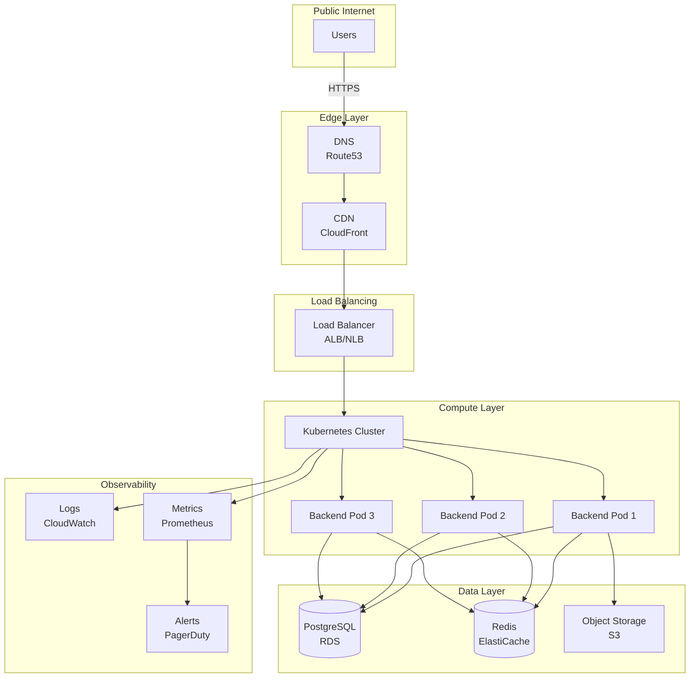
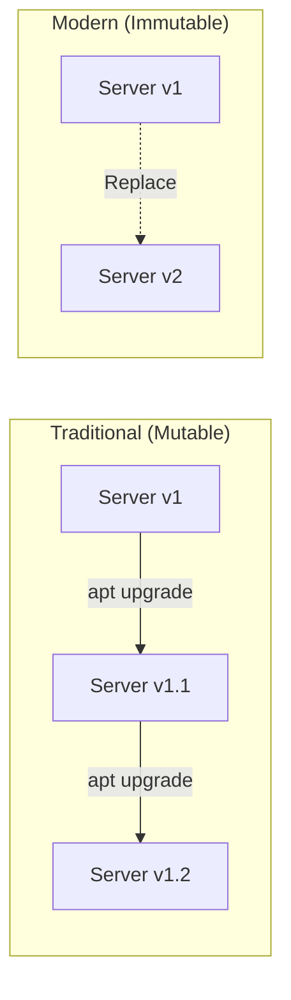
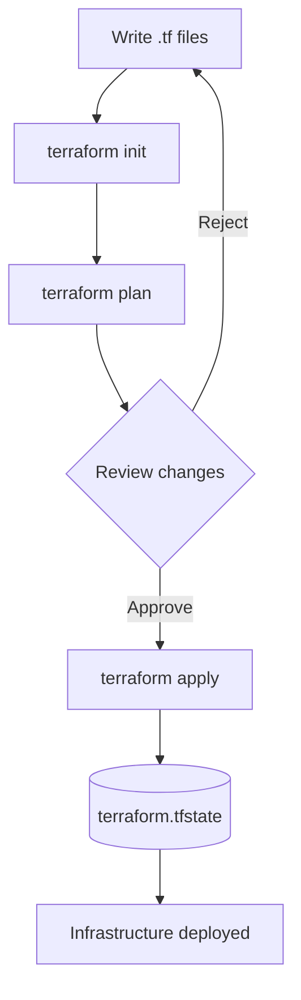
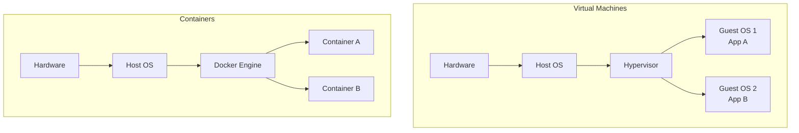
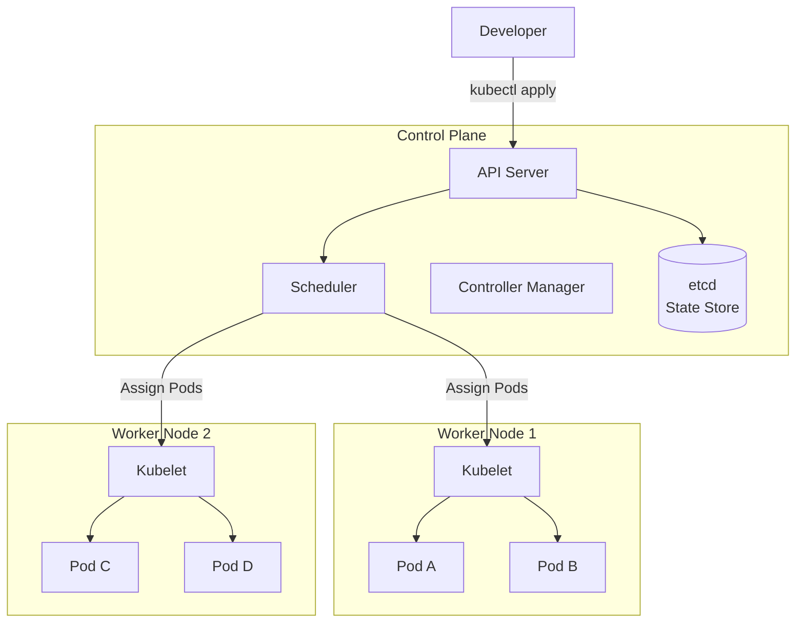
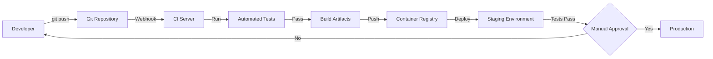

# Infrastructure & IaC Fundamentals

## Table of Contents

1. [Introduction](#introduction)
2. [What is Infrastructure?](#what-is-infrastructure)
3. [Traditional vs. Modern Infrastructure](#traditional-vs-modern-infrastructure)
4. [Infrastructure as Code (IaC)](#infrastructure-as-code-iac)
5. [Core IaC Principles](#core-iac-principles)
6. [Terraform Fundamentals](#terraform-fundamentals)
7. [Docker & Containerization](#docker--containerization)
8. [Kubernetes Essentials](#kubernetes-essentials)
9. [CI/CD Pipelines](#cicd-pipelines)
10. [How SpecWeave Fits In](#how-specweave-fits-in)
11. [Best Practices](#best-practices)
12. [Common Pitfalls](#common-pitfalls)
13. [Next Steps](#next-steps)

## Introduction

Infrastructure is the foundation of every modern software system. From small startups to Fortune 500 companies, how you manage infrastructure directly impacts your ability to ship features, maintain reliability, and scale your applications. This guide introduces Infrastructure as Code (IaC) - a transformative approach that treats infrastructure the same way developers treat application code.

By the end of this guide, you'll understand:
- What infrastructure means in modern software development
- Why Infrastructure as Code revolutionizes operations
- How tools like [Terraform](/docs/glossary/terms/terraform), [Docker](/docs/glossary/terms/docker), and [Kubernetes](/docs/glossary/terms/kubernetes) work together
- How to design robust [CI/CD](/docs/glossary/terms/ci-cd) pipelines
- How SpecWeave helps you document and manage infrastructure evolution

## What is Infrastructure?

**Infrastructure** refers to all the foundational technology resources required to run your application:

**Compute Resources:**
- Virtual machines (EC2, Azure VMs, Google Compute Engine)
- Container orchestration platforms (Kubernetes, ECS, AKS)
- Serverless functions (AWS Lambda, Azure Functions)

**Networking:**
- Load balancers (distributing traffic across servers)
- DNS configuration (routing domain names to servers)
- Virtual Private Clouds (VPCs, isolated network environments)
- Content Delivery Networks (CDNs, caching static assets globally)

**Storage:**
- Block storage (persistent volumes for VMs)
- Object storage (S3, Azure Blob Storage for files/backups)
- Databases (RDS, CosmosDB, Cloud SQL)

**Security:**
- Identity and Access Management (IAM roles, service accounts)
- Network security groups (firewalls, access control lists)
- Secrets management (KMS, Azure Key Vault, HashiCorp Vault)

**Observability:**
- Logging infrastructure (CloudWatch, Stackdriver)
- Monitoring systems (Prometheus, Datadog)
- Alerting mechanisms (PagerDuty, Opsgenie)

### Infrastructure Architecture Example



## Traditional vs. Modern Infrastructure

### Traditional Infrastructure (Pre-2010s)

**Manual Setup:**
- Engineers manually provision physical servers
- Install operating systems from CDs/USB drives
- Configure networking through hardware switches
- Document setup in wikis or Word documents

**Problems:**
- **Slow**: Provisioning takes days or weeks
- **Error-prone**: Manual steps lead to inconsistencies
- **Hard to replicate**: "Works on my machine" syndrome
- **Difficult to scale**: Adding capacity requires physical hardware
- **Poor disaster recovery**: Rebuilding from documentation is slow and unreliable

### Modern Infrastructure (2010s+)

**Automated, Code-Driven:**
- Infrastructure defined in version-controlled files
- Automated provisioning via APIs (cloud providers)
- Configuration management through code
- Infrastructure changes go through code review

**Benefits:**
- **Fast**: Provision resources in minutes
- **Consistent**: Same code produces identical infrastructure
- **Reproducible**: Spin up dev/staging/prod from same definitions
- **Scalable**: Add capacity with configuration changes
- **Auditable**: Full history via [Git](/docs/glossary/terms/git)

## Infrastructure as Code (IaC)

**Infrastructure as Code (IaC)** is the practice of managing infrastructure through machine-readable definition files rather than manual processes.

### Key Characteristics

**Declarative Approach:**
```hcl
# You declare WHAT you want (Terraform example)
resource "aws_instance" "web_server" {
  ami           = "ami-0c55b159cbfafe1f0"
  instance_type = "t3.micro"

  tags = {
    Name = "WebServer"
    Environment = "production"
  }
}
```

The tool (Terraform, CloudFormation, etc.) figures out HOW to achieve the desired state.

**Version Control:**
All infrastructure definitions live in [Git](/docs/glossary/terms/git) alongside application code:
```
my-project/
├── src/                  # Application code
├── infrastructure/       # IaC definitions
│   ├── main.tf
│   ├── variables.tf
│   └── outputs.tf
└── .specweave/          # SpecWeave specs
```

**Repeatability:**
The same IaC code creates identical infrastructure across environments:
- Development (smaller instance sizes)
- Staging (production-like for testing)
- Production (full scale)

### IaC Benefits Over Manual Management

| Aspect | Manual | IaC |
|--------|--------|-----|
| **Provisioning time** | Days/weeks | Minutes |
| **Consistency** | Manual errors | 100% identical |
| **Documentation** | Outdated wikis | Code is documentation |
| **Disaster recovery** | Slow, error-prone | Automated rebuild |
| **Change auditing** | Email/tickets | Git history |
| **Testing** | Difficult | Automated validation |
| **Collaboration** | Handoffs | Code review process |

## Core IaC Principles

### 1. Immutable Infrastructure

**Traditional approach**: Update servers in place (patch operating systems, upgrade packages)

**Immutable approach**: Replace servers entirely with new versions



**Benefits:**
- **No configuration drift**: Servers always match definitions
- **Easy rollback**: Revert to previous image version
- **Predictable deployments**: No accumulated state from updates

### 2. Idempotency

Running the same IaC code multiple times produces the same result:

```hcl
# First run: Creates S3 bucket
# Second run: Sees bucket exists, does nothing
# Third run: Still does nothing (idempotent)
resource "aws_s3_bucket" "data" {
  bucket = "my-app-data"
}
```

### 3. Self-Documentation

Infrastructure code serves as living documentation:

```hcl
# Security group configuration documents firewall rules
resource "aws_security_group" "web" {
  name        = "web-server-sg"
  description = "Allow inbound HTTPS from anywhere, SSH from office IP only"

  ingress {
    from_port   = 443
    to_port     = 443
    protocol    = "tcp"
    cidr_blocks = ["0.0.0.0/0"]  # HTTPS from internet
  }

  ingress {
    from_port   = 22
    to_port     = 22
    protocol    = "tcp"
    cidr_blocks = ["203.0.113.0/24"]  # SSH from office only
  }
}
```

## Terraform Fundamentals

[Terraform](/docs/glossary/terms/terraform) is the industry-standard IaC tool for cloud infrastructure. It supports AWS, Azure, GCP, and 100+ providers.

### Core Concepts

**Resources**: Infrastructure components you create:
```hcl
resource "aws_instance" "app_server" {
  ami           = "ami-0c55b159cbfafe1f0"
  instance_type = "t3.micro"
}
```

**Variables**: Parameterize configurations:
```hcl
variable "instance_type" {
  description = "EC2 instance type"
  type        = string
  default     = "t3.micro"
}

resource "aws_instance" "app_server" {
  ami           = "ami-0c55b159cbfafe1f0"
  instance_type = var.instance_type  # Use variable
}
```

**Outputs**: Export values for use elsewhere:
```hcl
output "server_ip" {
  value = aws_instance.app_server.public_ip
}
```

### Terraform Workflow



**Workflow Steps:**

1. **Write**: Define infrastructure in `.tf` files
2. **Init**: Download provider plugins (`terraform init`)
3. **Plan**: Preview changes (`terraform plan`)
4. **Review**: Examine what will be created/modified/destroyed
5. **Apply**: Execute changes (`terraform apply`)
6. **State**: Terraform tracks current infrastructure in state file

### Example: Complete Web Application Infrastructure

```hcl
# variables.tf
variable "environment" {
  description = "Environment name (dev/staging/prod)"
  type        = string
}

variable "app_instance_count" {
  description = "Number of application servers"
  type        = number
  default     = 3
}

# main.tf
terraform {
  required_providers {
    aws = {
      source  = "hashicorp/aws"
      version = "~> 5.0"
    }
  }
}

provider "aws" {
  region = "us-west-2"
}

# VPC and networking
resource "aws_vpc" "main" {
  cidr_block = "10.0.0.0/16"

  tags = {
    Name        = "${var.environment}-vpc"
    Environment = var.environment
  }
}

resource "aws_subnet" "public" {
  vpc_id            = aws_vpc.main.id
  cidr_block        = "10.0.1.0/24"
  availability_zone = "us-west-2a"

  tags = {
    Name = "${var.environment}-public-subnet"
  }
}

# Load balancer
resource "aws_lb" "app" {
  name               = "${var.environment}-app-lb"
  internal           = false
  load_balancer_type = "application"
  subnets            = [aws_subnet.public.id]

  tags = {
    Environment = var.environment
  }
}

# Application servers (auto-scaling group)
resource "aws_launch_template" "app" {
  name_prefix   = "${var.environment}-app-"
  image_id      = "ami-0c55b159cbfafe1f0"
  instance_type = "t3.micro"
}

resource "aws_autoscaling_group" "app" {
  desired_capacity    = var.app_instance_count
  max_size           = var.app_instance_count * 2
  min_size           = var.app_instance_count
  target_group_arns  = [aws_lb_target_group.app.arn]

  launch_template {
    id      = aws_launch_template.app.id
    version = "$Latest"
  }
}

# Database
resource "aws_db_instance" "postgres" {
  identifier        = "${var.environment}-db"
  engine            = "postgres"
  engine_version    = "15.3"
  instance_class    = "db.t3.micro"
  allocated_storage = 20

  db_name  = "myapp"
  username = "admin"
  password = var.db_password  # Should be from secret manager

  tags = {
    Environment = var.environment
  }
}

# Outputs
output "load_balancer_dns" {
  value = aws_lb.app.dns_name
}

output "database_endpoint" {
  value = aws_db_instance.postgres.endpoint
}
```

## Docker & Containerization

[Docker](/docs/glossary/terms/docker) packages applications with all dependencies into lightweight, portable containers.

### Why Containers?

**Problem**: "Works on my machine" syndrome
- Different OS versions between dev/staging/prod
- Missing system libraries
- Conflicting dependency versions

**Solution**: Package everything together
```dockerfile
# Dockerfile defines container image
FROM node:18-alpine

WORKDIR /app

# Install dependencies
COPY package*.json ./
RUN npm ci --production

# Copy application code
COPY src/ ./src/

# Run application
CMD ["node", "src/index.js"]
```

### Container vs. Virtual Machine



**Key Differences:**
- **Containers**: Share host OS kernel, lightweight (MBs), start in seconds
- **VMs**: Full guest OS per VM, heavy (GBs), start in minutes

### Docker Workflow

```bash
# Build image from Dockerfile
docker build -t my-app:1.0 .

# Run container from image
docker run -p 3000:3000 my-app:1.0

# Push to registry (Docker Hub, ECR, GCR)
docker push myregistry/my-app:1.0
```

### Multi-Container Applications (Docker Compose)

```yaml
# docker-compose.yml
version: '3.8'

services:
  frontend:
    build: ./frontend
    ports:
      - "3000:3000"
    depends_on:
      - backend

  backend:
    build: ./backend
    ports:
      - "8000:8000"
    environment:
      DATABASE_URL: postgres://postgres:password@db:5432/myapp
    depends_on:
      - db

  db:
    image: postgres:15
    environment:
      POSTGRES_PASSWORD: password
    volumes:
      - db-data:/var/lib/postgresql/data

volumes:
  db-data:
```

Run entire stack: `docker-compose up`

## Kubernetes Essentials

[Kubernetes](/docs/glossary/terms/kubernetes) (K8s) orchestrates containers at scale - managing deployment, scaling, networking, and self-healing.

### Core Concepts

**Pod**: Smallest deployable unit (one or more containers)
```yaml
apiVersion: v1
kind: Pod
metadata:
  name: web-app
spec:
  containers:
  - name: frontend
    image: my-app:1.0
    ports:
    - containerPort: 3000
```

**Deployment**: Manages replicas of Pods
```yaml
apiVersion: apps/v1
kind: Deployment
metadata:
  name: web-app
spec:
  replicas: 3  # Run 3 copies
  selector:
    matchLabels:
      app: web
  template:
    metadata:
      labels:
        app: web
    spec:
      containers:
      - name: frontend
        image: my-app:1.0
```

**Service**: Exposes Pods to network traffic
```yaml
apiVersion: v1
kind: Service
metadata:
  name: web-service
spec:
  selector:
    app: web
  ports:
  - protocol: TCP
    port: 80
    targetPort: 3000
  type: LoadBalancer
```

### Kubernetes Architecture



### Kubernetes Benefits

**Self-Healing**: Automatically restarts failed containers
**Auto-Scaling**: Adds/removes Pods based on CPU/memory usage
**Rolling Updates**: Deploy new versions with zero downtime
**Service Discovery**: Automatic DNS for service-to-service communication
**Load Balancing**: Distributes traffic across Pod replicas

## CI/CD Pipelines

[CI/CD](/docs/glossary/terms/ci-cd) automates testing and deployment, enabling rapid, reliable software delivery.

### Continuous Integration (CI)

**Goal**: Automatically test every code change

```yaml
# .github/workflows/ci.yml (GitHub Actions example)
name: CI Pipeline

on:
  push:
    branches: [ main, develop ]
  pull_request:
    branches: [ main ]

jobs:
  test:
    runs-on: ubuntu-latest
    steps:
      - uses: actions/checkout@v3

      - name: Setup Node.js
        uses: actions/setup-node@v3
        with:
          node-version: '18'

      - name: Install dependencies
        run: npm ci

      - name: Run linter
        run: npm run lint

      - name: Run unit tests
        run: npm test

      - name: Run integration tests
        run: npm run test:integration
```

### Continuous Deployment (CD)

**Goal**: Automatically deploy passing builds to production

```yaml
# .github/workflows/cd.yml
name: CD Pipeline

on:
  push:
    branches: [ main ]

jobs:
  deploy:
    runs-on: ubuntu-latest
    steps:
      - uses: actions/checkout@v3

      - name: Build Docker image
        run: docker build -t my-app:${{ github.sha }} .

      - name: Push to registry
        run: |
          docker login -u ${{ secrets.DOCKER_USER }} -p ${{ secrets.DOCKER_PASS }}
          docker push my-app:${{ github.sha }}

      - name: Deploy to Kubernetes
        run: |
          kubectl set image deployment/web-app \
            frontend=my-app:${{ github.sha }} \
            --record
```

### Complete CI/CD Pipeline



**Pipeline Stages:**

1. **Source**: Developer pushes code to Git
2. **Build**: Compile code, run linters
3. **Test**: Unit, integration, E2E tests
4. **Package**: Build Docker images
5. **Deploy to Staging**: Automated deployment
6. **Approval**: Manual or automated gate
7. **Deploy to Production**: Automated deployment

## How SpecWeave Fits In

SpecWeave brings **spec-driven development** to infrastructure, ensuring all infrastructure changes are documented, reviewed, and traceable.

### Infrastructure Increments

Create dedicated increments for infrastructure work:

```bash
/specweave:inc "0024-kubernetes-migration"
```

**Spec includes**:
- Current state (existing infrastructure)
- Desired state (target infrastructure)
- Migration strategy
- Rollback plan
- Success criteria

### Architecture Decision Records

Document infrastructure choices in ADRs:

```markdown
# .specweave/docs/internal/architecture/adr/0015-kubernetes-over-ecs.md

## Status
Accepted

## Context
Need container orchestration for microservices architecture.
Evaluating Kubernetes vs. AWS ECS.

## Decision
We will use Kubernetes (EKS on AWS).

## Rationale
- Multi-cloud portability (can move to GCP/Azure if needed)
- Rich ecosystem (Helm charts, operators)
- Better support for complex networking (service mesh)
- Team has Kubernetes experience

## Consequences
**Positive:**
- Greater flexibility and portability
- Access to extensive Kubernetes tooling

**Negative:**
- Higher operational complexity
- Steeper learning curve for new team members

## Alternatives Considered
- AWS ECS: Simpler but AWS-locked
- Docker Swarm: Simpler but declining ecosystem
```

### Infrastructure Documentation

SpecWeave's living documentation keeps infrastructure docs up-to-date:

```
.specweave/docs/internal/
├── architecture/
│   ├── infrastructure-overview.md
│   ├── network-topology.md
│   └── diagrams/
│       ├── aws-architecture.mmd
│       └── kubernetes-cluster.mmd
├── operations/
│   ├── runbooks/
│   │   ├── deploy-to-production.md
│   │   ├── scale-kubernetes-cluster.md
│   │   └── incident-response.md
│   └── disaster-recovery.md
```

### Example: Terraform Increment

**Spec** (`.specweave/increments/0024-terraform-migration/spec.md`):
```markdown
# Increment 0024: Migrate to Terraform

## Objective
Migrate all AWS infrastructure from manual console management to Terraform.

## Current State
- 15 EC2 instances (manually created)
- RDS database (console-created)
- No version control for infrastructure
- Configuration drift between environments

## Desired State
- All infrastructure defined in Terraform
- Dev/staging/prod environments from same code
- Infrastructure changes via pull requests
- State stored in S3 backend

## User Stories

### US-001: Terraform Setup (P1)
**As a** DevOps engineer
**I want** Terraform project structure
**So that** I can begin defining infrastructure as code

**Acceptance Criteria:**
- AC-US1-01: Terraform initialized with S3 backend
- AC-US1-02: Variables defined for environment-specific config
- AC-US1-03: Outputs defined for resource IDs

### US-002: Import Existing Resources (P1)
**As a** DevOps engineer
**I want** existing AWS resources imported into Terraform state
**So that** Terraform can manage them

**Acceptance Criteria:**
- AC-US2-01: All EC2 instances imported
- AC-US2-02: RDS database imported
- AC-US2-03: Security groups imported
- AC-US2-04: `terraform plan` shows no changes

## Migration Strategy
1. Set up Terraform project structure
2. Import existing resources into Terraform state
3. Test in dev environment
4. Apply to staging (with rollback plan)
5. Apply to production (during maintenance window)

## Rollback Plan
- Keep manual backups of all resource configurations
- Document manual recreation steps
- Test rollback in dev environment first
```

## Best Practices

### 1. Infrastructure Repository Structure

```
infrastructure/
├── environments/
│   ├── dev/
│   │   ├── main.tf
│   │   ├── variables.tf
│   │   └── terraform.tfvars
│   ├── staging/
│   └── production/
├── modules/
│   ├── networking/
│   ├── compute/
│   └── database/
├── scripts/
│   └── deploy.sh
└── README.md
```

### 2. Use Remote State

Store Terraform state in S3 (not local files):
```hcl
terraform {
  backend "s3" {
    bucket = "my-terraform-state"
    key    = "prod/terraform.tfstate"
    region = "us-west-2"
    encrypt = true
  }
}
```

### 3. Tag Everything

```hcl
resource "aws_instance" "web" {
  ami           = "ami-0c55b159cbfafe1f0"
  instance_type = "t3.micro"

  tags = {
    Name        = "web-server-01"
    Environment = var.environment
    ManagedBy   = "terraform"
    Team        = "platform"
    CostCenter  = "engineering"
  }
}
```

### 4. Use Modules for Reusability

```hcl
# Call reusable module
module "web_cluster" {
  source = "./modules/web-cluster"

  environment      = "production"
  instance_count   = 5
  instance_type    = "t3.small"
}
```

### 5. Implement CI/CD for Infrastructure

```yaml
# Terraform CI/CD pipeline
name: Terraform

on:
  pull_request:
    paths:
      - 'infrastructure/**'

jobs:
  terraform:
    runs-on: ubuntu-latest
    steps:
      - uses: actions/checkout@v3

      - name: Terraform Format
        run: terraform fmt -check

      - name: Terraform Init
        run: terraform init

      - name: Terraform Validate
        run: terraform validate

      - name: Terraform Plan
        run: terraform plan -out=tfplan

      - name: Post Plan to PR
        uses: actions/github-script@v6
        with:
          script: |
            const output = `### Terraform Plan
            \`\`\`
            ${{ steps.plan.outputs.stdout }}
            \`\`\``;
            github.rest.issues.createComment({
              issue_number: context.issue.number,
              owner: context.repo.owner,
              repo: context.repo.repo,
              body: output
            });
```

## Common Pitfalls

### 1. Storing Secrets in Code

❌ **Wrong**:
```hcl
resource "aws_db_instance" "postgres" {
  username = "admin"
  password = "MyP@ssw0rd123"  # Never hardcode secrets!
}
```

✅ **Correct**:
```hcl
resource "aws_db_instance" "postgres" {
  username = "admin"
  password = var.db_password  # Variable from secrets manager
}
```

### 2. Not Using State Locking

Multiple engineers running Terraform simultaneously can corrupt state. Use locking:

```hcl
terraform {
  backend "s3" {
    bucket         = "my-terraform-state"
    key            = "prod/terraform.tfstate"
    region         = "us-west-2"
    dynamodb_table = "terraform-locks"  # Enables state locking
  }
}
```

### 3. Ignoring Blast Radius

Limit scope of changes to reduce risk:

❌ **Wrong**: Single state file for entire company infrastructure
✅ **Correct**: Separate state per environment/service

```
state-files/
├── prod-frontend.tfstate
├── prod-backend.tfstate
├── staging-frontend.tfstate
└── staging-backend.tfstate
```

### 4. No Rollback Plan

Always test rollback procedures:
- Can you destroy and recreate resources?
- Are backups automated?
- Do you have manual steps documented?

## Next Steps

**Deepen Your Knowledge:**
- [Backend Development Fundamentals](/docs/public/learn/backend/backend-fundamentals) - Learn how backend code runs on this infrastructure
- [Testing Fundamentals](/docs/public/learn/testing/testing-fundamentals) - Test infrastructure with integration tests
- [CI/CD Deep Dive](/docs/glossary/terms/ci-cd) - Advanced pipeline patterns

**Hands-On Practice:**
1. Set up local Terraform project
2. Deploy simple infrastructure (VPC + EC2)
3. Implement blue-green deployment
4. Build CI/CD pipeline for infrastructure

**SpecWeave Integration:**
- Create infrastructure increment: `/specweave:inc "infrastructure-setup"`
- Document architecture decisions in ADRs
- Use SpecWeave's living docs to keep infrastructure documentation current

**Further Reading:**
- [Terraform Documentation](https://developer.hashicorp.com/terraform/docs)
- [Kubernetes Documentation](https://kubernetes.io/docs/)
- [Docker Documentation](https://docs.docker.com/)
- [The Twelve-Factor App](https://12factor.net/) - Best practices for modern applications
