# Testing & Quality Fundamentals

## Table of Contents

1. [Introduction](#introduction)
2. [Why Testing Matters](#why-testing-matters)
3. [The Test Pyramid](#the-test-pyramid)
4. [Unit Testing](#unit-testing)
5. [Integration Testing](#integration-testing)
6. [End-to-End Testing](#end-to-end-testing)
7. [Test-Driven Development (TDD)](#test-driven-development-tdd)
8. [Behavior-Driven Development (BDD)](#behavior-driven-development-bdd)
9. [Testing Strategies](#testing-strategies)
10. [Test Coverage](#test-coverage)
11. [Mocking & Stubbing](#mocking--stubbing)
12. [Testing Best Practices](#testing-best-practices)
13. [Playwright for E2E Testing](#playwright-for-e2e-testing)
14. [Performance Testing](#performance-testing)
15. [How SpecWeave Fits In](#how-specweave-fits-in)
16. [Common Pitfalls](#common-pitfalls)
17. [Next Steps](#next-steps)

## Introduction

Testing is not just about finding bugs - it's about building confidence in your code, enabling refactoring, serving as documentation, and ultimately shipping better software faster. Modern software development is impossible without comprehensive testing strategies.

This guide teaches you:
- Why testing is essential for professional software development
- The test pyramid and when to use each testing level
- How to write effective [unit tests](/docs/glossary/terms/unit-testing), [integration tests](/docs/glossary/terms/integration-testing), and E2E tests
- [Test-Driven Development (TDD)](/docs/glossary/terms/tdd) and [Behavior-Driven Development (BDD)](/docs/glossary/terms/bdd) workflows
- [Test coverage](/docs/glossary/terms/test-coverage) metrics and realistic targets
- [Playwright](/docs/glossary/terms/playwright) for browser automation and E2E testing
- How SpecWeave integrates testing into the development workflow

## Why Testing Matters

### The Cost of Bugs


**Key Insight**: Bugs found in production cost **10,000x more** than bugs caught during development.

**Real-World Impact**:
- **Knight Capital (2012)**: $440M loss in 45 minutes due to untested deployment
- **Amazon Prime Day (2018)**: 63-minute outage = $99M lost revenue
- **Healthcare.gov (2013)**: Failed launch cost $1.7B+ to fix

### Benefits of Testing

**1. Confidence to Refactor**
```javascript
// Without tests: Fear of changing code
function calculatePrice(item) {
  // 200 lines of complex logic
  // No one dares to refactor this!
}

// With tests: Refactor fearlessly
test('calculatePrice returns correct discount', () => {
  expect(calculatePrice(item)).toBe(89.99);
});
// Refactor implementation, tests catch regressions
```

**2. Living Documentation**
```javascript
// Test describes behavior
describe('UserService', () => {
  it('sends welcome email when user registers', async () => {
    await userService.register({ email: 'test@example.com' });
    expect(emailService.send).toHaveBeenCalledWith({
      to: 'test@example.com',
      subject: 'Welcome!'
    });
  });
});
```

**3. Faster Development**
- Manual testing: 30 minutes per feature
- Automated testing: 30 seconds per feature
- **60x faster feedback loop**

**4. Catch Regressions**
```javascript
// Feature works today
test('user can login', () => { /* passes */ });

// Someone breaks it tomorrow
// Test fails immediately, catches regression
```

## The Test Pyramid


### Distribution Guidelines

| Test Type | Percentage | Speed | Cost | Reliability |
|-----------|-----------|-------|------|-------------|
| **[Unit](/docs/glossary/terms/unit-testing)** | 70% | Milliseconds | Low | High |
| **[Integration](/docs/glossary/terms/integration-testing)** | 20% | Seconds | Medium | Medium |
| **E2E** | 10% | Minutes | High | Low (flaky) |

**Why Pyramid Shape?**
- **Base (Unit tests)**: Fast, reliable, test individual functions
- **Middle (Integration)**: Test modules working together
- **Top (E2E)**: Test entire system through UI (slowest, most brittle)

### Anti-Pattern: Ice Cream Cone

```mermaid
graph TB
    subgraph "Anti-Pattern: Ice Cream Cone"
        E2E2[E2E Tests<br/>70%<br/>❌ Too many!]
        Integration2[Integration Tests<br/>20%]
        Unit2[Unit Tests<br/>10%<br/>❌ Too few!]
    end

    Unit2 --> Integration2
    Integration2 --> E2E2

    style Unit2 fill:#ff6b6b
    style E2E2 fill:#ff6b6b
```



**Problems**:
- **Slow test suite**: 30+ minutes to run
- **Flaky tests**: E2E tests fail randomly
- **Hard to debug**: E2E failures don't pinpoint root cause
- **Expensive CI**: More compute resources needed

## Unit Testing

**Unit tests** verify individual functions/components in isolation.

### Characteristics

- **Fast**: Runs in milliseconds
- **Isolated**: No database, API calls, file I/O
- **Focused**: Tests one function/method
- **Reliable**: No flakiness

### Unit Test Structure (AAA Pattern)

```javascript
test('description of behavior', () => {
  // Arrange: Set up test data
  const input = { name: 'Alice', age: 25 };

  // Act: Execute the function
  const result = formatUser(input);

  // Assert: Verify the result
  expect(result).toBe('Alice (25 years old)');
});
```

### Examples

**Pure Function Testing:**
```javascript
// Function to test
function calculateDiscount(price, discountPercent) {
  if (discountPercent < 0 || discountPercent > 100) {
    throw new Error('Invalid discount');
  }
  return price * (1 - discountPercent / 100);
}

// Unit tests
describe('calculateDiscount', () => {
  test('applies 10% discount correctly', () => {
    expect(calculateDiscount(100, 10)).toBe(90);
  });

  test('applies 50% discount correctly', () => {
    expect(calculateDiscount(200, 50)).toBe(100);
  });

  test('handles 0% discount', () => {
    expect(calculateDiscount(100, 0)).toBe(100);
  });

  test('throws error for negative discount', () => {
    expect(() => calculateDiscount(100, -10)).toThrow('Invalid discount');
  });

  test('throws error for discount > 100', () => {
    expect(() => calculateDiscount(100, 150)).toThrow('Invalid discount');
  });
});
```

**Class/Object Testing:**
```javascript
// Class to test
class ShoppingCart {
  constructor() {
    this.items = [];
  }

  addItem(item) {
    this.items.push(item);
  }

  getTotal() {
    return this.items.reduce((sum, item) => sum + item.price, 0);
  }

  isEmpty() {
    return this.items.length === 0;
  }
}

// Unit tests
describe('ShoppingCart', () => {
  let cart;

  beforeEach(() => {
    cart = new ShoppingCart(); // Fresh cart for each test
  });

  test('starts empty', () => {
    expect(cart.isEmpty()).toBe(true);
  });

  test('adds items', () => {
    cart.addItem({ name: 'Book', price: 20 });
    expect(cart.items).toHaveLength(1);
    expect(cart.isEmpty()).toBe(false);
  });

  test('calculates total correctly', () => {
    cart.addItem({ name: 'Book', price: 20 });
    cart.addItem({ name: 'Pen', price: 5 });
    expect(cart.getTotal()).toBe(25);
  });
});
```

**React Component Testing:**
```javascript
import { render, screen, fireEvent } from '@testing-library/react';

// Component
function Counter({ initialCount = 0 }) {
  const [count, setCount] = React.useState(initialCount);

  return (
    <div>
      <span data-testid="count">{count}</span>
      <button onClick={() => setCount(count + 1)}>Increment</button>
      <button onClick={() => setCount(count - 1)}>Decrement</button>
    </div>
  );
}

// Unit tests
describe('Counter', () => {
  test('renders with initial count', () => {
    render(<Counter initialCount={5} />);
    expect(screen.getByTestId('count')).toHaveTextContent('5');
  });

  test('increments count on button click', () => {
    render(<Counter />);
    const button = screen.getByText('Increment');

    fireEvent.click(button);
    expect(screen.getByTestId('count')).toHaveTextContent('1');

    fireEvent.click(button);
    expect(screen.getByTestId('count')).toHaveTextContent('2');
  });

  test('decrements count on button click', () => {
    render(<Counter initialCount={5} />);
    const button = screen.getByText('Decrement');

    fireEvent.click(button);
    expect(screen.getByTestId('count')).toHaveTextContent('4');
  });
});
```

## Integration Testing

**Integration tests** verify multiple modules working together.

### Characteristics

- **Medium speed**: Runs in seconds
- **Database/API**: Real or test database, may call real APIs
- **Broader scope**: Tests workflows across modules
- **More setup**: Requires test data, database migrations

### Examples

**API Integration Testing:**
```javascript
import request from 'supertest';
import app from '../src/app';
import { setupTestDB, cleanupTestDB } from './helpers/db';

describe('User API', () => {
  beforeAll(async () => {
    await setupTestDB(); // Set up test database
  });

  afterAll(async () => {
    await cleanupTestDB(); // Clean up test database
  });

  afterEach(async () => {
    await db.user.deleteMany(); // Clear data between tests
  });

  test('POST /api/users creates user', async () => {
    const response = await request(app)
      .post('/api/users')
      .send({
        email: 'test@example.com',
        name: 'Test User',
        password: 'password123'
      });

    expect(response.status).toBe(201);
    expect(response.body).toMatchObject({
      email: 'test@example.com',
      name: 'Test User'
    });
    expect(response.body.password).toBeUndefined(); // Password not returned

    // Verify user in database
    const user = await db.user.findUnique({
      where: { email: 'test@example.com' }
    });
    expect(user).toBeDefined();
    expect(user.password).not.toBe('password123'); // Password hashed
  });

  test('POST /api/users returns 400 for duplicate email', async () => {
    // Create initial user
    await request(app)
      .post('/api/users')
      .send({ email: 'test@example.com', name: 'User 1', password: 'pass1' });

    // Try to create duplicate
    const response = await request(app)
      .post('/api/users')
      .send({ email: 'test@example.com', name: 'User 2', password: 'pass2' });

    expect(response.status).toBe(400);
    expect(response.body.error).toContain('already exists');
  });

  test('GET /api/users/:id returns user', async () => {
    // Create user
    const createResponse = await request(app)
      .post('/api/users')
      .send({ email: 'test@example.com', name: 'Test', password: 'pass' });

    const userId = createResponse.body.id;

    // Retrieve user
    const response = await request(app).get(`/api/users/${userId}`);

    expect(response.status).toBe(200);
    expect(response.body).toMatchObject({
      id: userId,
      email: 'test@example.com',
      name: 'Test'
    });
  });
});
```

**Database Integration Testing:**
```javascript
describe('OrderService', () => {
  let orderService;
  let db;

  beforeAll(async () => {
    db = await setupTestDB();
    orderService = new OrderService(db);
  });

  test('createOrder creates order and updates inventory', async () => {
    // Arrange: Set up test data
    const product = await db.product.create({
      data: { name: 'Widget', price: 50, stock: 10 }
    });

    // Act: Create order
    const order = await orderService.createOrder({
      productId: product.id,
      quantity: 3
    });

    // Assert: Order created
    expect(order).toMatchObject({
      productId: product.id,
      quantity: 3,
      total: 150
    });

    // Assert: Inventory updated
    const updatedProduct = await db.product.findUnique({
      where: { id: product.id }
    });
    expect(updatedProduct.stock).toBe(7); // 10 - 3 = 7
  });

  test('createOrder throws error for insufficient stock', async () => {
    const product = await db.product.create({
      data: { name: 'Widget', price: 50, stock: 2 }
    });

    await expect(
      orderService.createOrder({ productId: product.id, quantity: 5 })
    ).rejects.toThrow('Insufficient stock');

    // Verify inventory unchanged
    const unchangedProduct = await db.product.findUnique({
      where: { id: product.id }
    });
    expect(unchangedProduct.stock).toBe(2);
  });
});
```

### Integration Test Flow


## End-to-End Testing

**E2E tests** verify entire application through the user interface.

### Characteristics

- **Slow**: Runs in minutes
- **Complete stack**: Browser + frontend + backend + database
- **User perspective**: Tests what users actually do
- **Brittle**: Prone to flakiness (network, timing issues)

### When to Use E2E Tests

✅ **DO use E2E for**:
- Critical user journeys (checkout, login, signup)
- Complex workflows spanning multiple pages
- Testing UI interactions that are hard to unit test

❌ **DON'T use E2E for**:
- Testing business logic (use unit tests)
- Testing API validation (use integration tests)
- Testing every edge case (test pyramid!)

### Example: [Playwright](/docs/glossary/terms/playwright) E2E Test

```javascript
import { test, expect } from '@playwright/test';

test.describe('User Registration Flow', () => {
  test('user can register and login', async ({ page }) => {
    // Navigate to registration page
    await page.goto('http://localhost:3000/register');

    // Fill registration form
    await page.fill('input[name="name"]', 'Test User');
    await page.fill('input[name="email"]', 'test@example.com');
    await page.fill('input[name="password"]', 'SecurePassword123');
    await page.fill('input[name="confirmPassword"]', 'SecurePassword123');

    // Submit form
    await page.click('button[type="submit"]');

    // Wait for redirect to dashboard
    await page.waitForURL('**/dashboard');

    // Verify user is logged in
    await expect(page.locator('text=Welcome, Test User')).toBeVisible();
  });

  test('shows error for invalid email', async ({ page }) => {
    await page.goto('http://localhost:3000/register');

    await page.fill('input[name="email"]', 'invalid-email');
    await page.fill('input[name="password"]', 'password123');

    await page.click('button[type="submit"]');

    // Verify error message
    await expect(page.locator('text=Invalid email format')).toBeVisible();
  });

  test('shows error for weak password', async ({ page }) => {
    await page.goto('http://localhost:3000/register');

    await page.fill('input[name="email"]', 'test@example.com');
    await page.fill('input[name="password"]', '123'); // Too short

    await page.click('button[type="submit"]');

    await expect(
      page.locator('text=Password must be at least 8 characters')
    ).toBeVisible();
  });
});

test.describe('E-commerce Checkout Flow', () => {
  test('complete purchase flow', async ({ page }) => {
    // 1. Login
    await page.goto('http://localhost:3000/login');
    await page.fill('input[name="email"]', 'buyer@example.com');
    await page.fill('input[name="password"]', 'password123');
    await page.click('button[type="submit"]');

    // 2. Browse products
    await page.goto('http://localhost:3000/products');
    await page.click('text=Widget Pro'); // Click product card

    // 3. Add to cart
    await page.click('button:has-text("Add to Cart")');
    await expect(page.locator('.cart-badge')).toHaveText('1'); // Cart count

    // 4. Go to cart
    await page.click('a[href="/cart"]');
    await expect(page.locator('text=Widget Pro')).toBeVisible();

    // 5. Proceed to checkout
    await page.click('button:has-text("Checkout")');

    // 6. Fill shipping info
    await page.fill('input[name="address"]', '123 Main St');
    await page.fill('input[name="city"]', 'Springfield');
    await page.fill('input[name="zip"]', '12345');

    // 7. Fill payment info
    await page.fill('input[name="cardNumber"]', '4242424242424242');
    await page.fill('input[name="expiry"]', '12/25');
    await page.fill('input[name="cvv"]', '123');

    // 8. Place order
    await page.click('button:has-text("Place Order")');

    // 9. Verify order confirmation
    await page.waitForURL('**/order-confirmation/**');
    await expect(page.locator('text=Order placed successfully')).toBeVisible();
    await expect(page.locator('text=Order #')).toBeVisible();
  });
});
```

## Test-Driven Development (TDD)

[TDD](/docs/glossary/terms/tdd) is a development workflow where you write tests **before** implementation.

### The Red-Green-Refactor Cycle


### TDD Workflow Example

**Step 1: RED - Write failing test**
```javascript
// tests/user.test.js
describe('User', () => {
  test('validates email format', () => {
    const user = new User({ email: 'invalid-email' });
    expect(user.isValid()).toBe(false);
  });
});

// Run test: ❌ FAILS (User class doesn't exist yet)
```

**Step 2: GREEN - Make test pass (minimal implementation)**
```javascript
// src/user.js
class User {
  constructor({ email }) {
    this.email = email;
  }

  isValid() {
    return this.email.includes('@'); // Simplest solution
  }
}

// Run test: ✅ PASSES
```

**Step 3: REFACTOR - Improve implementation**
```javascript
// src/user.js
class User {
  constructor({ email }) {
    this.email = email;
  }

  isValid() {
    const emailRegex = /^[^\s@]+@[^\s@]+\.[^\s@]+$/;
    return emailRegex.test(this.email); // Better validation
  }
}

// Run test: ✅ STILL PASSES
```

**Step 4: Add more tests (RED again)**
```javascript
test('requires email to be present', () => {
  const user = new User({ email: '' });
  expect(user.isValid()).toBe(false);
});

test('accepts valid email', () => {
  const user = new User({ email: 'test@example.com' });
  expect(user.isValid()).toBe(true);
});
```

### Benefits of TDD

1. **Better design**: Writing tests first forces you to think about API design
2. **100% coverage**: Every line of code has a test
3. **Less debugging**: Catch bugs immediately
4. **Refactoring confidence**: Tests verify behavior doesn't change
5. **Living documentation**: Tests describe how code should behave

## Behavior-Driven Development (BDD)

[BDD](/docs/glossary/terms/bdd) extends TDD with human-readable test descriptions using **Given-When-Then** format.

### BDD Format

```javascript
describe('User Authentication', () => {
  it('should return JWT token when credentials are valid', async () => {
    // Given: A user with valid credentials exists
    const user = await createUser({
      email: 'test@example.com',
      password: 'password123'
    });

    // When: User logs in with correct credentials
    const response = await request(app)
      .post('/api/auth/login')
      .send({ email: 'test@example.com', password: 'password123' });

    // Then: Server returns 200 with JWT token
    expect(response.status).toBe(200);
    expect(response.body).toHaveProperty('token');
    expect(response.body.token).toMatch(/^eyJ/); // JWT starts with eyJ
  });

  it('should return 401 when password is incorrect', async () => {
    // Given: A user exists
    await createUser({ email: 'test@example.com', password: 'correct' });

    // When: User logs in with wrong password
    const response = await request(app)
      .post('/api/auth/login')
      .send({ email: 'test@example.com', password: 'wrong' });

    // Then: Server returns 401 Unauthorized
    expect(response.status).toBe(401);
    expect(response.body.error).toContain('Invalid credentials');
  });
});
```

### SpecWeave's BDD Integration

SpecWeave embeds BDD tests in `tasks.md`:

```markdown
## T-003: Implement User Authentication

**Test Plan** (BDD format):
- **Given** valid credentials → **When** POST /login → **Then** return JWT token
- **Given** invalid password → **When** POST /login → **Then** return 401 error
- **Given** non-existent user → **When** POST /login → **Then** return 401 error

**Test Cases**:
- Unit (`auth.service.test.js`): validateCredentials, generateToken → 90% coverage
- Integration (`auth.api.test.js`): POST /login endpoint → 85% coverage
```

## Testing Strategies

### Testing Public vs Private Methods

```javascript
class UserService {
  // Public method (test this)
  async register(userData) {
    this._validateEmail(userData.email);
    const hashedPassword = await this._hashPassword(userData.password);
    return this._createUser({ ...userData, password: hashedPassword });
  }

  // Private methods (test indirectly through public methods)
  _validateEmail(email) { /* validation logic */ }
  _hashPassword(password) { /* hashing logic */ }
  _createUser(data) { /* database logic */ }
}

// ✅ Test public method (covers private methods indirectly)
test('register creates user with hashed password', async () => {
  const user = await userService.register({
    email: 'test@example.com',
    password: 'password123'
  });

  expect(user.email).toBe('test@example.com');
  expect(user.password).not.toBe('password123'); // Hashed
});

// ❌ Don't test private methods directly
// test('_hashPassword returns bcrypt hash', () => { ... });
```

### Testing Error Conditions

```javascript
describe('OrderService', () => {
  test('throws error when product not found', async () => {
    await expect(
      orderService.createOrder({ productId: 'non-existent', quantity: 1 })
    ).rejects.toThrow('Product not found');
  });

  test('throws error for insufficient stock', async () => {
    const product = await createProduct({ stock: 5 });

    await expect(
      orderService.createOrder({ productId: product.id, quantity: 10 })
    ).rejects.toThrow('Insufficient stock');
  });

  test('throws error for negative quantity', async () => {
    const product = await createProduct({ stock: 10 });

    await expect(
      orderService.createOrder({ productId: product.id, quantity: -1 })
    ).rejects.toThrow('Invalid quantity');
  });
});
```

### Testing Async Code

```javascript
// ✅ Correct: Return promise
test('fetches user data', () => {
  return fetchUser('123').then(user => {
    expect(user.name).toBe('Alice');
  });
});

// ✅ Correct: Use async/await
test('fetches user data', async () => {
  const user = await fetchUser('123');
  expect(user.name).toBe('Alice');
});

// ❌ Wrong: Test completes before assertion
test('fetches user data', () => {
  fetchUser('123').then(user => {
    expect(user.name).toBe('Alice'); // Never runs!
  });
  // Test finishes immediately
});
```

## Test Coverage

[Test coverage](/docs/glossary/terms/test-coverage) measures percentage of code executed by tests.

### Coverage Metrics

**Line Coverage**: % of code lines executed
**Branch Coverage**: % of code branches (if/else) executed
**Function Coverage**: % of functions called
**Statement Coverage**: % of statements executed

### Coverage Report Example

```
File                  | % Stmts | % Branch | % Funcs | % Lines |
----------------------|---------|----------|---------|---------|
All files             |   87.5  |   80.0   |  90.0   |  87.5   |
 src/
  user.service.js     |   95.0  |   90.0   |  100    |  95.0   |
  order.service.js    |   80.0  |   70.0   |  80.0   |  80.0   |
  payment.service.js  |   90.0  |   85.0   |  100    |  90.0   |
```

### Realistic Coverage Targets

**SpecWeave's Philosophy**: Coverage is a tool, not a goal.

| Code Type | Target | Rationale |
|-----------|--------|-----------|
| **Critical paths** | 100% | Payment processing, authentication, data loss prevention |
| **Business logic** | 90%+ | Core features, user flows |
| **Controllers** | 80-85% | Request handling, validation |
| **Utilities** | 90%+ | Shared functions used everywhere |
| **UI Components** | 70-80% | Focus on user interactions |

**Key Insight**: 80% well-written tests > 100% poor tests

### What Coverage Doesn't Tell You

```javascript
// 100% coverage, but tests nothing!
function divide(a, b) {
  return a / b;
}

test('divide function exists', () => {
  divide(10, 2); // Called, but no assertion!
});
// Coverage: 100% ✅
// Quality: 0% ❌
```

**Better approach**:
```javascript
describe('divide', () => {
  test('divides two numbers', () => {
    expect(divide(10, 2)).toBe(5);
  });

  test('handles division by zero', () => {
    expect(divide(10, 0)).toBe(Infinity);
  });

  test('returns negative for negative dividend', () => {
    expect(divide(-10, 2)).toBe(-5);
  });
});
```

## Mocking & Stubbing

**Mocking** replaces real dependencies with test doubles.

### Why Mock?

**1. Isolate unit under test**
```javascript
// Without mocking: Tests UserService AND EmailService AND Database
test('register sends welcome email', async () => {
  await userService.register({ email: 'test@example.com' });
  // Real email sent! Real database hit!
});

// With mocking: Tests only UserService
test('register sends welcome email', async () => {
  const mockEmailService = { send: jest.fn() };
  const userService = new UserService({ emailService: mockEmailService });

  await userService.register({ email: 'test@example.com' });

  expect(mockEmailService.send).toHaveBeenCalledWith({
    to: 'test@example.com',
    subject: 'Welcome!'
  });
});
```

**2. Test error conditions**
```javascript
test('handles email service failure', async () => {
  const mockEmailService = {
    send: jest.fn().mockRejectedValue(new Error('SMTP error'))
  };

  await expect(
    userService.register({ email: 'test@example.com' })
  ).rejects.toThrow('Failed to send welcome email');
});
```

### Mocking Examples

**Mock functions:**
```javascript
const mockFunction = jest.fn();
mockFunction.mockReturnValue(42);
mockFunction.mockResolvedValue({ data: 'success' });
mockFunction.mockRejectedValue(new Error('Failed'));

expect(mockFunction).toHaveBeenCalled();
expect(mockFunction).toHaveBeenCalledWith('arg1', 'arg2');
expect(mockFunction).toHaveBeenCalledTimes(3);
```

**Mock modules:**
```javascript
// Mock entire module
jest.mock('../src/database', () => ({
  query: jest.fn(),
  connect: jest.fn()
}));

// Use in tests
const db = require('../src/database');
db.query.mockResolvedValue([{ id: 1, name: 'Alice' }]);
```

**Spy on existing functions:**
```javascript
const user = { save: async () => { /* real implementation */ } };
const spy = jest.spyOn(user, 'save');

await user.save();
expect(spy).toHaveBeenCalled();

spy.mockRestore(); // Restore original implementation
```

## Testing Best Practices

### 1. AAA Pattern (Arrange-Act-Assert)

```javascript
test('clear structure', () => {
  // Arrange
  const cart = new ShoppingCart();
  const item = { name: 'Book', price: 20 };

  // Act
  cart.addItem(item);

  // Assert
  expect(cart.getTotal()).toBe(20);
});
```

### 2. One Assertion Per Test (When Possible)

```javascript
// ❌ Multiple unrelated assertions
test('user creation', () => {
  const user = createUser({ name: 'Alice' });
  expect(user.name).toBe('Alice');
  expect(user.isActive).toBe(true);
  expect(user.role).toBe('user');
});

// ✅ Separate tests
test('creates user with given name', () => {
  const user = createUser({ name: 'Alice' });
  expect(user.name).toBe('Alice');
});

test('creates user as active by default', () => {
  const user = createUser({ name: 'Alice' });
  expect(user.isActive).toBe(true);
});
```

### 3. Descriptive Test Names

```javascript
// ❌ Vague
test('user test', () => { ... });

// ✅ Descriptive
test('creates user with hashed password', () => { ... });
test('throws error for duplicate email', () => { ... });
test('sends welcome email after registration', () => { ... });
```

### 4. Test Behavior, Not Implementation

```javascript
// ❌ Tests implementation
test('calls _validateEmail method', () => {
  const spy = jest.spyOn(userService, '_validateEmail');
  userService.register({ email: 'test@example.com' });
  expect(spy).toHaveBeenCalled();
});

// ✅ Tests behavior
test('rejects invalid email format', () => {
  expect(() =>
    userService.register({ email: 'invalid' })
  ).toThrow('Invalid email');
});
```

### 5. Independent Tests

```javascript
// ❌ Tests depend on each other
test('creates user', () => {
  globalUser = createUser({ email: 'test@example.com' });
});

test('retrieves user', () => {
  const user = getUser(globalUser.id); // Depends on previous test!
});

// ✅ Independent tests
test('creates user', () => {
  const user = createUser({ email: 'test@example.com' });
  expect(user).toBeDefined();
});

test('retrieves user', () => {
  const user = createUser({ email: 'test@example.com' }); // Create in this test
  const retrieved = getUser(user.id);
  expect(retrieved).toEqual(user);
});
```

## Playwright for E2E Testing

[Playwright](/docs/glossary/terms/playwright) is a modern browser automation framework supporting Chromium, Firefox, and WebKit.

### Setup

```bash
npm init playwright@latest
```

### Basic Test

```javascript
import { test, expect } from '@playwright/test';

test('homepage loads', async ({ page }) => {
  await page.goto('http://localhost:3000');
  await expect(page).toHaveTitle(/My App/);
});
```

### Advanced Playwright Features

**Multiple browsers:**
```javascript
import { test, expect, chromium, firefox, webkit } from '@playwright/test';

test('works in all browsers', async () => {
  for (const browserType of [chromium, firefox, webkit]) {
    const browser = await browserType.launch();
    const page = await browser.newPage();
    await page.goto('http://localhost:3000');
    await expect(page.locator('h1')).toHaveText('Welcome');
    await browser.close();
  }
});
```

**Screenshots and videos:**
```javascript
test('capture on failure', async ({ page }) => {
  await page.goto('http://localhost:3000');
  await page.screenshot({ path: 'screenshot.png' });
});

// playwright.config.js
export default {
  use: {
    screenshot: 'only-on-failure',
    video: 'retain-on-failure'
  }
};
```

**Network interception:**
```javascript
test('mocks API response', async ({ page }) => {
  await page.route('**/api/users', route => {
    route.fulfill({
      status: 200,
      body: JSON.stringify([{ id: 1, name: 'Mock User' }])
    });
  });

  await page.goto('http://localhost:3000/users');
  await expect(page.locator('text=Mock User')).toBeVisible();
});
```

## Performance Testing

### Load Testing

```javascript
// Using k6
import http from 'k6/http';
import { check, sleep } from 'k6';

export let options = {
  stages: [
    { duration: '1m', target: 100 },  // Ramp up to 100 users
    { duration: '3m', target: 100 },  // Stay at 100 users
    { duration: '1m', target: 0 },    // Ramp down to 0
  ]
};

export default function () {
  const response = http.get('http://localhost:3000/api/products');

  check(response, {
    'status is 200': (r) => r.status === 200,
    'response time < 500ms': (r) => r.timings.duration < 500
  });

  sleep(1);
}
```

### Performance Benchmarking

```javascript
// Using benchmark.js
const Benchmark = require('benchmark');
const suite = new Benchmark.Suite;

suite
  .add('Array#forEach', () => {
    [1, 2, 3].forEach(n => n * 2);
  })
  .add('Array#map', () => {
    [1, 2, 3].map(n => n * 2);
  })
  .on('cycle', event => {
    console.log(String(event.target));
  })
  .on('complete', function () {
    console.log('Fastest is ' + this.filter('fastest').map('name'));
  })
  .run({ async: true });
```

## How SpecWeave Fits In

### Embedded Test Plans in Tasks

SpecWeave embeds tests directly in `tasks.md` (v0.7.0+):

```markdown
## T-003: Implement User Authentication API

**AC**: AC-US1-01, AC-US1-02

**Test Plan** (BDD format):
- **Given** valid credentials → **When** POST /login → **Then** return JWT token
- **Given** invalid credentials → **When** POST /login → **Then** return 401 error

**Test Cases**:
- Unit (`auth.service.test.js`): validateCredentials, generateToken, hashPassword → 90% coverage
- Integration (`auth.api.test.js`): POST /login endpoint, token validation → 85% coverage
- E2E (`login.spec.ts`): Full login flow through UI → 100% critical path
- **Overall: 87% coverage**

**Implementation**: AuthService, JWT middleware, bcrypt password hashing
```

### AC-ID Traceability

**spec.md** defines acceptance criteria with IDs:
```markdown
### US1: Basic Login Flow
**Acceptance Criteria**:
- [ ] **AC-US1-01**: User can log in with valid credentials (P1, testable)
- [ ] **AC-US1-02**: Invalid credentials show error (P1, testable)
```

**tasks.md** references AC-IDs in test plans:
```markdown
## T-003: Implement Login API

**AC**: AC-US1-01, AC-US1-02

**Test Cases**:
- Unit: `authService.test.js` covers AC-US1-01, AC-US1-02
- Integration: `login.api.test.js` covers AC-US1-01, AC-US1-02
```

### Validate Test Coverage

```bash
/specweave:check-tests
```

**Output**:
```
📊 Test Coverage Report for Increment 0008

✅ Task T-003: 87% coverage
   - Unit: 90% ✅
   - Integration: 85% ✅
   - E2E: 100% ✅

✅ AC-ID Coverage:
   - AC-US1-01: Covered by T-003 (unit, integration, E2E) ✅
   - AC-US1-02: Covered by T-003 (unit, integration) ✅

✅ Overall: 87% coverage (target: 85%) ✅
```

## Common Pitfalls

### 1. Testing Implementation Details

❌ **Wrong**:
```javascript
test('uses bcrypt to hash password', () => {
  const spy = jest.spyOn(bcrypt, 'hash');
  hashPassword('password123');
  expect(spy).toHaveBeenCalled();
});
```

✅ **Correct**:
```javascript
test('returns hashed password', async () => {
  const hashed = await hashPassword('password123');
  expect(hashed).not.toBe('password123');
  expect(await bcrypt.compare('password123', hashed)).toBe(true);
});
```

### 2. Flaky Tests

❌ **Wrong**:
```javascript
test('updates count after delay', () => {
  component.incrementAfterDelay();
  expect(component.count).toBe(1); // Fails randomly!
});
```

✅ **Correct**:
```javascript
test('updates count after delay', async () => {
  await component.incrementAfterDelay();
  expect(component.count).toBe(1);
});
```

### 3. Mocking Too Much

❌ **Wrong** (integration test with everything mocked):
```javascript
test('creates order', async () => {
  const mockDb = { order: { create: jest.fn() } };
  const mockInventory = { update: jest.fn() };
  const mockEmail = { send: jest.fn() };
  // What are we testing?
});
```

✅ **Correct** (use real database in integration tests):
```javascript
test('creates order', async () => {
  const order = await orderService.createOrder({ productId, quantity });
  expect(order).toBeDefined();
  // Real database, real transactions
});
```

## Next Steps

**Deepen Your Knowledge:**
- [Frontend Fundamentals](/docs/public/learn/frontend/frontend-fundamentals) - Test React components and user interactions
- [Backend Fundamentals](/docs/public/learn/backend/backend-fundamentals) - Test APIs, databases, and business logic
- [Infrastructure & IaC](/docs/public/learn/infrastructure/iac-fundamentals) - Test infrastructure and deployment pipelines

**Hands-On Practice:**
1. Write TDD-style for next feature (red-green-refactor)
2. Achieve 85%+ coverage on a real project
3. Set up Playwright for E2E tests
4. Implement BDD-style acceptance tests
5. Configure [CI/CD](/docs/glossary/terms/ci-cd) to run tests automatically

**SpecWeave Integration:**
- Create testing increment: `/specweave:inc "test-coverage-improvement"`
- Document testing strategy in architecture docs
- Use embedded BDD test plans in tasks.md
- Validate coverage: `/specweave:check-tests`

**Further Reading:**
- [Jest Documentation](https://jestjs.io/docs/getting-started)
- [Playwright Documentation](https://playwright.dev/)
- [Test Pyramid](https://martinfowler.com/articles/practical-test-pyramid.html)
- [TDD by Example (Kent Beck)](https://www.amazon.com/Test-Driven-Development-Kent-Beck/dp/0321146530)
