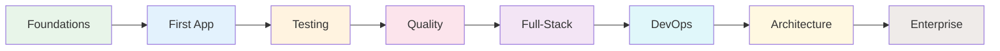

# SpecWeave Software Engineering Academy

**Your Complete Journey from Beginner to Enterprise Developer**

Welcome to the SpecWeave Software Engineering Academy — a comprehensive learning path that takes you from complete beginner to confident enterprise developer, teaching industry-standard practices used at Fortune 500 companies.

---

## What You'll Learn

This academy covers the complete software engineering lifecycle:



**Progressive complexity**: Start with a single file, graduate to enterprise microservices.

---

## Learning Paths

Choose your journey based on your goals and experience.

> **Terminology**:
> - **Parts** (Part 1-14) - Major sections of the curriculum
> - **Modules** (01-44) - Individual topics within each part
> - **Lessons** (01.1, 01.2, etc.) - Sub-lessons within each module
>
> See [Curriculum Overview](#curriculum-overview) for the complete module list.

### Path 1: Quick Start (2 hours)

**For**: Experienced developers who want to use SpecWeave immediately

| Module | What You'll Learn |
|--------|-------------------|
| [05. SpecWeave Intro](./part-2-first-application/05-specweave-intro/) | Installation, first increment, core workflow |
| [06. Your First Feature](./part-2-first-application/06-your-first-feature/) | Complete a real feature end-to-end |

---

### Path 2: Beginner Developer (4 weeks)

**For**: Those new to software engineering

| Part | Modules | Topics | Duration |
|------|---------|--------|----------|
| [Part 1: Foundations](./part-1-foundations/) | 01-03 | Environment, Git, Principles | 2 weeks |
| [Part 2: First Application](./part-2-first-application/) | 04-06 | Single-repo, SpecWeave basics | 1 week |
| [Part 3: Testing](./part-3-testing/) | 07-11 | Unit, Integration, E2E | 1 week |

---

### Path 3: Full-Stack Developer (10 weeks)

**For**: Building complete web applications

| Part | Modules | Topics | Duration |
|------|---------|--------|----------|
| Parts 1-3 | 01-11 | Foundations, First App, Testing | 4 weeks |
| [Part 4: Quality](./part-4-quality/) | 12-14 | Code quality, Quality gates | 1 week |
| [Part 5: Full-Stack](./part-5-full-stack/) | 15-17 | Frontend, Backend, Full-Stack Project | 3 weeks |
| [Part 6: DevOps](./part-6-devops/) | 18-22 | CI/CD, Containers, Kubernetes, IaC | 2 weeks |

---

### Path 4: DevOps Engineer (3 weeks)

**For**: Those focused on deployment and infrastructure

| Part | Modules | Topics | Duration |
|------|---------|--------|----------|
| [Part 6: DevOps](./part-6-devops/) | 18-22 | CI/CD, Containers, Kubernetes, IaC | 2 weeks |
| [Part 7: Environments](./part-7-environments/) | 23-24 | Dev/Staging/Prod, Release Management | 1 week |

---

### Path 5: Enterprise Developer (16 weeks)

**For**: Enterprise-ready development skills

| Part | Modules | Topics | Duration |
|------|---------|--------|----------|
| Parts 1-7 | 01-24 | Full-Stack + DevOps | 10 weeks |
| [Part 8: Architecture](./part-8-architecture/) | 25-28 | Monolith, Microservices, Multi-repo | 2 weeks |
| [Part 9: Scale](./part-9-scale-performance/) | 29-30 | Scaling, Performance | 1 week |
| [Part 10: Security](./part-10-security/) | 31-33 | Security, Auth, Compliance | 1 week |
| [Part 11: Enterprise](./part-11-enterprise/) | 34-37 | GitHub/JIRA/ADO Integration | 2 weeks |

---

### Path 6: Complete Academy (24 weeks)

**For**: Comprehensive mastery with capstone projects

| Part | Modules | Topics | Duration |
|------|---------|--------|----------|
| Parts 1-11 | 01-37 | Full Enterprise Developer Path | 16 weeks |
| [Part 12: Fortune 500](./part-12-enterprise-practices/) | 38-41 | Enterprise Standards, SRE, Governance | 2 weeks |
| [Part 13: AI-Native](./part-13-ai-development/) | 42-44 | AI Revolution, SpecWeave Mastery | 1 week |
| [Part 14: Capstones](./part-14-capstones/) | — | 4 Real-World Projects | 5 weeks |

---

## Progressive Complexity Model

The academy follows a **7-level progression**:

```
LEVEL 1: Single File
├── Write one .ts file
├── Run locally
└── Manual testing

LEVEL 2: Single Repo (Simple)
├── Multiple files organized
├── One package.json
├── Unit tests
└── Basic CI

LEVEL 3: Single Repo (Full)
├── Frontend + Backend
├── Database
├── Full test pyramid
├── CI/CD pipeline
├── Docker

LEVEL 4: Modular Monolith
├── Domain separation
├── Module boundaries
├── Contract testing

LEVEL 5: Multi-Repo
├── Multiple repositories
├── SpecWeave umbrella mode
├── Cross-repo dependencies

LEVEL 6: Microservices
├── Independent services
├── Service mesh
├── Distributed tracing
├── Event-driven architecture

LEVEL 7: Enterprise
├── Multi-team coordination
├── Compliance (HIPAA, SOC2)
├── SLA/SLO monitoring
├── Disaster recovery
└── Audit trails
```

---

## Curriculum Overview

### Part 1: Foundations

| Module | Topics |
|--------|--------|
| 01. Welcome | What is software engineering? |
| 02. Version Control | Git basics, branching, collaboration |
| 03. Engineering Principles | Methodologies, roles, documentation |

### Part 2: Your First Application

| Module | Topics |
|--------|--------|
| 04. Simple Project | Project structure, writing code |
| 05. SpecWeave Intro | Installation, first increment, three files |
| 06. Your First Feature | Planning, implementing, completing |

### Part 3: Testing Mastery

| Module | Topics |
|--------|--------|
| 07. Testing Fundamentals | Why testing, testing pyramid |
| 08. Unit Testing | Writing tests, mocking, coverage |
| 09. Integration Testing | API testing, database testing |
| 10. E2E Testing | Playwright, test strategies |
| 11. TDD Workflow | Red-Green-Refactor with SpecWeave |

### Part 4: Quality & Best Practices

| Module | Topics |
|--------|--------|
| 12. Code Quality | Linting, formatting, code review |
| 13. Quality Gates | /specweave:validate, /specweave:qa |
| 14. Documentation | Living docs, ADRs |

### Part 5: Full-Stack Development

| Module | Topics |
|--------|--------|
| 15. Frontend | HTML/CSS/JS, React/Vue/Angular |
| 16. Backend | API design, databases, auth |
| 17. Full-Stack Project | Capstone: Todo App |

### Part 6: DevOps & Infrastructure

| Module | Topics |
|--------|--------|
| 18. DevOps Intro | Culture, practices |
| 19. CI/CD | GitHub Actions, Azure Pipelines |
| 20. Containers | Docker basics, Dockerfile |
| 21. Kubernetes | Concepts, deployments, services |
| 22. Infrastructure | Terraform, cloud providers |

### Part 7: Environments & Deployment

| Module | Topics |
|--------|--------|
| 23. Environments | Dev, Staging, Production |
| 24. Release Management | Versioning, feature flags, rollbacks |

### Part 8: Architecture Patterns

| Module | Topics |
|--------|--------|
| 25. Monolith | When monolith, modular monolith |
| 26. Microservices | Service design, communication |
| 27. Multi-Repo | SpecWeave umbrella, shared libs |
| 28. Choosing Architecture | Decision framework |

### Part 9: Scaling & Performance

| Module | Topics |
|--------|--------|
| 29. Scaling | Horizontal/vertical, load balancing |
| 30. Performance | Caching, profiling, monitoring |

### Part 10: Security

| Module | Topics |
|--------|--------|
| 31. Security Fundamentals | Threat modeling, OWASP |
| 32. Authentication | JWT, OAuth, MFA |
| 33. Compliance | HIPAA, SOC2, PCI-DSS |

### Part 11: Enterprise Integration

| Module | Topics |
|--------|--------|
| 34. GitHub Integration | Issues, PRs, Enterprise |
| 35. JIRA Integration | Epics, Stories |
| 36. ADO Integration | Work items |
| 37. Team Workflows | Multi-team collaboration |

### Part 12: Fortune 500 Practices

| Module | Topics |
|--------|--------|
| 38. Enterprise Standards | Coding standards, reviews |
| 39. Governance | Audit trails, change management |
| 40. Reliability | SRE, SLAs, disaster recovery |
| 41. Team Topologies | Organization patterns |

### Part 13: AI-Native Development

| Module | Topics |
|--------|--------|
| 42. AI Revolution | Evolution 2020-2025 |
| 43. AI Best Practices | Model selection, prompting |
| 44. SpecWeave Mastery | Advanced patterns |

### Part 14: Capstone Projects

| Project | Description |
|---------|-------------|
| Capstone 1 | Todo App (Single Repo, Full Stack) |
| Capstone 2 | E-Commerce (Modular Monolith) |
| Capstone 3 | Multi-Service Platform (Microservices) |
| Capstone 4 | Enterprise System (Full DevOps + Compliance) |

---

## How to Use This Academy

1. **Choose your learning path** based on your goals
2. **Work through modules sequentially** — each builds on the previous
3. **Practice with hands-on exercises** in each module
4. **Complete capstone projects** to cement your learning
5. **Use SpecWeave throughout** — it integrates naturally into the workflow

---

## Getting Started

**Ready to begin?**

→ [Start with Part 1: Foundations](./part-1-foundations/)

**Already know the basics?**

→ [Jump to Part 2: Your First Application](./part-2-first-application/)

**Just want SpecWeave?**

→ [Quick Start: SpecWeave Intro](./part-2-first-application/05-specweave-intro/)

---

## Support & Community

- **Discord**: [Join our community](https://discord.gg/UYg4BGJ65V)
- **YouTube**: [Video tutorials](https://www.youtube.com/@antonabyzov)
- **GitHub**: [Report issues](https://github.com/anthropics/claude-code/issues)

---

**Philosophy**:
> *"The best way to learn software engineering is to build software. This academy gives you the structure, and SpecWeave gives you the AI-powered assistance to build faster and better."*
