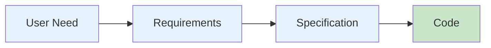

# Lesson 01.1: What is Software Engineering?

**Duration**: 45 minutes | **Difficulty**: Beginner

---

## Learning Objectives

By the end of this lesson, you will:
- Understand the difference between programming and software engineering
- Know the history and why it matters today
- Recognize the five timeless principles
- See how AI changes (and doesn't change) these fundamentals

---

## Programming vs Software Engineering

**Programming** is writing code that works.

**Software Engineering** is building software that:
- Works **reliably** for thousands/millions of users
- Can be **maintained** for years/decades
- Can be **evolved** as requirements change
- Can be **understood** by new team members
- Meets **business objectives** on time and budget

> *"Programming is telling a computer what to do. Software engineering is telling a team what to build."*

---

## The Software Crisis (1968)

In 1968, NATO held a conference because software projects were failing catastrophically:

| Problem | Impact |
|---------|--------|
| Projects delivered late | 60-80% over schedule |
| Budgets exploded | 2-3x original estimates |
| Software didn't work | Critical bugs in production |
| Maintenance nightmare | 80% of costs post-delivery |

**The term "software engineering" was born** to apply engineering discipline to software.

### What They Discovered

The solution wasn't better programmers — it was **better processes**:

```
1. Requirements First → Know what you're building
2. Design Before Code → Think before typing
3. Test What You Build → Verify correctness
4. Document Your Work → Knowledge persists
5. Iterate and Improve → Perfection is a journey
```

These principles remain **timeless** — even in the AI era.

---

## The Five Timeless Principles

### 1. Requirements First

**Bad**: "Let's just start coding and figure it out"
**Good**: "Let's understand what we're building first"



**SpecWeave Connection**: The `spec.md` file captures requirements with user stories and acceptance criteria.

### 2. Design Before Code

**Bad**: "I'll refactor later"
**Good**: "Let's design the architecture first"

Good design:
- Separates concerns (UI vs logic vs data)
- Enables change without breaking everything
- Makes code testable

**SpecWeave Connection**: The `plan.md` file captures architecture decisions before implementation.

### 3. Test What You Build

**Bad**: "It works on my machine"
**Good**: "It passes 500 automated tests"

The [testing pyramid](/docs/glossary/terms/test-pyramid):
```
        /\
       /E2E\         ← Few, slow, expensive
      /------\
     /Integration\   ← Some, moderate
    /--------------\
   /   Unit Tests   \ ← Many, fast, cheap
  /------------------\
```

**SpecWeave Connection**: Tasks include embedded [BDD](/docs/glossary/terms/bdd) test cases with `Given/When/Then`.

### 4. Document Your Work

**Bad**: "The code is self-documenting"
**Good**: "Anyone can understand this in 6 months"

Documentation includes:
- **What**: Requirements, user stories
- **Why**: Architecture Decision Records ([ADRs](/docs/glossary/terms/adr))
- **How**: API docs, setup guides

**SpecWeave Connection**: [Living documentation](/docs/glossary/terms/living-docs) syncs automatically after every task.

### 5. Iterate and Improve

**Bad**: "Ship it and move on"
**Good**: "Ship, measure, learn, improve"

Modern development cycles:
```
Plan → Build → Test → Review → Deploy → Monitor → Plan...
```

**SpecWeave Connection**: [Increments](/docs/glossary/terms/increments) are small, deliverable units that enable iteration.

---

## How AI Changes Software Engineering

### What AI Changes

| Before AI | With AI |
|-----------|---------|
| Write code manually | AI generates code |
| Hours for boilerplate | Seconds for boilerplate |
| Search Stack Overflow | Ask AI directly |
| Write docs manually | AI drafts docs |

### What AI Doesn't Change

The five principles still apply:
- You still need clear requirements
- You still need good architecture
- You still need tests
- You still need documentation
- You still need iteration

**The difference**: AI accelerates each step, but doesn't replace the discipline.

---

## The SpecWeave Paradigm Shift

Traditional AI tools (ChatGPT, Copilot, Cursor) have a problem:

> **The chat disappears. The context is lost. The decisions evaporate.**

SpecWeave introduces **Spec-Driven Development**:


**Every AI decision is captured permanently**:
- Requirements → `spec.md`
- Architecture → `plan.md` + ADRs
- Implementation → `tasks.md`
- Knowledge → Living documentation

**This is the paradigm shift**: From "AI writes code" to "AI builds documented, maintainable software."

---

## Real-World Example

**Without SpecWeave**:
```
Day 1: Chat with AI, build login feature
Day 2: Chat history gone, rebuild understanding
Day 5: New developer joins, no context
Day 30: "Why did we make this decision?" Nobody knows.
```

**With SpecWeave**:
```
Day 1: /specweave:increment "User authentication"
       → spec.md captures requirements
       → plan.md captures architecture
       → tasks.md captures implementation plan

Day 30: New developer reads spec.md, plan.md
        → Full context preserved
        → ADRs explain all decisions
```

---

## Key Takeaways

1. **Software engineering ≠ programming** — it's about building maintainable systems
2. **The five principles are timeless** — even with AI
3. **AI accelerates but doesn't replace discipline**
4. **SpecWeave captures AI decisions permanently** — the paradigm shift
5. **Good engineering = good documentation** — always

---

## Practice Exercise

**Reflection Questions** (write your answers):

1. Think of a project that failed or was difficult. Which of the five principles was missing?

2. Have you ever lost context from an AI conversation? How would permanent specs help?

3. Why do you think 80% of software costs come *after* initial delivery?

---

## Next Lesson

Now that you understand the discipline, let's set up your development environment.

→ [Continue to Lesson 01.2: Development Environment Setup](./02-development-setup)
