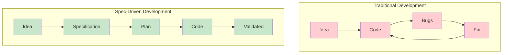

# Module 01: Welcome to Software Engineering

**Duration**: 2-3 hours | **Difficulty**: Beginner

Welcome to your journey into software engineering! This module establishes the foundation for everything that follows.

---

## What You'll Learn

- What software engineering actually is (and isn't)
- Why structured approaches matter
- The "software crisis" and how it was solved
- How AI is transforming software development
- Where SpecWeave fits in the modern landscape

---

## The Big Picture

**The difference**: Spec-driven development captures decisions *before* they're lost.

---

## Module Lessons

| Lesson | Topic | Duration |
|--------|-------|----------|
| [01.1 What is Software Engineering?](./01-what-is-software) | Core concepts and history | 45 min |
| [01.2 Development Environment Setup](./02-development-setup) | Tools you need | 60 min |
| [01.3 Command Line Essentials](./03-command-line) | Terminal basics | 30 min |

---

## Why This Matters

**The Problem**: Most developers jump straight to coding without understanding:
- Why certain practices exist
- How teams collaborate effectively
- What makes software maintainable

**The Solution**: This module gives you the mental framework that top engineers use.

---

## The SpecWeave Paradigm Shift

Traditional AI coding tools help you write code faster. But they create a new problem:

> **"The chat is gone, and so is all the context."**

SpecWeave introduces **Spec-Driven Development** — where every AI decision becomes permanent, searchable documentation:

| Traditional AI Tools | SpecWeave |
|---------------------|-----------|
| Chat disappears | Specs persist in `spec.md` |
| No architecture record | ADRs capture decisions |
| Manual doc updates | Living docs auto-sync |
| Context lost between sessions | Full traceability maintained |

**By the end of this academy**, you'll understand why this paradigm shift matters and how to leverage it.

---

## Prerequisites

- A computer (Mac, Windows, or Linux)
- Curiosity and willingness to learn
- No prior programming experience required

---

## Let's Begin

Ready to understand what software engineering really is?

→ [Start Lesson 01.1: What is Software Engineering?](./01-what-is-software)
